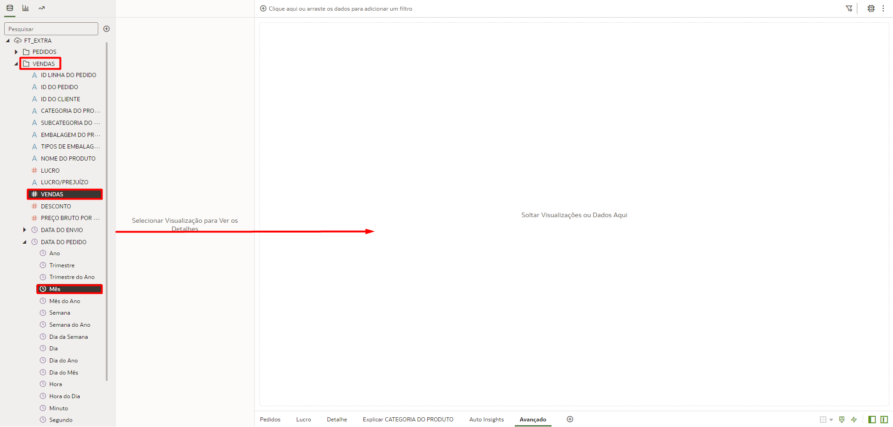
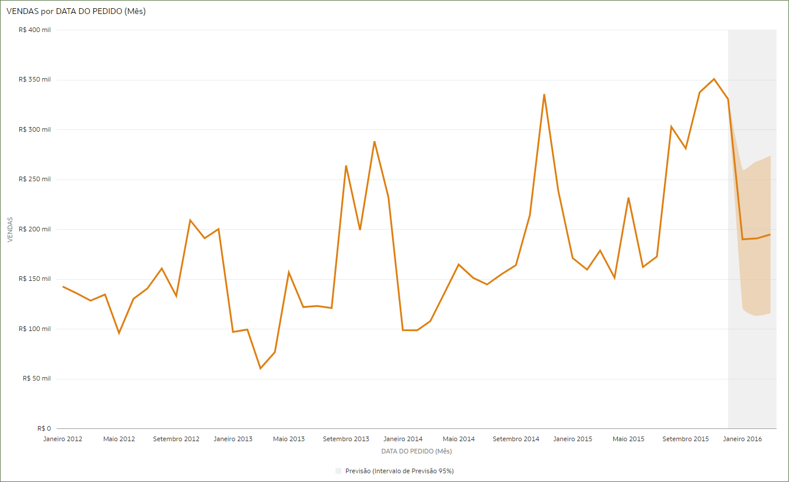

# Criar Dashboards - Avançado

## Introdução

Neste Lab você vai aprender a trabalhar com Load Balancer dentro da Oracle Cloud Infrastructure

*Tempo estimado para o Lab:* 25 Minutos

### Objetivos 
	b."Capacidades mais avançadas" (Thais) (04/11)
		- Forecast / Linha de tendência / Linha de Referência;
		- Filtros;
			- Colocar uma imagem e mapear para utilizar como filtro;
		- Condicional por cor;
		- Data Actions - navegabilidade entre abas;
		- Formas de disponibilização do dashboard:
			- Dar acesso a pasta/relatório/dataset;
			- Presentation;
			- Export / e-mail;
			- Embedded (comentar que existe).
	- Explain;
	- AutoInsight;
	- 
## Task 1: Adicionar Estatísticas no Dashboard

O Oracle Analytics Cloud (OAC) te oferece uma forma muito simples de adicionar estatísticas em seus gráficos. Os tipos disponíveis são: *Clusters, Outliers, Linha de Referência, Linha de Tendência, Previsão (Forecast)*

1. Crie uma nova tela no seu arquivo de trabalho clicando no sinal de **+** na parte inferior da tela.

2. Em seguida vamos renomear essa tela, clique no triangulo ao lado do nome da tela e clique em renomear.

3. Digite o nome **"Avançado"** e clique no sinal de check para confirmar.

4. Segure a tecla Control (CTRL) e selecione os campos **Vendas** e **Data do pedido (Mês)** dentro da tabela "Vendas", arraste e solte no centro da tela.

Você vai notar que um gráfico de Linha será criado automaticamente. Aqui nós iremos criar uma previsão de vendas para os próximos 3 meses.

5. Clique com o botão direito do mouse no gráfico, em seguida selecione **"Adicionar Estatísticas"** e selecione **"Previsão"**.

Após alguns segundo você a previsão de vendas para os próximos 3 meses adicionada ao seu gráfico. A previsão é a área em cinza claro.

Agora nos vamos adicionar um a Linha de Referência no mesmo gráfico que criamos a previsão.

6. Clique com o botão direito do mouse no gráfico, em seguida selecione **"Adicionar Estatísticas"** e selecione **"Linha de Referência"**.

Após alguns segundo você verá a Linha de Referência em seu gráfico

> **Note:** Como mostrado nos passos anteriores podemos combinar mais de um tipo de estatística em um mesmo gráfico.

*DESAFIO:* Crie mais um gráfico com as informações de Vendas por Data do Pedido (Mês) e adicione a estatística de **"Outliers"** nesse gráfico para você identificar os valores que estão fora do padrão de vendas

Esse deve ser seu resultado final:

## Task 2: Formatação Condicional

Formatação condicionar por cores

## Task 3: Usar Inteligência Artificial Nativa - Explain e Auto Insights

Criar Dashboard usando Auto insight e o Explain

## Task 4: Apresentar & Exportar Dashboards

Aba present e depois o Play

Exportar Arquivo ou Imprimir

## Task 5: Data Actions (OPCIONAL)

usar Data Actions para ir para outro canva ou ir para uma URL

## Task 6: Criar um gráfico através de uma Imagem (OPCIONAL)

Importar e Mapear uma imagem no OAC e usá-la como gráfico

## Conclusão

Nesta sessão você aprendeu a utilizar recursos avançados para criação de Dashboards no Oracle Analytics Cloud (OAC)

## Autoria

- **Autores** - Thais Henrique, Isabella Alvarez, Breno Comin, Isabelle Dias, Guilherme Galhardo
- **Último Update Por/Date** - Thais Henrique, Nov/2022