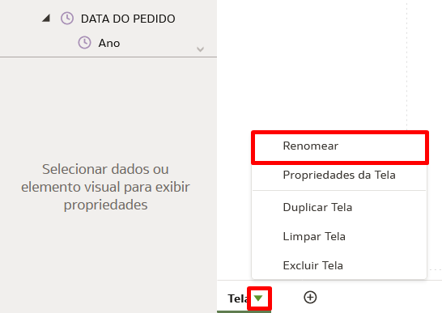
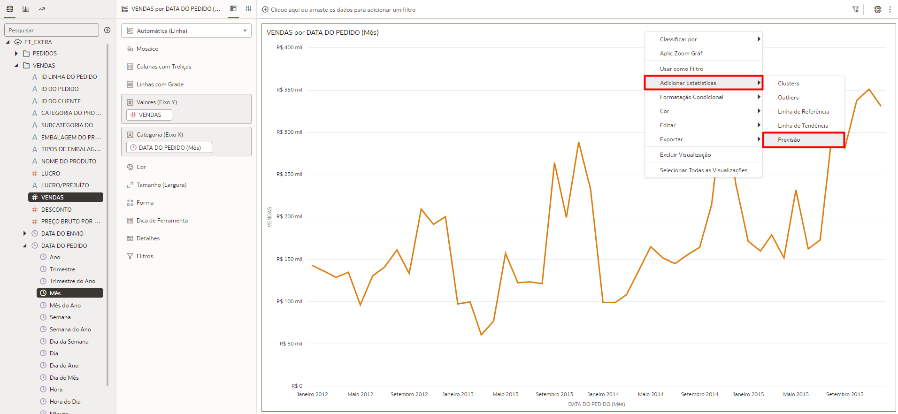
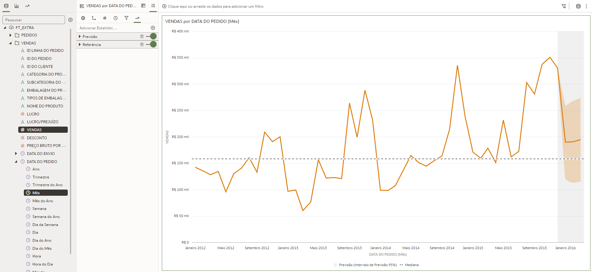
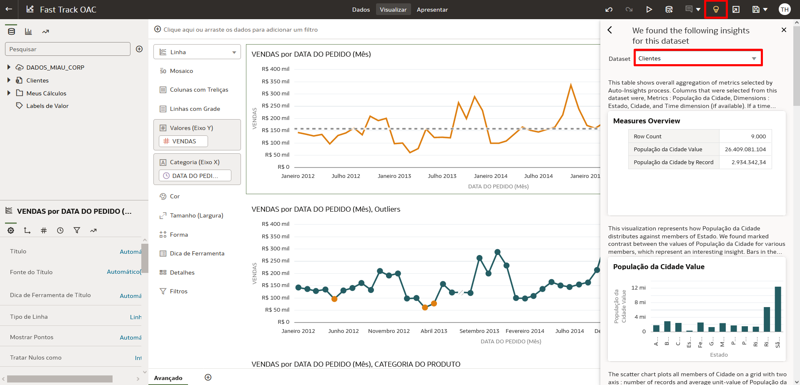
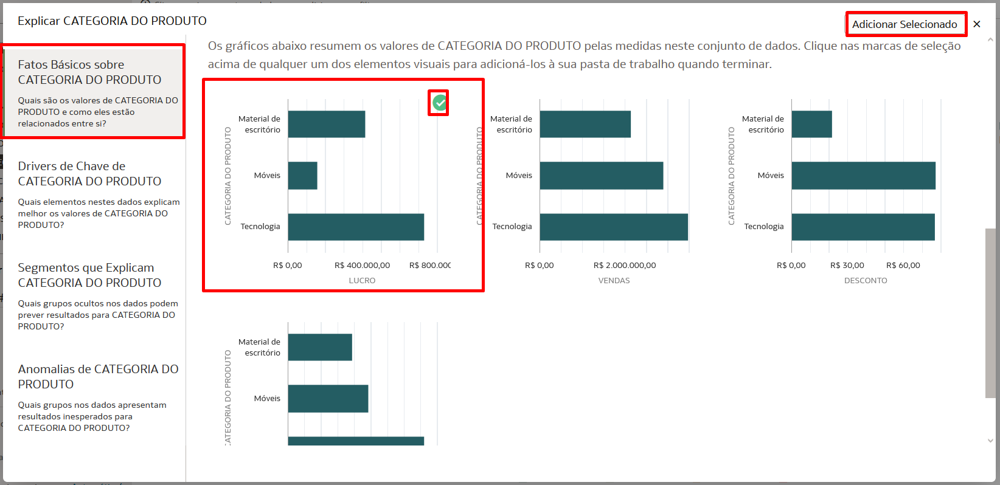

# Criar Dashboards - Avançado

## Introdução

Neste Lab você vai aprender a trabalhar com Load Balancer dentro da Oracle Cloud Infrastructure

*Tempo estimado para o Lab:* 25 Minutos

### Objetivos 
	b."Capacidades mais avançadas" (Thais) (04/11)
		- Forecast / Linha de tendência / Linha de Referência;
		- Filtros;
			- Colocar uma imagem e mapear para utilizar como filtro;
		- Condicional por cor;
		- Data Actions - navegabilidade entre abas;
		- Formas de disponibilização do dashboard:
			- Dar acesso a pasta/relatório/dataset;
			- Presentation;
			- Export / e-mail;
			- Embedded (comentar que existe).
	- Explain;
	- AutoInsight;

## Task 1: Adicionar Estatísticas no Dashboard

O Oracle Analytics Cloud (OAC) te oferece uma forma muito simples de adicionar estatísticas em seus gráficos. Os tipos disponíveis são: *Clusters, Outliers, Linha de Referência, Linha de Tendência, Previsão (Forecast)*

1. Crie uma nova tela no seu arquivo de trabalho clicando no sinal de **+** na parte inferior da tela.

2. Em seguida vamos renomear essa tela, clique no triangulo ao lado do nome da tela e clique em renomear.

3. Digite o nome **"Avançado"** e clique no sinal de check para confirmar.

4. Segure a tecla Control (CTRL) e selecione os campos **Vendas** e **Data do pedido (Mês)** dentro da tabela "Vendas", arraste e solte no centro da tela.

Você vai notar que um gráfico de Linha será criado automaticamente. Aqui nós iremos criar uma previsão de vendas para os próximos 3 meses.

5. Clique com o botão direito do mouse no gráfico, em seguida selecione **"Adicionar Estatísticas"** e selecione **"Previsão"**.

Após alguns segundo você a previsão de vendas para os próximos 3 meses adicionada ao seu gráfico. A previsão é a área em cinza claro.

Agora nos vamos adicionar um a Linha de Referência no mesmo gráfico que criamos a previsão.

6. Clique com o botão direito do mouse no gráfico, em seguida selecione **"Adicionar Estatísticas"** e selecione **"Linha de Referência"**.

Após alguns segundo você verá a Linha de Referência em seu gráfico

> **Note:** Como mostrado nos passos anteriores podemos combinar mais de um tipo de estatística em um mesmo gráfico.

*DESAFIO:* Crie mais um gráfico com as informações de Vendas por Data do Pedido (Mês) e adicione a estatística de **"Outliers"** nesse gráfico para você identificar os valores que estão fora do padrão de vendas

Esse deve ser seu resultado final:

## Task 2: Formatação Condicional

Use a Formatação Condicional para destacar dados importantes em suas visualizações para que você possa tomar melhores decisões.

1. Na aba de Tipos de Gráfico, clique a arraste o tipo "Tabela Dinâmica" e solte na parte inferior da tela quando uma barra verde aparecer.

2. Segurando o Control (CTRL) selecione os campos: **Vendas**, **Data do Pedido (Mês)** e **Categoria do Produto**, em seguida arraste os 3 campos para o gráfico de tabela dinâmica que você adicionou no dashboard no passo anterior.

3. Verifique se o campo "Categoria do Produto" está em baixo do campo "Data do Pedido (Mês)" na área de linhas da Tabela Dinâmica.

4. Clique com o botão direito do mouse sobre a tabela dinâmica, selecione "Formatação Condicional" e clique em "Manage Rules".

5. Dê o nome *"Vendas por Periodo"* para a nova regra e em seguida selecione "Vendas" no campo Medida.

Agora vamos adicionar cores especificas de acordo com a variação do valor de vendas:

6. Preencha os campos de acordo com as informações abaixo e clique em salvar

* ***VENDAS >  60.000 - Cor: Verde Escuro***
* ***VENDAS <= 60.000 - Cor: Verde Claro***
* ***VENDAS <  40.000 - Cor: Amarelo***
* ***VENDAS <  35.000 - Cor: Vermelho***

Você vai notar que cada valor de venda possui uma cor associada e dessa forma você consegue visualizar as informações de forma mais agradável e facilmente identificar informações como, por exemplo, os valores em vermelho que indicam valores de vendas abaixo do esperado.

## Task 3: Usar Inteligência Artificial Nativa - Auto Insights e Explain

O Oracle Analytics Cloud possui diversos mecanismos de Machine Learning nativo da ferramenta, esses recursos nos ajudam de várias formas diferentes durante o processo de criação dos nossos dashboards. Vamos ver duas funcionalidades muito úteis para entendimento dos dados e sugestões de gráficos: *Auto Insights e Explain (Explicar)*.

Vamos usar o Auto Insights para encontrar recomendações de gráficos para enriquecer nosso dashboard.

O ***Auto Insights*** é uma ótima maneira de criar visualizações poderosas usando sugestões geradas pelo Oracle Analytics Cloud (OAC).

1. Clique no ícone de uma lâmpada amarela na parte superior direita da tela e verifique se a tabela "Clientes" está selecionada.

2. Role a barra lateral até você encontrar um gráfico chamando: **"Top 10 Cidade by População da Cidade"**. Clique sobre ele e arraste o gráfico até a lateral esquerda da tela até uma barra verde aparecer e solte o gráfico nessa posição. (veja na gif abaixo)

3. Em seguida role a barra lateral e localiza o gráfico chamado: **"Count of Records"**. Clique sobre ele e arraste o gráfico até a parte superior da tela até uma barra verde aparecer e solte o gráfico nessa posição. (veja na gif abaixo)

*(Clique no gif para ver em tela cheia)*

> **Nota:** Fique à vontade para explorar mais gráfico usando o Auto Insights.

Agora vamos usar o **Explain (Explicar)** para entender um pouco mais sobre nossos dados.

O ***Explain*** usa Machine Learning para encontrar informações úteis sobre seus dados.

4. Clique com o botão direito do mouse sobre o campo **"Categoria do Produto"** na tabela Vendas e em seguida selecione a opção **"Explicar CATEGORIA DO PRODUTO"**

Uma nova janela será aberta com todas as explicações sobre o campo que você selecionou, incluindo: Fatos Básicos, Drivers Chave, Segmentos que Explicam, Anomalias. Em cada aba dessas você vai encontrar gráficos e descrições em forma de texto sobre o campo que você está analisando. Uma vez que você olhou todas as abas você pode escolher os gráficos que você acha relevantes para seu dashboard.

1. Na aba "Fatos Básicos sobre CATEGORIA DE PRODUTOS" role a página até você encontrar um gráfico que explica o Lucro por Categoria de Produto, descanse o mouse sobre o gráfico até aparecer um sinal de check no canto superior direito do gráfico e clique nesse sinal de check, em seguida clique em **"Adicionar Selecionado"**.

Esse gráfico será adicionado em uma nova tela no seu Arquivo de trabalho, como indicado na imagem abaixo.

## Task 4: Apresentar & Exportar Dashboards

Aba present e depois o Play

Exportar Arquivo ou Imprimir

## Task 5: Data Actions (OPCIONAL)

usar Data Actions para ir para outro canva ou ir para uma URL

## Task 6: Criar um gráfico através de uma Imagem (OPCIONAL)

Importar e Mapear uma imagem no OAC e usá-la como gráfico

## Conclusão

Nesta sessão você aprendeu a utilizar recursos avançados para criação de Dashboards no Oracle Analytics Cloud (OAC)

## Autoria

- **Autores** - Thais Henrique, Isabella Alvarez, Breno Comin, Isabelle Dias, Guilherme Galhardo
- **Último Update Por/Date** - Thais Henrique, Nov/2022