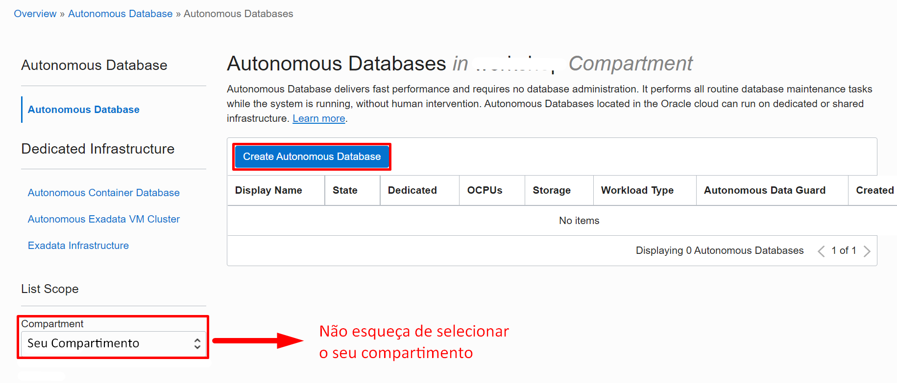
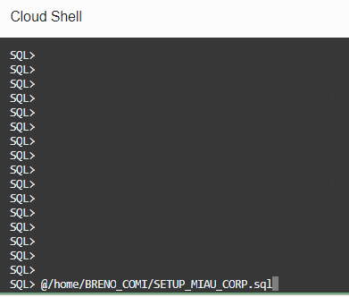

# Criar os recursos necessários para o Laboratório

## Introdução
A Oracle Cloud é o provedor de nuvem mais amplo e integrado do setor, com opções de implantação que vão desde a nuvem pública até o seu data center. A Oracle Cloud oferece serviços de alta qualidade em Software como Serviço (SaaS), Plataforma como Serviço (PaaS) e Infraestrutura como Serviço (IaaS).
Nesse Lab você vai aprender a provisionar um Autonomous Database na Oracle Cloud Infrastructure.

***Overview***

Oracle Cloud Infrastructure Autonomous Database é um ambiente de banco de dados totalmente gerenciado e pré-configurado com três tipos de carga de trabalho disponíveis, Autonomous Transaction Processing, Autonomous Data Warehouse e Autonomous JSON. Você não precisa configurar ou gerenciar nenhum hardware ou instalar nenhum software. Após o provisionamento, você pode dimensionar o número de núcleos de CPU ou a capacidade de armazenamento do banco de dados a qualquer momento, sem afetar a disponibilidade ou o desempenho. O Banco de Dados Autônomo cuida da criação do banco de dados, bem como das seguintes tarefas de manutenção:
* Backup do Banco de dados
* Patching do Banco de dados
* Upgrading do Banco de dados
* Tuning do Banco de dados

*Tempo estimado para o Lab:* 25 Minutos

### Objetivos

Neste Laboratório você vai:
* Aprender como fazer login na sua conta Oracle Cloud
* Provisionar um Oracle Autonomous Data Warehouse
* Provisionar um Oracle Analytics Cloud


## Task 1: Fazer Login na Oracle Cloud

1.  Abra seu navegador da Web e acesse [a Oracle Cloud](https://cloud.oracle.com).
Insira o nome da sua conta na nuvem se estiver entrando em uma conta com o Identity Cloud Service. 

 

Quando a nova página carregar, apenas clique em **Continue**.

 

2.  Na página de login de **Cloud Infrastructure**, insira suas credenciais de login e, em seguida, clique em **Acessar**.

 

3. Agora você está conectado à Oracle Cloud!


## Task 2: Processo de criação do Autonomous Database

Para iniciar o processo de criação do Autonomous Database:

1.	Clique no menu no lado esquerdo da tela principal, escolha Oracle Database, e depois “Autonomous Database"


2.	Clique em "Create Autonomous Database" e você será redirecionado para a criação do Autonomous Database.



3.	Preencha os campos necessários para a criação do seu Autonomous Database conforme mostrado abaixo:


* Display Name: **Escolha um Display Name para seu banco**
* Database name: **Escolha um Database Name para seu banco**
* Choose a workload type : Para este Workshop, por favor selecione **Data Warehouse**
* Choose a deployment type: **Shared Infrastructure**


* Choose database version: **19c**
* OCPU count: **1**
* Storage (TB): **1**


* Create administrator credentials: **Crie um password para o usuário ADMIN**
* Choose network access: **Secure access from everywhere**


* Choose License and Oracle Database Edition: **License Included**
* Agora finalize a criação clicando no  botão **"Create Autonomous Database"**

4. Agora basta aguardar alguns minutos e em seguida você verá a tela:


*Seu Banco de Dado Autonomous foi provisionado com sucesso!*

## Task 3: Processo de criação do Oracle Analytics Cloud

Nesse tutorial criaremos uma instância da ferramenta Oracle Analytics Cloud.

1. Criar o OAC


- Clicar no Menu Hambúrguer no lado esquerdo superior;
- Clicar em **Analytics & AI**;
- Clicar em **Analytics Cloud**.


- Verificar se está no compartimento correto;
- Clicar em **Create Instance**.


2. Preencher as informações:

* Name: nome dado à instância;
* Description: descrição dada à instância – opcional;
* Create in Compartment: Compartimento onde a instância será criada;
* Feature Set: Escolher **Professional Edition**;
* Capacity: Escolher **OCPUs** e digitar **1**;
* License Type: Escolher **License Included**;

- Clicar em **Create** .

3. Acessar o Oracle Analytics Cloud

Nesse passo mostraremos como acessamos a instância do Oracle Analytics Cloud.
- Clicar no nome da instância criada “Nome Escolhido”;


- Clicar em **Analytics Home Page**.


## Task 4: Carregando os dados do laboratório no Autonomous

1. Acesse o seu Autonomous Database e clique no botão **Database Connection**.


2. Faça o download do arquivo de Wallet disponibilizado pelo banco.


3. Será solicitada a criação de um password no momento do Download.


4. Acesse o Cloud Shell a partir das Developer Tools disponíveis na região superior direita da Console.


5. Clique na Engrenagem e selecione a opção Upload.


6. Suba o arquivo da Wallet que acabou de ser baixado, assim como o script SETUP\_MIAU\_CORP.sql (disponível [aqui](https://objectstorage.us-ashburn-1.oraclecloud.com/p/WTbbTR3qL-sAT_BU6yKuJV-OEbwj97v2mxlQcbIY5q0s7auhcIZdbTVBN77Ib2Po/n/id3kyspkytmr/b/ArquivosPublicos/o/SETUP_MIAU_CORP.sql) para download


7. Valide que os arquivos foram carregados corretamente


8. Descompacte a wallet utilizando o comando
```
unzip nomedawallet.zip
```


9. Utilize o comando abaixo para editar o arquivo, e altere o campo DIRECTORY para o caminho até o seu arquivo Wallet. Para sair de edição do vi, clique ESC, depois ':wq' e logo após ENTER.
```
vi sqlnet.ora
```


10. Defina o mesmo caminho para a variável TNS_ADMIN.


11. Valide a variável com o comando echo $TNS_ADMIN


12. Conecte-se ao ADW através do comando
```
sqlplus admin@<nomedoadw>_high
```


13. Chame o script através do
```
@caminho_para_o_arquivo/SETUP_MIAU_CORP.sql
```



14. O script criará o Schema MIAU_CORP, assim como 2 tabelas populadas com 9000 linhas cada.
Ao finalizar, você verá a última mensagem como Commit Complete.


15. Caso queira, valide a quantidade de linhas nas 2 tabelas geradas.


Parabéns, você concluiu esse laboratório!

## Conclusão

Nesta sessão você provisionou um Oracle Autonomous Data Warehouse e um Oracle Analytics Cloud, que serão utilizados durante todo o laboratório. Também foram criados os schemas e carregados os dados para popular as tabelas no banco.

## Autoria

- **Autores** - Breno Comin, Thais Henrique, Isabella Alvarez, Isabelle Dias
- **Último Update Por/Data** - Isabelle Dias, Maio/2023
