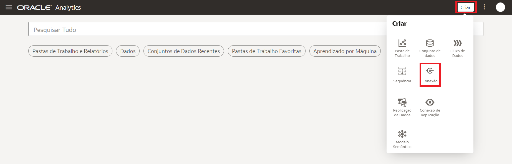
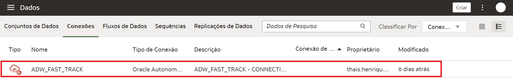

# Criar uma Conexão

## Introdução
Como usuário do Oracle Analytics com acesso de Autor de Conteúdo do DV, você pode estabelecer conexão com as origens de dados usadas por sua organização. Por exemplo, você pode criar um conjunto de dados que inclua tabelas de uma conexão do Autonomous Data Warehouse , tabelas de uma conexão Spark e tabelas de uma área de assunto local.

Neste Lab você vai aprender a conectar o Oracle Ananlytics Cloud a dados.

*Tempo estimado para o Lab:* NN Minutos

### Objetivos

* Estabelecer uma conexão.
* Testar sua conexão. 

## Tarefa 1: Criar uma Conexão

Você pode se conectar a vários tipos de fonte de dados, como bancos de dados em nuvem (públicas e privadas), bancos de dados locais (incluindo JDBC - Conectividade de Banco de Dados Java) e muitos aplicativos comumente usados, como Dropbox, Google Drive e Amazon Hive.

1.  Na página inicial, no canto superior esquerdo, clique em **Criar** e, em seguida, clique em **Conexão**.

2. Será exibido uma nova janela, na qual mostrará os ícones dos conectores disponíveis.
Você pode pesquisar pelo nome ou rolar a barra para encontrar mais opções. Bastar clicar no ícone correspondente à conexão desejada para começar a configurá-la.

Você cria uma conexão para cada fonte de dados que deseja acessar no Oracle Analytics. Uma vez conectado, você pode visualizar seus dados para criar insights.

## Tarefa 2: Teste Sua Conexão 
**OPCIONAL**

Para ter certeza que sua conexão está ativa e funcionando, visualize-a através da lista de conexões.
Tal lista contém as conexões que você criou e as conexões que você tem permissão para acessar e usar para criar conjuntos de dados.
Existem algumas formas de fazer essa verificação:

1.	No Menu Hamburguer da página inicial, clique em **Dados** e, em seguida, na guia **Conexões** para acessar a lista. Se a conexão foi feita de maneira correta, você será capaz de visualizá-la, bem como os detalhes da mesma.

2. Ao clicar em **Criar** e posteriormente em **Conjunto de Dados** para dar início à criação do seu conjunto, você será direcionado para uma guia onde imediatamente, conseguirá visualizar sua conexão. 

Pronto!

Você pode **seguir para o próximo Lab**.

## Conclusão

Nesta sessão você aprendeu quais fontes de dados você pode usar em conjuntos de dados, como acessá-los e averiguar se a conexão está apta a ser usada.

## Autoria

- **Autores** - Isabelle Vieira
- **Último Update Por/Date** - Isabelle Vieira, Novembro/2022