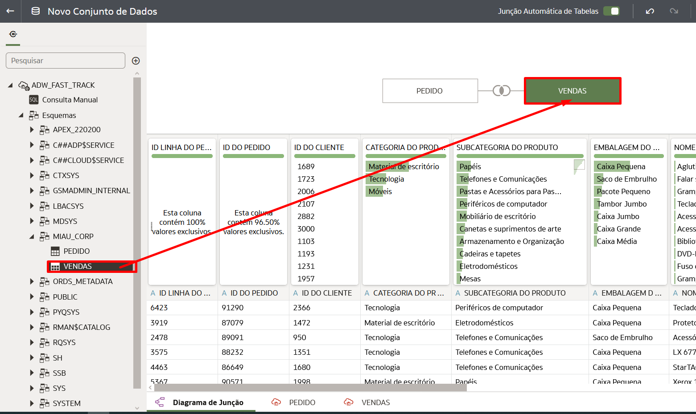

# Criar um Conjunto de Dados

## Introdução

Neste Lab você vai aprender a criar um conjunto de Dados (Dataset) no Oracle Analytics Cloud

*Tempo estimado para o Lab:* 20 Minutos

### Objetivos

* Selecionar as tabelas
* Fazer o Join entre as tabelas
* Salvar o Conjunto de Dados

## Task 1: Selecionar as tabelas

1.	Clique no botão **Criar** na parte superior direita e em seguida selecione **Conjunto de Dados**.


2.	Selecione a Conexão com o Autonomous Data Warehouse: **ADW_FAST_TRACK**.


3. Expanda a lista de Esquemas do Autonomous Data Warehouse, localiza o Esquema MIAU_CORP e Localize as duas tabelas que utilizaremos nesse Workshop: **Vendas** e **Pedidos** .


## Task 2: Join entre as tabelas

1.	Seleciona a tabela **Pedidos** e arraste até o centro da tela do Diagramas de Junção (Join).


2. Em seguida arrate a tabela **Vendas** e solte ao Lado da tabela de pedidos.



O Oracle Analytics Cloud (OAC) vai criar o Join de forma automática para você, desde as duas tabelas tenham o mesmo nome na coluna usada para o Join em si.


Note: É importante que as colunas tenham o mesmo "Tipo": Atributo ou Medida para que vocÊ possa fazer o Join manual

## Task 3: Criar Join Manualmete

1. Acesse o seu bucket.

2. Clique em **Objects**, no menu do lado esquerdo, e em **Upload**.


3. Copie o html abaixo e crie o arquivo index.html através de algum editor de texto (notepad)

> **Note:** Lembre-se de salvar o arquivo com a extensão ".html"

``` shell
<copy>
<!DOCTYPE html>
<html lang="pt-br">
<head>
    <meta charset="UTF-8">
    <meta name="viewport" content="width=device-width, initial-scale=1.0">
    <title>LAB: OCI FAST TRACK</title>
</head>
<body>
    <center> 
            <h1>Site estático no Object Storage</h1> 
               
</body>
</html>
</copy>
```

4. Feito isto, arraste e solte para o campo indicado do bucket e clique em **Upload**.


5. Para o objeto, clique no ícone de três pontos e em **View Object Details**.


6. Clique na URI indicada e confira se o site está disponível.


## Conclusão

Nesta sessão você aprendeu sobre Object Storage na prática.

## Autoria

- **Autores** - Arthur Vianna, Lucas de Almeida, Luiz de Oliveira, Thais Henrique
- **Último Update Por/Date** - Arthur Vianna, Jun/2022