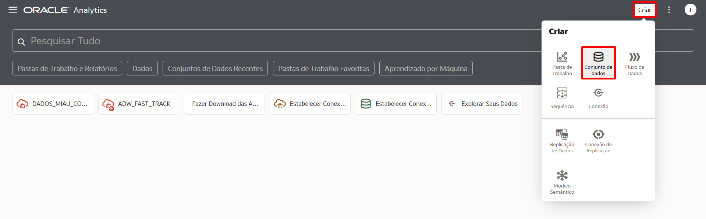
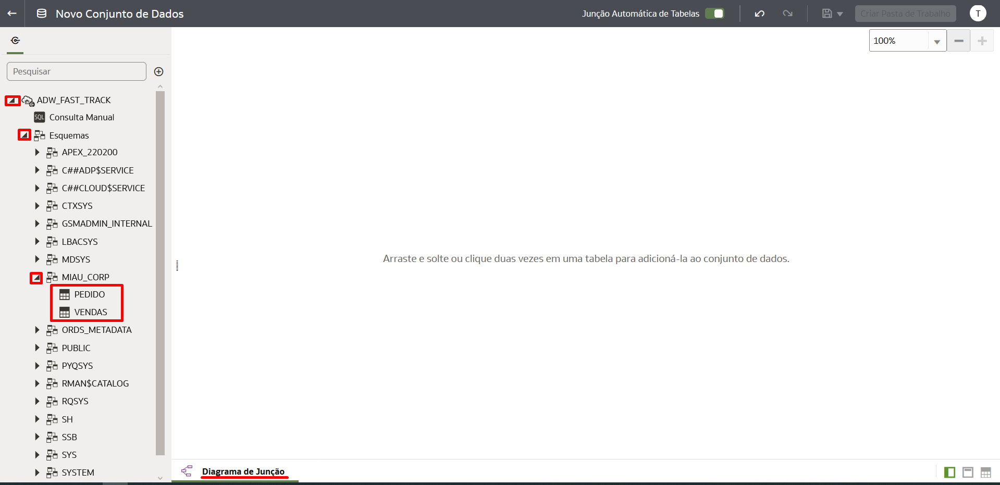
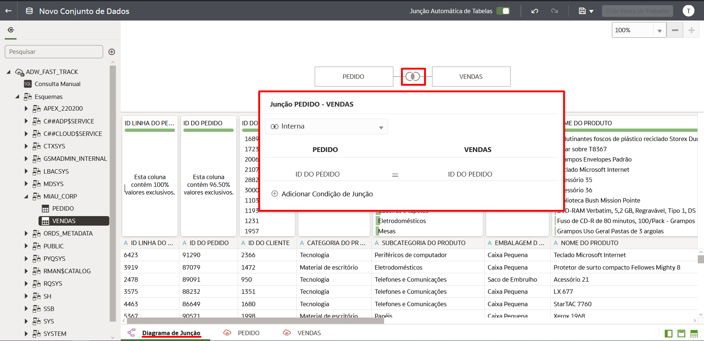
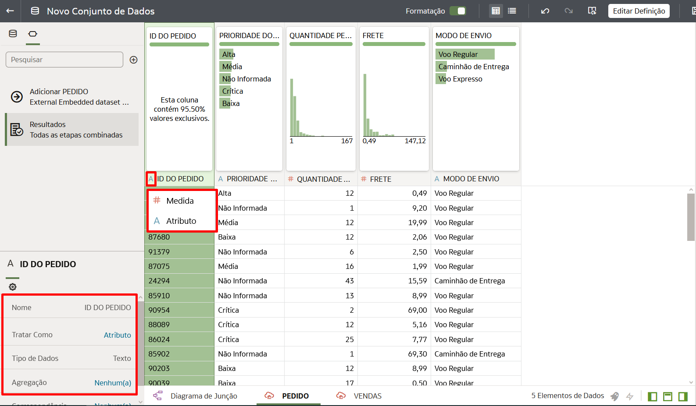
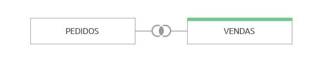
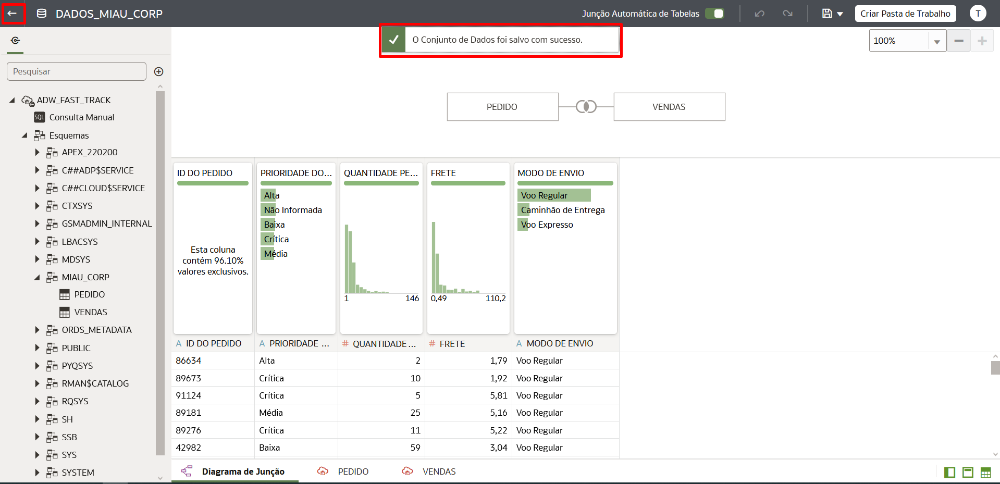
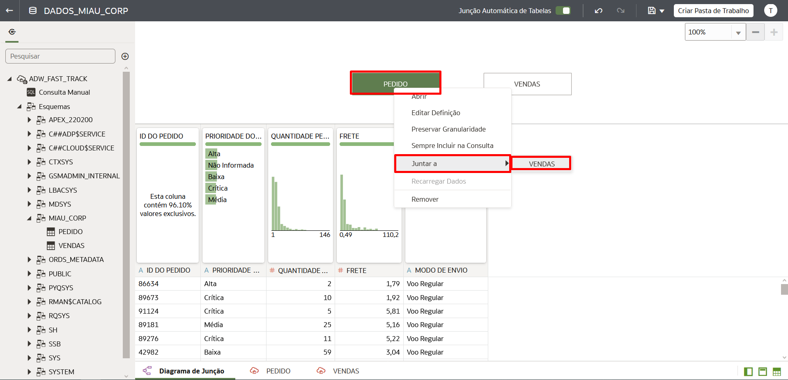
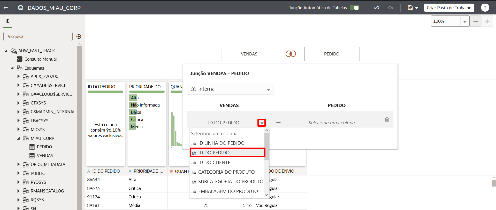
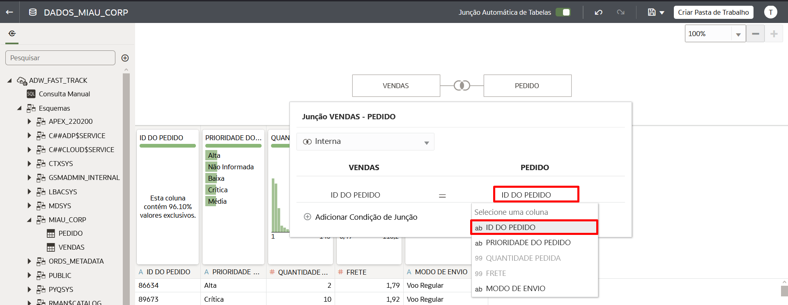

# Criar um Conjunto de Dados

## Introdução

Neste Lab você vai aprender a criar um Conjunto de Dados (Dataset) no Oracle Analytics Cloud.

[Oracle Video Hub video scaled to Large size](videohub:1_1ei28osm:large)

**Conjuntos de Dados** podem ser criados usando uma ou mais tabelas, que podem ser de uma mesma conexão ou de conexões diferentes (inclusive podemos usar arquivos CSV ou XLSX). Você pode unir todas essa tabelas dentro do "Diagrama de Junções" (Join).

*Tempo estimado para o Lab:* 15 Minutos

### Objetivos

* Selecionar as tabelas que serão utilizadas
* Fazer o Join entre as tabelas
* Salvar o Conjunto de Dados

## Tarefa 1: Localize as tabelas

1.	Clique no botão **Criar** na parte superior direita e em seguida selecione **Conjunto de Dados**.

2.	Selecione a conexão com o Autonomous Data Warehouse: **ADW\_FAST\_TRACK**.

3. Expanda a lista de Esquemas do Autonomous Data Warehouse (ADW), localize o Esquema MIAU_CORP e localize as duas tabelas que utilizaremos nesse Workshop: **Vendas** e **Pedidos**.

## Tarefa 2: Join entre as tabelas

1.	Selecione a tabela **Pedidos** e arraste até o centro da tela do Diagramas de Junção (Join).

2. Em seguida arraste a tabela **Vendas** e solte ao lado da tabela de pedidos.

O Oracle Analytics Cloud (OAC) vai criar o Join de forma automática para você, desde que as duas tabelas tenham o mesmo nome na coluna e que as duas colunas sejam do mesmo **"Tipo"**.

> **Nota:** Existem dois tipos de colunas no Oracle Analytics Cloud: Atributo ou Medida

As colunas do tipo ***Medida*** aceitam valores numéricos e poderemos executar operações matemáticas e agregações com os dados dessa coluna.

**Exemplo: Valor da Venda, Quantidade de produtos, Lucro, Custo, Desconto etc**

As colunas do tipo ***Atributo*** aceitam qualquer tipo de dados descritivo, que não serão usados para nenhum tipo de cálculo. Podemos ter campos com texto, números, localizações, datas, entre outros.

**Exemplo: ID de produto, ID do cliente, Número da Nota Fiscal, Nome do Cliente, Idade, Endereço, Data de Venda, Cidade, País etc**

3. Clique com o botão direto do mouse na tabela **"Vendas"** dentro do Diagrama de Junção e selecione a opção **Preservar Granularidade**.

4. Após isso você verá uma barra verde na parte superior da caixa que representa a tabela **"Vendas"** indicando que a granularidade da tabela está preservada.

## Tarefa 3: Salvar o Conjunto de Dados

1. Verifique se você está na aba do Diagrama de Junção e clique no botão de salvar no topo direito da tela (ícone de um disquete).

2. Dê um nome e uma descrição para o Conjunto de dados:

*Nome:* DADOS\_MIAU\_CORP
*Descrição:* Conjunto de Dados para Análise de Dados de vendas da MIAU CORP

3. Verifique se você recebeu a mensagem **O Conjunto de Dados foi salvo com sucesso** e em seguida clique em voltar.

4. Você verá seu novo Conjunto de Dados listado como indicado na imagem abaixo.

Você pode **seguir para o próximo Lab**.

## Tarefa 4: Criar Join Manualmente (Opcional)

O Oracle Analytics Cloud (OAC) permite a criação de conjuntos de dados usando diversas tabelas e ainda oferece uma área especial chamada "Diagrama de Junção" para criarmos os Joins dessas tabelas. Geralmente o OAC cria o Join de forma automática entre as tabelas, mas em cenários onde ele não identifica colunas para esse Join nós podemos fazê-lo de forma manual.

Imagine que o Oracle Analytics Cloud não criou o Join entre a tabela "Pedidos" e a tabela "Vendas", o procedimento para criar o Join manualmente seria esse:

1. Clique com o botão direito em cima de uma das duas tabelas que estão no tela do "Diagrama de Junção", selecione a opção "Juntar a" e selecione a tabela que você deseja unir através do Join. Aqui no nosso exemplo será a tabela "Vendas".

2. Selecione a coluna que você vai usar para o Join na primeira tabela, no caso usaremos a coluna "ID DO PEDIDO".

3. Agora na segunda tabela selecione a coluna correspondente, no nosso caso as colunas possuem o mesmo nome "ID DO PEDIDO". *(Não é necessário que as duas colunas tenham o mesmo nome)*

Parabéns, você terminou esse laboratório!
Você pode **seguir para o próximo Lab**.

## Conclusão

Nesta sessão você aprendeu criar um Conjunto de Dados no Oracle Analytics Cloud usando mais de uma tabela e aprendeu a utilizar o "Diagrama de Junção".

## Autoria

- **Autores** - Thais Henrique, Isabella Alvarez, Breno Comin, Isabelle Dias, Guilherme Galhardo
- **Último Update Por/Date** - Isabelle Dias, Maio/2023