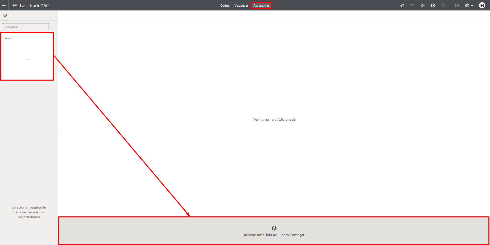
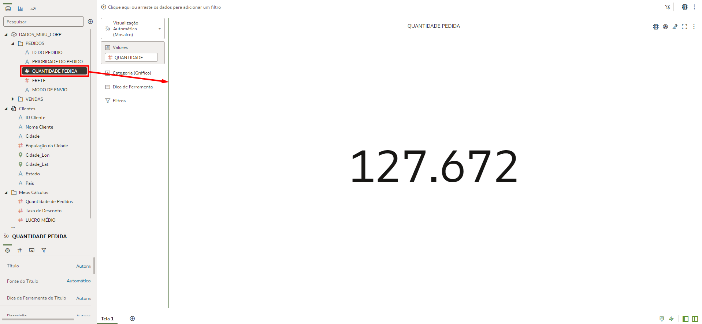
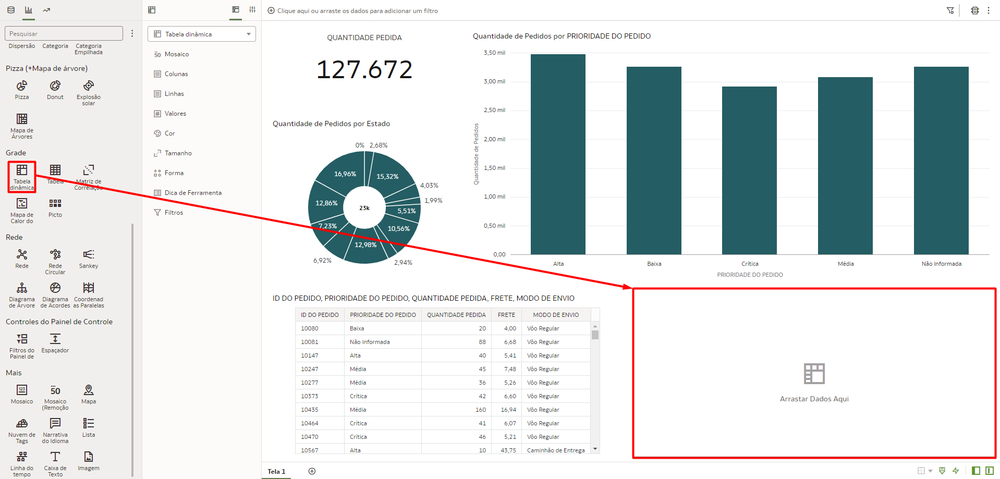

# Criar Visualizações

## Introdução

Nesse Lab você vai aprender a criar visualizações no Oracle Analytics Cloud.

*Tempo estimado para o Lab:* 30 Minutos

### Objetivos

* Conhecer a interface de criação de visualizações do OAC
* Construir um dashboard com gráficos de diferentes tipos
* Alterar propriedades dos gráficos e fazer uso de funcionalidades complementares para personalizar o dashboard

## Task 1: Explorar a Interface

O Oracle Analytics Cloud (OAC) possuí uma interface simples, o que permite navegar rapidamente por suas diversas opções e funcionalidades. Em nossa primeira tarefa exploraremos a interface do Oracle Analytics Cloud dentro de uma pasta de trabalho.

Sempre que você abrir ou criar uma pasta de trabalho, por padrão, você terá a seguinte tela no modo de visualização:

Para explorar as demais opções de navegação na interface:

1.  Clique no icone correspondente a **Editar** no menu superior direito da tela.

Após habilitar o modo de edição, a interface da tela devera ter a seguinte configuração:

2.  No menu superior direto da tela encontre a opção correspondente aos comandos de **Desfazer/Refazer a Última Edição**.

3.  No menu superior direto da tela encontre a opção correspondente ao comando de **Visualização**.

4.  No menu superior direto da tela encontre a opção correspondente ao comando de **Atualizar Dados**.

5.  No menu superior direto da tela encontre a opção correspondente ao comando de **Adicionar Observação**.

6.  No menu superior direto da tela encontre a opção correspondente ao comando de **Auto Insights**.

7.  No menu superior direto da tela encontre a opção correspondente ao comando de **Exportar**.

8.  No menu superior direto da tela encontre a opção correspondente ao comando de **Salvar**.

Na região central do menu superior da tela é possível alternar entre páginas que fornecem acesso a diferentes funcionalidades.

9.  Na região central do menu superior da tela encontre a opção de **Visualizar**, que é referente a página atual.

10. Na região central do menu superior da tela encontre e selecione a opção **Dados** para acessar a página que permite adicionar novos conjuntos de dados a pasta de trabalho e editar as condições de junção entre eles.

11. Na região central do menu superior da tela encontre e selecione a opção **Apresentar** para acessar a página que permite adicionar telas a uma apresentação.

Outras opções de navegação são encontradas na região inferior da página.

12. Na região inferior direita da página encontre as opções de **Brushing**, **Aplicar Dados Automaticamente**, **Alternar Painel de Dados** e **Alternar Painel de Gramática**.

13. Na região inferior esquerda da página encontre a opção de **Adicionar Tela**, representada pelo simbolo **+**.

## Task 2: Criar um Dashboard com Visualizações Básicas

Em nossa segunda tarefa criaremos algumas visualizações básicas para compor nosso dashboard.

1.  Iniciaremos a construção do nosso dashboard adicionando uma visualização do tipo Tile (Métrica) a tela. Para isso selecione o campo de **Quantidade Pedida** dentro da tabela "Pedidos", arraste e solte no meio da tela.

2.  Agora iremos adicionar um gráfico do tipo Barras Empilhadas. Para isso navegue para a aba de visualizações, localize e arraste a opção de Barras Empilhadas para o lado direito da visualização de Tile.

3.  Você irá notar que o espaço para este gráfico está vazio. Para popular o gráfico com dados, selecione o campo de **Prioridade do Pedido** dentro da tabela "Pedidos", arraste e solte no espaço de **Categoria**. Faça o mesmo com o campo de **Quantidade de Pedidos** dentro da tabela "Meus Cálculos", porém o solte no espaço de **Valores**.

4.  Para ordenar as barras do gráfico criado, localize e selecione a opção de **Classificar**, que é representada por um par de setas.

5.  Na janela que irá abrir, selecione a métrica pela qual você deseja ordenar o gráfico, o modo de ordenação e clique em OK.

6.  A seguir criaremos um gráfico de Donut. Para isso navegue para a aba de visualizações, localize e arraste a opção de Donut para a região abaixo da visualização de Tile.

7.  Para popular o gráfico com dados, selecione o campo de **Estado** dentro da tabela "Clientes", arraste e solte no espaço de **Categoria**. Faça o mesmo com o campo de **Quantidade de Pedidos** dentro da tabela "Meus Cálculos", porém o solte no espaço de **Valores**.

8.  Iremos adicionar uma tabela com valores e atributos ao nosso dashboard. Para isso navegue para a aba de visualizações, localize e arraste a opção de Tabela para a região inferior da página.

9.  Para popular a Tabela com dados, segure a tecla Control (CTRL) e selecione os campos **ID do Pedido**, **Prioridade do Pedido**, **Quantidade Pedida**, **Frete** e **Modo de Envio** dentro da tabela "Pedidos", arraste e solte no espaço de **Linhas**.

10. Para finalizar o primeiro conjunto de visualizações, iremos criar uma Tabela Dinâmica. Para isso navegue para a aba de visualizações, localize e arraste a opção de Tabela Dinâmica para a região ao lado direito da Tabela.

11. Para popular a Tabela Dinâmica com dados, selecione o campo de **Categoria do Produto** dentro da tabela "Vendas", arraste e solte no espaço de **Colunas**. Selecione o campo de **Estados** dentro da tabela "Clientes", arraste e solte no espaço de **Linhas**. Faça o mesmo para o campo **Quantidade de Pedidos** dentro da tabela "Meus Cálculos", porém o solte no campo de **Valores**.

12. Para melhor identificar esta primeira página do dashboard, vamos renomear esta tela. Clique no triangulo ao lado do nome da tela e clique em renomear.

13. Digite o nome **Pedidos** e clique no sinal de check para confirmar.

14. Em seguida vamos criar uma nova tela. Para isso clique no sinal de **+** na parte inferior da tela.

15. Digite o nome **Lucro** e clique no sinal de check para confirmar.

16. Começaremos a construção dessa nova tela com um gráfico de Dispersão. Para isso, seguiremos o mesmo processo realizado para os demais gráficos, porém selecionando a opção de Dispersão e arrastando para o centro da página. Para popular o gráfico com dados, selecione o campo de **Vendas** dentro da tabela "Vendas", arraste e solte no espaço de **Valores (Eixo Y)**. Faça o mesmo para o campo **Lucro** dentro da tabela "Vendas" e para o campo **Subcategoria do Produto** da tabela "Vendas", porém os soltando nos campos de **Valores (Eixo X)** e **Categoria** respectivamente.

...

## Task 3: Alterar Propriedades dos Gráficos

## Task 4: Adicionar Texto, Cores e Imagens ao Dashboard

## Conclusão

Nesta sessão você aprendeu a criar um dashboard com visualizações básicas de diversos tipos.

## Autoria

- **Autores** - Guilherme Galhardo, Thais Henrique, Isabella Alvarez, Breno Comin, Isabelle Dias
- **Último Updated Por/Data** - Guilherme Galhardo, Nov/2022