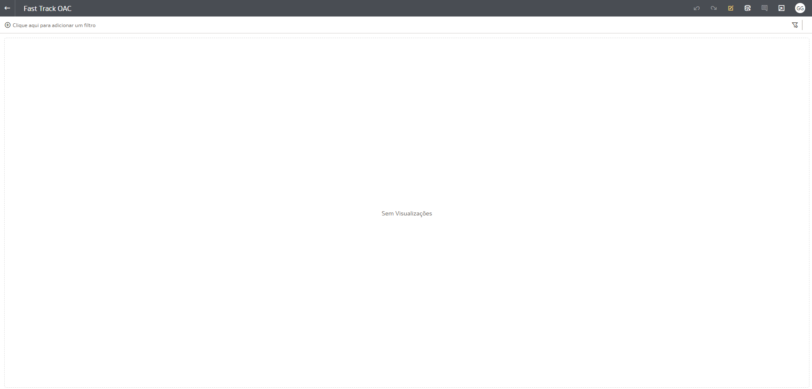
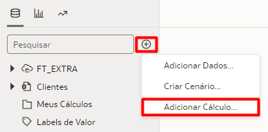
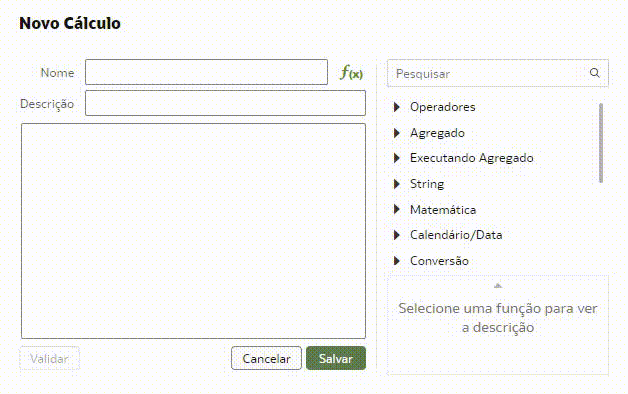
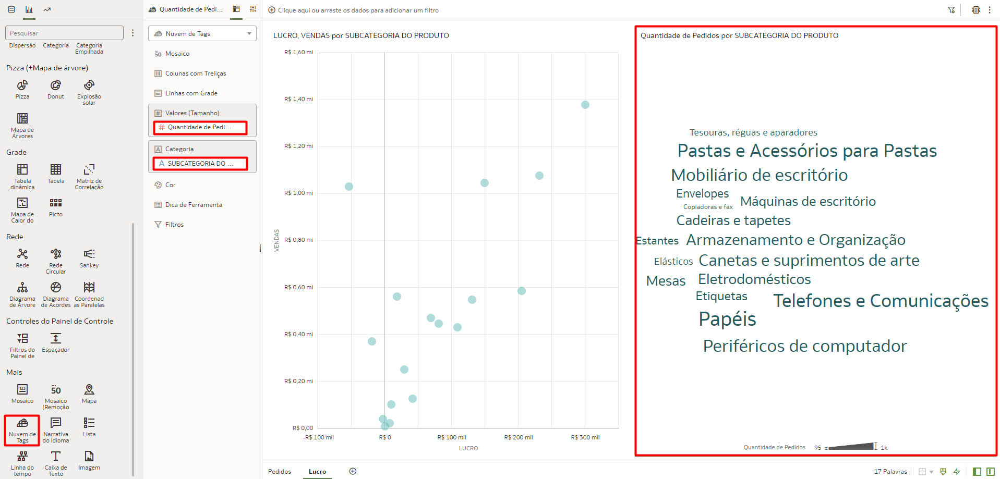
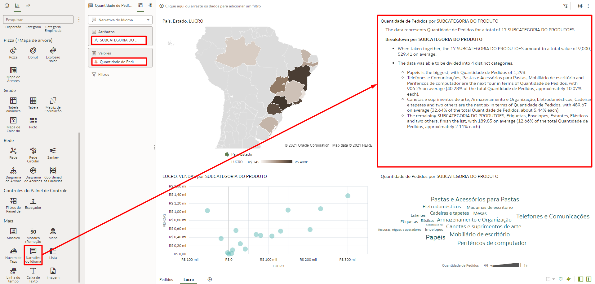
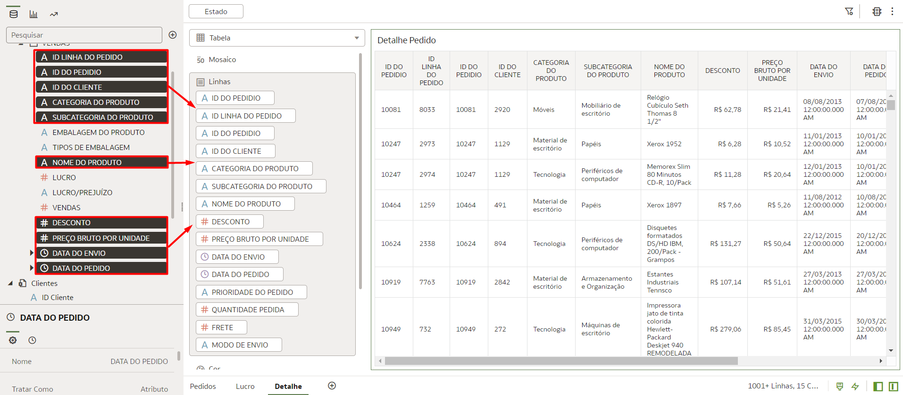
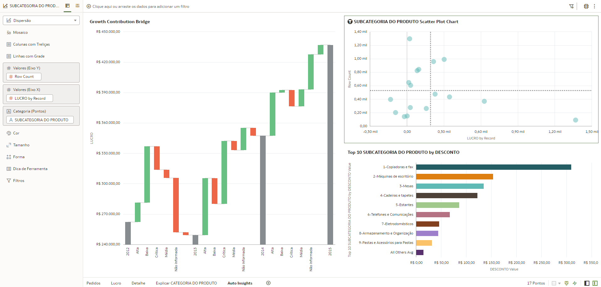
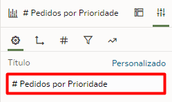

# Criar Visualizações

## Introdução

Neste Lab você vai aprender a criar visualizações no Oracle Analytics Cloud.

[Oracle Video Hub video scaled to Large size](videohub:1_6xkzayss:large)

*Tempo estimado para o Lab:* 30 Minutos

### Objetivos

* Conhecer a interface de criação de visualizações do OAC
* Criar campos calculados
* Construir um dashboard com gráficos de diferentes tipos
* Alterar propriedades dos gráficos e fazer uso de funcionalidades complementares para personalizar o dashboard

## Tarefa 1: Explorar a Interface

O Oracle Analytics Cloud (OAC) possuí uma interface simples, o que permite navegar rapidamente por suas diversas opções e funcionalidades. Em nossa primeira tarefa exploraremos a interface do Oracle Analytics Cloud dentro de uma pasta de trabalho.

Sempre que você abrir ou criar uma pasta de trabalho, por padrão, você terá a seguinte tela no modo de visualização:



Para explorar as demais opções de navegação na interface:

1.  Clique no icone correspondente a **Editar** no menu superior direito da tela.


Após habilitar o modo de edição, a interface da tela devera ter a seguinte configuração:


2.  No menu superior direto da tela encontre a opção correspondente aos comandos de **Desfazer/Refazer a Última Edição**.


3.  No menu superior direto da tela encontre a opção correspondente ao comando de **Visualização**.


4.  No menu superior direto da tela encontre a opção correspondente ao comando de **Atualizar Dados**.


5.  No menu superior direto da tela encontre a opção correspondente ao comando de **Adicionar Observação**.


6.  No menu superior direto da tela encontre a opção correspondente ao comando de **Auto Insights**.


7.  No menu superior direto da tela encontre a opção correspondente ao comando de **Exportar**.


8.  No menu superior direto da tela encontre a opção correspondente ao comando de **Salvar**.


Na região central do menu superior da tela é possível alternar entre páginas que fornecem acesso a diferentes funcionalidades.

9.  Na região central do menu superior da tela encontre a opção de **Visualizar**, que é referente a página atual.


10. Na região central do menu superior da tela encontre e selecione a opção **Dados** para acessar a página que permite adicionar novos conjuntos de dados a pasta de trabalho e editar as condições de junção entre eles.


11. Na região central do menu superior da tela encontre e selecione a opção **Apresentar** para acessar a página que permite adicionar telas a uma apresentação.


Outras opções de navegação são encontradas na região inferior da página.

12. Na região inferior direita da página encontre as opções de **Diretrizes de Grade**, **Brushing**, **Aplicar Dados Automaticamente**, **Alternar Painel de Dados** e **Alternar Painel de Gramática**.


13. Na região inferior esquerda da página encontre a opção de **Adicionar Tela**, representada pelo simbolo **+**.


## Tarefa 2: Criar um Campo Calculado

O Oracle Analytics Cloud também permite a criação de campos calculados dentro do próprio projeto de visualização para trazer informações complementares àquelas já presentes.

Para explorar essa funcionalidade iremos criar um campo calculado que será utilizado ao longo deste laboratório.

1.  Na barra lateral de opções, clique no simbolo indicado por um **+** e em seguida clique na opção **Adicionar Cálculo...**.



2.  Na janela que se abrir, coloque o nome do campo como **Quantidade de Pedidos**, digite o código a seguir e clique em **Validar** e posteriormente em **Salvar**.

```
COUNT(ID LINHA DO PEDIDO)
```



3.  O campo calculado criado ficará disponível dentro da aba **Dados** dentro da pasta **Meus Cálculos**.


## Tarefa 3: Criar um Dashboard com Visualizações Básicas

Em nossa segunda tarefa criaremos algumas visualizações básicas para compor nosso dashboard.

1.  Iniciaremos a construção do nosso dashboard adicionando uma visualização do tipo Tile (Métrica) a tela. Para isso selecione o campo de **Quantidade Pedida** dentro da tabela "Pedidos", arraste e solte no meio da tela.


2.  Agora iremos adicionar um gráfico do tipo Barras Empilhadas. Para isso navegue para a aba de visualizações, localize e arraste a opção de Barras Empilhadas para o lado direito da visualização de Tile.


3.  Você irá notar que o espaço para este gráfico está vazio. Para popular o gráfico com dados, selecione o campo de **Prioridade do Pedido** dentro da tabela "Pedidos", arraste e solte no espaço de **Categoria**. Faça o mesmo com o campo de **Quantidade de Pedidos** dentro da tabela "Meus Cálculos", porém o solte no espaço de **Valores**.


4.  Para ordenar as barras do gráfico criado, localize e selecione a opção de **Classificar**, que é representada por um par de setas.


5.  Na janela que irá abrir, selecione a métrica pela qual você deseja ordenar o gráfico, o modo de ordenação e clique em OK.


6.  A seguir criaremos um gráfico de Donut. Para isso navegue para a aba de visualizações, localize e arraste a opção de Donut para a região abaixo da visualização de Tile.


7.  Para popular o gráfico com dados, selecione o campo de **Estado** dentro da tabela "Clientes", arraste e solte no espaço de **Categoria**. Faça o mesmo com o campo de **Quantidade de Pedidos** dentro da tabela "Meus Cálculos", porém o solte no espaço de **Valores**.


8.  Iremos adicionar uma tabela com valores e atributos ao nosso dashboard. Para isso navegue para a aba de visualizações, localize e arraste a opção de Tabela para a região inferior da página.


9.  Para popular a Tabela com dados, segure a tecla Control (CTRL) e selecione os campos **ID do Pedido**, **Prioridade do Pedido**, **Quantidade Pedida**, **Frete** e **Modo de Envio** dentro da tabela "Pedidos", arraste e solte no espaço de **Linhas**.


10. Para finalizar o primeiro conjunto de visualizações, iremos criar uma Tabela Dinâmica. Para isso navegue para a aba de visualizações, localize e arraste a opção de Tabela Dinâmica para a região ao lado direito da Tabela.


11. Para popular a Tabela Dinâmica com dados, selecione o campo de **Categoria do Produto** dentro da tabela "Vendas", arraste e solte no espaço de **Colunas**. Selecione o campo de **Estados** dentro da tabela "Clientes", arraste e solte no espaço de **Linhas**. Faça o mesmo para o campo **Quantidade de Pedidos** dentro da tabela "Meus Cálculos", porém o solte no campo de **Valores**.


12. Para melhor identificar esta primeira página do dashboard, vamos renomear esta tela. Clique no triangulo ao lado do nome da tela e clique em renomear.


13. Digite o nome **Pedidos** e clique no sinal de check para confirmar.


14. Em seguida vamos criar uma nova tela. Para isso clique no sinal de **+** na parte inferior da tela.

15. Digite o nome **Lucro** e clique no sinal de check para confirmar.

16. Começaremos a construção dessa nova tela com um gráfico de Dispersão. Para isso, seguiremos o mesmo processo realizado para os demais gráficos, porém selecionando a opção de Dispersão e arrastando para o centro da página. Para popular o gráfico com dados, selecione o campo de **Vendas** dentro da tabela "Vendas", arraste e solte no espaço de **Valores (Eixo Y)**. Faça o mesmo para o campo **Lucro** dentro da tabela "Vendas" e para o campo **Subcategoria do Produto** da tabela "Vendas", porém os soltando nos campos de **Valores (Eixo X)** e **Categoria** respectivamente.


17. A seguir iremos criar uma visualização do tipo Nuvem de Tags. Para isso, seguiremos o mesmo processo realizado para os demais gráficos, porém selecionando a opção de Nuvem de Tags e arrastando para a direita do gráfico de dispersão. Para popular a nuvem, selecione o campo de **Subcategoria do Produto** dentro da tabela "Vendas", arraste e solte no espaço de **Categoria**. Faça o mesmo para o campo **Quantidade de Pedidos** dentro da tabela "Vendas", porém o soltando no campo de **Valores (Tamanho)**.



18. Uma das possibilidade mais interessantes para visualizar dados geográficos no OAC é a visualização do tipo Mapa. Para criar uma visualização do tipo Mapa, selecione a opção de Mapa e arraste para a região superior das visualizações já existentes na página. Para popular o gráfico com os dados de interesse, selecione os campos de **Pais** e **Estado** dentro da tabela "Clientes", arraste e solte no campo **Categoria**. Arraste o campo de **Lucro**, da tabela "Vendas", para o campo **Cor** da visualização de Mapa.


19. Por fim, para finalizar esse segundo conjunto de visualizações do seu dashboard, crie uma visualização do tipo Narrativa do Idioma. Essa funcionalidade explica, de forma textual, os dados selecionados. Para criar essa visualização, selecione a opção de Narrativa do Idioma e arraste para a região superior esquerda da tela. Para a narrativa dos dados, selecione o campo de **Subcategoria do Produto** da tabela "Vendas" e arraste para o campo de **Atributos**. Faça o mesmo com o campo de **Quantidade de Pedidos** da tabela "Vendas", porém o arraste para o campo de **Valores**.



20. Para nos preparar para a utilização de opções mais avançadas que serão apresentados nos laboratórios a seguir, iremos criar uma nova página, da mesma forma como criamos as demais página, com o nome **Detalhe**.

21. Retorne a página **Pedidos** e clique com o botão direto do mouse na região da tabela existente nessa página e selecione a opção **Editar** e posteriormente a opção **Copiar Visualização**.


22. Na página **Detalhe**, clique com o botão direito e selecione a opção **Colar Visualização**.


23. Adicione os seguintes dados a tabela para aumentar o seu nível de detalhe:

* **ID Linha do Pedido**
* **ID do Pedido**
* **ID do Cliente**
* **Categoria do Produto**
* **Subcategoria do Produto**
* **Nome do Produto**
* **Desconto**
* **Preço Bruto por Unidade**
* **Data do Envio**
* **Data do Pedido**



## Tarefa 4: Explorando as Funcionalidades de Auto Insight e Explicar

O Oracle Analytics Cloud possui diversos mecanismos de Machine Learning nativo da ferramenta, esses recursos nos ajudam de várias formas diferentes durante o processo de criação dos nossos dashboards. Vamos ver duas funcionalidades muito úteis para entendimento dos dados e sugestões de gráficos: *Auto Insights e Explain (Explicar)*.

O ***Explain*** usa Machine Learning para encontrar informações úteis sobre seus dados.

1.  Para começar a explorar a funcionalidade de Explicar, clique com o botão direito do mouse sobre o campo **"Categoria do Produto"** na tabela Vendas e em seguida selecione a opção **"Explicar CATEGORIA DO PRODUTO"**


Uma nova janela será aberta com todas as explicações sobre o campo que você selecionou, incluindo: Fatos Básicos, Drivers Chave, Segmentos que Explicam, Anomalias. Em cada aba dessas você vai encontrar gráficos e descrições em forma de texto sobre o campo que você está analisando. Uma vez que você olhou todas as abas você pode escolher os gráficos que você acha relevantes para seu dashboard.

2. Na aba "Fatos Básicos sobre CATEGORIA DE PRODUTOS" role a página até você encontrar um gráfico que explica o Lucro por Categoria de Produto, descanse o mouse sobre o gráfico até aparecer um sinal de check no canto superior direito do gráfico e clique nesse sinal de check, em seguida clique em **"Adicionar Selecionado"**.


Esse gráfico será adicionado em uma nova tela no seu Arquivo de trabalho, como indicado na imagem abaixo.


Agora vamos usar o ***Auto Insights*** para criar visualizações poderosas usando sugestões geradas pelo Oracle Analytics Cloud (OAC).

1.  Vamos começar criando uma nova página chamada ***Auto Insights***.

2.  Clique no ícone de uma lâmpada amarela na parte superior direita da tela e verifique se a tabela "FT_EXTRA" está selecionada. Role até encontrar o gráfico chamado ***Subcategoria do Produto Scatter Plot Chart*** e arraste para o centro da página.


3.  Encontre os gráficos chamados ***Top 10 Subcategoria do Produto by Desconto*** e ***Growth Contribution Bridge*** e os arraste para a tela de modo a ter o resultado disposto na imagem a seguir.



## Tarefa 5: Alterar Propriedades dos Gráficos

O Oracle Analytics Cloud permite que você altere propriedades dos gráficos do seu dashboard. Essa é uma funcionalidade essencial para garantir que suas visualizações estejam claras e possam ser fácilmente entendidas pelos usuários finais do dashboard.

Vamos começar alterando os títulos das visualizações da página **Pedidos**.

1.  Selecione a visualização **Quantidade de Pedidos por PRIORIDADE DO PEDIDO** e na barra de propriedades, na opção de Título, clique na opção **Automático** e mude para **Personalizado**.


2.  Defina o título da visualização como **# Pedidos por Prioridade**.



3.  Repita o processo para os demais gráficos com títulos da sua escolha.

Agora iremos mudar o Plano de Fundo dos gráficos.

1.  Nas opções gerais da visualização **# Pedidos por Prioridade**, busque a opção Plano de Fundo. Clique na opção **Automático** e mude para **Personalizado**. No campo de Cor de Preenchimento utilize a cor ***#e0e0e0***.


2.  Repita o processo com as visualizações da página **Pedidos** até obter o resultado a seguir.


Uma das propriedades mais importantes de uma boa visualização é a sua legenda. A seguir iremos explorar a opção de legenda do Oracle Analytics Cloud.

1.  No gráfico de Donut criado anteriormente, mude o dado **Estado** do campo **Categoria** para o campo **Cor**. Isso irá habilitar as legendas na visualização. 


2. No painel de propriedades da visualização, encontre a opção chamada **Posição da Legenda** e mude de **Automático** para **Direita**.


## Tarefa 6: Adicionar Texto, Cores e Imagens ao Dashboard

O Oracle Analytics Cloud permite a adição de texto e imagens de modo fácil ao seu dashboard, dando um maior nível de customização. Também é possível facilmente alterar a paleta de cores do dashboard para que todos os gráficos sigam o mesmo padrão de cores.

Vamos começar adicionando um título a página **Pedidos**.

1.  Nas opções de tipos de gráficos, selecione a opção Caixa de Texto, arraste e solte na região superior da página.


2.  Clique na opção Editar Texto e selecione o tamanho de fonte 22 e ative o negrito e o italico para inserir o texto **Dashboard Pedidos Miau Corp**.


3.  Faça o mesmo para a página **Lucro** com o texto **Análise de Lucro Miau Corp**.

Agora iremos adicionar o logo da empresa no dashboard.

1.  Baixe o logo da MIAU CORP [aqui](https://objectstorage.us-ashburn-1.oraclecloud.com/n/id3kyspkytmr/b/ArquivosPublicos/o/MiauCorpLogo.jpg).

2.  Nas opções de tipos de gráficos, selecione a opção Imagem, arraste e solte na região superior da página indicada na imagem a seguir.


3.  Ao clicar na opção Selecionar Imagem a seguinte janela irá abrir. Nela clique em Fazer Upload e selecione o logo da empresa e clique em Ok.


4.  Na aba de opções da visualização, mude a Largura e Altura de **Original** para **Ajuste Automático**.


Após essas instruções a imagem deverá estar no formato indicado na imagem a seguir.


Para finalizar essa etapa de personalização do dashboard, iremos modificar a paleta de cores de modo a padronizar todas as visualizações.

1.  Na região superior direita da página, clique no icone indicado pelos **três pontos** e selecione a opção **Propriedades do Arquivo de Trabalho**.


2.  Na janela que irá abrir, na opção **Sequência de Cores**, clique na opção **Padrão (Redwood)** e mude para a opção **Lilac** e clique em Ok.


Case tenha mudado a paleta com sucesso, a sua página **Pedidos** deve estar igual a imagem a seguir.


Parabéns, você terminou esse laboratório!
Você pode **seguir para o próximo Lab**.

## Conclusão

Nesta sessão você aprendeu a criar um dashboard com visualizações básicas de diversos tipos.

## Autoria

- **Autores** - Guilherme Galhardo, Thais Henrique, Isabella Alvarez, Breno Comin, Isabelle Dias
- **Último Updated Por/Data** - Guilherme Galhardo, Mar/2023