# Primeiros passos no OAC

## Introdução

Neste Lab você vai aprender a navegar pela interface do Oracle Analytics Cloud e, conectar o OAC a dados. 

[Oracle Video Hub video scaled to Large size](videohub:1_emf4ny76:large)

***Overview***

O Oracle Analytics Cloud é um serviço de nuvem pública escalável e seguro que fornece um conjunto completo de recursos para explorar e executar análises colaborativas para você, seu grupo de trabalho e sua empresa. Com o Oracle Analytics Cloud, você também tem recursos flexíveis de gerenciamento de serviços, incluindo configuração rápida, dimensionamento e patches fáceis.
Como usuário do Oracle Analytics com acesso de Autor de Conteúdo do DV, você poderá estabelecer conexão com as origens de dados usadas por sua organização. Por exemplo, você pode criar um conjunto de dados que inclua tabelas de uma conexão do Autonomous Data Warehouse, tabelas de uma conexão Spark e tabelas de uma área de assunto local.

*Tempo estimado para o Lab:* 10 Minutos

### Objetivos

Neste Laboratório você vai:
* Explorar os recursos disponíveis de forma nativa dentro do OAC (Oracle Analytics Cloud)
* Testar sua conexão.

## Tarefa 1: Acessar a instância do Oracle Analytics Cloud

O Oracle Analytics Cloud é um dos serviços disponível dentro de OCI (Oracle Cloud Infrastructure). Você poderia acessá-lo diretamente através da sua URL. Porém nessa tarefa você vai aprender como acessar o OAC usando a console em OCI e navegando pelo menu de serviços até a instância do Oracle Analytics Cloud que vamos usar nesse Workshop.

Após fazer o login no ambiente com suas credenciais exclusivas (Ver Lab "Pré-requisitos")

1. Você verá a console OCI. Verifique se você está na Região correta *US East (Ashburn)*, em seguida clique no menu de hamburger na lateral superior esquerda.

 

2. Selecione **Analytics & AI** e clique em **Analytics Cloud**.

 

3. Verifique se você está no Compartimento desejado e clique no nome da instância, neste exemplo, **ANALYTICS** e **ANALYTICSLAB** são o compartimento e a instância, respectivamente.

 

4. Agora basta clicar no botão **ANALYTICS HOME PAGE** .

Uma nova aba será aberta e você será direcionado para a Página Inicial do OAC.

## Tarefa 2: Página Inicial

Toda navegação é feita pelo **Menu Hamburguer**. Sempre que quiser retornar à Home page, você deve:

1.	Clicar no Menu Hamburguer no lado superior esquerdo da tela principal, 

   

Assim que a barra lateral se expandir, você verá o ícone correspondente a **Home**, selecione-o.

 

O analytics permite o trabalho colaborativo, você e todos os outros usuários têm suas próprias pastas pessoais. As pastas pessoais (minhas pastas) só podem ser acessadas ​​pelo usuário que criou e salvou o conteúdo na pasta. Você também pode salvar projetos em pastas compartilhadas onde outros usuários ou grupos podem acessá-los.

2.	Para explorar, clique no **Menu Hamburguer** e escolha **Catálogo**. Você será direcionado para a seguinte tela:

Conjuntos de dados são modelos de dados self-service que você cria especificamente para sua visualização de dados e requisitos de análise.

3.	Seguindo o mesmo passo de clicar no **Menu Hamburguer**, ao clicar em **Dados**, será exibidos em **Conjunto de Dados**, dados disponíveis para serem usados, quando você upar uma tabela, planilha ou arquivo, eles ficarão salvos para serem consumidos imediatamente ou reaproveitados em outras ocasiões.

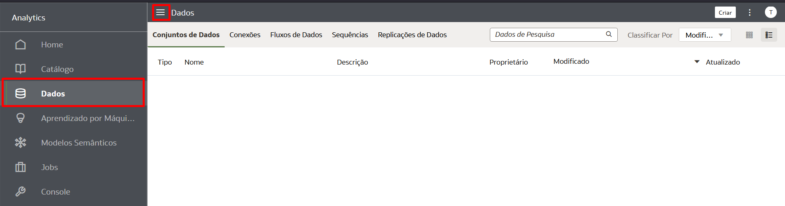 

Ainda nesta aba, você poderá verificar **Conexões**, como usuário do Oracle Analytics com permissão de DV Content Author, você pode estabelecer conexão com as origens de dados usadas por sua organização:

Os fluxos de dados permitem que você organize e integre seus dados para produzir conjuntos de dados que seus usuários podem visualizar.

Por exemplo, você pode usar um fluxo de dados para:

* Criar um conjunto de dados.
* Combinar dados de diferentes fontes.
* Treinar modelos de aprendizado de máquina ou aplicar um modelo de aprendizado de máquina aos seus dados.
À direita de **Conexões**, você pode acessar **Fluxos de Dados** clicando em cima dele.

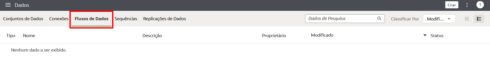

Seguindo, teremos **Sequências**. 
Uma sequência é definida como uma coleção de fluxos de dados que você executa juntos. Eles são úteis quando você quiser executar vários fluxos de dados como uma única transação. 

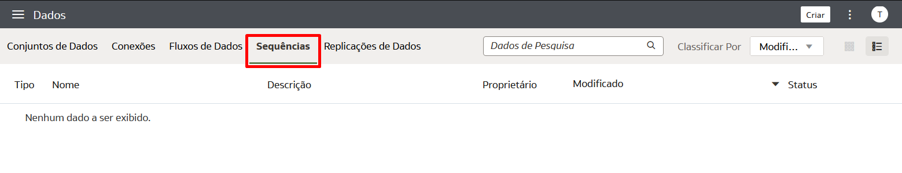

Por fim, **Replicações de Dados**. 
Use-o para copiar dados de uma origem para análise no Oracle Analytics Cloud. 

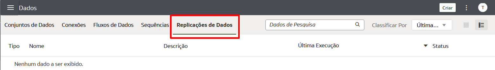

4.	O Oracle Analytics permite que você registre e use modelos de machine leaning Oracle do Oracle Database ou Oracle Autonomous Data Warehouse, volte mais uma vez no **Menu Hamburguer** e clique em **Aprendizagem Por Máquina** para acessar uma lista de modelos e scripts registrados:

O  modelo de dados semânticos é uma abordagem que se baseia em princípios semânticos que resultam em um conjunto de dados com estruturas de dados especificadas inerentemente. 

5.	Novamente, clique no **Menu Hambuguer**, abaixo de **Aprendizagem Por Máquina**, clique em **Modelos Semânticos** para acessar uma lista de modelos e scripts registrados:

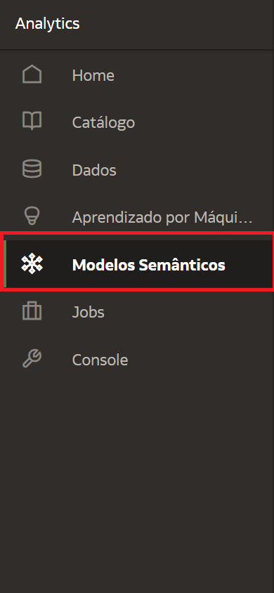

6.	Para rastrear o status de seus jobs e gerenciá-los, continue navegando no **Menu Hamburguer** e clique em **Jobs**. Você pode monitorar o número de jobs filtrando por **Tipo de Objeto** e o **Status** do mesmo.

7.	Ao clicar em **Console**, através do **Menu Hamburguer**, você encontrará opções para gerenciar permissões de usuário, configurar vários aspectos do Oracle Analytics Cloud e executar outras tarefas administrativas.

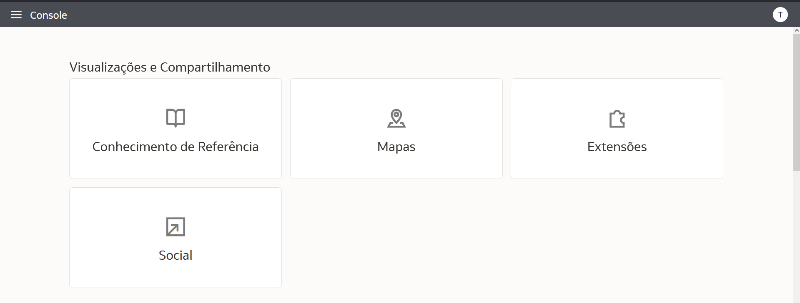
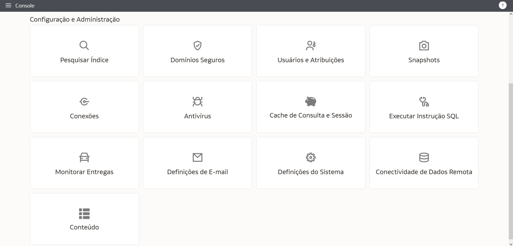

## Tarefa 3: Opções de ID

1. Para ter acesso ao Help Center, editar seu perfil, mudar a senha ou efetuar, verificar a versão atual do OAC ou fazer logout da sua conta, basta clicar em cima do círculo com as iniciais da sua credencial.

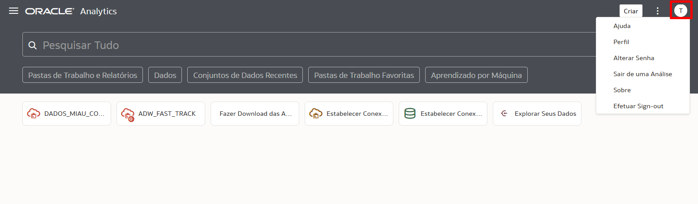

## Tarefa 4: Barra de Pesquisa

1. Através da **Barra de pesquisa** em sua Home Page, você pode pesquisar todos os tópicos apresentados aqui e todas as funcionalidades que existem dentro do OAC, desde as opções dentro do **Menu Hamburguer** até funções do **Criar**.

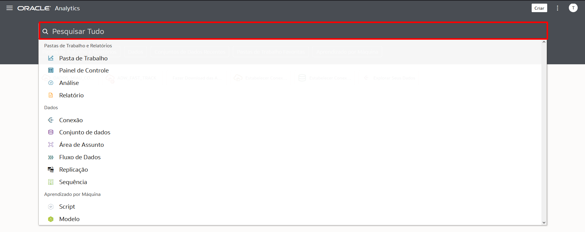

## Tarefa 5: Teste Sua Conexão 
Para esse Workshop você criou uma conexão no lab **Pré-requisitos: Provisionando os recursos necessários para o lab**.
Para ter certeza que sua conexão está ativa e funcionando, visualize-a através da lista de conexões.
Tal lista contém as conexões que você criou e as conexões que você tem permissão para acessar e usar para criar conjuntos de dados.
Existem algumas formas de fazer essa verificação:

1.	No Menu Hambúrguer da página inicial, clique em **Dados** e, em seguida, na guia **Conexões** para acessar a lista. Se a conexão foi feita de maneira correta, você será capaz de visualizá-la, bem como os detalhes da mesma.

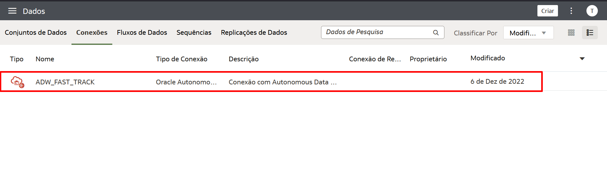

Ao descansar o mouse sobre a conexão, no final desta linha, você verá três pontinhos à sua direita. Clique em cima do mesmo e em seguida, **Inspecionar**.

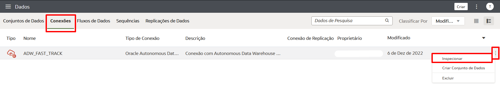

Você verá todos os detalhes da sua conexão.

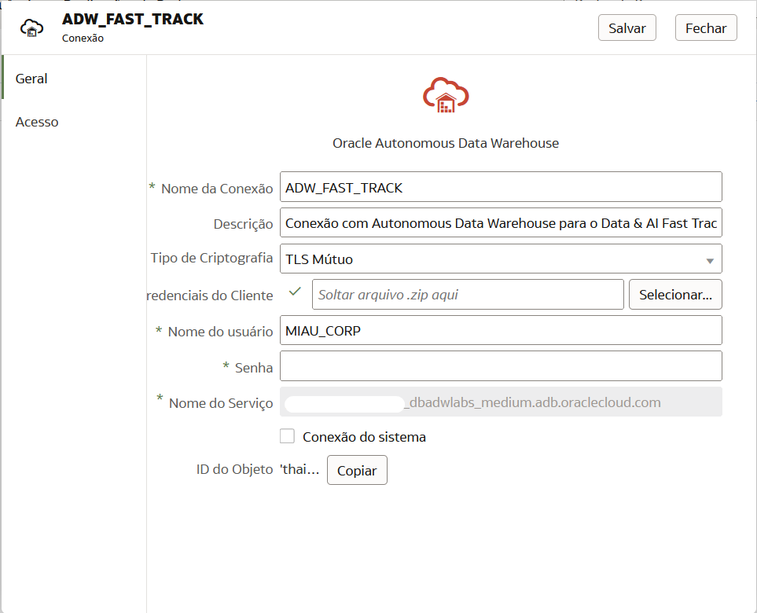

Pronto!

Você pode **seguir para o próximo Lab**.

## Autoria

- **Autores** - Isabelle Dias
- **Último Update Por/Data** - Isabelle Dias, Maio/2023