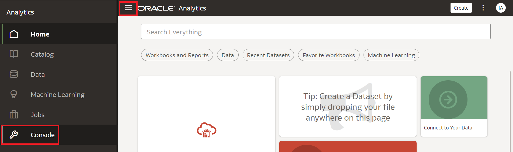

# Atividades Administrativas

## Introdução

Neste Lab você vai aprender a gerenciar a solução Oracle Analytics Cloud.

*Este Lab só pode ser realizado por usuários que possuam o perfil de Administrador dentro do Oracle Analytics Cloud. Não é o caso dos usuários do Fast Track, portanto, está como Lab opcional para usuários que possuam a solução.*

*Tempo estimado para o Lab:* xx Minutos

### Objetivos

* Criar Backups do ambiente
* Definir o tipo de acesso de usuários
* Gerenciar a utilização de performance da solução
* Criar uma url customizada de acesso a solução

## Task 1: Backup do Ambiente com Snapshots

1.	Na página inicial, clique no hambúrguer na lateral direita e, em seguida, clique em **Console**.

2.	Buscar o botão **Snapshots** e clicar nele.

3.  Clicar em **Create Snapshot**, adicionar o nome do arquivo de Backup a sua escolha, nesse tutorial estamos utilizando **Backup Geral**, em content escolher a opção **Everything** e clicar em **Create**

4.  Aguardar alguns segundos para que o processamento finalize, em seguida, clicar nos 3 pontos e clicar em **Export**

5.  Escolher a opção **Local File System**, adicionar uma senha e confirmar essa senha, clicar em **Export**

O arquivo será baixado para a máquina local, mas caso fosse necessário, poderia ser baixado para um ambiente de Data Lake (Object Storage), para isso, no passo 5, basta escolher a opção **Oracle Cloud Storage** ao invés de **Local File System** e adicionar os detalhes de acesso ao Object Storage.

## Task 2: Adminstração de usuários através de Application Roles

1.	Na página inicial, clique no hambúrguer na lateral direita e, em seguida, clique em **Console**.

2.	Buscar o botão **Users and Roles** e clicar nele.

3.  Clicar em **Application Roles**, escolher em qual role irá adicionar usuários, nesse exemplo, adicionaremos na opção **DVConsumer**, então basta clicar na opção.

4.  Para adicionar usuários no grupo desejado, basta clicar na opção **Users** e em seguida em **Add Users**.

5.  No campo de busca, digitar o nome do usuário desejado seguido por um asterisco (*), clicar em Enter no teclado, selecionar o usuário escolhido e clicar em **Add**.

Para entender em mais detalhes quais são as roles e suas permissões, basta verificar na documentação: https://docs.oracle.com/en/cloud/paas/analytics-cloud/acabi/application-roles.html

## Task 3: Mudança de url de acesso ao Oracle Analytics Cloud (Opcional)

1.	No menu principal, clique em "Networking" e escolha "Virtual Cloud Networks"

## Task 4: Gerenciamento de utilização com Usage Tracking (Opcional)

1.	No menu principal, clique em "Networking" e escolha "Virtual Cloud Networks"

//Fazer até 4/5 tasks
//* simples cria italico
//**duplo cria negrito
//***triplo cria negrito + italico
// se o usuário tiver que clicar em algo, colocar em negrito entre ""

Você pode **seguir para o próximo Lab**.

## Conclusão

Nesta sessão você aprendeu a criar uma Virtual Cloud Network (VCN) na prática.

## Autoria

- **Autores** - Breno Comin, Guilherme Galhardo, Isabella Alvarez, Isabelle Dias, Thais Henrique
- **Último Updated Por/Data** - Isabella Alvarez, Nov/2022