# Apresentar e Exportar os Dashboards

## Introdução

Neste Lab você vai aprender a utilizar o modo de apresentação do Oracle Analytics Cloud e vai aprender a exportar seus dashboards podendo escolher entre os formatos oferecidos pela ferramenta.

[Oracle Video Hub video scaled to Large size](videohub:1_k7t0njfr:large)

*Tempo estimado para o Lab:* 15 Minutos

### Objetivos
* Configurar o modo de apresentação
* Ocultar gráfico no modo de apresentação
* Exportar o dashboard em PDF e em DVA (formato nativo do OAC)

## Tarefa 1: Apresentar Dashboards

A última etapa na construção das nossas visualizações é a configuração do modo de apresentação, a definição de como cada Tela será disponibilizada para o usuário que vai apenas consumir os dashboards e não fará nenhum tipo de alteração.

O Oracle Analytics Cloud oferece uma área dedicada para essa etapa, na aba Apresentar:

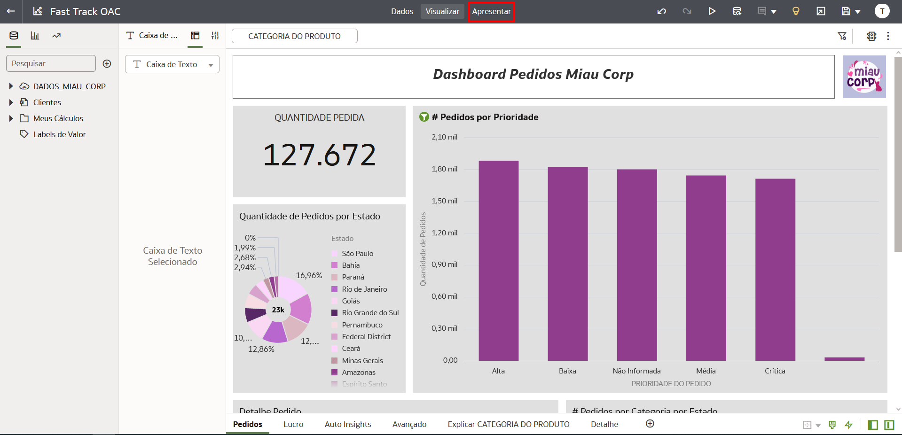

Nessa aba você verá todas as tela criadas no modo de edição (na aba Visualizar) e poderá escolher quais você vai apresentar e ainda definir a ordem.

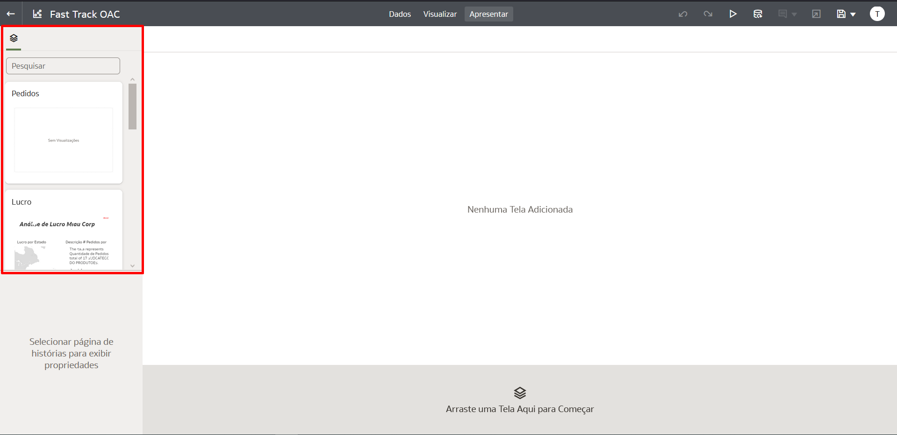

Vamos começar a criar nossa apresentação

1. Selecione a tela Pedidos e arraste para a parte inferior da tela

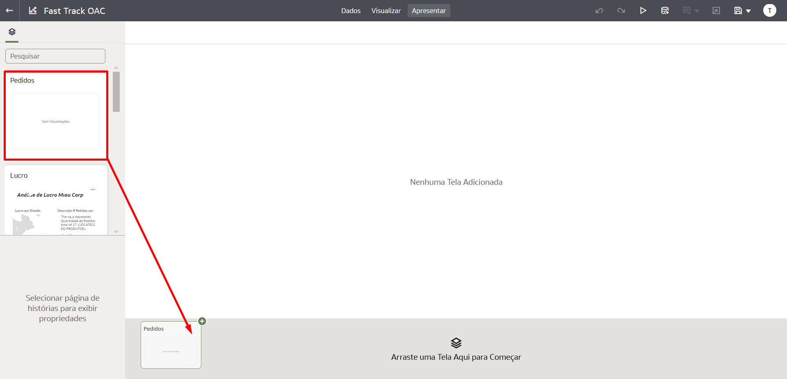

Você verá o preview da tela escolhida e você verá que agora as opções de configuração de apresentação para essa tela estarão disponíveis.

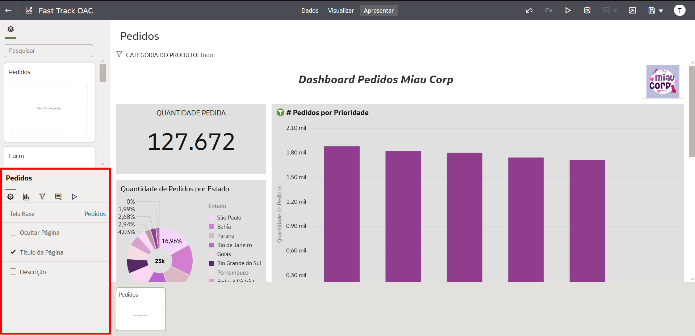

Teremos opções diferentes em cada aba, desde definir qual dos gráficos estarão visíveis até o estilo de navegação entre as telas

2. Explore todas as abas e se familiarize com elas

Agora que você está familiarizado com as opções de configuração de apresentação vamos adicionar mais telas a nossa apresentação

3. Adicione as telas: **Lucro, Auto Insights, Avançado e Detalhe**

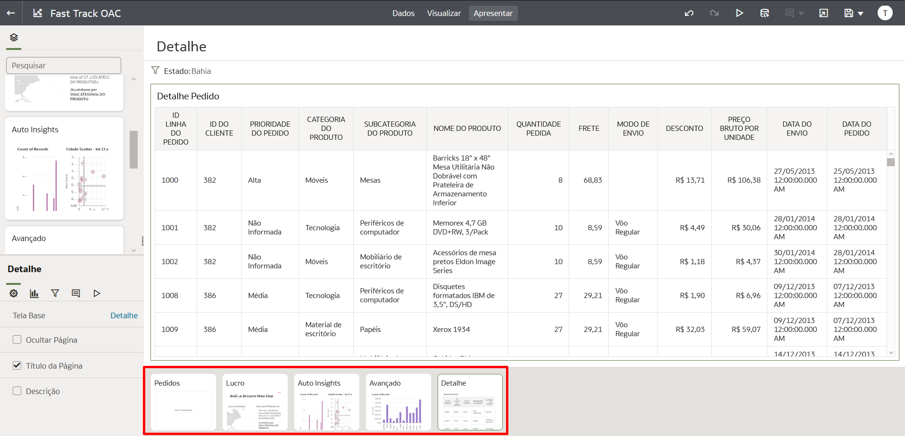

Uma das opções que temos ao editar a apresentação é a possibilidade de escolher quais do gráfico presentes em uma tela permanecerão visíveis. No nossa tela "Lucro" temos um gráfico de Linguagem Natural que não fará sentido na nossa apresentação pois o formato texto não é o mais indicado durante uma apresentação pois o próprio apresentador poderá falar sobre esses detalhes mais descritivos.

Vamos remover o gráfico "Descrição # Pedidos por Subcategoria do Produto"  da nossa apresentação.

> **Nota:** Ocultar um gráfico na aba de "Apresentar" não afeta o gráfico original. Você poderá visualizá-lo normalmente na aba "Visualizar".

4. Selecione a tela de "Lucro" e clique na aba de Ajustes. Localize a seção "Visuais", em seguida clique no gráfico que queremos ocultar da nossa apresentação: **"Descrição # Pedidos por Subcategoria do Produto"**.

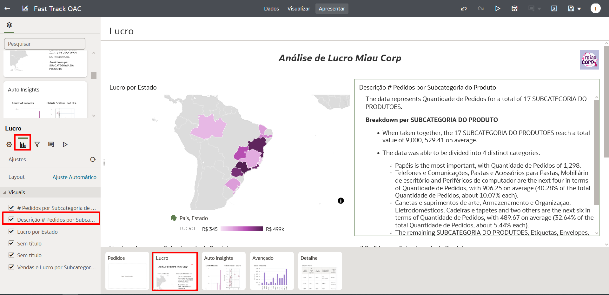

Pronto, o gráfico não estará mais visível na nossa apresentação.

Agora vamos alterar a forma como as telas serão exibidas durante nossa apresentação. Podemos alterar o estilo do Navegador de Histórias e escolher entre essas 4 opções: **Guia Inferiores (padrão)**, **Barra de Navegação**, **Tira de Filme** ou **Nenhum**

5. Na lateral inferior direta vamos acessar a aba "Apresentação". Localize a opção "Navegador de Histórias", clique na opção atual "Guia Inferiores" e troque por "Barra de Navegação".

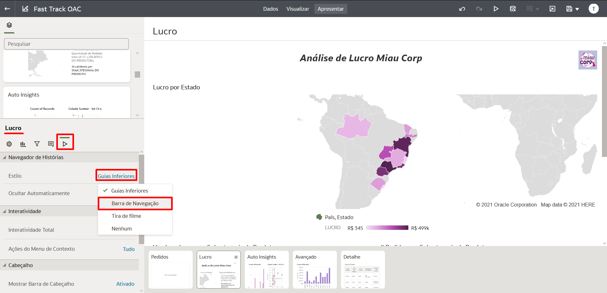

A opção "Barra de Navegação" adiciona pontinhos representando cada uma das suas telas. Ela é bem discreta e muito útil para manter o foco da apresentação na tela atual.

Vamos salvar nossas modificações e visualizar como ficou nossa apresentação.

6. Clique no ícone de disquete no canto superior direito para salvar e após a mensagem de confirmação clique no ícone de **Play**.

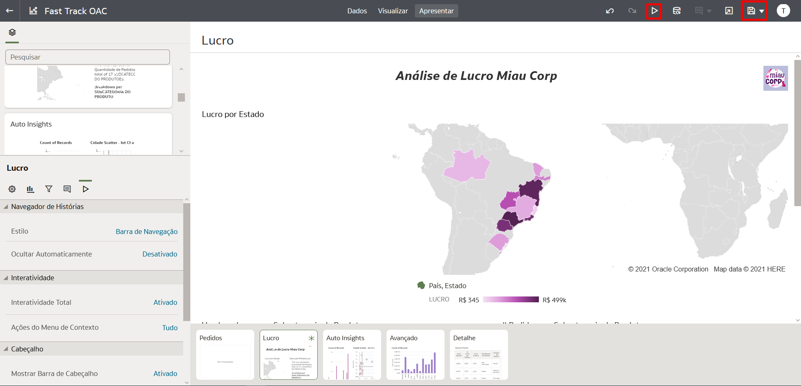

Observe:
* A Barra de Navegação indicada abaixo na imagem
* O gráfico de Linguagem Natural permaneceu oculto

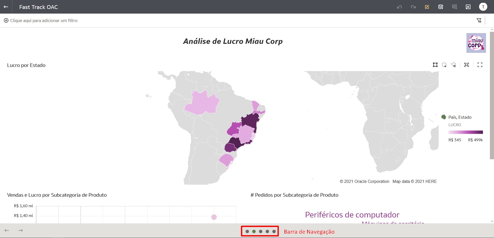

Agora explore as outras telas através da Barra de Navegação.

## Tarefa 2: Exportar Dashboards

O Oracle Analytics Cloud (OAC) oferece algumas opções para exportação dos nossos Dashboards ou de um gráfico específico. Temos a possibilidade de exportar o arquivo, de imprimir e até [enviar por e-mail*](https://docs.oracle.com/en/cloud/paas/analytics-cloud/acabi/send-email-reports-and-track-deliveries.html#GUID-C5815E71-9348-4C13-BAB6-B5B0C887B3D6).

Para a exportar o arquivo temos diversões formatos disponíveis: PowerPoint(pptx), Acrobat(pdf), Imagem(png) e Pacote(dva) formato nativo do OAC.

Vamos exportar nosso dashboard em PDF para ser compartilhado de forma mais simples com usuários que não tem acesso ao OAC.

1. Na aba Visualizar, clique no botão de "Exportar" no canto superior direito da tela e selecione a opção "Arquivo".

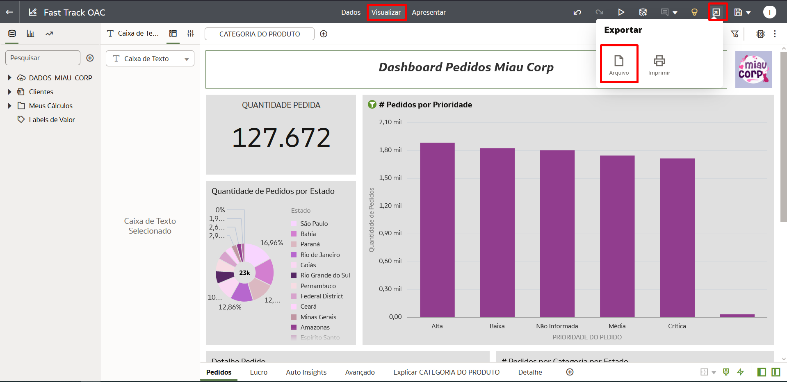

2. Preencha preencha os campos com as informação abaixo e em seguida clique em **Salvar**.

*Nome:* Análise Miau Corp
*Formato:* Acrobat (pdf)
*Incluir:* Todas as Telas
*Tamanho:* A4 (210 mm x 297 mm)
*Orientação:* Paisagem

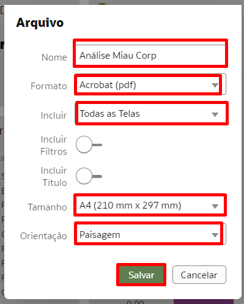

Uma janela vai aparecer mostrando o processamento dos gráficos e você poderá acompanhar o processo através dela.

Quando o processamento terminar o download automático do arquivo vai iniciar, basta verifica nas opções de download do seu navegador.

O resultado final deve similar ao abaixo:

Agora vamos exportar o nosso dashboard no formato .DVA que é o formato nativo do Oracle Analytics Cloud (OAC). Como esse tipo de arquivo você pode fazer importação de dashboard em outras instâncias do OAc ou manter essa arquivo salvo como um Backup.

3. Acesse "Exportar" e selecione "Arquivo".

4. Dessa vez vamos mudar o formato de exportação para Pacote (dva) e será necessário adicionar uma senha para a exportação. (Essa senha  será necessária caso você for importar o arquivo)

*Nome:* Fast Track OAC
*Formato:* Pacote (dva)
*Incluir Dados* - MANTER HABILITADO
*Incluir Credenciais de Conexão* - DESABILITAR
*Proteger Senha:* Colocar uma senha

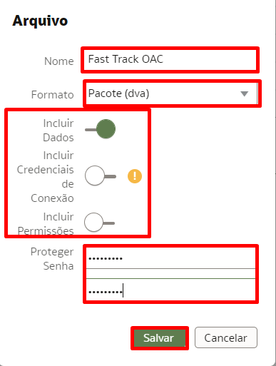

Uma janela vai aparecer mostrando o processo de exportação

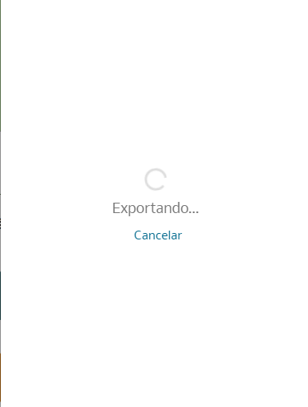

Quando o processamento terminar o download automático do arquivo vai iniciar, basta verifica nas opções de download do seu navegador e buscar um arquivo com a extensão **.dva**.

Você pode utilizar o arquivo que acabou de baixar com todos os gráfico e configurações que você fez nos dados para importar em qualquer instancia do OAC sem a necessidade de ter que refazer todo o processo.

Parabéns, você terminou esse laboratório!
Você pode **seguir para o próximo Lab**.

## Saiba Mais

[Configurar envio de dashboards por e-mail](https://docs.oracle.com/en/cloud/paas/analytics-cloud/acabi/set-email-server-deliver-reports.html).
[Agendar o envio automático de dashboards por e-mail](https://docs.oracle.com/en/cloud/paas/analytics-cloud/acabi/send-email-reports-and-track-deliveries.html#GUID-49732584-010B-444F-84C6-37FABF533642).
[Importar um arquivo DVA](https://docs.oracle.com/en/middleware/bi/analytics-desktop/bidvd/import-workbook-file.html).

## Conclusão

Nesta sessão você aprendeu a configurar o modo de apresentação e aprendeu a exportar seus dashboards em dois formatos de arquivos diferentes PDF e DVA.

## Autoria

- **Autores** - Thais Henrique, Isabella Alvarez, Breno Comin, Isabelle Dias, Guilherme Galhardo
- **Último Update Por/Date** - Thais Henrique, Mar/2023