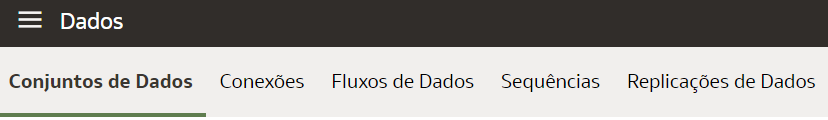
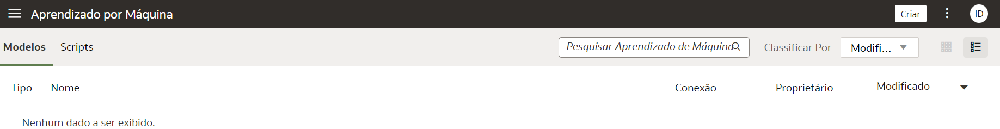

# Tour pelo OAC

## Introdução

Neste Lab você vai aprender a navegar pela interface do Oracle Analytics Cloud

***Overview***

O Oracle Analytics Cloud é um serviço de nuvem pública escalável e seguro que fornece um conjunto completo de recursos para explorar e executar análises colaborativas para você, seu grupo de trabalho e sua empresa. Com o Oracle Analytics Cloud, você também tem recursos flexíveis de gerenciamento de serviços, incluindo configuração rápida, dimensionamento e patches fáceis.

*Tempo estimado para o Lab:* NN Minutos

### Objetivos

Neste Laboratório você vai:
* Explorar os recursos disponíveis de forma nativa dentro do OAC (Oracle Analytics Cloud)

## Tarefa 1: Página Inicial

Assim que logar com seu ID de Usuário e Senha, você será direcionado para a página inicial da ferramenta. 
Quando você acessar pela primeira vez, o Oracle Analytics Cloud exibe um tour pelo produto. 
Esta tela inicial é a **Home page**.
  

Sempre que quiser retornar à ela:

1.	Clique no Menu Hamburguer no lado superior esquerdo da tela principal, 

   

Assim que a barra lateral se expandir, você verá o ícone correspondente a **Home**, selecione-o.

 

2.	Para explorar os projetos acessíveis, clique no Menu Hamburguer e escolha **Catálogo**. Você será direcionado para a seguinte tela:

  

3.	Seguindo o mesmo passo de clicar no Menu Haburguer, ao clicar em **Dados**, será exibidos em **Conjunto de Dados**, dados disponíveis para serem usados, quando você upar uma tabela, planilha ou arquivo, eles ficarão salvos para serem consumidos imediatamente ou reaproveitados em outras ocasiões.

Ainda nesta aba, você poderá verificar **Conexões**:

À direita de **Conexões**, você pode acessar **Fluxos de Dados** clicando em cima dele.
Os fluxos de dados permitem que você organize e integre seus dados para produzir conjuntos de dados que seus usuários podem visualizar.

Por exemplo, você pode usar um fluxo de dados para:

* Criar um conjunto de dados.
* Combinar dados de diferentes fontes.
* Treinar modelos de aprendizado de máquina ou aplicar um modelo de aprendizado de máquina aos seus dados.

Seguindo, teremos **Sequências**. 
Uma sequência é definida como uma coleção de fluxos de dados que você executa juntos. Eles são úteis quando você quiser executar vários fluxos de dados como uma única transação. 

Por fim, **Replicações de Dados**. 
Use-o para copiar dados de uma origem para análise no Oracle Analytics Cloud. 

4.	O Oracle Analytics permite que você registre e use modelos de machine leaning Oracle do Oracle Database ou Oracle Autonomous Data Warehouse, volte mais uma vez no Menu Hamburguer e clique em **Aprendizagem Por Máquina** para acessar uma lista de modelos e scripts registrados:

5.	Abaixo de Aprendizagem Por Máquina, clique em **Modelos Semânticos** para acessar uma lista de modelos e scripts registrados:

O modelo de dados semânticos é uma abordagem que se baseia em princípios semânticos que resultam em um conjunto de dados com estruturas de dados especificadas inerentemente. 

6.	Para rastrear o status de seus jobs e gerenciá-los, continue navegando no Menu Hamburguer e clique em **Jobs**. Você pode monitorar o número de jobs filtrando por **Tipo de Objeto** e o **Status** do mesmo.

7.	Ao clicar em **Console** você encontrará opções para gerenciar permissões de usuário, configurar vários aspectos do Oracle Analytics Cloud e executar outras tarefas administrativas.

## Tarefa 2: Opções de ID

1. Para ter acesso ao Help Center, editar seu perfil, mudar a senha ou efetuar, verficar a versão atual do OAC ou fazer logout da sua conta, basta clicar em cima do círculo com as iniciais da sua credencial.

## Tarefa 3: Barra de Pesquisa

1. Através da **Barra de pesquisa** em sua Home Page, você pode pesquisar todos os tópicos apresentados aqui e todas as funcionalidades que existem dentro do OAC, desde as opções dentro do **Menu Hamburguer** até funções do **Criar**.

## Conclusão

Nesta sessão você aprendeu a explorar os principais recursos e definições do sistema  para localizar pastas de trabalho, dados e conexões, jobs e principais abas para configurar o sistema.

## Autoria

- **Autores** - Isabelle Dias
- **Último Update Por/Data** - Isabelle Dias, Novembro/2022