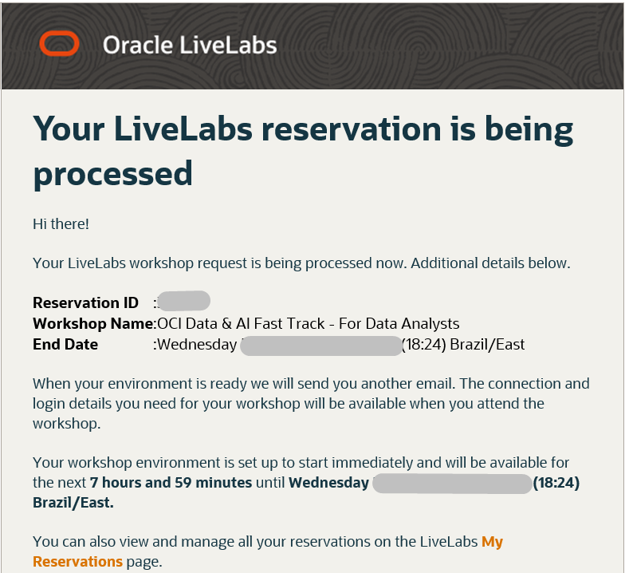
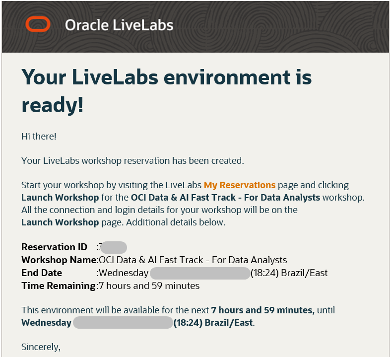
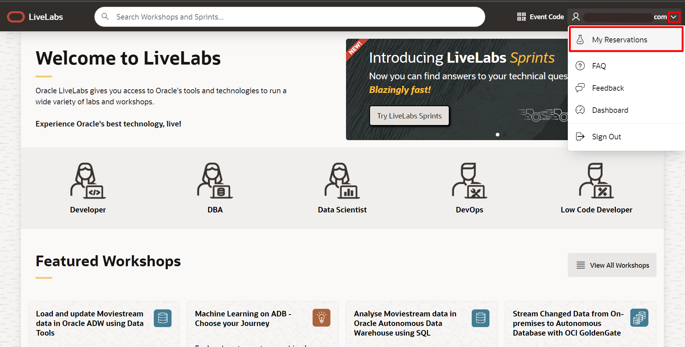
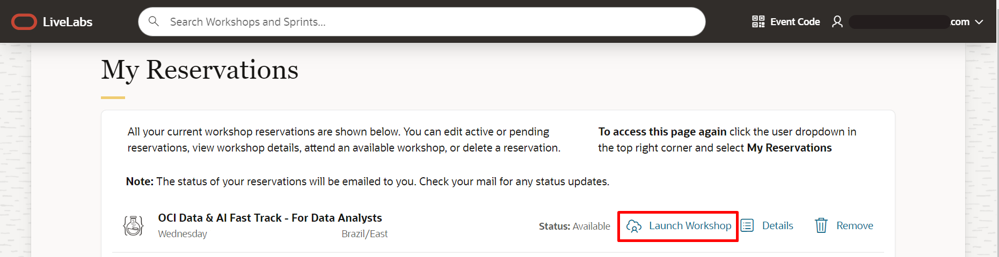
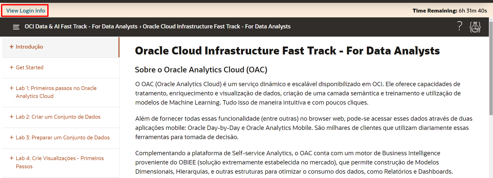
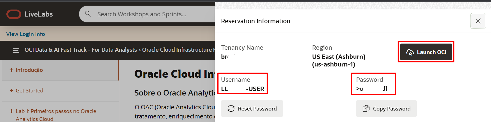

# Pré-requisitos - Login no LiveLabs

## Introdução

Bem-vindo ao seu ambiente pré-configurado para os Labs (LiveLabs Sandbox).
Para iniciar seu workshop, você precisa fazer login em nosso LiveLabs Sandbox.

Neste laboratório, mostraremos onde você pode encontrar as informações de login e como fazer login no LiveLabs Sandbox

Tempo estimado para o Lab: 5 minutos

### Objetivos

- Verificar as informações de Login para o ambiente pré-configurado para os Labs (LiveLabs Sandbox) 
- Fazer Login no LiveLabs Sandbox

## Tarefa 1: Exibir informações de login

Após criar uma reserva para um Workshop LiveLab, você receberá um e-mail informando que sua reserva está sendo processada, seguido de um e-mail informando que seu ambiente foi criado.

  

  >**Nota:** Você receberá o segundo e-mail um pouco antes do horário selecionado durante a reserva.

  

 1. Faça login no LiveLabs. Clique no seu nome de usuário e clique em **My Reservations**.

  

 2. Em seguida, clique no link **Launch Workshop** para o ambiente do Workshop que deseja usar. Observe que você pode ter vários Workshops listados.

  

3. Clique em **View Login Info**

  

4. Salve o usuário e a senha de primeiro acesso exibidos, eles serão necessários para o primeiro acesso. Agora clique em **Launch OCI**.

  

5. Em seguida mantenha a opção **Default** e clique em **Next**.

 

6. Preencha os campos com seu usuário com a senha fornecidos em **View Login Info**, em seguida clique em **Sign-in**

 

7. Você deverá criar uma nova senha de acesso para seu usuário. (Você usará essa senha a partir de agora)

.

Pronto! Você acabou de acessar o ambiente que usaremos para os próximos Labs práticos

>**Nota:** Se precisar visualizar suas informações de login a qualquer momento, clique em **View Login Info**.

Você pode **seguir para o próximo Lab**.

## Autoria

- **Autores** - Thais Henrique, Isabella Alvarez, Breno Comin, Isabelle Dias, Guilherme Galhardo
- **Último Update Por/Date** - Thais Henrique, Dez/2022