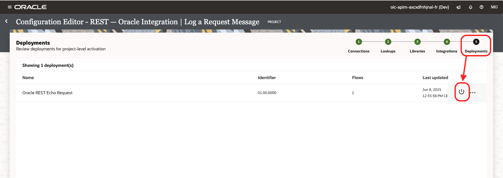
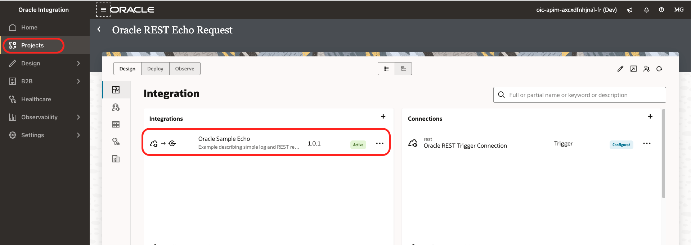

# Lab 2: Add Existing APIs

## Introduction

Estimated time: 20 min

### Objectives

- Add existing API from Oracle Integration:
    - Create Samples APIs in OIC 
    - Configure the security
    - Collect the APIs
- Add existing API from Oracle API Gateway

### Prerequisites

Follow previous labs.

## Task 1: Add existing APIs from Oracle Integration
### A. Create an Oracle Integration installation

Let's create a Oracle Integration Installation with some samples:
- Menu Developer Services / Application Integration 


- Click *Create Instance*
- Name *oic\_apim*
- Choose Integration Cloud Gen 2 (not tested yet with Gen3)
- Choose your version and license type
- Click *Create*
- When the instance is green, click *Service Console*
- In the Oracle Integration menu, choose *Integrations* / *Integrations* again
- Remove the filter with your username
- You will see some preinstalled sample. 
 


- Hover your mouse on the first line (Echo) and activate the integration
- In the dialog, click *Activate* again
- Do the same for several other integrations



- Note the host name of OIC from the URL (##OIC\_HOST##): ex: oic-apim-xxxxx-fr.integration.ocp.oraclecloud.com

### B. ADMIN right
- Go back your Database Actions
- Click *SQL* 
- Run the following command (replace the ##OIC_HOST##)

```
BEGIN
   DBMS_NETWORK_ACL_ADMIN.APPEND_HOST_ACE(
       host => '##OIC_HOST##',
       ace => XS$ACE_TYPE( 
           privilege_list => XS$NAME_LIST('http'),
           principal_name => 'API',
           principal_type => XS_ACL.ptype_db));
END;
```


It will allow the database to call the OIC URLs

### C. APEX right

- Go to APEX, 
- Click on SQL Workshops
- Then SQL Commands.
- Run this (replace the ##OIC_USER## / ##OIC_USER## ) with a OCI user name and password that has access to the OIC instance. 

```
BEGIN
    DBMS_CLOUD.CREATE_CREDENTIAL (
    credential_name => 'OIC_CRED',
    username        => '##OCI_USER##',
    password        => '##OCI_PASSWORD##');
END;
```


This will store the password to call the OIC Rest API with DBMS_CLOUD.

### D. Test

- Go in the APEX Portal (##PORTAL_URL##)
- In the menu, choose *Source*
- Click *Create*
- Source Type *OIC*
- OIC Host: ##OIC_HOST##
- Click *Create*


- Click *Harvest All*
- Go and check the result in the Portal


## Task 2: Add existing API from API Gateway

### A. Get APIW OCID

Please find back the Compartment OCID that was used to create the API Gateway in Lab 2 (Cloud Native). (##COMPARTMENT_OCID##)

### B. APEX right

- Go to APEX, 
- Click on SQL Workshops
- Then SQL Commands.
- Run this (replace the ##USER_OCID## / ##TENANCY_OCID## / ##PRIVATE_KEY## /##FINGERPRINT##' ) with the settings from a user that has access to the OCI API Gateway APIs

```
BEGIN
DBMS_CLOUD.CREATE_CREDENTIAL (
  credential_name => 'OCI_CRED',
  user_ocid => '##USER_OCID##',
  tenancy_ocid => '##TENANCY_OCID##',
  private_key => '##PRIVATE_KEY##',
  fingerprint => '##FINGERPRINT##');
END;
```


### C. Test

- Go in the APEX Portal (##PORTAL_URL##)
- In the menu, choose *Source*
- Click *Create*
- Source Type *Oracle API Gateway*
- Compartment OCID: ##COMPARTMENT_OCID##
- Click *Create*


- Click *Harvest All*
- Go and check the result in the Portal

## Troubleshooting

- If there are issue with the harvesting, run this query in SQL

```
select * from api.harvest_log
```

- To clean up the repository and harvest all again

```
truncate table api.TAG_IMPL
/
truncate table api.TAG
/
truncate table api.ENDPOINT
/
truncate table api.SPECIFICATION
/
truncate table api.IMPLEMENTATION
/
truncate table api.harvest_log
/
begin
  api.api_harvest.harvest_all;
end;
/
select * from api.harvest_log
/
```

- The sample has the following limitation:
    - It does not contain a logic to remove the duplicate entries in the API Portal
    - The APIGW harvest requires Tags to be set up on the API Deployment to allow the harvesting


## Acknowledgements

- **Author**
    - Marc Gueury / Robert Wunderlich  / Shyam Suchak / Tom Bailiu / Valeria Chiran
