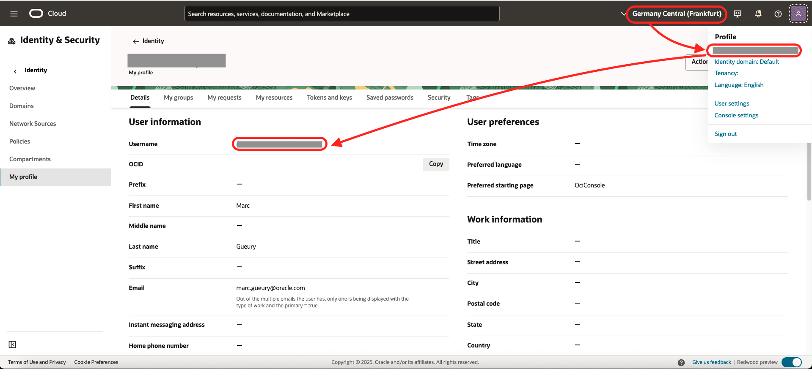
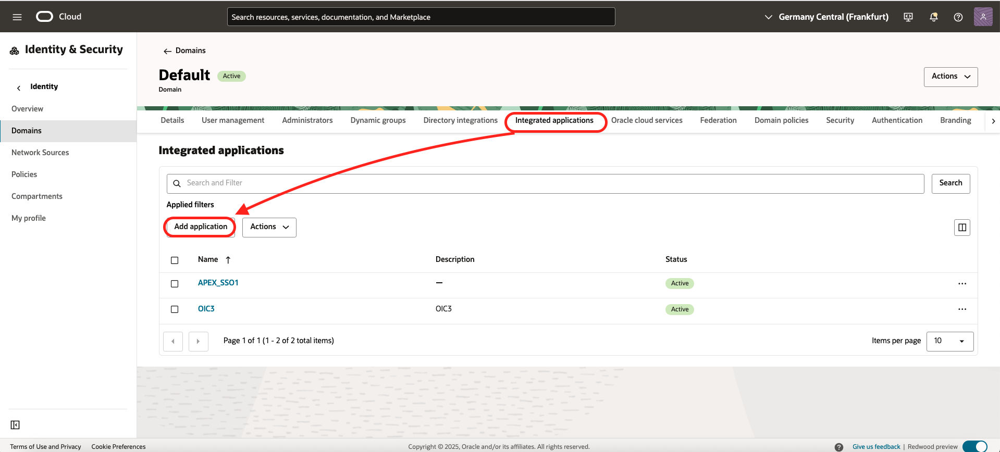
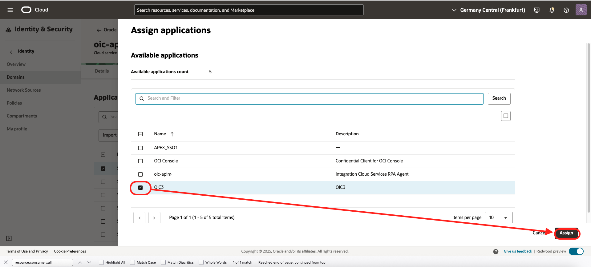
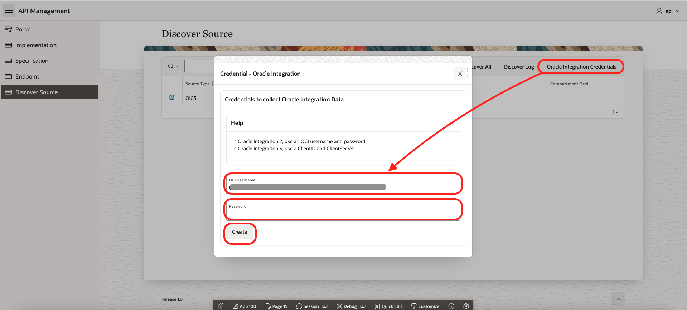

# Lab 3: Add Existing APIs

## Introduction

In this lab, we will add existing APIs in the Portal. We will first create samples of APIs. Then import all of them in one shoot in the API Portal.

Estimated time: 20 min
 
### Objectives

- Add existing API from Oracle Integration:
    - Create Samples APIs in OIC 
    - Configure the security
    - Collect the APIs
- Add existing API from Oracle API Gateway

### Prerequisites

- Follow previous labs.

## Task 1: User details

1. We need data about the user
    - Go on the OCI Homepage
    - Take a note of the region name: *##REGION##*
    - On the top, right, click *Your username*
    - Copy the username *##USERNAME##* (without oracleidentitycloudservice )
    

## Task 2: Add existing APIs from Oracle Integration

1. Create an Oracle Integration installation
    - Menu Developer Services / Application Integration 
        
    - Click *Create Instance*
    - Name *oic\_apim*
    - Edition: *standard* or *enterprise*
    - Shape: *Development*
    - License Type: Choose your version and license type
    - Click *Create*
    - When the instance is green,
    - Copy the value of the OIC *Runtime URL* 
        - Ex: https://oic-apim-xxxxxxxxx-fr.integration.eu-frankfurt-1.ocp.oraclecloud.com/
        - Take note of the hostname: ##OIC_HOST## = oic-apim-xxxxxxxxx-fr.integration.eu-frankfurt-1.ocp.oraclecloud.com
    - Click *Open Console*
2. Install Samples
    - In the Oracle Integration home, in Getting Started, choose *Browse Store*
    - Look for Echo
    - Click *Get*
    - Click on the icon "*tool*" to configure it
    - Go to step 5 - Deployment
    - Click the *Activate* button
    - In the dialog, again *Activate*

        

    - If you go in the top-left Menu / Projects, you should see the sample project 
    
        
3. Create an IDCS Application
    - To be able to call the OIC3 APIs, we need to 
        - Create an IDCS application with a kind of user/password ( CLIENT\_ID and CLIENT\_SECRET )
        - And give it right to call OIC APIS.
    - In OCI Console, go to *Identity and Security*, then *Domain*
    - Open your domain
    - Copy the Domain URL and keep only the host name ##IDCS_HOST##. ex: idcs-xxxxxxx.identity.oraclecloud.com
    - Open the tab *Integrated Application*
    - Click *Add Application*
        
    - Choose *Confidential*
    - Click *Launch workflow*
    - Name: *OIC3*
    - Description: *OIC3*
    - Click *Submit*
    - Go in the tab *OAuth Configuration*
        
    - Click *Edit OAuth Configuration*
    - Choose *Configure this application as a client now*
    - In Autorization, check *Client credentials* and *Refresh Token*
    - Check Client IP address: *Anywhere*,
    - In Token issuance policy, click *Add Scope* and search for your OIC instance, add it.
    - Take note of the scope. #SCOPE# ex: https://xxxxxxxxxxxx.integration.eu-frankfurt-1.ocp.oraclecloud.com:443urn:opc:resource:consumer::all
    - Click *Submit*. The confidential app is created.
    - Click *Action* / *Activate*
    - In this screen, note the ##CLIENT\_ID## and ##CLIENT\_SECRET##
       
4. Add rights to the IDCS Application
    - Now go back to Domains and go in tab Oracle Cloud Services tab and click on OIC Gen 3 Instance that we want to access.
    - Go in the tab *Application roles* 
        
    - Click *ServiceAdministration* and add the confidential app that we just created.
        

## Task 3. Create OIC Source

Go back the APEX API Portal (##PORTAL\_URL##)
- Click on the menu 
- Then *Discover Source*

1. Click *Create Source*
    - Type: Oracle Integration Cloud 3 
    - OIC Host: ##OIC_HOST## 
    - IDCS Host: ##IDCS_HOST## 
    - SCOPE: ##SCOPE## 
    - Click *Create*
    
2. Click *Oracle Integration Credentials*
    - Username: ##CLIENT\_ID##
    - Password: ##CLIENT\_SECRET##
    - Click *Create*
    

## Task 4: (optional) Add existing API from API Gateway

1. Get APIW OCID
    - Please find back the Compartment OCID that was used to create the API Gateway in Lab 2 (Cloud Native). (##COMPARTMENT\_OCID##)
2. Go back the APEX API Portal (##PORTAL\_URL##)
    - Click on the menu 
    - Then *Discover Source*
3.  Create APIGW Source. 
    - Still in the Source screen.
    - Click *Create Source*
    - Source Type *OCI API Gateway*
    - Compartment OCID: ##COMPARTMENT\_OCID##
    - Region: ##REGION##
    - Click *Create*

        

## Task 5: Discover and Test

1. Still in the Source screen.
    - Click *Discover All*
    - Go and check the result in the Portal 

        

## Troubleshooting

- If there are issue with the discovering, 
    - Go on the Discover page 
    - Click the Discover Log button. 
    - You may also run this query in SQL

    ```
    <copy>
    select * from api.discover_log
    </copy>
    ```

- To clean up the repository and discover all again

    ```
    <copy>
    truncate table api.TAG_IMPL
    /
    truncate table api.TAG
    /
    truncate table api.ENDPOINT
    /
    truncate table api.SPECIFICATION
    /
    truncate table api.IMPLEMENTATION
    /
    truncate table api.discover_log
    /
    begin
    api.api_discover.discover_all;
    end;
    /
    select * from api.discover_log
    /
    </copy>
    ```

- The sample has the following limitation:
    - It does not contain a logic to remove the duplicate entries in the API Portal
    - The APIGW discovery requires Tags to be set up on the API Deployment:
        - api\_icon: icon name (java/rest/soap/dotnet/go/python/...)
        - api\_git\_url: base URL to see the git project source 
        - api\_git\_spec_path: relative url for the specification (openapi file for ex)
        - api\_git\_spec_type: OpenAPI/WSDL/...
        - api\_git\_endpoint_path: relative url for the specification (Terraform file for ex)
        - api\_endpoint\_url: path to add the endpoint url (sometimes a API Gateway URL is containing variable path)

- The right to call OCI API could probably be improved with OCI policies instead of encoding the user ocid, ...

## Known Issues

- When pressing Discover All, there is an *error: ORA-40441 - JSON Syntax Error*
    - Symptoms: When running this command, it works 
       ```
       curl -k -u ##USER##:##PASSWORD## https://##OIC_HOST/ic/api/integration/v1/integrations | jq .  
       ```
    - Work-around: Wait 2/5 mins and it works.

## Acknowledgements
* **Author** - Marc Gueury / Phil Wilkins /  Robert Wunderlich  / Shyam Suchak / Tom Bailiu / Valeria Chiran
* **Last Updated By/Date** - Marc Gueury, June 2025
