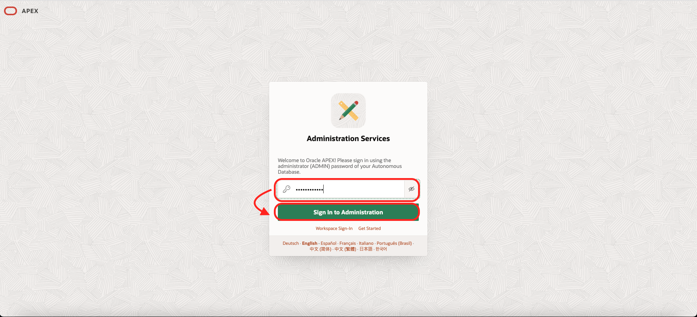
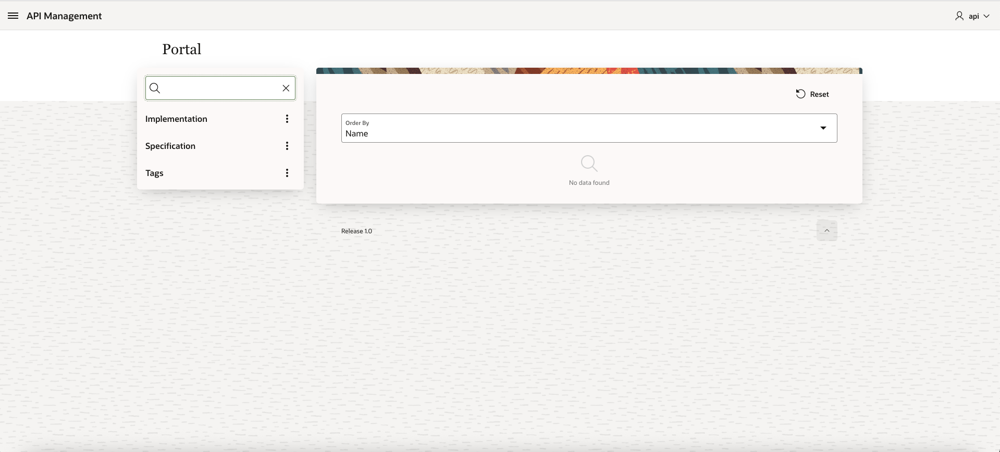

# Integrate to the Components together

## Introduction

Estimated time: 20 min

### Objectives

- Install an Autonomous Database
- Install the API Portal (APEX application) in it

### Prerequisites

- Open the Oracle Cloud Shell and clone this repository on your laptop first.

    ```
    <copy>git clone https://github.com/mgueury/oci-api-portal.git</copy>
    ```

- Create a file on your Laptop to take your notes

    ````
    <copy>
    ##PORTAL_URL##       : Portal URL ex: https://xxxxx-apidb.adb.eu-frankfurt-1.oraclecloudapps.com/ords/r/api/apimgt/portal

    // Autonomous Database / APEX 
    ##DB_PASSWORD##      : DB Password    : (ex LiveLab__123)
    ##APEX_HOST##        : APEX Host Name : (ex: abcdefghijk-db123.adb.eu-frankfurt-1.oraclecloudapps.com)

    // OIC Discovery
    ##USERNAME##         : Federated user (IDCS user) that you use to log in OIC. Often an email ex: john.doe@domain.com
    ##PASSWORD##         : is the password of that user
    ##OIC_HOST##         : ex: myoic-abcdefgh-fr.integration.ocp.oraclecloud.com

    // APIGW Discovery
    ##DB_OCID##          : ex: ocid1.autonomousdatabase.oc1..xxxxxxxxxxx
    ##COMPARTMENT_OCID## : ex: ocid1.compartment.oc1..xxxxxxxxxx
    ##REGION##           : ex: eu-frankfurt-1

    // Kubernetes
    ##AUTH_TOKEN##       : Optional
    </copy>
    ````

## Task 1: Create an Autonomous database

First, let's create an Autonomous database.

1. Go the menu
    - Oracle Database
    - Autonomous Database
        

2. Click *Create Autonomous Database*
    - Compartment : *Your Favorite Compartment*
    - Display Name: *APIDB*
    - Database Name: *APIDB* 
    - Workload: *Transaction Processing*
    - Deployment: *Shared Infrastructure*
    - Password: ex: *LiveLab\_\_123* (Take note of it: ##DB\_PASSWORD##)
    - Network: Keep *Secure Access from Everywhere*
    - Licence: *BYOL or Licence Included*
    - Then *Create Autonomous Database*

        
3. When the database is started
    - Copy the Database OCID (Take note of it: ##DB\_OCID##)

        

## Task 2: Create the Database User

1. Go to the SQL interface
    In the page of the Autonomous Database,
    - Click on *Database Actions*
    - If you get a prompt asking for an user/password, enter ADMIN/##DB\_PASSWORD##
    - Then *SQL*

        

2. Run the following SQL to create the user API.
    - Replace the password in the schema creation to your own (to make it easy, let's use the same than ADMIN ##DB_PASSWORD##) 

        ```
        <copy>
        grant connect, resource, unlimited tablespace, create view to API identified by ##DB_PASSWORD##
        /
        GRANT execute ON dbms_cloud_oci_ag_deployment_list_deployments_response_t TO API;
        GRANT execute ON dbms_cloud_oci_apigateway_deployment_collection_t TO API;
        GRANT execute ON dbms_cloud_oci_apigateway_deployment_summary_tbl TO API;
        GRANT execute ON dbms_cloud_oci_apigateway_deployment_summary_t TO API;
        GRANT execute ON DBMS_CLOUD_OCI_AG_DEPLOYMENT TO API;
        GRANT execute ON DBMS_CLOUD TO API;
        GRANT execute ON dbms_cloud_oci_id_identity_list_regions_response_t TO API;
        GRANT execute ON DBMS_CLOUD_OCI_IDENTITY_REGION_TBL TO API;
        GRANT execute ON DBMS_CLOUD_OCI_IDENTITY_REGION_T TO API;
        GRANT execute ON DBMS_CLOUD_OCI_ID_IDENTITY TO API;
        GRANT execute on DBMS_NETWORK_ACL_ADMIN to API;
        /
        BEGIN
        DBMS_CLOUD_ADMIN.ENABLE_RESOURCE_PRINCIPAL(username => 'API');
        ORDS.enable_schema(
            p_enabled             => TRUE,
            p_schema              => 'API',
            p_url_mapping_type    => 'BASE_PATH',
            p_url_mapping_pattern => 'apim',
            p_auto_rest_auth      => FALSE
        );
        COMMIT;
        end;
        /
        </copy>
        ```

        

## Task 3: Create a Dynamic Group and Policy

Here I assume that the tenant is using the new Identity Domains. If it is not the case, the Dynamic group, Policy are about at the same place in the menu.

1. Go the menu 
    - Identity And Security
    - Domains
    - Click on the *Default (Current Domain)*
    - Click *Dynamic Group*
    - Click the button *Create Dynamic Group*
    - Name *API\_MANAGEMENT\_DYN\_GROUP*
    - Description *API\_MANAGEMENT\_DYN\_GROUP*
    - In the Rule, you need to use the DB_OCID from the notes. 
        ```
        <copy>
        resource.id = '##DB_OCID##'
        </copy>
        ```
    - Click *Create*
        
2. Go the menu 
    - Identity And Security
    - Policies
    - Click *Create Policy*
    - Name *API\_MANAGEMENT\_POLICY*
    - Description *API\_MANAGEMENT\_POLICY*
    - Compartment: Choose the *root* compartment
    - Policy, click *Show manual editor*
    
        ```
        <copy>
        Allow dynamic-group API_MANAGEMENT_DYN_GROUP to manage api-gateway-family in tenancy
        </copy>
        ```


    

## Task 4: Install the APEX program

Back to page of the Autonomous Database,
1. Go to APEX. Click again on *Database Actions*

    

    - Click *APEX*
2. Note the URL of APEX, we need the Apex Host Name (##APEX_HOST##) later in the lab (Ex: abcdefghijk-db123.adb.eu-frankfurt-1.oraclecloudapps.com) 
3. In Administration Service, enter the DB password (##DB_PASSWORD##)
    - Click *Sign In to Administration*

        

    - Click *Create Workspace*

        

    - Click *Existing Schema*

        

    - Database User *API*
    - Workspace Name *API*
    - Workspace Username *API*
    - Workspace Password ex: *LiveLab\_\_123* (##DB\_PASSWORD##)
    - Click *Create Workspace*

        

    - Click on your top right icon. Then *Sign-out*

4. In the APEX login page
    - Workspace: *API*
    - Database User: *API*
    - Password: See ##DB\_PASSWORD##
    - Click *Sign In*
    - In Apex, 
        - Click Menu *App Builder*
        - *Import*
 
    

    - Go in the files that you have downloaded from Git
    - Choose *apex/apex_apim.sql*
    - Click *Next*
    - Click *Next*
    - Click *Install Application*
    - In Install Application, Click *Next*
    - Click *Install*

We have now a running API Management Portal but it is empty.
- Click *Run Application*

## Task 5: Test the empty installation

We have now a running API Management Portal but it is empty.
1. Login *API* / Password - See ##DB_PASSWORD##

    

    Note the URL ##PORTAL_URL##. Ex: https://xxxxx-apidb.adb.eu-frankfurt-1.oraclecloudapps.com/ords/r/api/apimgt/portal

2. In the next Lab, we will populate the Portal with APIs.

    

## Know issues

In case you make a mistake and need to restart the installation, most of the time the API User needs to be deleted and APEX application needs to be reinstalled. 
1. Go back to Task 2 - Create the database user.
2. Drop first the API user with SQL admin interface.
    ```
    DROP USER API CASCADE
    ```
3. Restart again from Task 2 - Create the database user.

## Acknowledgements

- **Authors**
    - Marc Gueury / Phil Wilkins /  Robert Wunderlich  / Shyam Suchak / Tom Bailiu / Valeria Chiran
