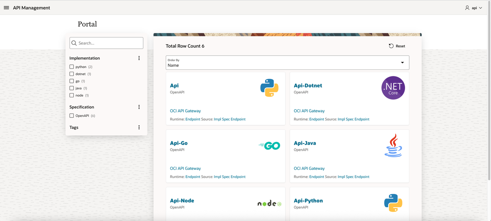
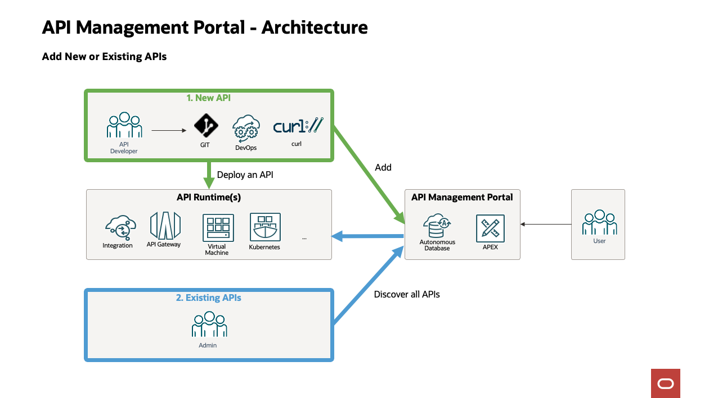

# Introduction

## About this Workshop

In this lab, we show how to create an API Management Portal with the following features:
- API Origin: The Portal will shows APIs from:
    - OCI API Gateway
    - Oracle Integration 
    - Cloud Native applications using Virtual Machines, Kubernetes, ...
- API type:
    -  Any API specification type: REST (OpenAPI/Swagger/...), SOAP (WSDL), ...
- Git Integration:
    - APIs are linked to Git where the source code is stored.
 

### Architecture

### How it works

The APIs definitions are stored in a database. The user interface is developed with Oracle APEX running in the same database.  

The APIs database can be populated in 2 ways:
- For new APIs, during a CI/CD DevOps pipeline, with "curl" to add the new API in the Portal
- For existing APIS by discovering APIs definition 

Estimated Workshop Time: 60 minutes

### Objectives

Create an API Management Portal:
- Create an Autonomous Database to install the APEX application
- Install the APEX application
- Test the application with:
    - API Gateway
    - Cloud Native program 
    - Oracle Integration

### Prerequisites

This lab assumes you have:
- An Oracle account
- Or that you will create one in *Get Started*

## Acknowledgements
* **Author** - Marc Gueury / Phil Wilkins /  Robert Wunderlich  / Shyam Suchak / Tom Bailiu / Valeria Chiran
* **Last Updated By/Date** - Marc Gueury, June 2025
