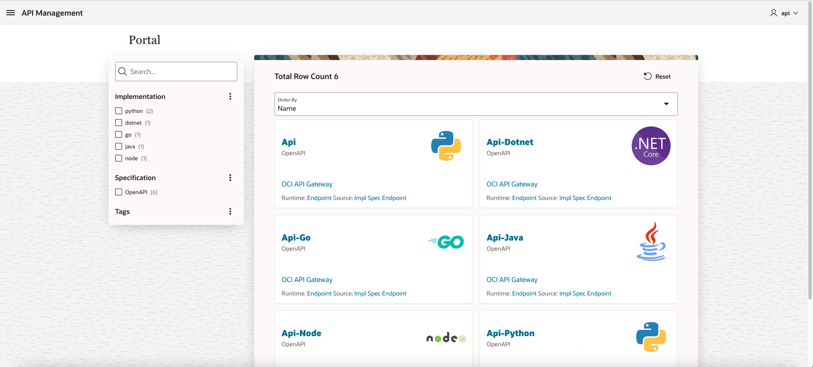

# Introduction

Estimated time: 60 minutes

### Goal: Create an API Management Portal 

In this lab, we will install (import) an existing APEX application. It is a API Management Portal with the following capabilities:
- API Origin: The Portal will shows APIs from:
    - OCI API Gateway
    - Oracle Integration 
    - Cloud Native applications using Virtual Machines, Kubernetes, ...
    - ...
- API type:
    -  Any API specification type is allowed: REST (OpenAPI) or SOAP (WSDL), ...
- Git Integration:
    - The APIs are linked to GIT where the API source code is stored.

### Architecture

### How it works

The APIs definitions are stored in a database. The user interface is developed with Oracle APEX running in the same database.  

The APIs database can be populated in 2 ways:
- For existing APIS, by discovering / collecting / harvesting APIs definition 
- For new APIs, during a CI/CD DevOps pipeline, via a command line tool to add the new API in the Portal

### Objectives

- Create an Autonomous to install the APEX Application
- Install the APEX program
- Test the solution with 
  - API Gateway
  - Cloud Native program 
  - Oracle Integration

## Acknowledgements 

- **Author**
    - Marc Gueury
