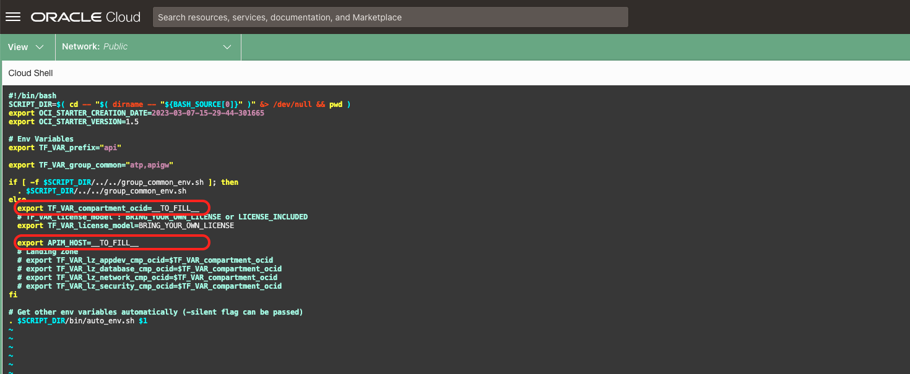

# Lab 2: Add New Cloud Native APIs

## Introduction

Estimated time: 20 min

### Objectives

- Add new APIs written with Cloud Native (Java/Node/Dotnet/Python/...)

### Prerequisites

Follow previous labs.

## Task 1: Add new APIs written with Cloud Native

- Go to Oracle Cloud Home page
- Go to Cloud Shell.
- When the shell is started, clone the git repository in the shell:
  
```
<copy>
git clone https://github.com/mgueury/oci-api-portal.git
cd oci-api-portal/cloud-native-sample
vi group_common/env.sh
</copy>
```

In the file group_common/env.sh, you have to set: 
- TF\_VAR\_compartment\_ocid in a compartment where the APIGW and VM with the APIs will be created. If no compartment is given and you are Admin of the OCI Tenant, an compartment oci-starter will be created. To get your compartment:
    - Go to OCI Menu/Identity & Security/Compartments.
    - Choose your comparment 
    - And copy the OCID
    - Take a note ##COMPARTMENT_OCID##
- APIM\_HOST to the APEX Host Name: ##APEX\_HOST##
- Then run the build. This will take about 15 mins. 

```
<copy>
./build_group.sh
</copy>
```



It will build with Terraform:
- An API Gateway
- 5 VMs with Java/Node/Dotnet/Go/Python with APIs
- And register the APIs in the API Management Portal with curl.

## Task 2: Curl command

You can check the curl command used in api-java/bin/add_api.sh.

```
curl -k "https://${APIM_HOST}/ords/apim/rest/add_api?git_repo_url=${TF_VAR_git_url}&impl_name=${FIRST_LETTER_UPPERCASE}&a_icon_url=${TF_VAR_language}&runtime_console=https://cloud.oracle.com/api-gateway/gateways/$TF_VAR_apigw_ocid/deployments/$APIGW_DEPLOYMENT_OCID&version=${GIT_BRANCH}&endpoint_url=${APIGW_URL}/app/dept&endpoint_git_path=src/terraform/apigw_existing.tf&spec_git_path=src/app/openapi_spec.yaml&a_spec_type=OpenAPI"
```

Where:
- impl\_name: name of the API
- icon\_url: icon used to show the API
- version: version of the API
- spec\_type: OpenAPI, WSDL, ...
- endpoint\_url: URL of the api that is deployed
- git\_repo\_url: base url of the git repository (when you go to this URL, you should see the base of your GIT project)
- spec\_git\_path: file containing the endpoint definition (OpenApi yaml file or WSDL Xml file, ...)
- endpoint\_git_path: The file creating the endpoind (Ex: Terraform, Ansible)
- runtime\_console:  url that allow to see the state of the API Runtime that is deployed

## Task 3: Test

When the Task 1 build is done.

- Go back to the APEX portal (##PORTAL_URL##) and check the result.


## Acknowledgements

- **Author**
    - Marc Gueury / Robert Wunderlich  / Shyam Suchak / Tom Bailiu / Valeria Chiran
