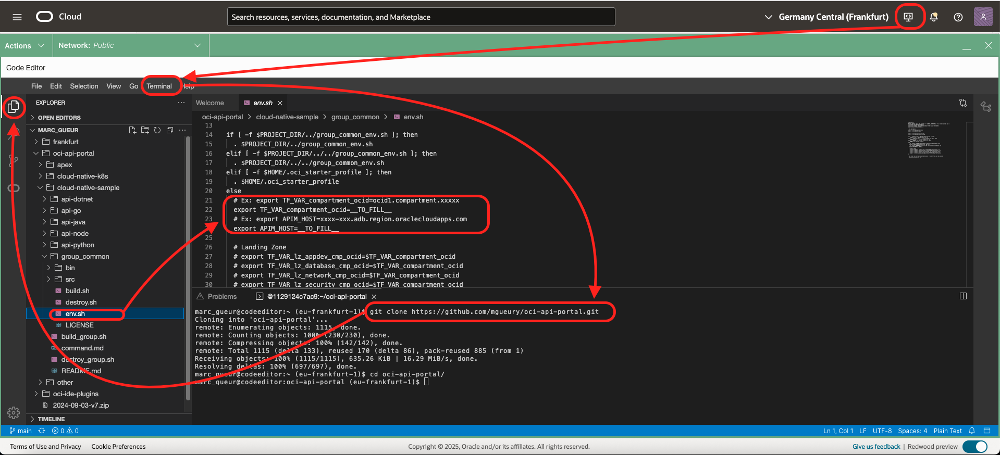

# Lab 2: Add New Cloud Native APIs

## Introduction

Estimated time: 20 min

### Objectives
 
- Create several Cloud Native (Java/Node/Dotnet/Python/...) APIs with the help of Terraform
- Add the APIs in the Portal 

### Prerequisites

- Follow previous labs.

## Task 1: Add new APIs written with Cloud Native

1. Go to Oracle Cloud Home page
2. Go to Cloud Editor.
3. When the editor is started, open a terminal
4. Clone the git repository
    ```
    <copy>
    git clone https://github.com/mgueury/oci-api-portal.git
    </copy>
    ```
5. Edit the file oci-api-portal/cloud-native-sample/group_common/env.sh
    
6. In the file group_common/env.sh, you have to set: 
    - TF\_VAR\_compartment\_ocid in a compartment where the infrastructure components will be created. If no compartment is given and you are Admin of the OCI Tenant, an compartment oci-starter will be created. To get your compartment:
        - Go to OCI Menu/Identity & Security/Compartments.
        - Choose your compartment 
        - And copy the OCID
        - Take a note ##COMPARTMENT_OCID##
    - APIM\_HOST to the APEX Host Name: ##APEX\_HOST##
7. Then run the build. This will take about 15 mins. 
    ```
    <copy>
    cd oci-api-portal/cloud-native-sample
    ./build_group.sh
    </copy>
    ```

It will build with Terraform:
- An API Gateway
- 5 VMs with Java/Node/Dotnet/Go/Python with APIs
- And register the APIs in the API Management Portal with curl.

## Task 2: Curl command

You can check the curl command used in api-java/bin/add_api.sh.

```
<copy>
curl -k "https://${APIM_HOST}/ords/apim/rest/add_api?git_repo_url=${TF_VAR_git_url}&impl_name=${FIRST_LETTER_UPPERCASE}&a_icon_url=${TF_VAR_language}&runtime_console=https://cloud.oracle.com/api-gateway/gateways/$TF_VAR_apigw_ocid/deployments/$APIGW_DEPLOYMENT_OCID&version=${GIT_BRANCH}&endpoint_url=${APIGW_URL}/app/dept&endpoint_git_path=src/terraform/apigw_existing.tf&spec_git_path=src/app/openapi_spec.yaml&a_spec_type=OpenAPI"
</copy>
```

Where:
- impl\_name: name of the API
- icon\_url: icon name (java/rest/soap/dotnet/go/python/...)
- version: version
- spec\_type: OpenAPI/WSDL/...
- endpoint\_url: URL of the api that is deployed
- git\_repo\_url: base URL to see the git project source 
- spec\_git\_path: relative url for the specification (openapi file for ex)
- endpoint\_git_path: relative url for the specification (Terraform file for ex)
- runtime\_console: url to the console that allow to see the state of the API

## Task 3: Test

When the Task 1 build is done.

- Go back to the APEX portal (##PORTAL_URL##) and check the result.


## Task 4 - Optional - Same with Kubernetes

1. Go to Oracle Cloud Home page
2. Go to Cloud Editor.
3. When the editor is started, open a terminal
4. The git repository should already be cloned (see Task 1)
5. Edit the file oci-api-portal/cloud-native-k8s/group_common/env.sh
    
6. In the file group_common/env.sh, you have to set: 
    - TF\_VAR\_compartment\_ocid in a compartment where the infrastructure components will be created. If no compartment is given and you are Admin of the OCI Tenant, an compartment oci-starter will be created. To get your compartment:
        - Go to OCI Menu/Identity & Security/Compartments.
        - Choose your compartment 
        - And copy the OCID
        - Take a note ##COMPARTMENT_OCID##
    - APIM\_HOST to the APEX Host Name: ##APEX\_HOST##
    - TF\_VAR\_auth\_token to the your OCI Auth token (an Auth Token for your user profile)
        - If you have no such token, please generate one with this script
            ```
            <copy>
            cd oci-api-portal/cloud-native-k8s/group_common
            ./bin/gen_auth_token.sh
            cd -
            </copy>
            ```
        - Take a note of it ##AUTH\_TOKEN##
7. Then run the build. This will take about 20 mins. 
    ```
    <copy>
    cd oci-api-portal/cloud-native-k8s
    ./build_group.sh
    </copy>
    ```

## Acknowledgements

- **Authors**
    - Marc Gueury / Phil Wilkins /  Robert Wunderlich  / Shyam Suchak / Tom Bailiu / Valeria Chiran

