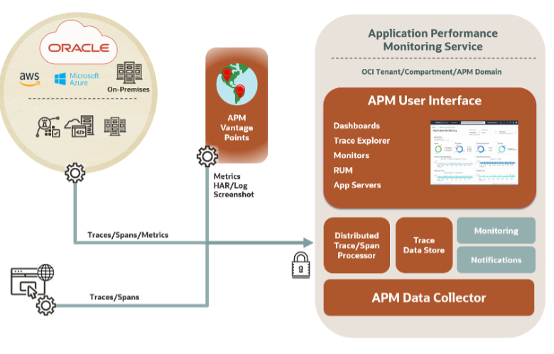

# Introduction

## About this Workshop

In this workshop, you will learn how to use Oracle Cloud APM to detect a performance issue from a cloud-native application, analyze the symptoms and identify the root cause. 

You will examine performance alarms in the APM Home dashboard, observe activities in the out-of-the-box performance widgets in the Synthetic Monitors dashboard, inspect client details in the HTTP Archive (HAR) file, and finally explore the server-side details using the APM Trace Explorer.

Estimated Time: 80 minutes

### About Oracle Cloud Infrastructure Application Performance Management (OCI APM)

The diagram below provides an overview of the OCI APM Service, its features, components, and some of the other OCI services it integrates with.

  

Among other capabilities, OCI APM includes an implementation of a Distributed Tracing system. It collects and processes transaction trace data (spans) from the monitored application and makes it available for viewing, dashboarding, exploration, alerts, etc. For more information on APM and Trace Explorer please refer to Application Performance Monitoring > **[Use Trace Explorer](https://docs.oracle.com/en-us/iaas/application-performance-monitoring/doc/use-trace-explorer.html)** section in the OCI Documentation.

### Objectives

In this workshop, you will:
* Examine APM Alarms
* Analyze APM Monitors
* Inspect Monitor Details and History
* Explore APM Trace Data
* Save a custom query
* Create a custom dashboard
* Construct complex queries

  [Oracle Cloud APM tutorial: Synthetic monitoring](https://www.youtube.com/watch?v=31lJYvmT6b0)
    

### Prerequisites

* An Oracle event account, which you can use to sign in to the workshop tenancy.

### More APM Workshops

* Please visit: **[APM LiveLabs workshops](https://apexapps.oracle.com/pls/apex/f?p=133:100:111996377805307::::SEARCH:application+Performance+monitoring)**.

## Acknowledgements

- **Author** - Yutaka Takatsu, Product Manager, Enterprise and Cloud Manageability
- **Contributors** - Steven Lemme, Senior Principal Product Manager,  
Anand Prabhu, Sr. Member of Technical Staff,  
Avi Huber, Vice President, Product Management
- **Last Updated By/Date** - Yutaka Takatsu, May 2023
