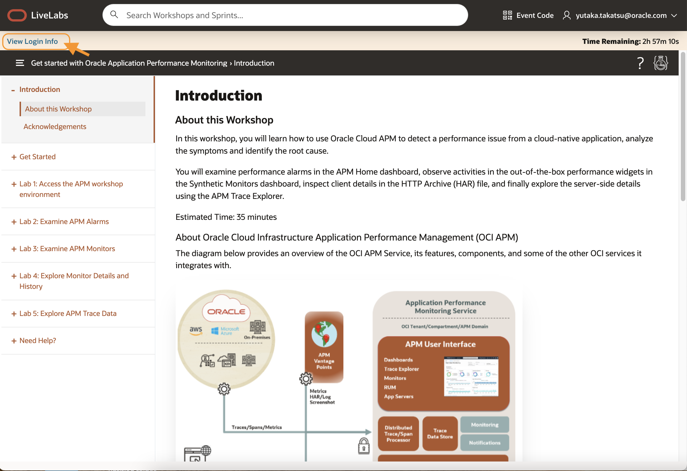
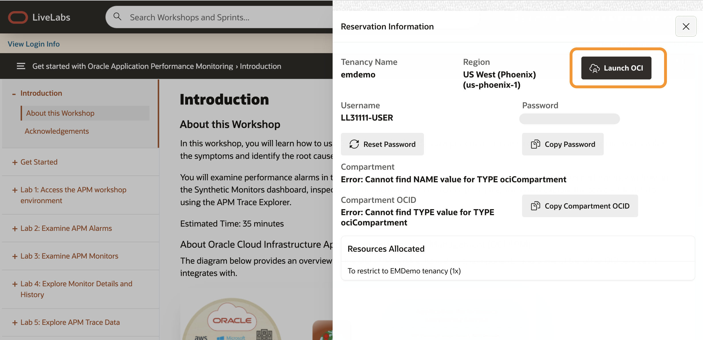
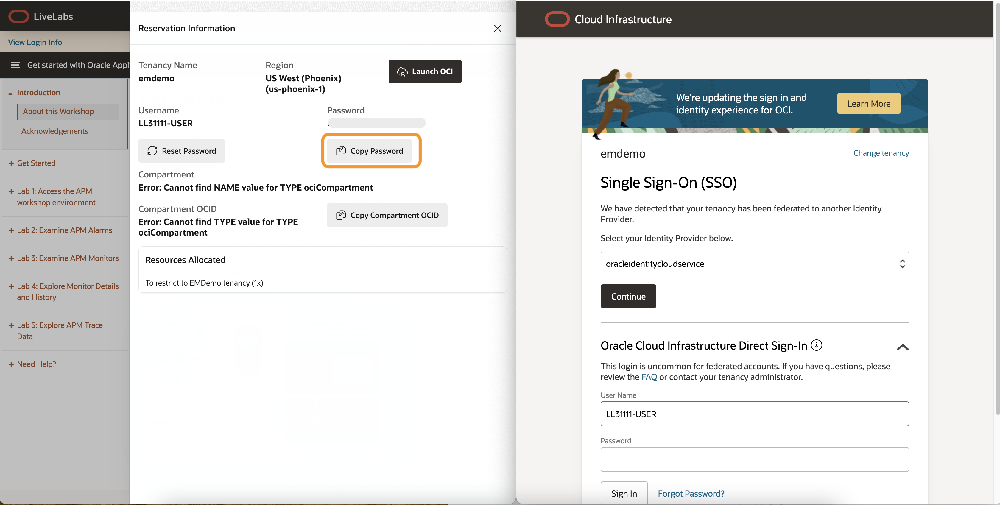
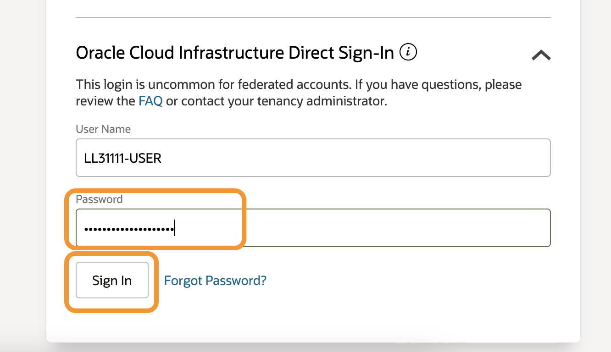
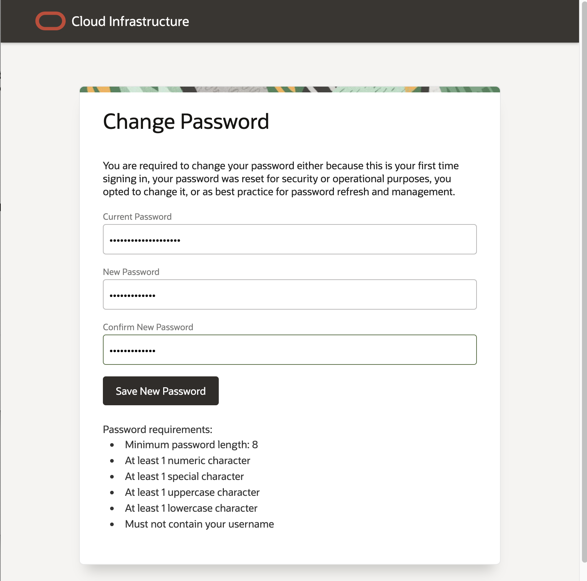
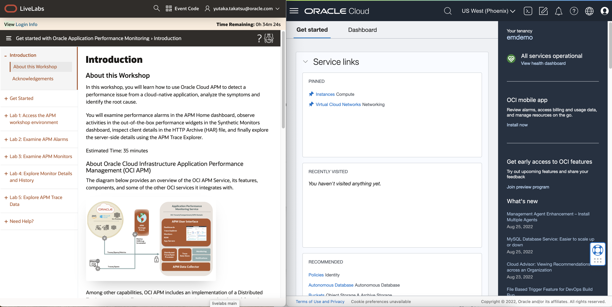
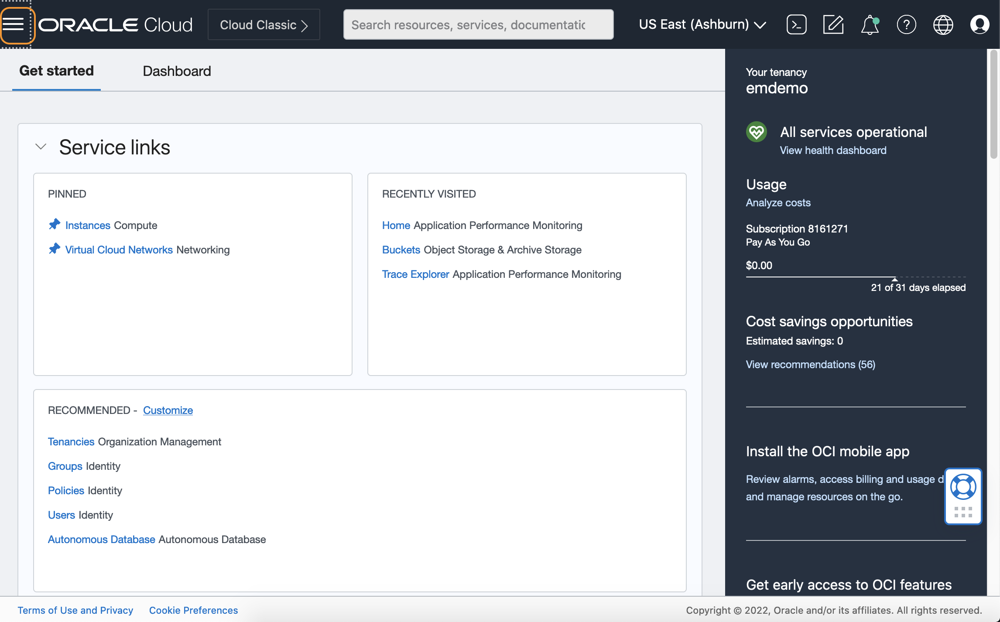
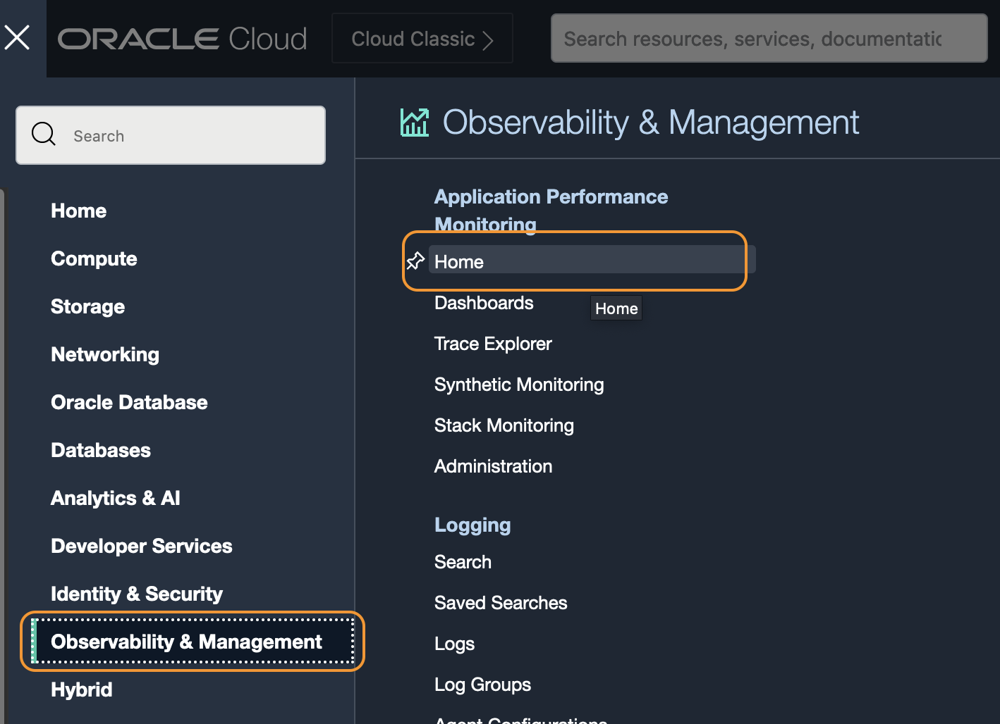
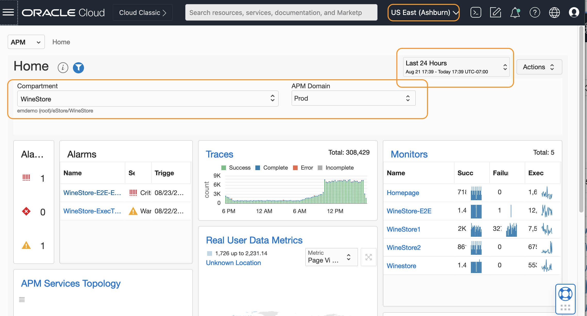

# Access APM Workshop environment

## Introduction

In this lab, you will use a username provided and log in to the workshop, then access an APM page in the Oracle Cloud console.

Estimated time: 5 minutes

### Objectives

* Access the workshop environment

### Prerequisites

* An Oracle event account, which you can use to sign in to the workshop tenancy.

## Task 1: Log in to the workshop tenancy

1. Click **View Login info** on **Get Started with Oracle Cloud Application Performance Monitoring** landing page to log in to the workshop tenancy in the Oracle Cloud.

   

2. Reservation Information pane opens. Click the **Launch OCI** button.

   

3. A new browser tab opens and loads the Oracle Cloud Infrastructure Sign-In page. Copy the Password from the Reservation Information pane on the LiveLab screen.

  
  >***Note:*** In the example image, two browser screens are opened side by side.

4. Paste the copied password onto the OCI Sign-In screen. Note that your user name is already pre-set in the **Direct Sign-In** section.

   

5. **Change Password** screen opens. Enter the new password that you can use to re-sign-in to the workshop tenancy, in case you closed your browser during the workshop reservation time.

   

6. **Oracle Cloud Get started** page opens. You can proceed to the next task to begin the workshop.

   

## Task 2: Access APM home dashboard

1. Open the navigation menu from the top left corner (aka. hamburger menu) in the Oracle Cloud console, select **Observability & Management** > **Home** under **Application Performance Management**.

   

   

   	 APM Home page opens.

2. On the APM Home page, select the following from the pulldown menus:
    - Region: **US East (Ashburn)**
    - Compartment : **root/eStore/WineStore**
    - APM Domain : **Prod**
    - Time : Last **24 Hours**

   
Make sure the data is loaded onto the charts in the Home dashboard.

You may now **proceed to the next lab**.

## Acknowledgements

* **Author** - Yutaka Takatsu, Product Manager, Enterprise and Cloud Manageability
- **Contributors** - Steven Lemme, Senior Principal Product Manager,  
Anand Prabhu, Sr. Member of Technical Staff,  
Avi Huber, Vice President, Product Management
* **Last Updated By/Date** - Yutaka Takatsu, August 2022
