# Analyze GenAI app with Inferencing app dashboard

## Introduction

IIn this lab, you will explore and analyze the performance, cost, and user experience of a GenAI application using the Inferencing App dashboard in Oracle Cloud APM.

Estimated time: 10 minutes

### Objectives

* Learn how to use the APM Inferencing app dashboard to analyze monitored GenAI app data and drill down into trace details

### Prerequisites

* An Oracle event account, which you can use to sign in to the workshop tenancy.

## Task 1: Open the Inferencing App dashboard

1. Open the navigation menu from the top left corner (aka. hamburger menu) in the Oracle Cloud console.

   

   Select **Observability & Management** > **Dashboards** under **Management Dashboard**.
   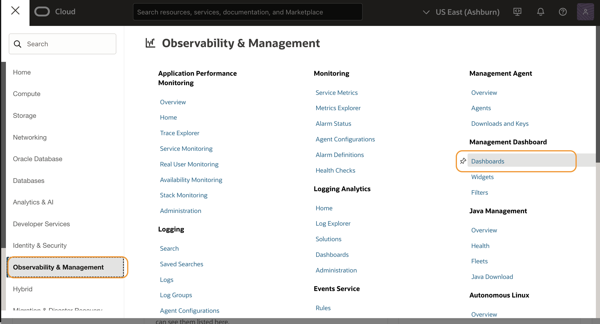

2. On the **Dashboards** page, type **WineStore** in the **Compartment** field. Select one of the entries under the **eStore** compartment.

   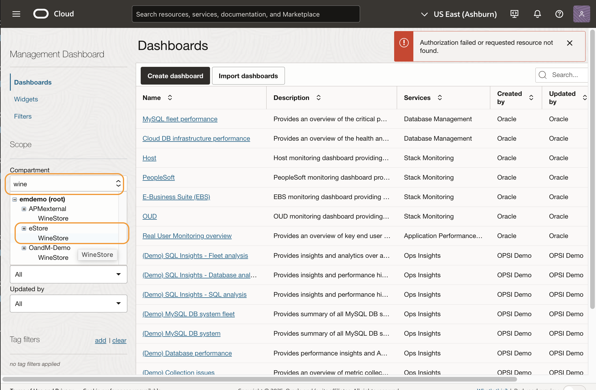
3. Click the **Inferencing apps** link.
   

4. The Inferencing apps dashboard opens. Make sure **WineStore** is selected in **Compartment**. Select **GenAI App** from the **APM domain** dropdown menu.

   

5. Change the timeline to **Last 7 days**. 
   
6. Open the **Actions** menu, select **Autorefresh** then choose **off**.

   

## Task 2: Review End User Experience view

In the **End User Experience** tab, you can view an overview of the inferencing apps from the users' perspective.

1. Review the summary widgets, such as the number of sessions executed, user logins, and average invocations per session during the selected time period. The bar charts display invocation counts and wait times for each GenAI app. The **Apdex** and **User Feedback** pie charts provide insight into overall user satisfaction.

   
2. Scroll down to explore top user sessions and queries with negative feedback.
   

## Task 3: Review the Readme and Github download page

The **Readme** tab explains how to set up the dashboard, instrument apps with the APM agent, and describes GenAI attributes used. It also links to a GitHub page with more configuration details.

1. Click the **Readme** tab.
   
2. Review the setup instructions and attribute descriptions. Find **Inferencing app monitoring** which links to GitHub page. (do not click)
   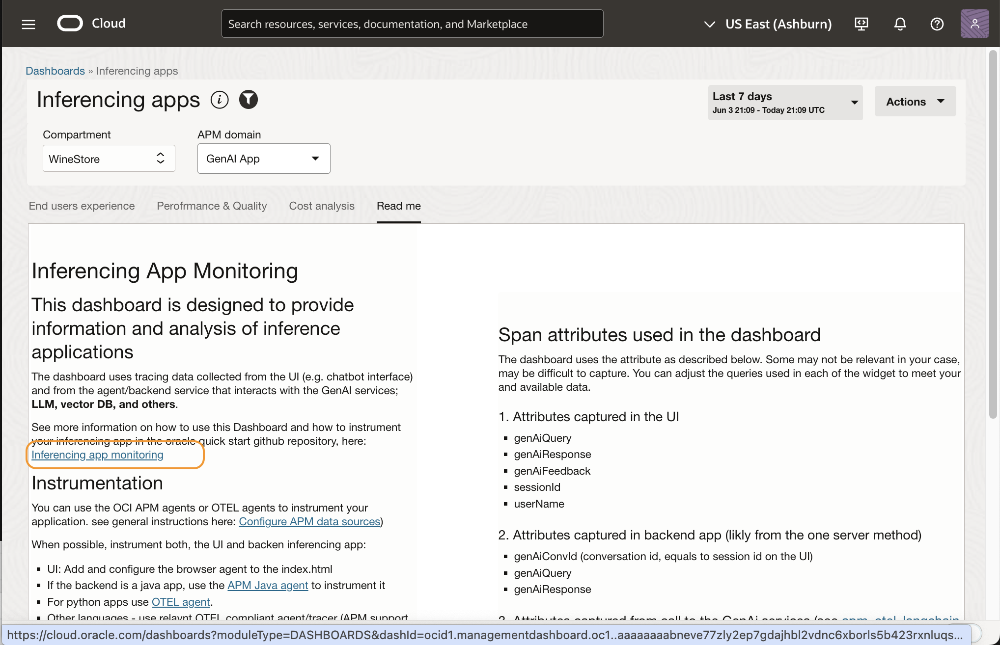
3. Right click the **Inferencing app mnitoring** link and choose to open in a new browser tab.
   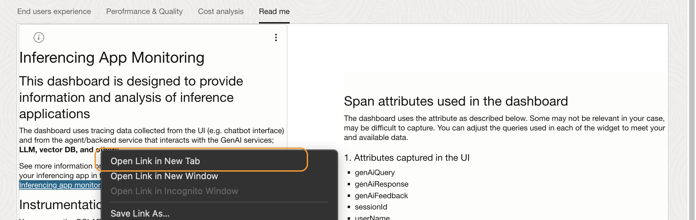
4. The GitHub page opens where you can download the dashboard files.
   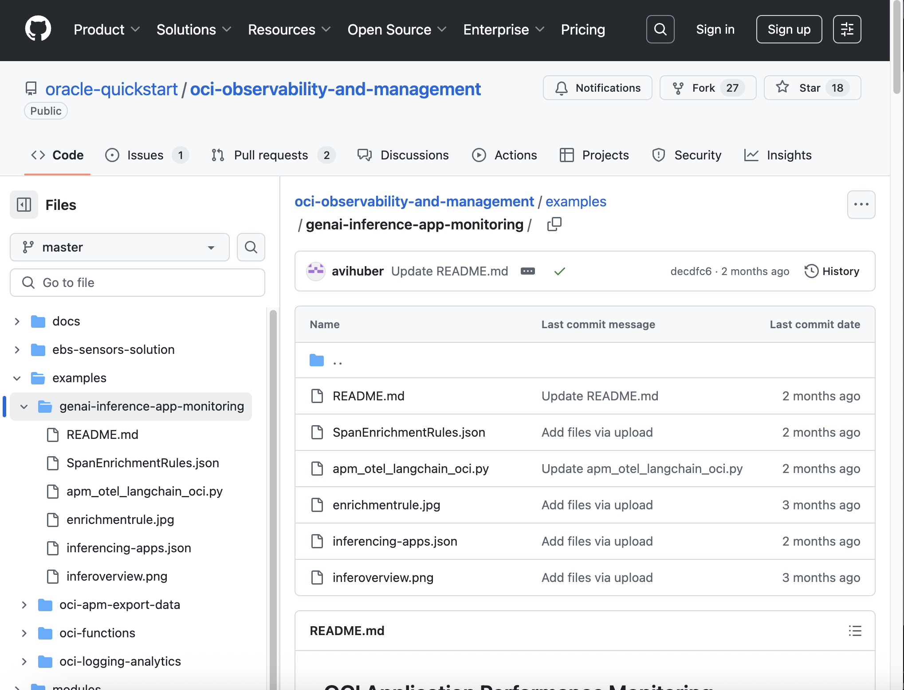

    >**Note:** The dashboard is already set up for lab use. When setting up a dashboard for your own purposes, download the dashboard file and import it into your APM domain. The GenAI attributes are documented in both the Readme tab and GitHub.  You can customize the widget queries based on your data. Token counts can be captured from the application’s service APIs or calculated using APM Span Enrichment. The image below shows an example of how token counts can be estimated using the length of input and output strings using an enrichment rule. This helps you measure the cost of each invocation, considering specific model pricing and the differences in input vs. output token rates from LLM providers.
     

## Task 4: Review the Cost analysis view

The **Cost analysis** tab provides insights into the cost spent on the GenAI applications.

1. Click the **Cost analysis** tab.
     

2. Review the cost related widgets, including total costs, average cost per session, cost by LLM model.
     

3. Scroll down to the **Top Users (by cost)** widget.
     
4. The widget displays tokens usage and the cost assocaited with for each user.
     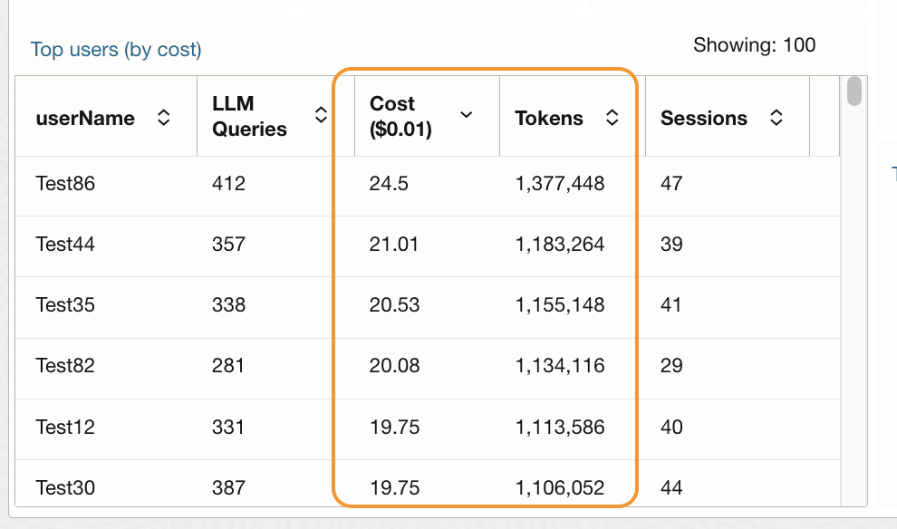

## Task 5: Review the Performance and Quality view

The **Performance & Quality** tab provides performance metrics and validate the GenAIs responses.

1. Click the **Performance and Quality** tab.
     
2. Review the **Response time breakdown by GenAI service** widget, which provides a breakdown among the LLM processing time, Vector search time and embedding generation time. The example image shows that most time is spent on LLM.
     
     Hover mouse cursor to view tooltips. 
     
3. Scroll to the **Response Divergence** widget, which highlights drifted answers from the similar queries.  
     
 In this example, the first row shows 66 queries with 35 divergences. Click the number in the **Divergence** column.
     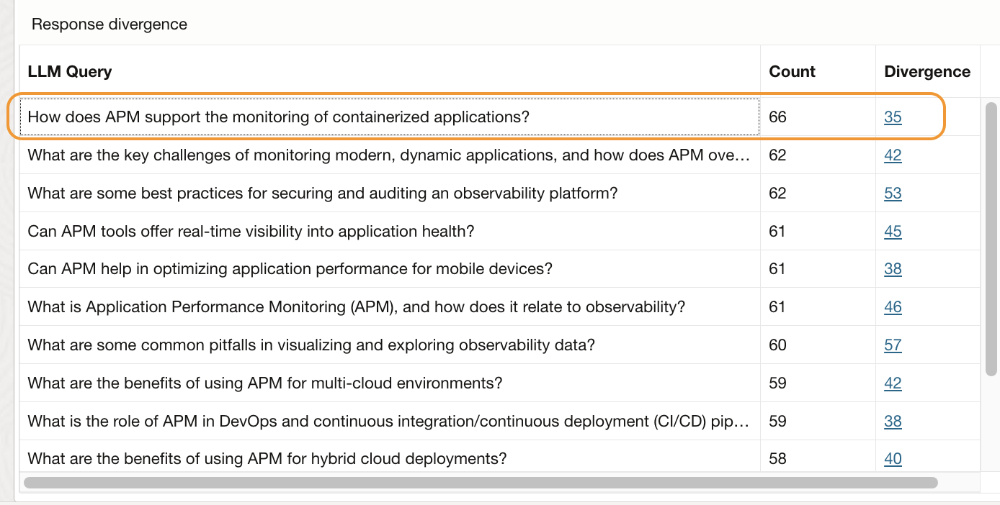
4. Review the responsese made by the GenAI model. Click **Close** when done.
     
5. **Failed to answer** widget at the right side displays the failed responses categorizes by type. Click the title of the widget.
     
Review the actual answers. Click **Close**.
     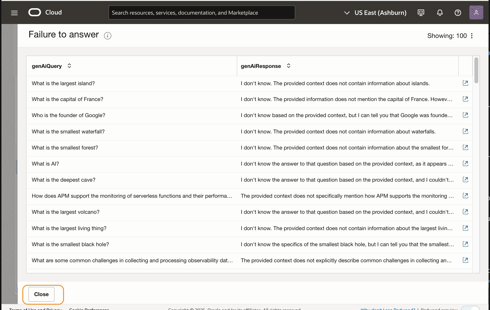
6. Scroll up to view the **GenAI invocation** bubble chart showing the outliers of the GenAI invocations.
     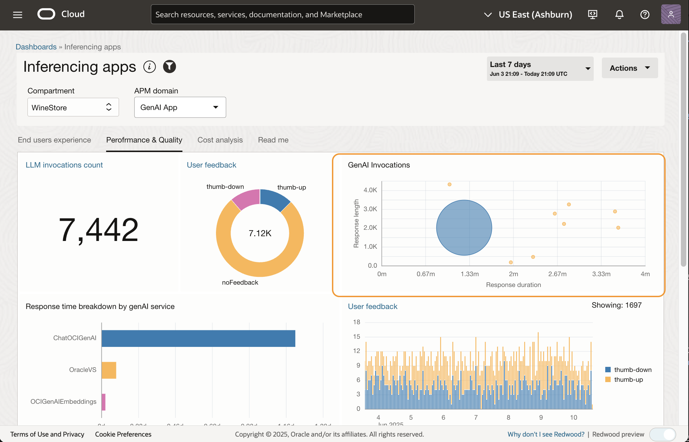
7. Change timeline to **Last 30 minutes** to show recent transactions. 
     
8. Locate a small bubble icon at the top-right (an outlier), and click to view the trace information.
     
9. Review the trace duration. In this example, their responses were more than 30 seconds. Click the arrow icon to drill down to the Trace Explorer to see the trace details.
     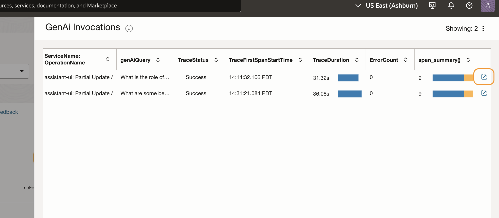

## Task 6: Analyze GenAI data in Trace Explorer

1. **Trace Explorer Trace Details** view opens. Click the triangle icon to close the **Topology** view.
     
2. In the waterfall (**Spans**) view, note that the **Invoke** spans were taking longer than **Embedding** and the **Vector search** spans. So the most time was spent on the conversation with LLM.
     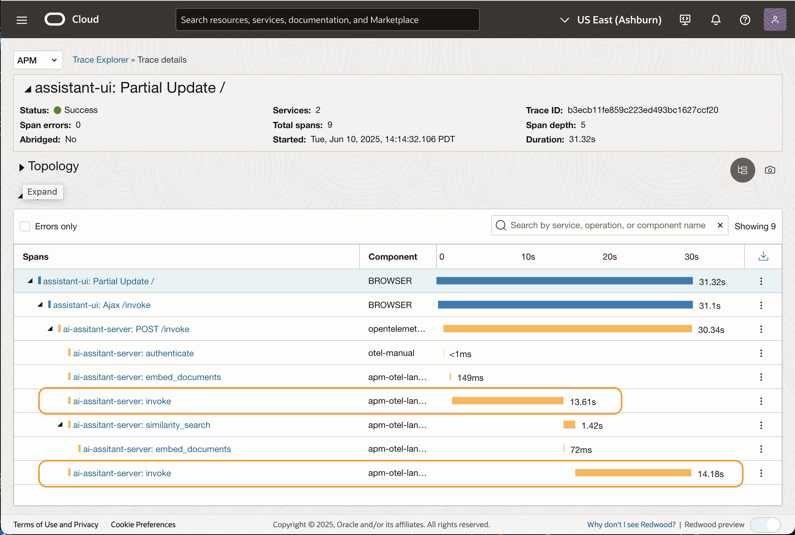
3. Click the invoke span to see the span details.
     
4.  Type **genai** in the search box. 
     
     This filters the list to show only GenAI related attributes.
     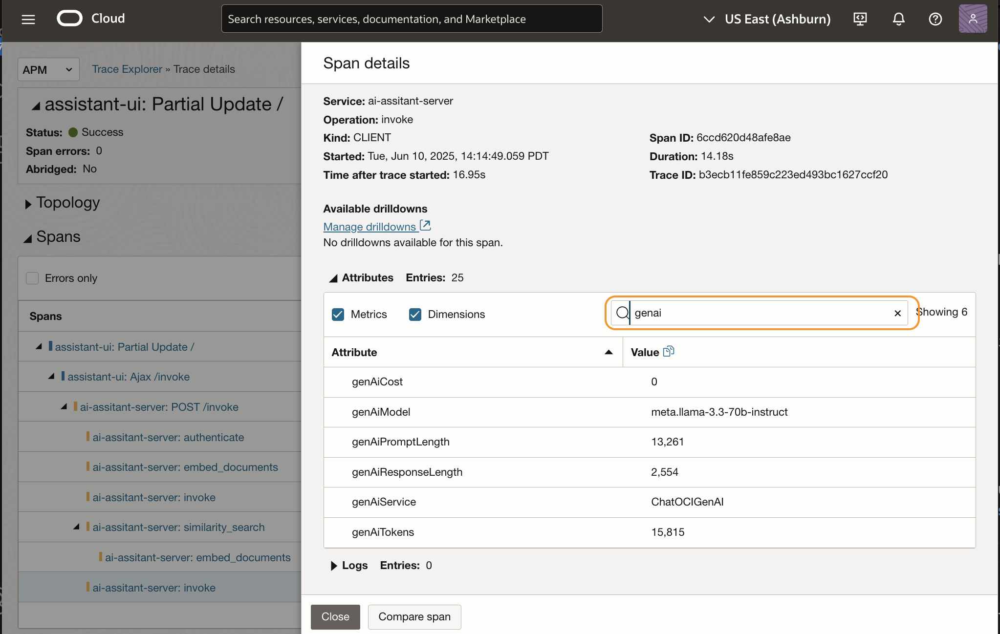
5. Review attributes such as GenAI model used, prompt length, response length, and token count.
     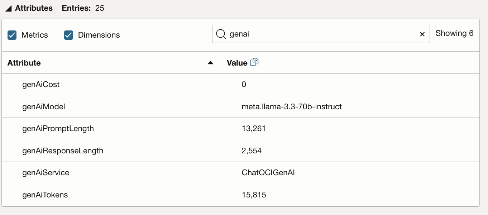
6. Hover over **GenAI Cost** to see its exact decimal values.
     
   Click **Close** to return to the waterfall view.
7.  To see the GenAI question the user made, click the parent span link.
     
8. Filter again with **genai**, then review the query asked by the user, and app-generated response.
     

You may now **proceed to the next lab**.

## Acknowledgements

* **Author** - Yutaka Takatsu, Product Manager, Enterprise and Cloud Manageability
- **Contributors** - Steven Lemme, Senior Principal Product Manager,  
Anand Prabhu, Sr. Member of Technical Staff,  
Avi Huber, Vice President, Product Management
* **Last Updated By/Date** - Yutaka Takatsu, June 2025
