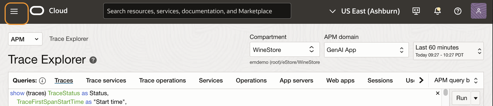
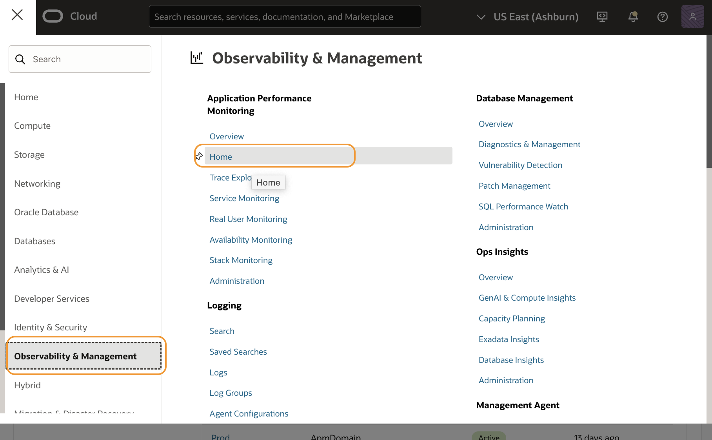
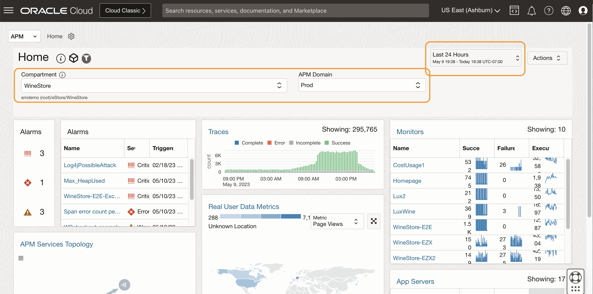

# Examine APM Alarms

## Introduction

In this lab, you will use the APM Home page to identify a critical APM alert and narrow it down to the Alert Details page to examine the alert details.

Estimated time: 5 minutes

### Objectives

* View critical alarms on the APM Home page
* Examine alarm details on the Alarm Details page

### Prerequisites

* Completion of the preceding labs in this workshop

## Task 1: Access APM home dashboard

1. Open the navigation menu from the top left corner (aka. hamburger menu) in the Oracle Cloud console, select **Observability & Management** > **Home** under **Application Performance Monitoring**.

   

   

   APM Home page opens.

2. On the APM Home page, select the following from the pulldown menus:
    - Compartment : **root/eStore/WineStore** (Type down **WineStore** and select an entry below eStore)
    - APM Domain : **Prod**
    - Time : Last **24 Hours**
    - Region: **US East (Ashburn)** (set by default)
   
Make sure the data is loaded onto the charts in the Home dashboard.

## Task 1: View critical alarms on the APM Home page

1. At the top left side of the screen, locate the **Alarms** widget. You may see 2 or 3 alarms currently being fired. Click the link to the alarm **WineStore-E2E-ExecTime**.

	

    >**Note:** It is possible that this alarm will not be active at the time you are looking at this, you can see the **WineStore-ExecTime-warning** alarm instead.

## Task 2: Examine alarm details on the Alarm Details page

1. **Alarm Definitions** page opens. This page shows details of the selected alarm. For example, if you select the **WineStore-E2E-ExecTime**, you can view the following information.

     - The alarm is triggered for the WineStore-E2E monitor when the execution time is longer than 12 seconds.
     - Severity is critical.
     - Alarm details, e.g., The metric is  **MonitorExecutionTime**, and from the namespace, you can see this is a **synthetic** metric. The statistics used are **percentile(.75)**.  Interval between the monitor run is 5 minutes, and one notification is processed, which you can click to see the details.

	
2. Next, let’s examine the metric data associated with this alarm.

  Scroll down to the section labeled **Alarm History**. From the pulldown **Quick Selects**, select **Last 6 hours**.

	

  Examine the chart. The values run over the red dotted line when the threshold is crossed. You can see that the alarm has been periodically triggered.

3. Hover the mouse over one of the spikes in the chart. A floating window opens showing details of the selected sample.

	

4. Review the chart to find additional details.
    - Many execution values fall below the alarm threshold
    - A few values exceed the average, taking 20 or more seconds to run
    - High values are not consistently produced

You may now **proceed to the next lab**.

## Acknowledgements

* **Author** - Yutaka Takatsu, Product Manager, Enterprise and Cloud Manageability
- **Contributors** - Steven Lemme, Senior Principal Product Manager,  
Anand Prabhu, Sr. Member of Technical Staff,  
Avi Huber, Vice President, Product Management
* **Last Updated By/Date** - Yutaka Takatsu, December 2024
