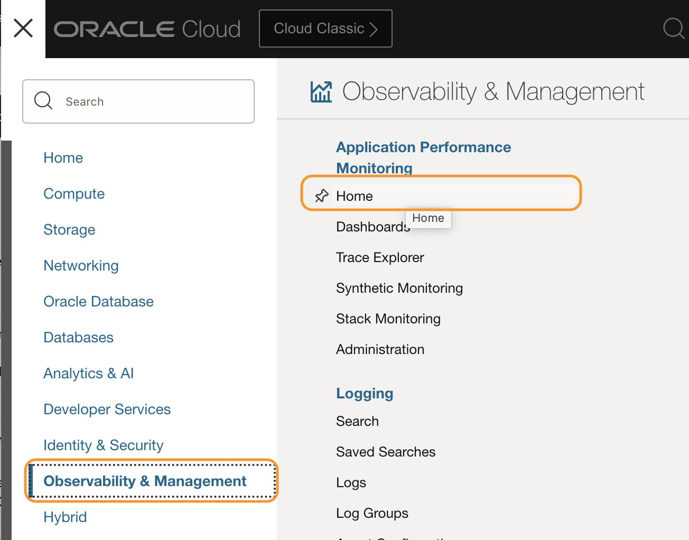
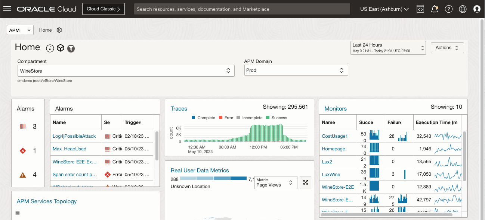
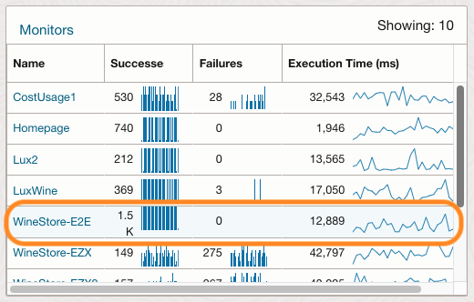
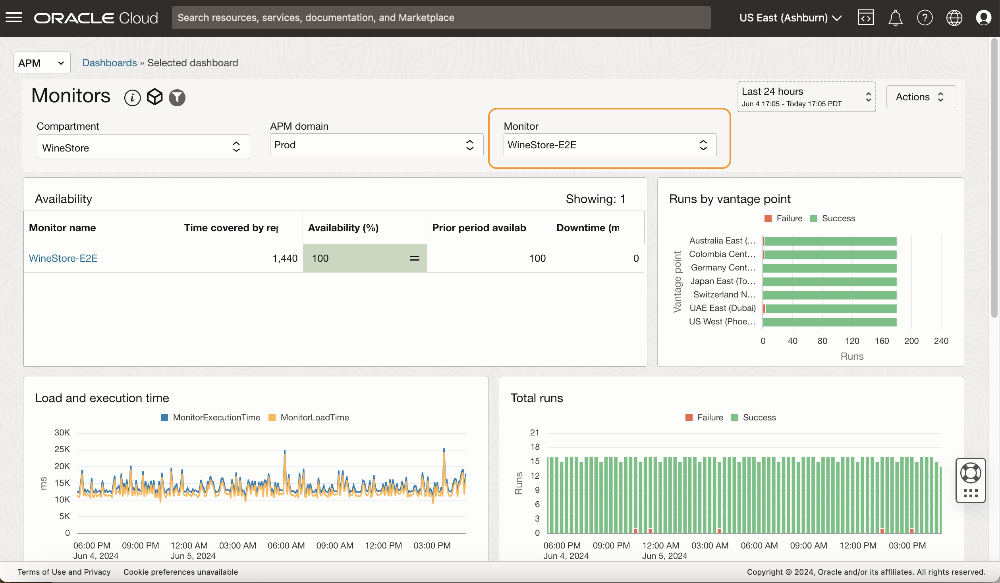
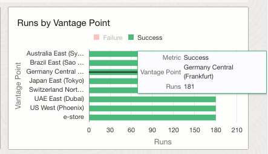
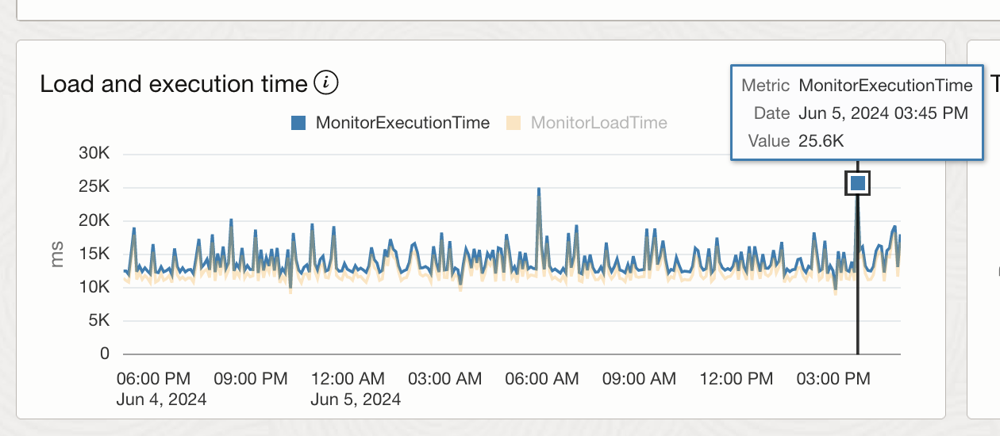
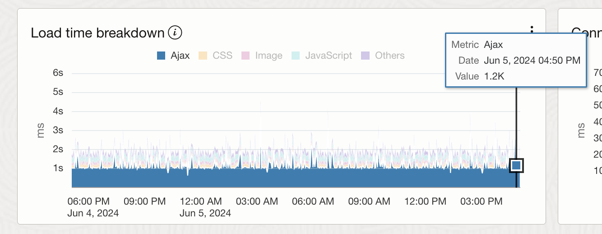
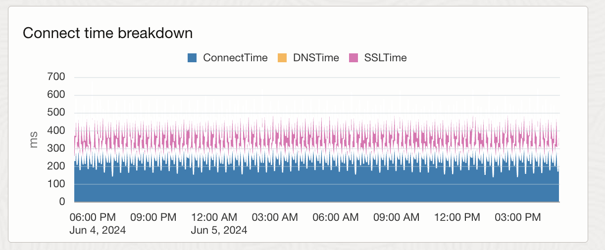
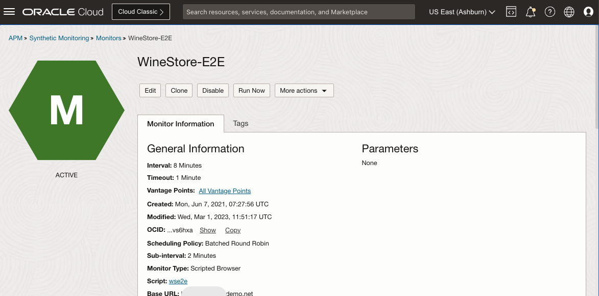

# Examine APM Monitors

## Introduction

In this lab, you will view the status of the monitors on the APM home page, drill down to the Monitor dashboard and analyze the details from the performance charts.  

Estimated time: 5 minutes

### Objectives

* View monitor statuses on the APM Home page
* Inspect the performance charts in the Monitor dashboard

### Prerequisites

* Completion of the preceding labs in this workshop

## Task 1: View monitor statuses on the APM Home page

1. Open the navigation menu in the Oracle Cloud console, select **Observability & Management** > **Home** under **Application Performance Management**.

	

2. APM Home page opens. Locate the **Monitors** widget on the right side of the page. You can see the status of the synthetic monitors running for the last 24 hours, in this compartment.

	

	Find the **WineStore-E2E** monitor in the Monitors table.  Since the alarm was produced by this monitor, let’s examine it in greater detail. Click on the **WineStore-E2E** monitor.

	

## Task 2: Inspect the performance charts in the Monitor dashboard

1. **Monitors** dashboard opens. Notice that the **WineStore-E2E** is pre-selected in the **Monitor** field. The Monitors dashboard shows performance and error summary information of multiple, or specific Monitors.

 	

2. Locate the **Run by Vantage Point** bar chart.

	APM Monitor is an automated test periodically run by APM on an application. The monitor can be run from multiple OCI sites, called **Vantage Points**. In this chart, each bar represents a Vantage point.  Hover the mouse on bars and observe the location and number of runs.

 	

	>**Note:** The example screenshot above does not have errors, but the chart also shows errors for any failure runs.
	 	

3. Find the **Load and Execution Time** chart. Spot a few spikes indicating slow executions in the chart. These likely caused an Alarm we saw earlier. Hover the mouse over the data points to see details.

 	

4. Scroll down to locate the **Load Time Breakdown** chart. You can see that the Ajax wait time is taking a large portion of the load time, which is typically waiting for a backend response.
 	

5. Find the **Connect Time Breakdown** chart on the right side. In the screenshot example, there is no connection related slow down you can see in the chart. However, in cases there are failures in monitor runs, the chart helps you to analyze the root cause. For example, the failed runs can be caused by the SSL not being resolved or an issue in DNS. Also, a longer execution time may be caused by the delay in connection.

 	

6. Scroll down the page and locate the Monitors section. Click on the **WineStore-E2E** monitor.

 	

	This will open the Monitor details page. In the next lab, we will look at the details of the Monitor to see what additional information is available.

 	

You may now **proceed to the next lab**.

## Acknowledgements

* **Author** - Yutaka Takatsu, Product Manager, Enterprise and Cloud Manageability
- **Contributors** - Steven Lemme, Senior Principal Product Manager,  
Anand Prabhu, Sr. Member of Technical Staff,  
Avi Huber, Vice President, Product Management
* **Last Updated By/Date** - Yutaka Takatsu, May 2023
