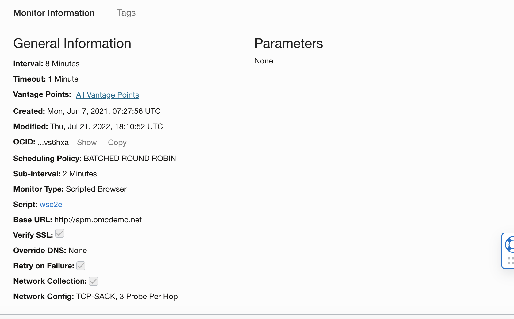
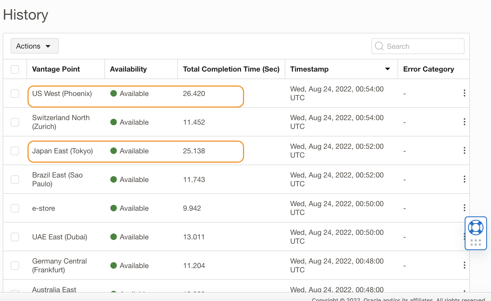
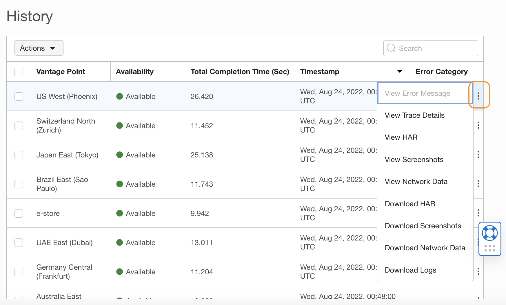
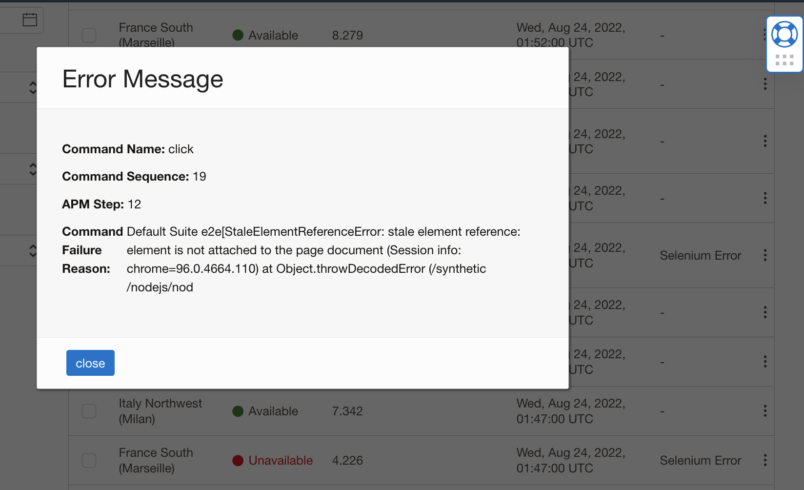
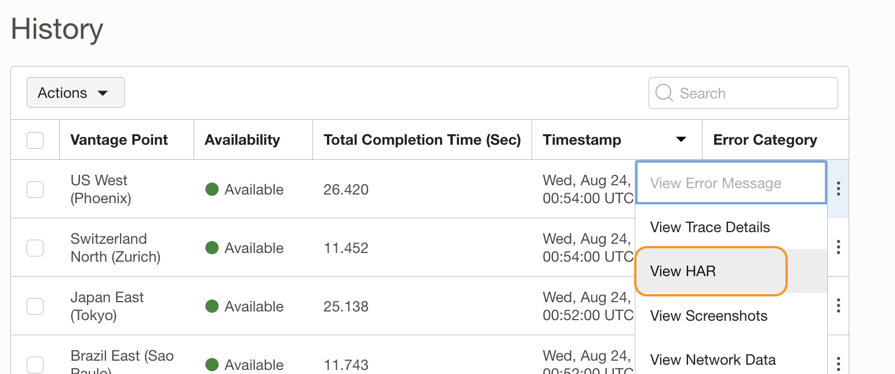
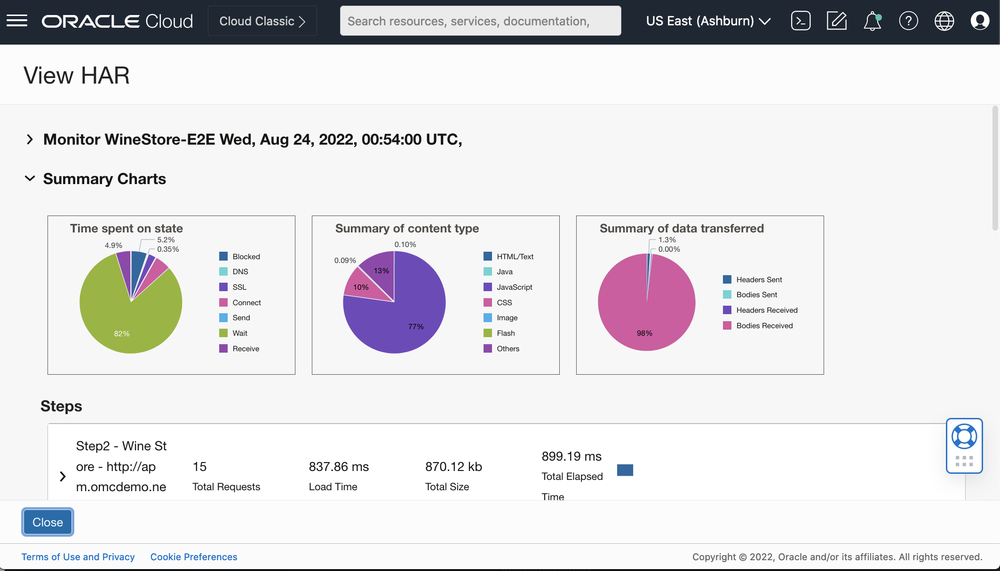
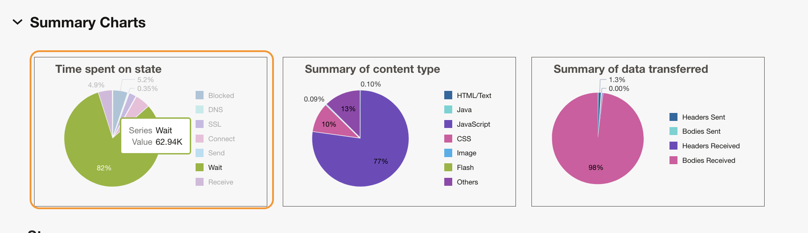
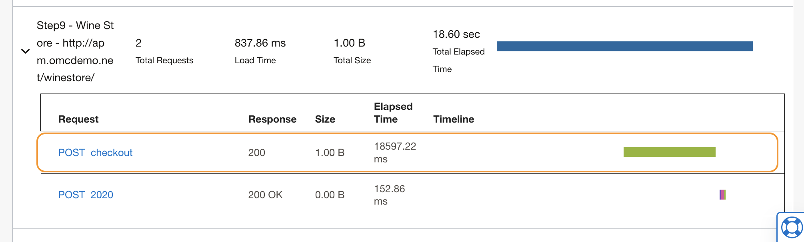
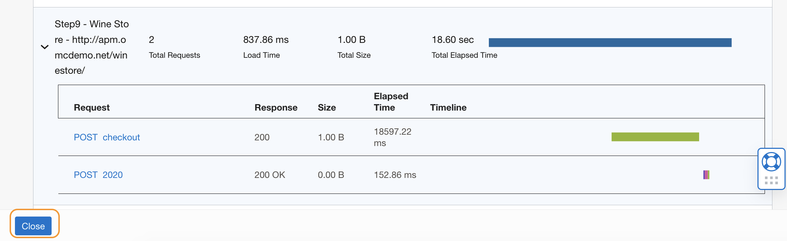
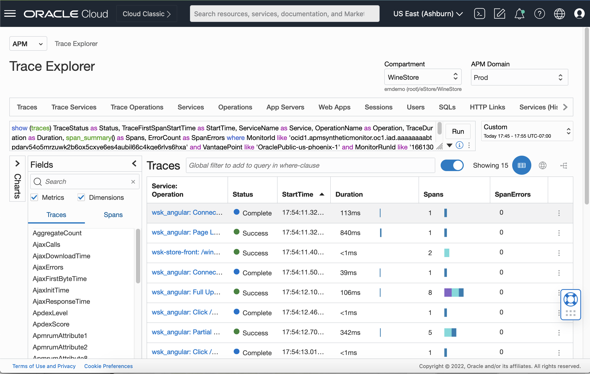

# Explore Monitor Details and History

## Introduction

In this lab, you will use the Monitor page to look into the additional details of the Monitor, such as the monitor execution history, and the client side details in the built-in HAR file viewer.  

Estimated time: 5 minutes

### Objectives

* Inspect the monitor details and execution history
* Examine the HAR file
* Drill down to the Trace Explorer page to view trace details

### Prerequisites

* Completion of the preceding labs in this workshop

## Task 1: Inspect the monitor details and execution history

1.  The Monitor page provides details about an APM monitor, for example, when and where the monitor is run, a link to the monitor script, or a history of the monitor running.  Examine the **Monitor Information** tab, **General Information** section.

	  

    In this example, you can observe the information including the following.
     - **Interval** is 8 minutes. So the monitor runs every 8 minutes.
     - The monitor runs in all **Vantage points** available in the domain.
     - The monitor type is a **Scripted Browser**, so it is a Selenium script running a recorded transaction against the website.
     - **Batched Round Robin** is selected so a set of monitors run sequentially on batches of vantage points. You can also configure it to run from all vantage points simultaneously or sequentially on each vantage point. For more information, please see the APM documentation, section [Create a Monitor](https://docs.oracle.com/en-us/iaas/application-performance-monitoring/doc/create-monitor.html) where the scheduling policy is explained.

2. Scroll down the page and locate the **History** section. History provides additional insights into the alarm we examined in the previous labs. From the list of the runs, you can see the long-running calls are run from multiple vantage points, and not based on a specific region. So you can assume it is not a geographical problem where the monitor was executed, but related to the monitor itself.

	  

3. Let's examine the details of a specific run. Find one of the slow runs from your list, and click the three dots at the end of the row. In this example, the monitor in the top row that took 26 seconds to execute is selected.

	  

    You will see a menu opened. This opens a menu that provides you options to analyze the monitor execution. For example, you can see an Error message in case of a failed script run, or Trace details in case of a network issue. You can also see screenshots of the HTML pages navigated in the monitor, or download browser console logs.

    >**Note:** In the example screenshot, the **View Error Message** menu is disabled, because the selected run did not have a failure. In case of a failed script run, you can select to see an error message.
    	  

## Task 2: Examine the HAR file

1. Select **View HAR** from the menu.

	  

    The **View HAR** page opens. The HTTP Archive file (HAR file) holds details of a specific monitor call. APM collects HAR files at the monitor executions and visualizes them on this page.

    

2. On the upper side of the screen, there are pie charts showing load time breakdown information. Looking at the **Time Spent on state** chart, you can see that most of the time was spent in a wait state.

    

3. Scroll down to the **Steps** section, and find the row that has the long execution time. In this example, that is Step 9.

    

4. Expand step 9 (or your selection of the slow step) by clicking the triangle icon at the beginning of the row.

    

    You can see the checkout POST operation was taking the majority of the time

    

5. Click **Close** to exit the View HAR page

    

## Task 3: Drill down to the Trace Explorer

1. You are back at the **History** section of the **Monitor details** page. On the same monitor run, click the three-dot icon to open the menu, then select **View Trace Details**.

    

2. This will open the **Trace Explorer**. In the next lab, you will examine the trace details of this monitor run.

    
You may now **proceed to the next lab**.

## Acknowledgements

* **Author** - Yutaka Takatsu, Product Manager, Enterprise and Cloud Manageability
- **Contributors** - Steven Lemme, Senior Principal Product Manager,  
Anand Prabhu, Sr. Member of Technical Staff,  
Avi Huber, Vice President, Product Management
* **Last Updated By/Date** - Yutaka Takatsu, August 2022
