# Explore APM Trace Data

## Introduction

In this lab, you will use the APM Trace Explorer to examine the traces and spans collected from the monitor run. You will inspect the Query view and learn how the parameters are carried over from the monitor page, how to use Topology and Waterfall views to analyze the traces and spans, and view span dimensions to identify the root cause of the problem. You will also use predefined and saved queries to analyze the trend and behavior of the span causing the performance issue.  


APM Trace Explorer lets you run queries and visualizations of APM data, including the following.
 - 	Traces (full transactions)
 - 	Spans (individual units of work that form a trace)


Estimated time: 15 minutes

### Objectives

* Examine the pre-configured query in Trace Explorer
* Understand relations of services and operations in the Topology view
* Drill down to the trace Details
* Inspect the SQL spans by executions
* Analyze the SQL spans with the histogram query

### Prerequisites

* Completion of the preceding labs in this workshop

## Task 1: Examine the pre-configured query in Trace Explorer

1. At the end of the previous lab, you selected to launch the **Trace Explorer** from the **Monitor History** page. Traces that are listed in the **Traces** section are captured from the monitor run.

	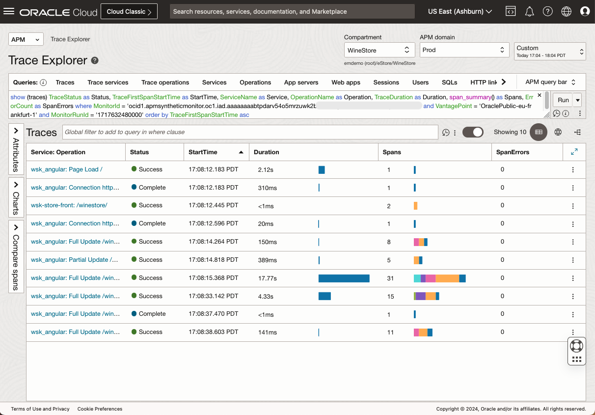

2. Examine the **where clause** in the query. You will see the parameters **Monitor ID**, **Vantage point**, and the **MonitorRunId** carried over from the Monitor History page, and automatically constructed a query to show a list of traces for this particular monitor run.

	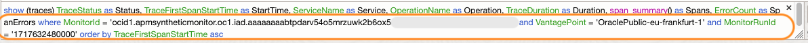

## Task 2: Understand relations of services and operations in the Topology view

1. Click the **Topology** Icon on the right-hand side of the screen.

	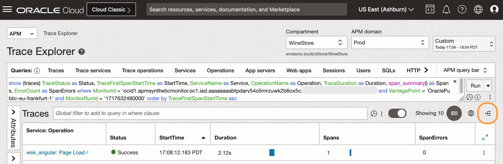


2. The **Topology** diagram opens. This is the **Service topology** constructed from the flow of the 15 traces, or transactions, executed by the Monitor.


	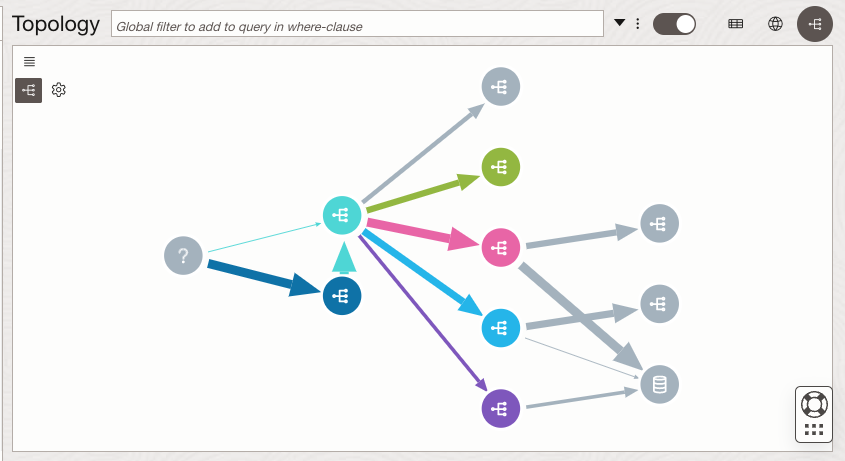

3. Examine the diagram by hovering the mouse over the nodes and arrows.

 	Hovering over a service shows the service name.

	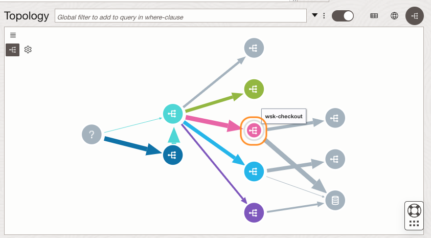

	Hovering over an arrow shows the connection details between the services. Notice that the thicker the arrow, the longer the connection time. So the diagram helps you to identify where in the services the slowness has occurred.  

	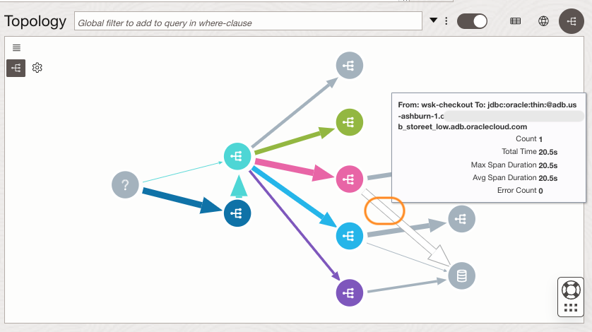


4. Click the **Operations** button to see the operation level topology. The operations view shows the flow of individual spans within the services.


	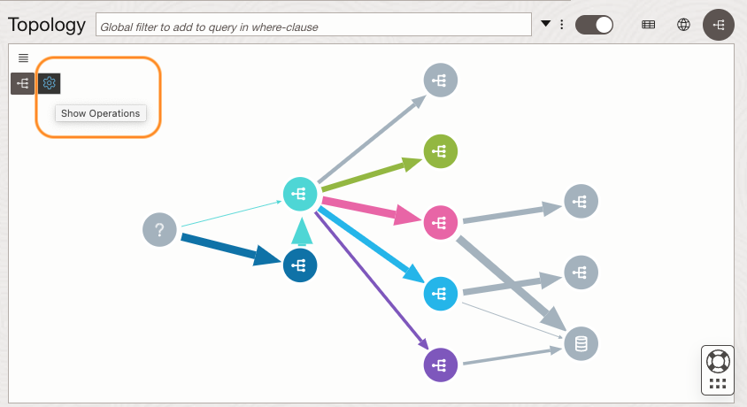


5. Now the topology shows the operations. Click the **Show Diagram Controls** icon (icon with four bars).

	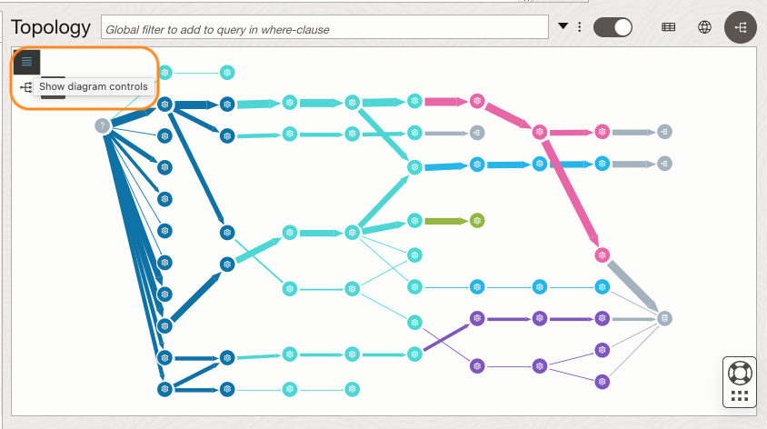

6. Click **Arrow Width** to open a pulldown. Then select **Max Span Duration**.

	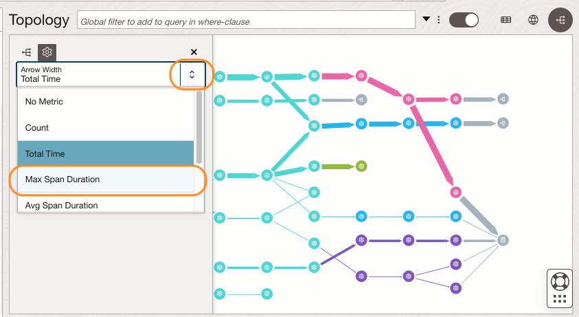

7. Click **X** to close the pane.

	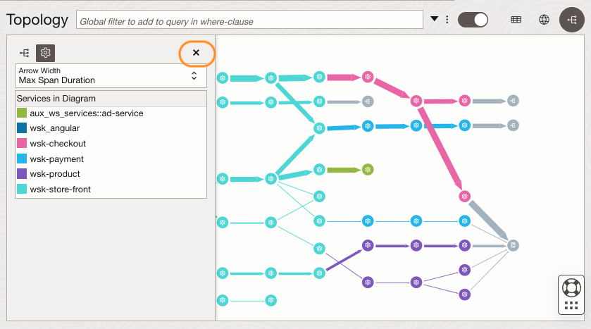

8. Find a path with thick arrows in the diagram to identify the slowness. In the screenshot below, a path involving the checkout is taking a long time.

	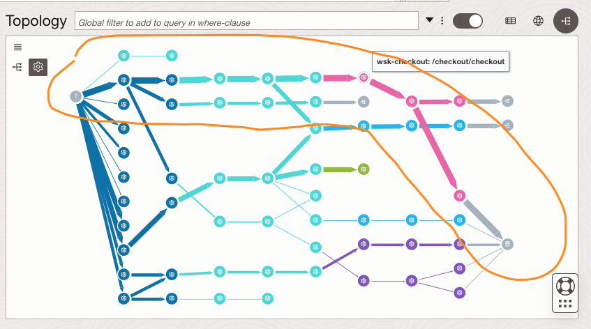

9. Hover the mouse over the arrow between the last operation and the database. A floating window shows information about the slow SQL executed.

	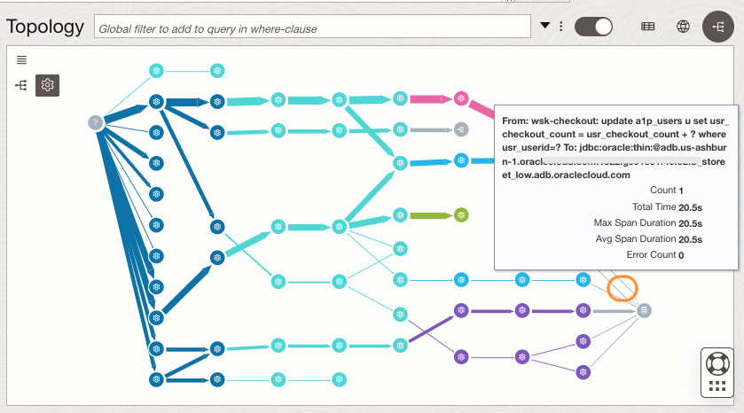


## Task 3: Drill down to the trace Details

1. Click the black triangle icon on the right side of the Query view. A list of queries used in the session will show in a pulldown. Select the previous query executed.

	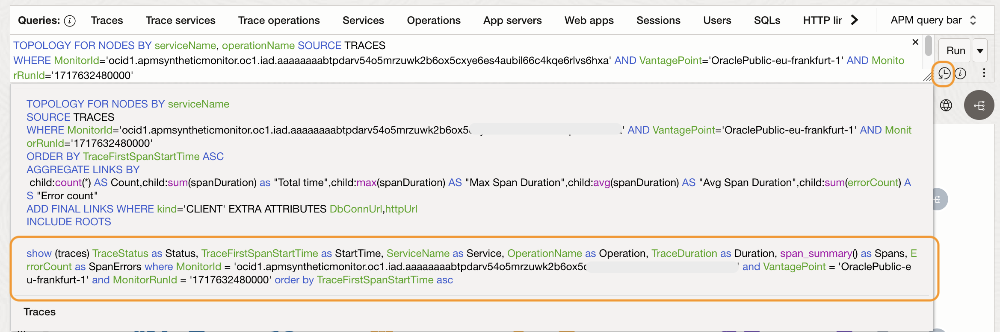

2. Now you are back at the **Traces** section. Look at the transactions (traces) executed by the monitor, and locate the slow trace that is taking more than 15 seconds. In the screenshot below, there is a trace that is taking 18 seconds to complete. Click the link in the first column.

	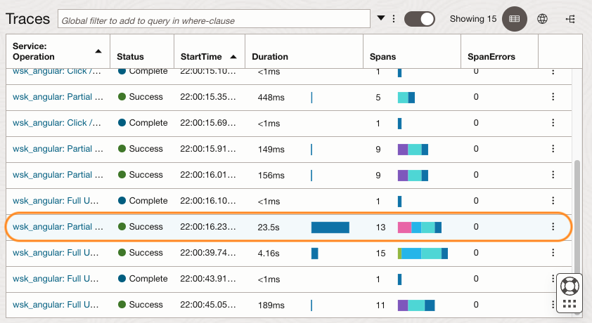


3. The Trace detail page opens and displays the flow of action for the specific transaction, in **Topology** and **Waterfall** views.

	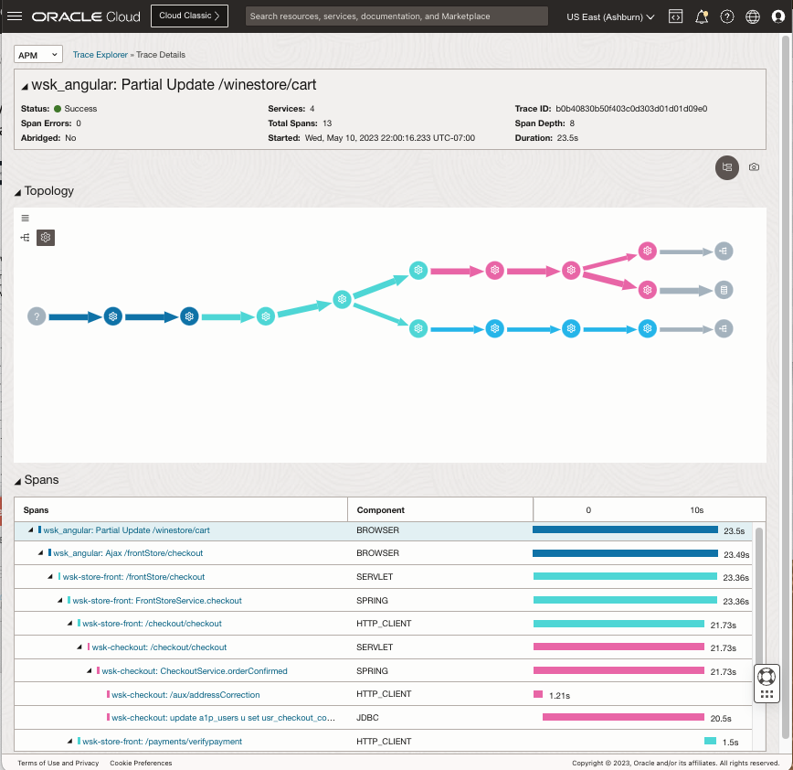

	>**Note:** The operations in the topology are the spans that are seen in the waterfall view.

	In the **Topology** view, hover the mouse over the icons. As you have already verified in the previous steps, slowness is seen in the monitor when a checkout button is clicked by the synthetic user.

	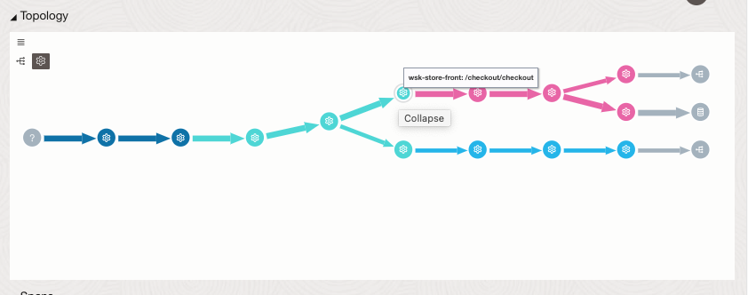


4. Click the triangle icon next to the **Topology** label, to minimize the topology region.

	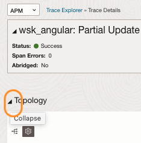


5. The waterfall view shows the spans invoked in the transaction. If the trace is spread across multiple services, spans in each service appear in a different color. Review the following.


	 - The view visualizes the workflow of the trace and the relation between the spans.
	 - Each bar represents a span, and the time length goes from left to right.
	 - The longer the bar, the more time was consumed to complete the operation.
	 - The bar at the top is a root span, and child spans are nested below.
	 - Spans may wait for the next span to complete, or may not if it is an async call.


	 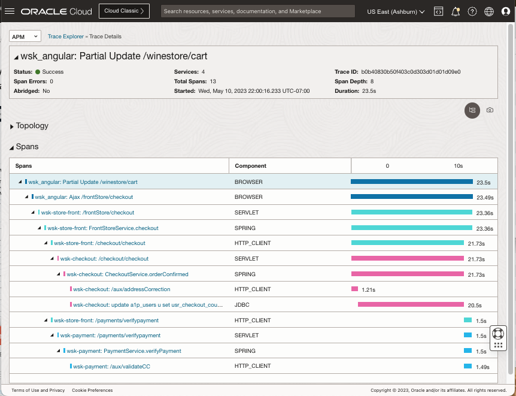

	 	>**Note:** The waterfall view is visualized in the form of a Gantt chart.

6. Look at the waterfall view, and try to identify the slow span. For example, in the screenshot below, **wsk-checkou:update** is the bottleneck, blocking the payment service from the process.

	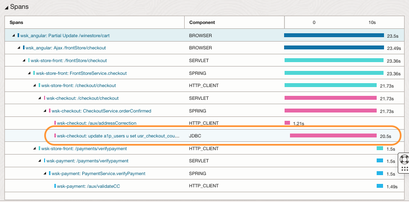

	Click the link or the bar of the span.

7. **Span details** page opens. On this page, span details are provided in the list of dimensions. Scroll down the list, and review the information of the span. E.g., the App server name, type and the port it uses, Kubernetes node and pod names, and the information related to the host and Oracle Cloud. Because this span is a JDBC span, it also includes information from the database. These dimensions are provided out-of-the-box and can help you investigate a problem. You can also create custom dimensions.

	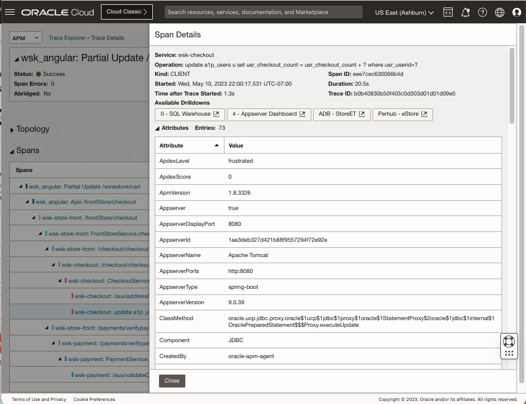

8. As scrolling down, locate the dimensions related to the database. In this case, you identified that the problem is a slow SQL. The dimensions provide the actual SQL, the time it took to execute, the DB Connection string, and the SQLID.

	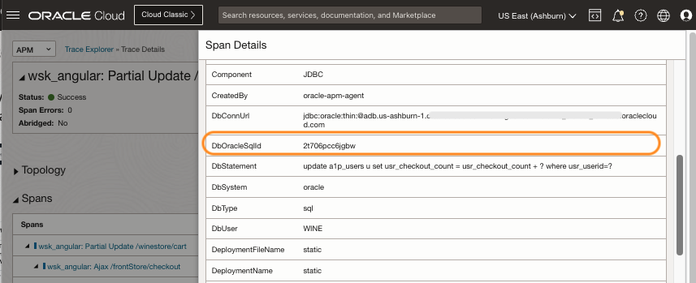

	Using the DB Connection string and the SQLID, you can drill down to perfhub and/or Operations Insights service in Oracle Cloud, to investigate the issue with the database.

	 >**Note:** You can use in context drill down to the database services, by clicking the **OPSCI** or **PerfHub** buttons in the **Available Drill downs** section.
	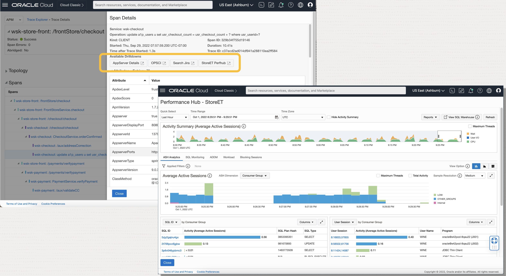

9. Click **Close**, then click the **Trace Explorer** link from the breadcrumb to go back to the Trace Explorer main page.

	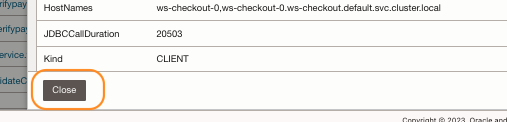
	


## Task 4: Inspect the SQL spans by executions


1. Now you are back at the Trace Explore the main page. From the Quick Pick tab, click **SQLs**.

	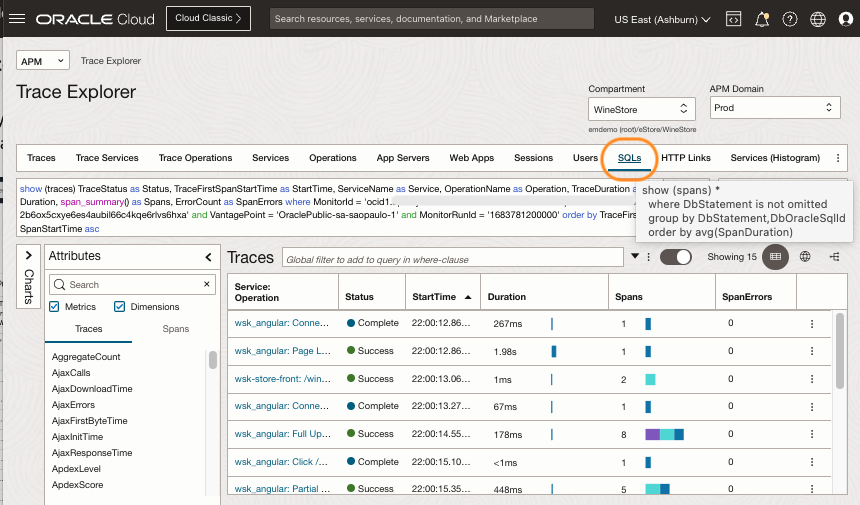

2. Verify that the SQL that comes at the top of the list, is the same SQL, which you found as a bottleneck in the previous steps. The view is sorted by the slowest average duration. Next, let's check whether the SQL is always slow or not. Click the **Count** column of the SQL on the top row.
	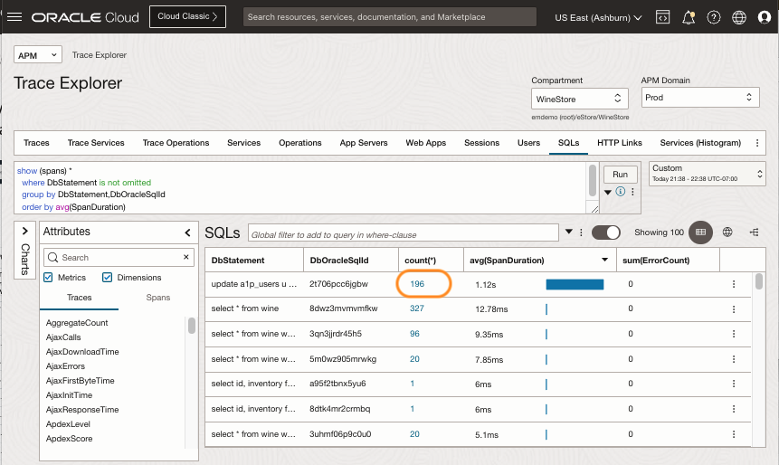

3. 	You can see each of the individual executions of the SQL. Confirm that the SQL is not always slow when executed. Scroll down the list as needed.

	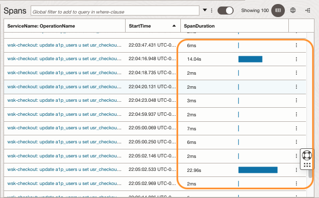


## Task 5: Analyze the SQL spans with the histogram query

1. Another way to analyze the distribution is to use the histogram view. Click the three-dot icon under the **Run** button, then click **Open**.

	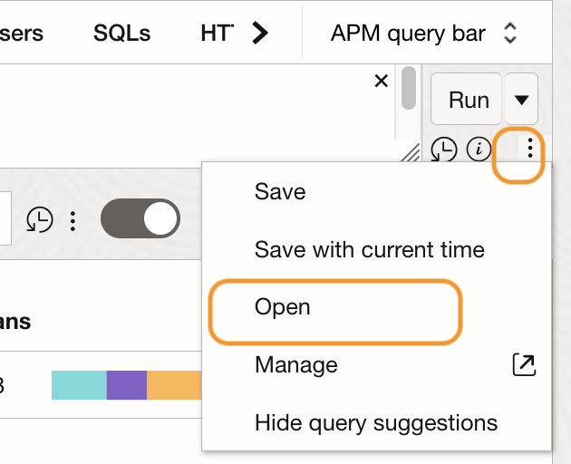

2. Type **histogram** in the search field. Select the query **SQL-Histogram**, then click **Open**.

	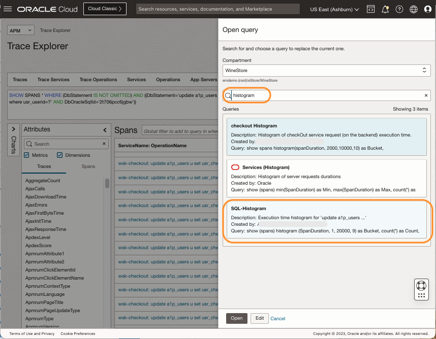


	>**Note:** Alternatively, copy the text below, paste it into the **Query** view, then hit enter, or press the **Run** button.

	``` bash
	<copy>
	show spans histogram(spanDuration, 2000,10000,10) as Bucket, min(spanDuration) as "Min", max(spanDuration) as "Max", count(*) as count, avg(spanDuration) as Avg  where operationName='/frontStore/checkout' group by histogram(spanDuration, 2000,10000,10) order by max(spanDuration) asc
	</copy>
	```

3. Inspect the histogram view opened on the screen.

	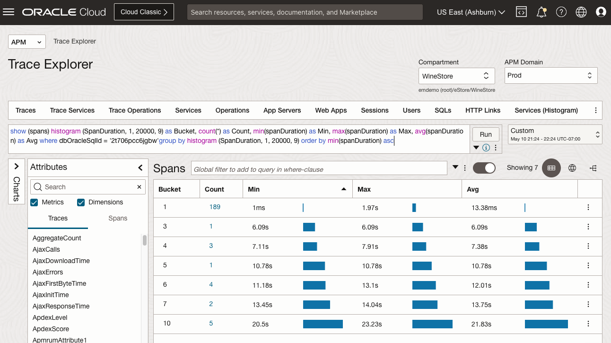

  In the above screenshot, you can see the following.

  -  In 90% of the total executions (the top row) the SQL runs 13 milli-seconds in average. So it is usually very fast.
    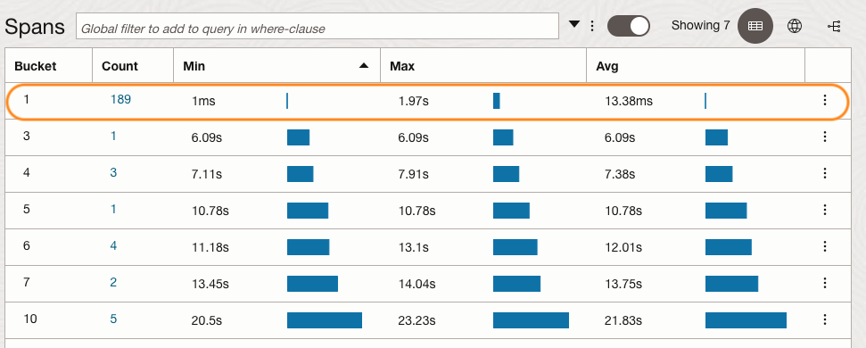


  - However, in some cases, it runs much slower. 6% of the total executions show the duration more than 10 seconds.
    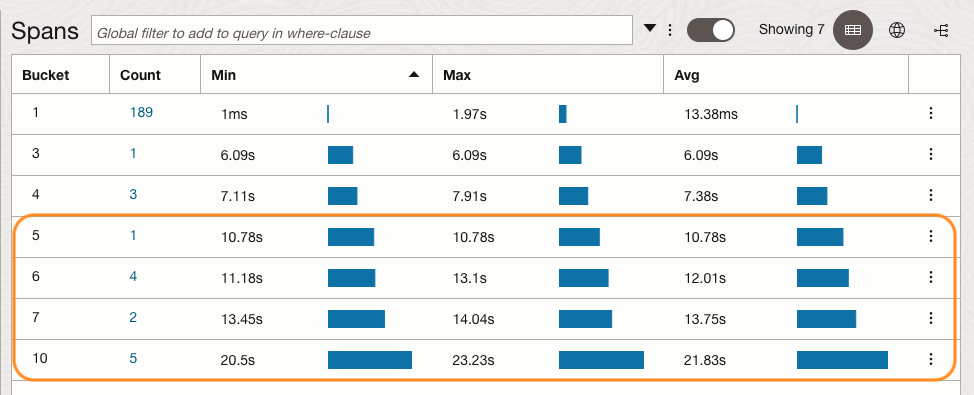


    > **Note:** You can further diagnose the issue in the PerfHub and use the Operations Insights service to solve this problem in the database.

    Although we do not cover the database side diagnostics in this workshop, the root cause of the issue is the lock contention in the database that the update statement is being blocked by another SQL that is doing a select on the same table. That uses a lot of CPU and takes a long time to execute, and is causing the update statement that usually runs in ms while slows down intermittently. Using Perfhub and/or the Operations Insights service, you can find and resolve this problem.

    For more details on the solution at the database, please watch the following video that demonstrates how the contention can be identified and how it can be resolved. In the video, you can see the issue is resolved by enabling the auto index feature in the autonomous database.  Operations Insights was utilized to obtain in-depth analytics based on long-term historic performance data.


    [Demonstration, A New Platform for Multicloud Observability and Management](https://youtu.be/EnsQMOEhWjQ?t=1058)

    [](https://youtu.be/EnsQMOEhWjQ?t=1058 "Redirect to YouTube")

You may now **proceed to the next lab**.


## Acknowledgements

* **Author** - Yutaka Takatsu, Product Manager, Enterprise and Cloud Manageability
- **Contributors** - Steven Lemme, Senior Principal Product Manager,  
Anand Prabhu, Sr. Member of Technical Staff,  
Avi Huber, Vice President, Product Management
* **Last Updated By/Date** - Yutaka Takatsu, May 2023
