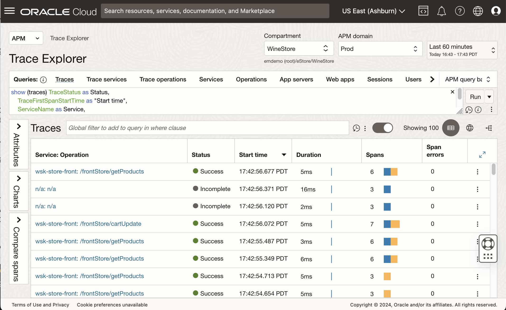
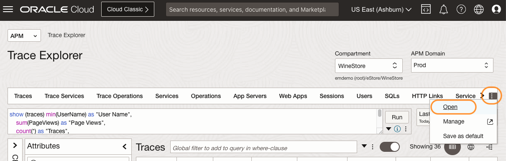

# Save a custom query

## Introduction

In this lab, you will learn how to save a custom query for future use and incorporate it into the quick bar for convenient and frequent access.

Estimated time: 15 minutes

### Objectives

* Save a query to a compartment
* Create a custom query bar
* Add the query to the custom query bar
* Set the custom query bar as the default option

### Prerequisites

* Completion of the preceding labs in this workshop

## Task 1: Run a custom query in Trace Explorer

1. In the OCI console, from **Navigation Menu** > **Observability and Management** > **Trace Explorer** under **Application Performance Monitoring**.

2. **Trace Explorer** opens in the screen.
    

3. Ensure the **Compartment** is set to **root/eStore/WineStore** and the **APM Domain** is set to **Prod**.

4. Place the cursor on the **Query view**. Either use your mouse or type Ctrl+A to select all.
    
5. Press the delete key on your keyboard to remove the text.
    
6. Type the text below into the **Query** view.

	``` bash
	<copy>
	show (traces) min(UserName) as "User Name",
		sum(PageViews) as "Page Views",
		count(*) as "Traces",
		max(TraceLatestSpanEndTime) - min(TraceFirstSpanStartTime) as Duration,
		min(case when (JourneyPhase = '2-addToCart') then TraceLatestSpanEndTime  end ) - min(TraceFirstSpanStartTime) as "time to addToCart",
		min(case when (JourneyPhase = '3-checkedOut') then TraceLatestSpanEndTime  end ) - min(TraceFirstSpanStartTime) as "time to checkOut",
	case when(sum(case when (JourneyPhase = '4-orderConfirmed') then 1 else 0 end))>0 then 'reached' else '0' end as step4,
	case when(sum(case when (ApmrumClickElementId='/html/body/app-root/app-prod-list/div/div[3]/div[4]/mat-card/mat-card-actions/button/span') then 1 else 0 end))>0 then 'clicked' else '-' end as Button
	where ( ApmrumPageUpdateType is not omitted OR ApmrumType='Connection')
	group by SessionId
	having  sum(case when (JourneyPhase = '4-orderConfirmed') then 1 else 0 end) >0
	order by max(TraceLatestSpanEndTime) - min(TraceFirstSpanStartTime) desc
	</copy>
	```

      > **Note:** The query retrieves session data for transactions conducted within a web-based shopping cart application. The process of constructing this query is explained in Lab 9.
    

7. Click **Run**. Verify the results in the **Traces** view.
    


## Task 2: Save the custom query to your compartment

1. Click the three dots icon under **Run**, click **Save**.
    
2. In the **Save query** window, expand the tree view **root/LiveLabs-Compartments/LiveLabs** and locate your compartment.
    
      > **Note:** You can find your compartment name in the **Reservation Information** pane. Click **View Login Info** at the top left corner of this page to access the page.
	      

3. Ensure your compartment name is entered in the **Query compartment** field. Name the query **Session Analysis**. Click **Save**.
    
4. Click the three dots icon under **Run**, click **Open**.
    
5. Select your compartment in the **Compartment** field, then type **Session** in the **Search** field. Find the query you saved with the name, **Session Analysis**. Select the query and click **Open** to close the window.
    

6. Verify that the session data from the saved query is loaded into the **Traces** view. 
    

## Task 3: Add the custom query to a quick bar

Next, let's save the query to the query bar so that you can quickly pick it up and load it onto the Query view the next time.

1. Select the three dots icon at the right side of the **Query bar**, and select **Manage**.
    
2. This will open the APM administration page.
    
3. Select your assigned compartment.
    

4. Select the three dots icon at the right side of the default **APM Query bar**. 
	
5. Verify that the **Edit** option is disabled. This is because the default query bar is not editable. Click **Duplicate**.
	

6. **Duplicate query bar** window opens.
	* Select your assigned compartment in the LiveLabs session.
	* Name the query bar. For example, **My APM lab Query Bar**.
	* Click **Add query**.
	
7. **Add query** window opens.
	* Ensure your assigned compartment is selected.
	* Add a check to the query saved in the previous steps. This is the query you want to add to the query bar.
	* Click **Add Query**
	

8. Verify that the query was added to the bottom of the list.
	
9. You can change the order shown up in the query bar. Select the three lines on the right side of the box, and drag and drop it to bring it to the top.
	
10. Click **Duplicate** 
	

11. A new query bar, **“APM Lab query bar”** is created. Click **Trace Explorer** from the menu under **APM** on the left side of the screen. 
	

## Task 4: Enable the custom quick bar

1. In the Trace Explorer, select the three dots icon at the end of the query bar. Click **Open**.
	
2. In the **Open query bar** window, select the custom query bar you created, then click **Open**.
	

     > **Note:** You can review the menu of queries saved in the query bar, by clicking the triangle icon.
	
3. Confirm that the **Session Analysis** is displayed as the first quick pick in the query bar menu. 
	

4. As it is the first quick pick, the result is already loaded in the Traces view. Verify the columns and values.
	

## Task 5: Set the custom quick bar as default

1. In the **Query Bar** view, select three dots. In the menu opened, select **Save as default**.
	
2. In the confirmation dialog, click **Save**.
	

You may now **proceed to the next lab**.

## Acknowledgements
* **Author** - Yutaka Takatsu, Product Manager, Enterprise and Cloud Manageability
- **Contributors** - Steven Lemme, Senior Principal Product Manager,  
Anand Prabhu, Sr. Member of Technical Staff,  
Avi Huber, Vice President, Product Management
* **Last Updated By/Date** - Yutaka Takatsu, May 2023
