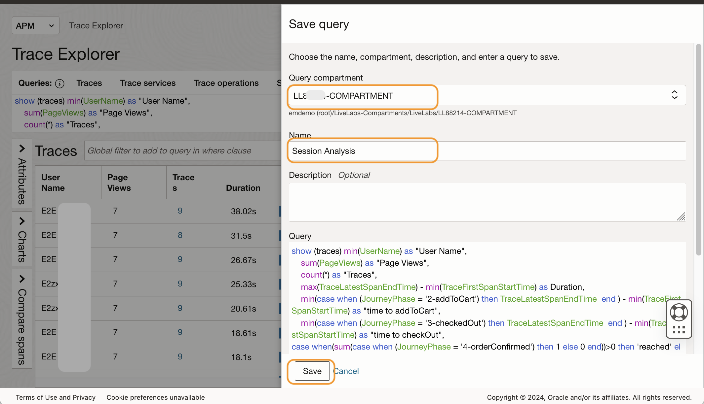
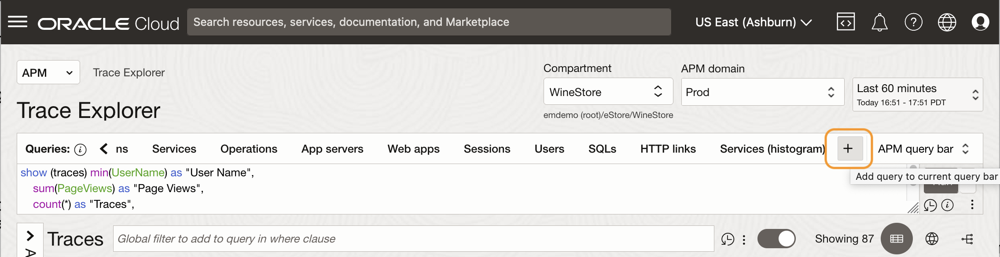
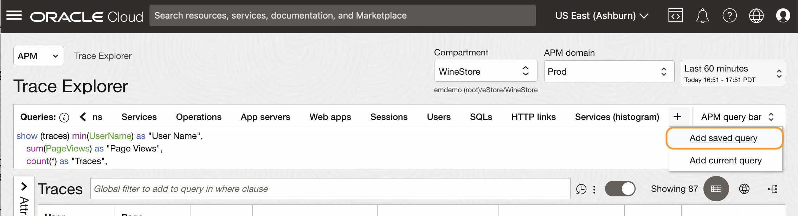
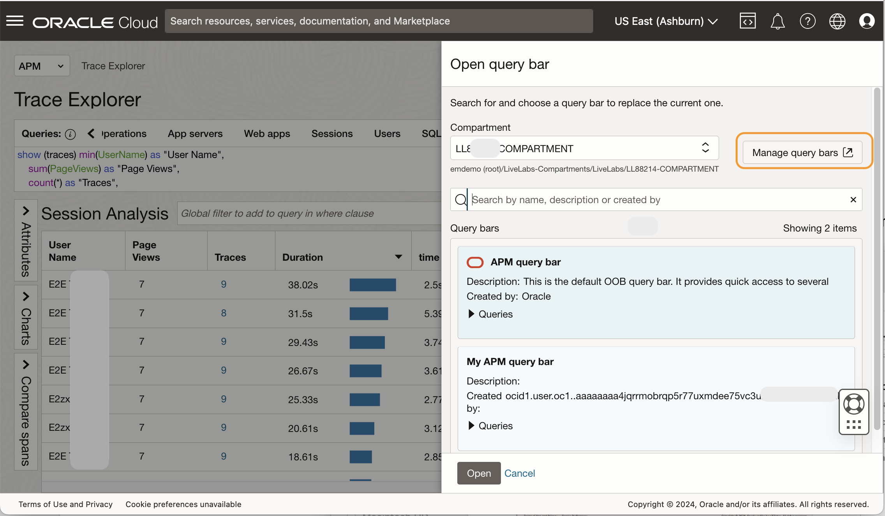
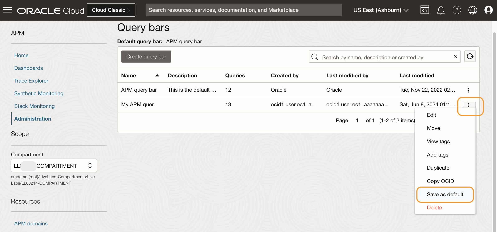
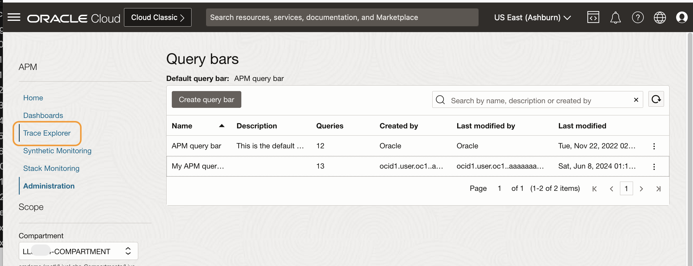

# Save a custom query

## Introduction

In this lab, you will learn how to save a custom query for future use and incorporate it into the quick bar for convenient and frequent access.

Estimated time: 15 minutes

### Objectives

* Save a query to a compartment
* Create a custom query bar
* Add the query to the custom query bar
* Set the custom query bar as the default option

### Prerequisites

* Completion of the preceding labs in this workshop

## Task 1: Run a custom query in Trace Explorer

1. In the OCI console, from **Navigation Menu** > **Observability and Management** > **Trace Explorer** under **Application Performance Monitoring**.

2. **Trace Explorer** opens in the screen.
    

3. Ensure the **Compartment** is set to **root/eStore/WineStore** and the **APM Domain** is set to **Prod**.

4. Place the cursor on the **Query view**. Either use your mouse or type Ctrl+A to select all.
    
5. Press the delete key on your keyboard to remove the text.
    
6. Type the text below into the **Query** view.

	``` bash
	<copy>
	show (traces) min(UserName) as "User Name",
		sum(PageViews) as "Page Views",
		count(*) as "Traces",
		max(TraceLatestSpanEndTime) - min(TraceFirstSpanStartTime) as Duration,
		min(case when (JourneyPhase = '2-addToCart') then TraceLatestSpanEndTime  end ) - min(TraceFirstSpanStartTime) as "time to addToCart",
		min(case when (JourneyPhase = '3-checkedOut') then TraceLatestSpanEndTime  end ) - min(TraceFirstSpanStartTime) as "time to checkOut",
	case when(sum(case when (JourneyPhase = '4-orderConfirmed') then 1 else 0 end))>0 then 'reached' else '0' end as step4,
	case when(sum(case when (ApmrumClickElementId='/html/body/app-root/app-prod-list/div/div[3]/div[4]/mat-card/mat-card-actions/button/span') then 1 else 0 end))>0 then 'clicked' else '-' end as Button
	where ( ApmrumPageUpdateType is not omitted OR ApmrumType='Connection')
	group by SessionId
	having  sum(case when (JourneyPhase = '4-orderConfirmed') then 1 else 0 end) >0
	order by max(TraceLatestSpanEndTime) - min(TraceFirstSpanStartTime) desc
	</copy>
	```

      > **Note:** The query retrieves session data for transactions conducted within a web-based shopping cart application. The process of constructing this query is explained in Lab 9.
    

7. Click **Run**. Verify the results in the **Traces** view.
    


## Task 2: Save the custom query to your compartment

1. Click the three dots icon under **Run**, click **Save**.
    
2. In the **Save query** window, expand the tree view **root/LiveLabs-Compartments/LiveLabs** and locate your compartment.
    
      > **Note:** You can find your compartment name in the **Reservation Information** pane. Click **View Login Info** at the top left corner of this page to access the page.
	      

3. Ensure your compartment name is entered in the **Query compartment** field. Name the query **Session Analysis**. Click **Save**.
    
4. Click the three dots icon under **Run**, click **Open**.
    
5. Select your compartment in the **Compartment** field, then type **Session** in the **Search** field. Find the query you saved with the name, **Session Analysis**. Select the query and click **Open** to close the window.
    

6. Verify that the session data from the saved query is loaded into the **Traces** view. 
    

## Task 3: Add the custom query to a quick bar

1. Click the **>** icon on the query bar to expand.
	 
2. Click the **+** icon at the end of the bar.
	 
3. You can either select to add a saved query or the current query. For learning purposes, select **Add Saved query**.
	 
4. Select your lab compartment, and type **Session** in the search field. Select **Session Analysis**. Click **Add**.
	 


5. Because the current query bar is a default query bar, it cannot be modified.  In the **Name** field, enter **My APM query bar** to create a custom query bar. Ensure your lab compartment is selected, and then click **Create**.
	 
6. Verify that the **Session Analysis** query is added to the **My APM Query bar**.
	 

## Task 4: Change the order of the queries
1. You can change the order of the queries displayed in the query bar. Next, let's move up the Session Analysis query to the top of the list. Click **My APM query bar** > **Open query bar**.
	 
2. Click **Manage query bars**.
	 

	 > **Note:** You can review the menu of queries saved in the query bar, by clicking the triangle icon.
	
3. Ensure the lab compartment is selected. Locate **My APM query bar** from the table, and click the three dots. Select **Edit**.
	 
4. In the **Edit query bar** pane, scroll down and locate the **Session Analysis**. 
	 
5. Select the three lines on the right side of the box, and drag and drop it to bring it to the top. Click **Save**.
	 

## Task 5: Set the custom quick bar as default
1. You can also set the custom query bar as default. On the **My APM query bar**, select three dots. In the menu opened, select **Save as default**.
	 
2. In the confirmation dialog, click **Save**. Click **Trace Explorer**.
	 
	 
3. In the **Trace Explorer** window, confirm that the custom query bar is loaded by default, and the **Session Analysis** is displayed as the first pick in the bar menu. As it is the first pick, the query result is already loaded in the Traces view. Verify the columns and values.
	 

You may now **proceed to the next lab**.

## Acknowledgements
* **Author** - Yutaka Takatsu, Product Manager, Enterprise and Cloud Manageability
- **Contributors** - Steven Lemme, Senior Principal Product Manager,  
Anand Prabhu, Sr. Member of Technical Staff,  
Avi Huber, Vice President, Product Management
* **Last Updated By/Date** - Yutaka Takatsu, December 2024
