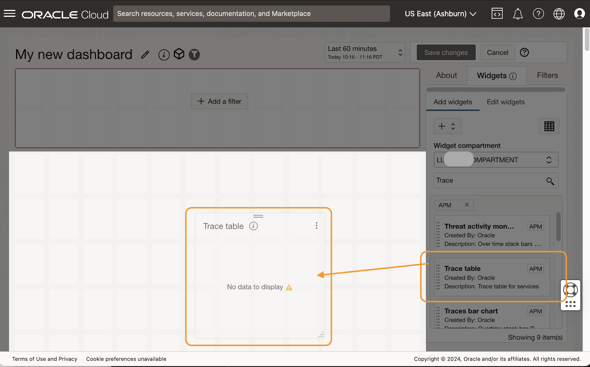
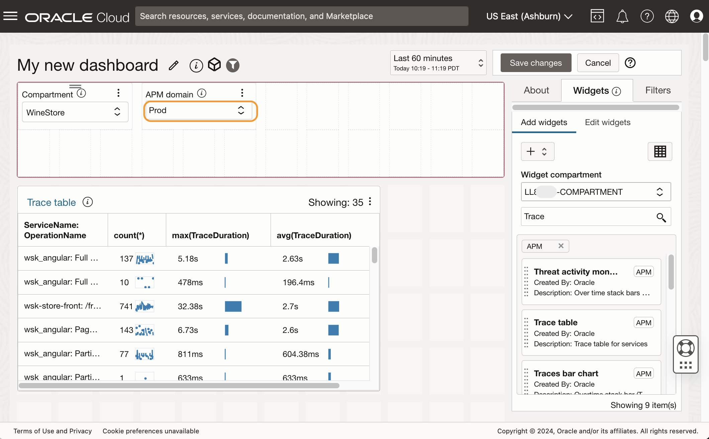
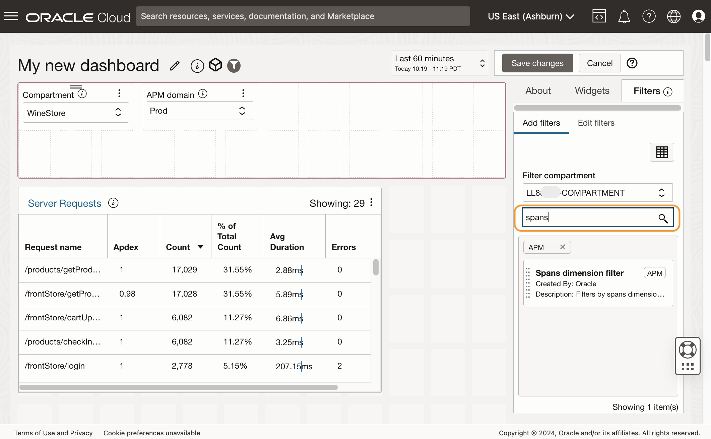
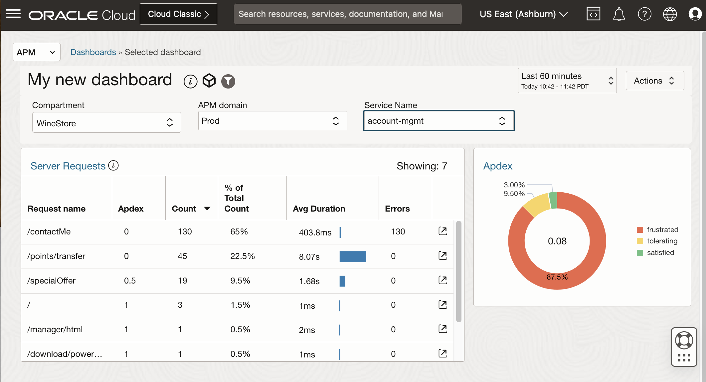

# Create a custom dashboard

## Introduction

In this lab, you will construct a custom dashboard, incorporating a custom APM Trace Table widget. This widget will be generated from a query that you run in the Trace Explorer, and be used for analysis and visualization.

Estimated time: 15 minutes

### Objectives

* Create a custom dashboard
* Add a widget to the dashboard
* Customize the Trace Table data widget
* Add a filter to the widget
* Import custom widget to the dashboard

### Prerequisites

* Completion of the preceding labs in this workshop

## Task 1: Define a custom query

To begin, you need to define the specific query for which you want to create a dashboard.

1. In the OCI console, from **Navigation Menu** > **Observability and Management** > **Trace Explorer** under **Application Performance Monitoring**.

2. **Trace Explorer** opens in the screen.
    

3. Ensure the **Compartment** is set to **root/eStore/WineStore** and the **APM Domain** is set to **Prod**.

4. Type the following query in the query view.

	``` bash
	<copy>
	show spans * where kind = 'SERVER' group by serviceName, operationName
	</copy>
	```
    

      > **Note:** * (asterisk) in the query is used as a shortcut to display expected attributes. Optionally, you can enhance the query with more refined column titles: 
	     ***show spans OperationName as "Request name", avg(ApdexScore) as Apdex,count(\*) as Count, percent\_of\_items() as "% of Total Count", avg(SpanDuration) as "Avg Duration", sum(errorCount) as Errors where Kind='SERVER' group by OperationName,ServiceName order by count(\*) desc***
	   

5. Select and copy the text from the Query view, either by the CTRL+C or by right-clicking and selecting the **Copy** option from the context menu.

    

## Task 2: Add a widget to a custom dashboard

1. From the **APM** menu at the top left corner, select **Dashboards**
    
2. This will open the **Dashboards** page.
	
3.	In the Dashboards page, expand the tree view **root/LiveLabs-Compartments/LiveLabs** and locate your assigned compartment in the LiveLabs session.
    
4.	Click **Create Dashboard**
    
5.	New dashboard editing page opens. Enter the name of the dashboard under **About** tab on the right side of the screen. For example, **My new dashboard**. Then select the **Widgets** tab.
    
7.	Type down **Trace** in the filter window. 
    
8.	Drag and drop the **APM Trace Table** widget to the center screen
    
9.	 **Configure Compartment Input** window opens, as the widgets require a compartment. Leave the default and click **Save changes**.
    
10.	**Configure APM Domain Input** window opens, as the widgets require an APM Domain. Leave the default and click **Save changes**.
    
11.	**Configure Compartment Input** window opens, as the APM Domain requires a compartment. Leave the default and click **Save changes**.
    
12.	The APM Trace Table widget is created on the screen. In the **Compartment** filter, select **root/eStore/WineStore**.
    
14.	In the **APM Domain** filter, ensure **Prod** is selected
    
15.	Resize the APM Trace table widget window by click-and-drag the edge of the window to make it larger.
    

## Task 3: Customize the Trace Table widget	

At present, the widget displays the default query. You can change the query depending on your desired data requirements.

1. In the **Widgets** tab, Click **Edit Widgets**.  
    
2. Expand the **APM Trace Table** by clicking the **>** icon.
    
2.	Under **Configured Widget input** section, click **"*" (asterisk)** showing next to the Trace Table Query. 
    
3. The **Configure Trace Table Query Input** window opens. Replace the text with the query from the Trace Explorer, then click **Save Changes**. Note that the query used in this example is the enhanced version.

	``` bash
	<copy>
	show spans OperationName as "Request name", avg(ApdexScore) as Apdex,count(*) as Count, percent_of_items() as "% of Total Count", avg(SpanDuration) as "Avg Duration", sum(errorCount) as Errors where Kind='SERVER' group by OperationName,ServiceName order by count(*) desc
	</copy>
	```

    
6. Confirm the APM Trace Table widget now shows the data from the copied query. 
    

7. In the **Widgets** tab, change the **Widget label** from APM Trace Table to **Server Requests**. Verify that the widget title is updated to Server Requests.
    
## Task 4: Add a filter to the widget

1. Next let's add a filter based on service names so that you can narrow down the data and focus on a specified service. Click **Filters** tab.
    
2. In the search field, type **spans**. You will see the **Spans Dimension Filter** in the list.
    	
3. Drag the filter to the **Filter** pane at the upper side of the screen. This will add a filter to the dashboard.
    	
4. **Configure APM Domain input** window opens. Leave as default, and click **Save changes**.
    	
5.	**Configure Dimension Name input** window opens. Click **Enter a Value** field and type **servicename**. Select **ServiceName** from the pull-down menu. Click **Save changes**.
    	

6.	In the **Filters** tab, in the **Filter label** field, change the filter name to **Service Name**. Confirm that the name is also changed in the filter.
    	
7.	Click **Widgets** tab. Then click **Edit Widgets**.
    	
8.	Expand **Server Requests** and click **Add Input**.
    	
9.	In **Configure input for Server Requests**, in **Select an Existing filter** field, select **Service Name**. Note that the **Parameter Name** field is updated and displays **ServiceName** as a value. Click **Save changes**.
    	
10.	Now the **Service Name** filter is connected to the widget. Click **About** tab, and make sure your assigned compartment is selected. This is where the dashboard will be saved. Click **Save changes**.
    
13.	This will open the new dashboard you just saved. Ensure the **Compartment** is set to **root/eStore/WineStore** and the **APM Domain** is set to **Prod**. 
    
14.  Verify that the data selections dynamically change as you select different service names from the **Service Name** filter.
    
	


## Task 5: Add a custom widget

 Next, we will import a preconfigured custom widget with a wide range of visualization options designed to accept customizable TQL expressions.


1. Download the custom widget to your computer, from the URL below:
	
	``` bash
	<copy>
	http://www.oracle.com/webfolder/technetwork/tutorials/sample_JSONs/custom_widgets_import.zip
	</copy>
	```
      > **Note:** For more detail about the custom trace data widget, see the APM blog **[Customize and display trace data in Application Performance Monitoring dashboards using widgets](https://blogs.oracle.com/observability/post/apm-custom-dashboards)**.

2. Unzip the zip file and locate the **custom\_widgets\_import.json** file.
	

3. Click **Dashboards** link from the breadcrumb. 
	

4. Select the compartment assigned to you in the LiveLabs session.
	

5. Click **Import Dashboards**.
	
6. Select the **custom\_widgets\_import.json** file downloaded in the prior steps.
	
7. **Import Dashboards** window opens. Select **Specify a component for all saved searches**. Ensure the assigned compartment is selected, and click **Import**.
	
8. The **Custom widget import** dashboard is imported to the compartment.
	


      > **Note:** Once the dashboard is imported into the compartment, the following eight widgets will be available when creating or editing dashboards in that compartment.
	   * **CTDW Line chart** - Visualize a set of values over time as lines. Use the “first X rows” TQL clause to control the max number of lines
	   * **CTDW Compare metrics** - This chart accepts two independent TQLs, each returning one data series. It can be used to compare two metrics over time.
	   * **CTDW Bar chart** - Visualize a set of values over time as a stacked bar chart.
	   * **CTDW Traces over time** - Same as the above, configured specifically for Trace status presentation. It includes specific color settings for the four (Complete, Error, Incomplete, and Success) possible trace statuses.
	   * **CTDW Pie chart** - Displays a set of values as a donut. It accepts a second TQL for the value in the center of the donut.  
	   * **CTDW Apdex** - Same as the above, specifically configured for Apdex presentation, using Red, Yellow, and Green for frustrated, tolerating, and satisfied levels.
	   * **CTDW Single value** - A single value panel.
	   * **CTDW Gauge chart** - A circle gauge presentation of a single value. the max and min are provided by the TQL. These can be fixed values (as demonstrated in the default TQL) or calculated (e.g.: max(spanDuration) and min (spanDuration)). The widget has two parameters that can be used to set thresholds.

9. Locate the custom dashboard, **My new dashboard**, you created, right-click the three dots icon at the end of the row, then select **Edit**.
	
10. In the **My new dashboard** editing page, select **Widgets** tab. 
	
11. Type **ctdw** to filter the widgets. Verify the **CTDW Apdex** widget appears on the top.
	
12. Select **CTDW Apdex**, drag and drop it into the main pane.
	


13. **Configure APM domain input** window opens. Click **Save changes**.
	
14. **CTDW Apdex** widget is added to the dashboard. Click **Edit widgets**. 
	
      > **Note:** You can change the widget layout by pressing and holding the two bars icon of a widget and dragging and dropping to the desired location. 	

15. In the **Widgets** tab, **Widget label** field, change the label from CTDW Apdex to **Apdex**. Note that the Widget title also changes to Apdex.
	

16. In the **Configured Widget inputs** section, locate the first query **Show traces count(apdexLevel)..**. Click the pencil icon next to the query to edit this query.
	


17. In the **Configure Trace query input for Apdex** window, replace the value with the following query. Click **Save changes**.

	``` bash
	<copy>
	show spans count(apdexLevel) as value, apdexLevel as series where apdexLevel is not omitted and kind='SERVER' group by apdexLevel order by min(apdexScore) asc
	</copy>
	```
	


18. In the **Configured Widget inputs** section, locate the second query, **Show traces avg(apdexScore)..**. Click the pencil icon next to the query to edit this query.
	
19. In the **Configure Trace query input for Apdex** window, replace the value with the following query. Click **Save changes**.

	``` bash
	<copy>
	show spans avg(apdexScore) as value where apdexScore is not omitted and kind='SERVER'
	</copy>
	```
	

20. If closed, expand the **Apdex** section, then click **Add Input**.
	
21. **Configure input for CTDW Apdex** window opens. In the **Select an existing filter** field, select **Service name**. The parameter name is **ServiceName**. Click **Save changes**.
	
22. Set the **Compartment** to **root/eStore/WineStore** and the **APM Domain** to **Prod**. Ensure the data is populated in the widgets. Click **Save Changes**.
	
23. Dashboard is updated with an Apdex widget. 
	
24. Select different service names from the **Service Name** filter to verify the data selection changes for both widgets.
	
	
## Acknowledgements

* **Author** - Yutaka Takatsu, Product Manager, Enterprise and Cloud Manageability
- **Contributors** - Steven Lemme, Senior Principal Product Manager,  
Anand Prabhu, Sr. Member of Technical Staff,  
Avi Huber, Vice President, Product Management
* **Last Updated By/Date** - Yutaka Takatsu, May 2023
