# Create a custom dashboard

## Introduction

In this lab, you will construct a custom dashboard, incorporating a custom Trace Table widget. This widget will be generated from a query that you run in the Trace Explorer, and be used for analysis and visualization.

Estimated time: 20 minutes

### Objectives

* Create a custom dashboard
* Add a widget to the dashboard
* Customize the Trace Table data widget
* Add a filter to the widget
* Import custom widget to the dashboard

### Prerequisites

* Completion of the preceding labs in this workshop

## Task 1: Define a custom query

To begin, you need to define the specific query for which you want to create a dashboard.

1. In the OCI console, from **Navigation Menu** > **Observability and Management** > **Trace Explorer** under **Application Performance Monitoring**.

2. **Trace Explorer** opens in the screen.
    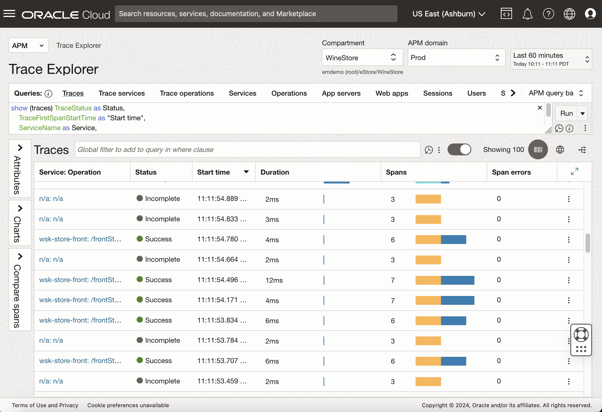

3. Ensure the **Compartment** is set to **root/eStore/WineStore** and the **APM Domain** is set to **Prod**.

4. Type the following query in the query view.

	``` bash
	<copy>
	show spans * where kind = 'SERVER' group by serviceName, operationName
	</copy>
	```
    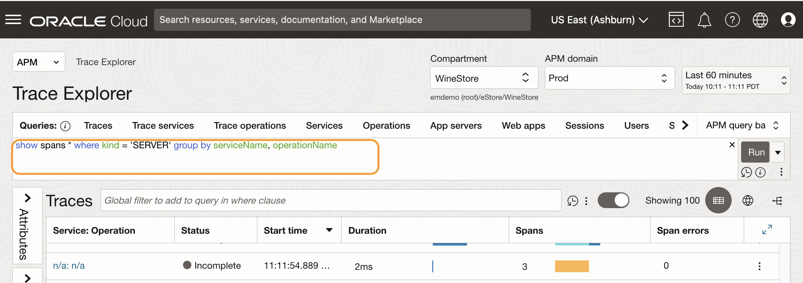

      > **Note:** * (asterisk) in the query is used as a shortcut to display expected attributes. Optionally, you can enhance the query with more refined column titles: 
	     ***show spans OperationName as "Request name", avg(ApdexScore) as Apdex,count(\*) as Count, percent\_of\_items() as "% of Total Count", avg(SpanDuration) as "Avg Duration", sum(errorCount) as Errors where Kind='SERVER' group by OperationName,ServiceName order by count(\*) desc***
	   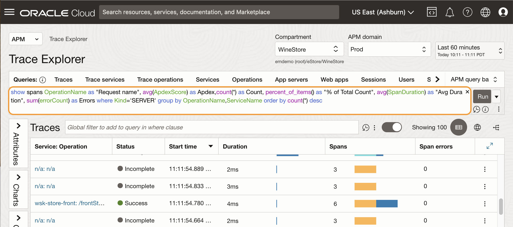

5. Select and copy the text from the Query view, either by the CTRL+C or by right-clicking and selecting the **Copy** option from the context menu.

    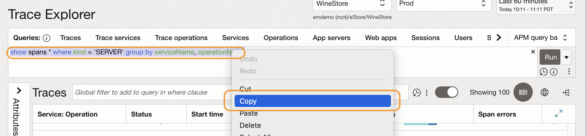

## Task 2: Add a widget to a custom dashboard

1. From the **APM** menu at the top left corner, select **Dashboards**
    
2. This will open the **Dashboards** page.
	
3.	In the Dashboards page, expand the tree view **root/LiveLabs-Compartments/LiveLabs** and locate your assigned compartment in the LiveLabs session.
    
4.	Click **Create Dashboard**
    
5.	New dashboard editing page opens. Enter the name of the dashboard under **About** tab on the right side of the screen. For example, **My new dashboard**. Then select the **Widgets** tab.
    
6.	Type down **Trace** in the filter window. 
    
7.	Drag and drop the **Trace Table** widget to the center screen
    

8.	The Trace Table widget is created on the screen. In the **Compartment** filter, select **root/eStore/WineStore**.
    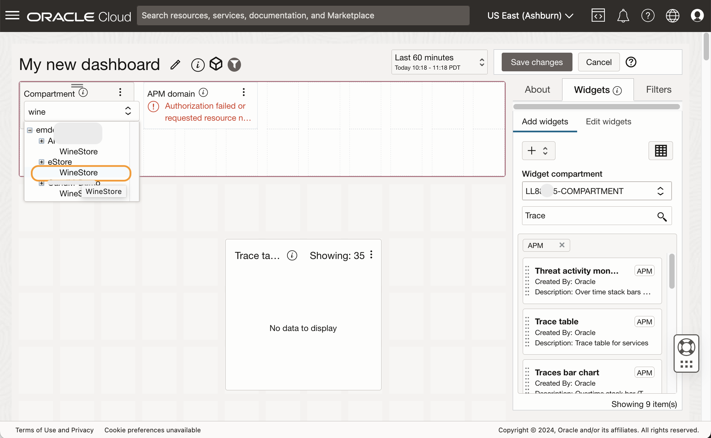
9.	In the **APM Domain** filter, ensure **Prod** is selected
    
10.	Resize the Trace Table widget window by click-and-drag the edge of the window to make it larger.
    

## Task 3: Customize the Trace Table widget	

At present, the widget displays the default query. You can change the query depending on your desired data requirements.

1. In the **Widgets** tab, Click **Edit Widgets**.  
    
2. Expand the **Trace Table** by clicking the **>** icon.
    
3.	Under **Configured Widget input** section, click a **pencil icon** showing next to the Trace Table Query. 
    
4. The **Configure Trace Table Query Input** window opens. Replace the text with the query from the Trace Explorer, then click **Save Changes**. Note that the query used in this example is the enhanced version.

	``` bash
	<copy>
	show spans OperationName as "Request name", avg(ApdexScore) as Apdex,count(*) as Count, percent_of_items() as "% of Total Count", avg(SpanDuration) as "Avg Duration", sum(errorCount) as Errors where Kind='SERVER' group by OperationName,ServiceName order by count(*) desc
	</copy>
	```

    
5. Confirm the Trace Table widget now shows the data from the copied query. 
    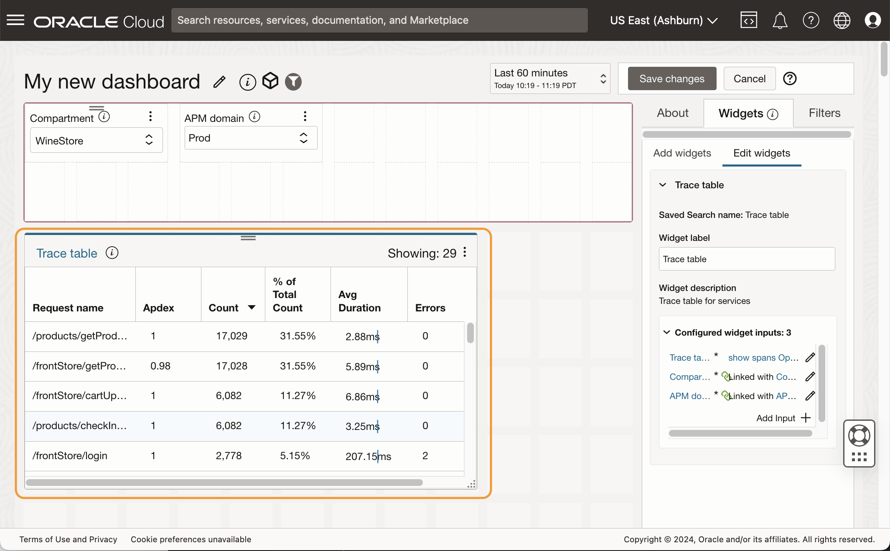

6. In the **Widgets** tab, change the **Widget label** from Trace Table to **Server Requests**. Verify that the widget title is updated to Server Requests.
    
## Task 4: Add a filter to the widget

1. Next let's add a filter based on service names so that you can narrow down the data and focus on a specified service. Click **Filters** tab.
    
2. In the search field, type **spans**. You will see the **Spans Dimension Filter** in the list.
    	
3. Drag the filter to the **Filter** pane at the upper side of the screen. This will add a filter to the dashboard.
    	

4.	**Configure Dimension Name input** window opens. Click **Enter a Value** field and type **servicename**. Select **ServiceName** from the pull-down menu. Click **Save changes**.
    	

5.	In the **Filters** tab, in the **Filter label** field, change the filter name to **Service Name**. Confirm that the name is also changed in the filter.
    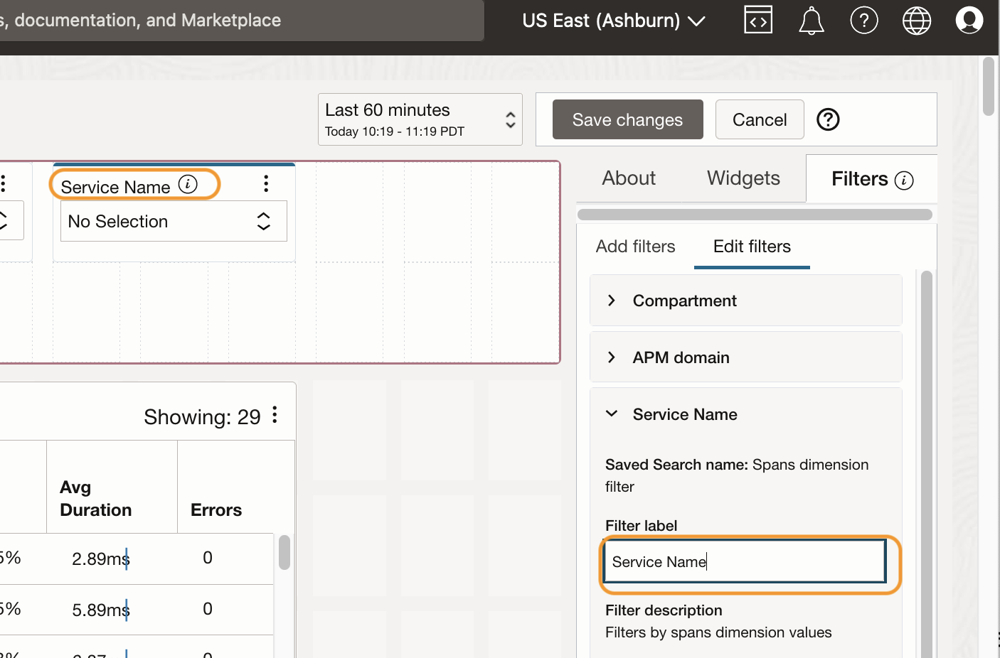	
6.	Click **Widgets** tab. Then click **Edit Widgets**.
    	
7.	Expand **Server Requests** and click **Add Input**.
    	
8.	In **Configure input for Server Requests**, in **Select an Existing filter** field, select **Service Name**. Note that the **Parameter Name** field is updated and displays **ServiceName** as a value. Click **Save changes**.
    	
9.	Now the **Service Name** filter is connected to the widget. Click **About** tab, and make sure your assigned compartment is selected. This is where the dashboard will be saved. Click **Save changes**.
    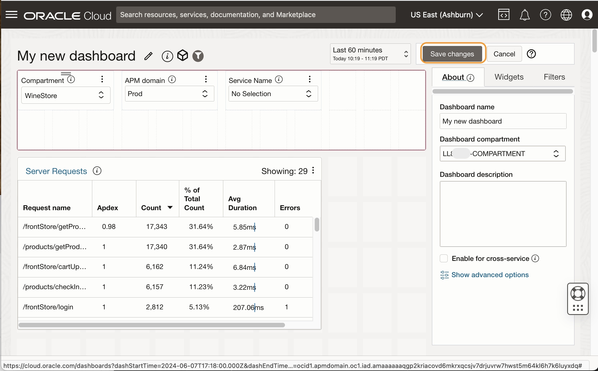
10.	This will open the new dashboard you just saved. Ensure the **Compartment** is set to **root/eStore/WineStore** and the **APM Domain** is set to **Prod**. 
    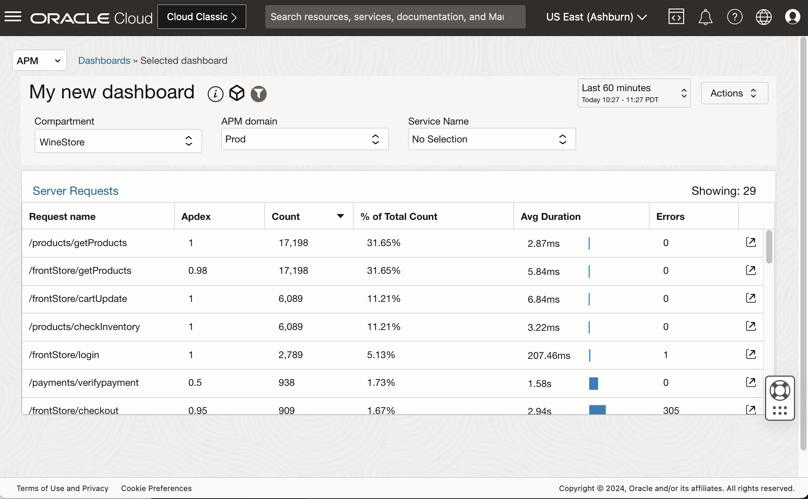
11.  Verify that the data selections dynamically change as you select different service names from the **Service Name** filter.
    
	


## Task 5: Add a custom widget

 Next, we will import a preconfigured custom widget with a wide range of visualization options designed to accept customizable TQL expressions.


1. Download the custom widget to your computer, from the URL below:
	
	``` bash
	<copy>
	http://www.oracle.com/webfolder/technetwork/tutorials/sample_JSONs/custom_widgets_import.zip
	</copy>
	```
      > **Note:** For more detail about the custom trace data widget, see the APM blog **[Customize and display trace data in Application Performance Monitoring dashboards using widgets](https://blogs.oracle.com/observability/post/apm-custom-dashboards)**.

2. Unzip the zip file and locate the **custom\_widgets\_import.json** file.
	

3. Click **Dashboards** link from the breadcrumb. 
	

4. Select the compartment assigned to you in the LiveLabs session.
	

5. Click **Import Dashboards**.
	
6. Select the **custom\_widgets\_import.json** file downloaded in the prior steps.
	
7. **Import Dashboards** window opens. Select **Specify a component for all saved searches**. Ensure the assigned compartment is selected, and click **Import**.
	
8. The **Custom widget import** dashboard is imported to the compartment.
	


      > **Note:** Once the dashboard is imported into the compartment, the following eight widgets will be available when creating or editing dashboards in that compartment.
	   * **CTDW Line chart** - Visualize a set of values over time as lines. Use the “first X rows” TQL clause to control the max number of lines
	   * **CTDW Compare metrics** - This chart accepts two independent TQLs, each returning one data series. It can be used to compare two metrics over time.
	   * **CTDW Bar chart** - Visualize a set of values over time as a stacked bar chart.
	   * **CTDW Traces over time** - Same as the above, configured specifically for Trace status presentation. It includes specific color settings for the four (Complete, Error, Incomplete, and Success) possible trace statuses.
	   * **CTDW Pie chart** - Displays a set of values as a donut. It accepts a second TQL for the value in the center of the donut.  
	   * **CTDW Apdex** - Same as the above, specifically configured for Apdex presentation, using Red, Yellow, and Green for frustrated, tolerating, and satisfied levels.
	   * **CTDW Single value** - A single value panel.
	   * **CTDW Gauge chart** - A circle gauge presentation of a single value. the max and min are provided by the TQL. These can be fixed values (as demonstrated in the default TQL) or calculated (e.g.: max(spanDuration) and min (spanDuration)). The widget has two parameters that can be used to set thresholds.

9. Locate the custom dashboard, **My new dashboard**, you created, right-click the three dots icon at the end of the row, then select **Edit**.
	
10. In the **My new dashboard** editing page, select **Widgets** tab. 
	
11. Type **ctdw** to filter the widgets. Verify the **CTDW Apdex** widget appears on the top.
	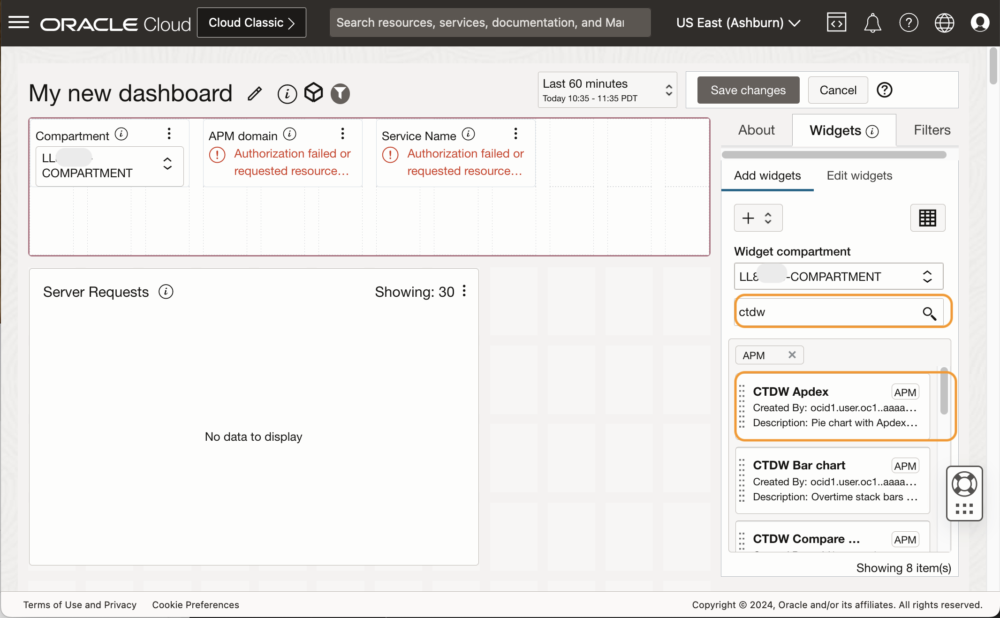

 > **Note:** You can resize the Server Requests widget to make a room for a new widget in the dashboard screen.

12. Select **CTDW Apdex**, drag and drop it into the main pane.
	


13. **CTDW Apdex** widget is added to the dashboard. Click **Edit widgets**. 
	
      > **Note:** You can change the widget layout by pressing and holding the two bars icon of a widget and dragging and dropping to the desired location. 	

14. In the **Widgets** tab, expand **CTDW Apdex**, then in the **Widget label** field, change the label from CTDW Apdex to **Apdex**. Note that the Widget title also changes to Apdex.
	
	

15. In the **Configured Widget inputs** section, locate the first query **Show traces count(apdexLevel)..**. Click the pencil icon next to the query to edit this query.
	


16. In the **Configure Trace query input for Apdex** window, replace the value with the following query. Click **Save changes**.

	``` bash
	<copy>
	show spans count(apdexLevel) as value, apdexLevel as series where apdexLevel is not omitted and kind='SERVER' group by apdexLevel order by min(apdexScore) asc
	</copy>
	```
	


17. In the **Configured Widget inputs** section, locate the second query, **Show traces avg(apdexScore)..**. Click the pencil icon next to the query to edit this query.
	
18. In the **Configure Trace query input for Apdex** window, replace the value with the following query. Click **Save changes**.

	``` bash
	<copy>
	show spans avg(apdexScore) as value where apdexScore is not omitted and kind='SERVER'
	</copy>
	```
	

19. If closed, expand the **Apdex** section, then click **Add Input**.
	
20. **Configure input for CTDW Apdex** window opens. In the **Select an existing filter** field, select **Service name**. The parameter name is **ServiceName**. Click **Save changes**.
	
21. Set the **Compartment** to **root/eStore/WineStore** and the **APM Domain** to **Prod**. Ensure the data is populated in the widgets. Click **Save Changes**.
	
22. Dashboard is updated with an Apdex widget. 
	
23. Select different service names from the **Service Name** filter to verify the data selection changes for both widgets.
	
	


## Task 6: Add a custom widget using the Trace Data Widget Builder

 You can also create a widget based on the trace query. In this task, you will build a bubble chart widget, using Trace Data widget builder functionality. With this feature, you can transfer trace queries by copying and pasting from the Trace Explorer UI to the dashboard creation page.By saving the widget with a few additional configurations, your custom APM dashboard is ready within minutes. 
 

1. Open **Trace Explorer** from **Navigation Menu** > **Observability and Management** > **Trace Explorer** under **Application Performance Monitoring**.
    
2. Type the following query in the query view, and hit **Run**.

	``` bash
	<copy>
	cluster by show spans spanduration first 1000 rows
	</copy>
	```

3. The results are displayed in the table view. The query executed the Cluster-by command, which organized data into clusters based on the span-duration metric. These clusters were generated according to the range of values, with additional columns such as count and percentage added to each cluster. Outliers were identified within the clusters.

    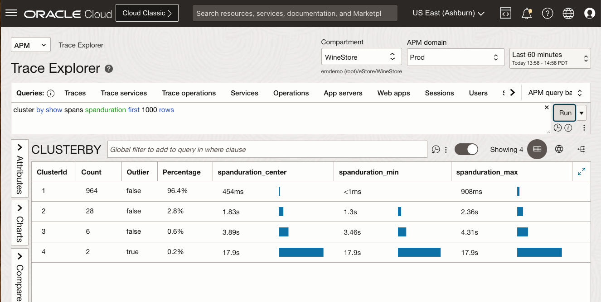

 > **Note:** You can use Cluster By command in TQL to create clusters from the traces and spans, and identify the outlieres. For more information, see **[Cluster Trace data]( https://docs.oracle.com/en-us/iaas/application-performance-monitoring/doc/work-queries-cluster.html#GUID-93E98932-ADB4-4A8C-9405-229C10A75E66)**.


4. Try an enhanced query that uses the Cluster-by command. Type the following query in the query view, and hit **Run**. The query result represents clusters of the top-server requests for a domain.

	``` bash
	<copy>
	cluster by show spans SpanDuration as Duration, ServiceName, OperationName as ServerRequest where kind='SERVER' and (ServiceName, OperationName) in (show spans serviceName,operationName where kind='SERVER'   group by serviceName,operationName order by sum(SpanDuration) first 8 rows) first 999999 rows
	</copy>
	```
    

	Next, you will bring this query to the dashboard creation page, and create a widget based on it.

5. From the menu, select **APM** > **Dashboards**.

    

6. Select the compartment assigned to you in the LiveLabs session.
	
7. Locate the custom dashboard, **My new dashboard**, you created, right-click the three dots icon at the end of the row, then select **Edit**.
	
8. In the **My new dashboard** editing page, from the **Compartment** filter, type **wine** to the select **root/eStore/WineStore**. Ensure the **APM Domain** is set to **Prod**. 
	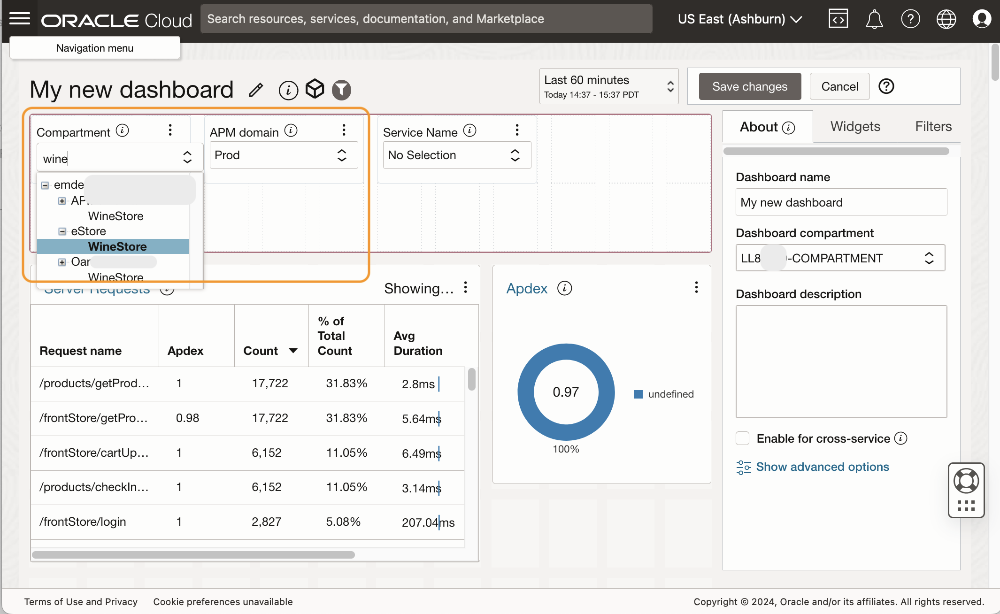
9. From the **Widgets** tab, select **Add Widgets**. Click **+** icon, and select **Create query-based widget** from the pull-down menu.
	
10. From the **Data source**, select **Traces**.
	
11. Copy the following query and paste it in the **Query** view. Hit **Run**.

	``` bash
	<copy>
	cluster by show spans SpanDuration as Duration, ServiceName, OperationName as ServerRequest where kind='SERVER' and (ServiceName, OperationName) in (show spans serviceName,operationName where kind='SERVER'   group by serviceName,operationName order by sum(SpanDuration) first 8 rows) first 999999 rows
	</copy>
	```

	
12. Verify the data populated in the table views. Click **Visualization** tab, select **Bubble Chart** from the **Chart Type** pull-down menu.
	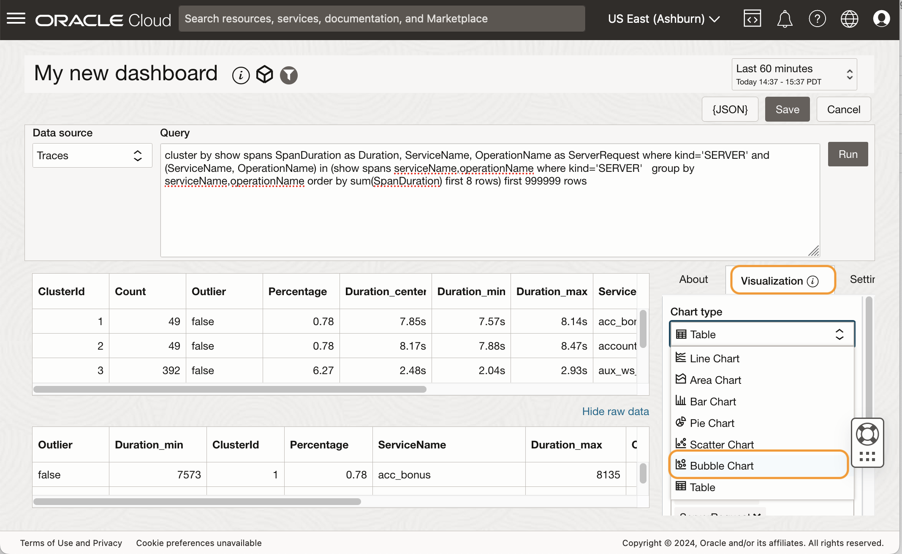
13. In the **Visualization** tab, set the values of the fields as follows.

	* Chart type: **Bubble Chart**
	* X axis: **Duration_center**
	* Y axis: **Percentage**
	* Size: **Count**
	* Color by: **Server Request**
	* X axis title: **Duration (ms)**
	* Y axis title: **Percentage**
	* Legend: **Right**


	
14. Click the **About** tab, set the values of the fields as follows.

	* Name: **ServerRequest clustered by duration**
	* Compartment: **Select your lab compartment**
	* Description: **ServerRequest (operationName where kind=SERVER) clustered by duration.**

	Click **Save** to save the widget. 
	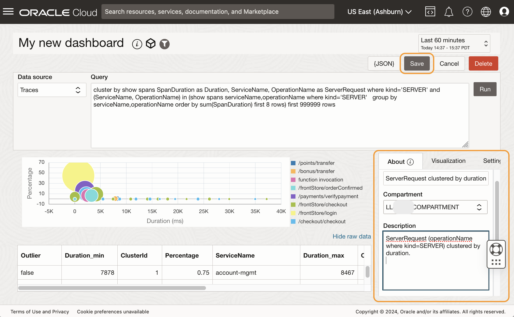

15. Click **Save Changes** to save your dashboard. 

	

16. Verify that a new widget is saved in the dashboard. The chart represents the top-server requests of the selected APM domain. Clusters are displayed in bubble objects with different sizes.
	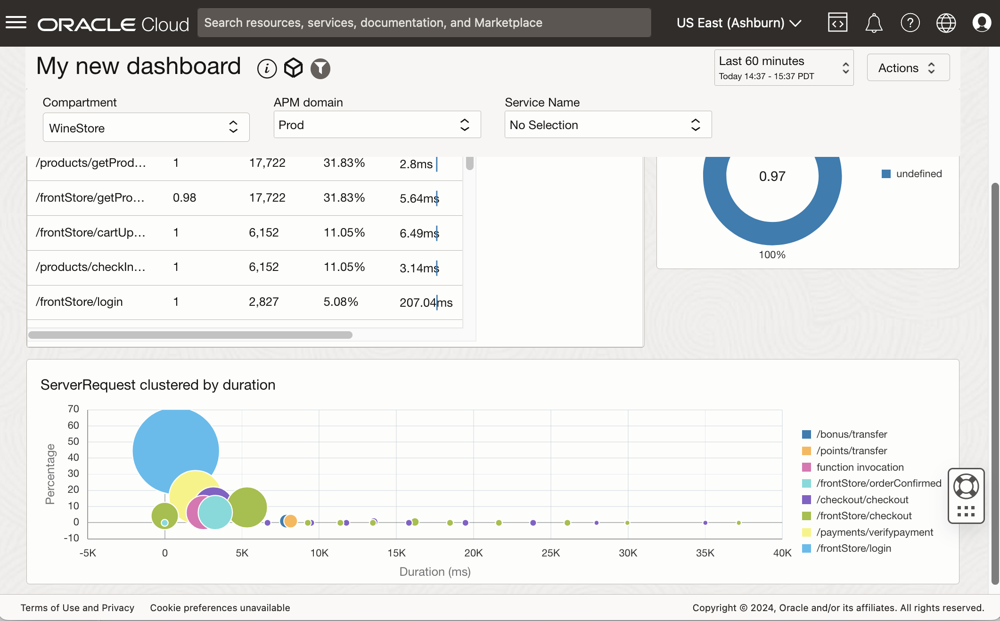
17. Hover mouse cursol on bubble objects to view the cluster information.  
	

## Acknowledgements

* **Author** - Yutaka Takatsu, Product Manager, Enterprise and Cloud Manageability
- **Contributors** - Steven Lemme, Senior Principal Product Manager,  
Anand Prabhu, Sr. Member of Technical Staff,  
Avi Huber, Vice President, Product Management
* **Last Updated By/Date** - Yutaka Takatsu, June 2024
