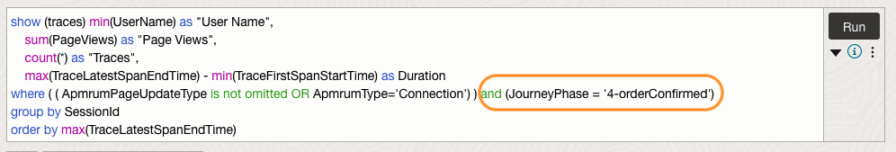
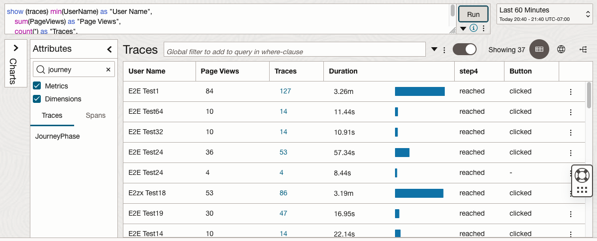

# Construct complex queries

## Introduction

The **Trace Explorer Query Language (TQL)** is used to retrieve and analyze the tracing data. TQL follows a SQL-like, purpose-built for tracing data, and syntax. It makes use of clauses to retrieve, aggregate, filter, and perform operations on trace and span attributes (dimensions and metrics). Pre-created TQL queries are available in the query bar for commonly used searches. These can be used as-is or as a starting point for more specific queries.
In this lab, you will learn how to create such queries by following the below examples.
 
In this example, we demonstrate how to gain insight about End User sessions in an e-commerce application (optional: you can use the demo application here: http://apm.omcdemo.net. Login using any name/password to see your own session in the trace data)

Estimated time: 15 minutes

### Objectives

* Understand the syntax formatting in TQL
* Learn how to construct complex queries based on a basic query

### Prerequisites

* Completion of the preceding labs in this workshop

## Task 1: Create a basic query

1. In the OCI console, from **Navigation Menu** > **Observability and Management** > **Trace Explorer** under **Application Performance Monitoring**

2. **Trace Explorer** opens in the screen.
    

3. Ensure the **Compartment** is set to **root/eStore/WineStore** and the **APM Domain** is set to **Prod**.
4. Click **Sessions** from the Quick bar.
    
5. Verify the query that is loaded into the **Query** view and the query result displayed in the **Sessions** tab.
    
The query used above is a quick pick for a “session”, showing end-users that were active for the selected time range. The query provides a set of fields that covers many common use cases. For learning purposes, in the next step, we will make the query more basic to start with and enhance it to more complex queries.
6. Type the text below it into the **Query** view, then click **Run**.

	``` bash
	<copy>
	show (traces) * group by sessionId
	</copy>
	```

    

      > **Note:** A condensed TQL guide, plus examples, is available in-page by selecting the **Infomation** button under the **Run** button.     


7. Verify the result in the **Traces** view. The query returns the traces categorized by session for the specified timeframe. It provides basic information with an overview of the traces that you can further drill down for more details.  
    
## Task 2: Add more data to the query

The query used in the previous task provided some basic information, however, you may have use cases that desire to add more information. This section explores some options to enrich the query with more fields. To begin with, let’s insert another column that shows a username in the query results.

1. Ensure you have the query below in the **Query** view.

	``` bash
	<copy>
	show (traces) * group by sessionId
	</copy>
	```

2. Add a new column for a user name, by inserting **min(UserName) as "User Name",**  to the query. Your query should look like the one below.

	``` bash
	<copy>
	show (traces) min(UserName) as "User Name",  * group by sessionId
	</copy>
	```
    

3. Add a **HAVING** clause, **having min(UserName) is not omitted** to restrict the selection to the query. Your query should look like the one below.

	``` bash
	<copy>
	show (traces) min(UserName) as "User Name", * group by sessionId
    having min(UserName) is not omitted
	</copy>
	```
	Explanations of the syntax used in the query:
	* **min(UserName) as “User Name”**: “min” function is used for the username, which takes the first username in alphabetical order, in case multiple usernames were used in a single session.
	* **“*” (asterisk)**:  Used in a group by or non-group queries as a shortcut to display expected attributes 
	* **having min(UserName) is not omitted**: The having clause that excludes the spans without a username is added to filter out the traces when a user did not log in at all.

4. Click **Run**. Verify that a new column **User Name** is added and ensure that each row contains a value in that column. 

    

5. In some cases, you may have multiple applications touched in a single session. You can use the same syntax to cover this use case, by replacing the variable **UserName** with **webApplicationName**, and specifying the display name as **“Web App”**. Your query should look like the one below.

	``` bash
	<copy>
	show (traces) min(webApplicationName) as "Web App", * group by sessionId
	having min(webApplicationName) is not omitted
	</copy>
	```

6. Click **Run** and verify the results in the **Traces** view.

    

Often the business cases require some insight into the distribution of the web applications used in the sessions. To cover this requirement, you can use the **unique_values** function and show the unique values of the dimension in the result. 

7. Replace the first min function in the query, with the **unique_values** function.  Your query should look like the one below. 

	``` bash
	<copy>
	show (traces) unique_values(webApplicationName) as "Web App",*
  	group by sessionId
  	having min(webApplicationName) is not omitted
	</copy>
	```

8. Click **Run** to verify the results in the **Traces** View. Ensure that the **Web App** column displays the values with bars, which visually represent the distribution of the Web Apps.

    

## Task 3: Add a condition to the query

Queries can be also modified by adding a filter, to narrow down the traces to meet the specified condition. As a result, it increases the visibility of a particular condition that is of interest. In this task, we will explore those options. 

1. We will start off with a slightly simplified version of the original Session data. Type the text below it into the Query view. 

	``` bash
	<copy>
	show (traces) min(UserName) as "User Name",
		sum(PageViews) as "Page Views",
		count(*) as "Traces",
		max(TraceLatestSpanEndTime) - min(TraceFirstSpanStartTime) as Duration
	where ( ApmrumPageUpdateType is not omitted OR ApmrumType='Connection') 
	group by SessionId
	order by max(TraceLatestSpanEndTime)
	</copy>
	```

2. Click **Run** to see the results. The query returns the following columns:
* **User Name**: A username used in the session
* **Page Views**: Total number of page views in the session
* **Traces**: Numbers of traces per username
* **Duration**: Duration of the session, measured as the time between the **first span start time** and the **last span end time**

    

In the web-based shopping cart application that is monitored by APM, users are expected to run a transaction having a series of steps to complete the purchase. In this environment, the buying process is covered through Journey data. The customer journey steps are defined as the following.

	* 0-search
	* 1-logged-in
	* 2-addToCart
	* 3-checkedOut
	* 4-orderConfirmed

At present, the query retrieves all session data regardless of whether the user completed the transaction or aborted it. 

The query can be adapted by adding a **WHERE** clause that limits the sessions to only those sessions that did generate revenue or purchased a product.  To view traces that successfully completed the transaction, you can add a filter in the **WHERE** clause to select only the tracers that reached the final journey phase, **“4-orderConfirmed”**. Next, let’s proceed with adding this condition to the query. 

3. In the **Attributes** pane, in the **Search** field, type **“journey”**. This will filter the list of attributes.


4. Click **JourneyPhase**.

    


5. Select **4-orderConfirmed** and click Add to **Query**

    


6. Verify the condition **(JourneyPhase = '4-orderConfirmed')** was automatically added in the where clause.

	``` bash
	<copy>
	show (traces) min(UserName) as "User Name",
		sum(PageViews) as "Page Views",
		count(*) as "Traces",
		max(TraceLatestSpanEndTime) - min(TraceFirstSpanStartTime) as Duration
	where ( ApmrumPageUpdateType is not omitted OR ApmrumType='Connection') and (JourneyPhase = '4-orderConfirmed')
	group by SessionId
	order by max(TraceLatestSpanEndTime)
	</copy>
	```
    
7. Click **Run** and view the results. Only traces that have the **JourneyPhase** dimension set to **“4-order confirmed”** will be displayed in the **Traces** view.


    


Note that although the query displayed the traces that have reached the final journey phase, the values shown for page views, traces, and duration columns are considerably smaller compared to before adding the condition.

The reduction in values is expected because the data is now limited to only the last step of the journey, resulting in incomplete and less informative data. In the next task, we will address this problem and make a correction to the query to ensure better results.

## Task 4: Retrieve complete session data

To fix the invalidated data in the query, we can move out the condition that was added in the previous task, from the **WHERE** clause into the reporting. Also, use a **HAVING** clause to preserve the filtering of only the rows that completed the full journey.

1. Update the query by inserting the below statement right before the **WHERE** clause.


		,case when(
			sum(case when (JourneyPhase = '4-orderConfirmed') 
			then 1 else 0 end)
			)>0 then 'reached' else '0' end as step4 


	Explanations:
	* The **CASE** expression returns a value when the first condition is met.
	* The **SUM** function in the query counts the occurrences within each group. In this example, it indicates the number of cases that meet the specified condition, which is when the JourneyPhase is set to '4-orderConfirmed'.
	* A new column **“step4”** will be added
	* When the **JourneyPhase** is set to **'4-orderConfirmed'**, it returns **“reached”** in the column **“step4”**
	* When the **JourneyPhase** is NOT set to **'4-orderConfirmed'**, it returns **“0”** in the column **“step4”**

    > **Note:** Ensure to retain the comma at the beginning of the statement when inserting it into the query. The comma is necessary to maintain continuity with the preceding statement.

2. Next, insert a **HAVING** clause right before the **ORDER BY** statement.

		 having sum(case when (JourneyPhase = '4-orderConfirmed') then 1 else 0 end) >0 

	Explanations:
	* The **HAVING** statement filters the record from the group based on the specified condition.
	* In this case, the statement only includes the records where the **JourneyPhase** is set to **'4-orderConfirmed'**.
	* Removal of the **HAVING** clause results in displaying all sessions again.

3. Remove the following statement from the query.

	~~***and (JourneyPhase = '4-orderConfirmed')***~~

4. Your query should look like below. 

	``` bash
	<copy>
		show (traces) min(UserName) as "User Name",
		sum(PageViews) as "Page Views",
		count(*) as "Traces",
		max(TraceLatestSpanEndTime) - min(TraceFirstSpanStartTime) as Duration,
		case when(sum(case when (JourneyPhase = '4-orderConfirmed') then 1 else 0 end))>0 then 'reached' else '0' end as step4
	where ( ApmrumPageUpdateType is not omitted OR ApmrumType='Connection')
	group by SessionId
	having  sum(case when (JourneyPhase = '4-orderConfirmed') then 1 else 0 end) >0
	order by max(TraceLatestSpanEndTime)
	</copy>
	```

    

5. Click **Run**. Verify the result in the **Traces** view. Although returned the same set of traces, columns include complete session data. Also, there is a newly added column **“step4”** confirming the transaction is completed.
    

## Task 5:  Add more conditions verifying the user's action

In some cases, you may want to know whether a user made a click action on Web UI components, such as a button, or a link during the session. You can accomplish this by adding another condition in a case clause, having an XPath expression that references the target element. This value is captured by the APM Browser agent and stored in the **ApmrumClickElementId** dimension. The outcome will be displayed as a new column indicating the click status.

1.	Update the query by inserting the below statement right before the **WHERE** clause.

		, case when(
		sum(case when (ApmrumClickElementId='/html/body/app-root/app-prod-list/div/div[3]/div[4]/mat-card/mat-card-actions/button/span') then 1 else 0 end)
		)>0 then 'clicked' else '-' end as Button 

	Explanations:

	* The **CASE** expression returns a value when the first condition is met.
	* The **SUM** function in the query counts the occurrences within each group. In this example, it indicates the number of cases when the **ApmrumClickElementId** is set to the element **'/html/body/app-root/app-prod-list/div/div[3]/div[4]/mat-card/mat-card-actions/button/span'**, indicating the element was clicked.
	* A new column **“Button”** is added
	* If the element is clicked, it returns **“clicked”** as a value in the **Button** column
	* If not clicked, it returns **“-”** as a value in the **Button** column

2. Your query should look like below.

	``` bash
	<copy>
	show (traces) min(UserName) as "User Name",
		sum(PageViews) as "Page Views",
		count(*) as "Traces",
		max(TraceLatestSpanEndTime) - min(TraceFirstSpanStartTime) as Duration,
		case when(sum(case when (JourneyPhase = '4-orderConfirmed') then 1 else 0 end))>0 then 'reached' else '-' end as step4,
		case when(sum(case when (ApmrumClickElementId='/html/body/app-root/app-prod-list/div/div[3]/div[4]/mat-card/mat-card-actions/button/span') then 1 else 0 end))>0 then 'clicked' else '-' end as Button
	where ( ApmrumPageUpdateType is not omitted OR ApmrumType='Connection')
	group by SessionId
	having  sum(case when (JourneyPhase = '4-orderConfirmed') then 1 else 0 end) >0
	order by max(TraceLatestSpanEndTime)
	</copy>
	```
    
3. Click **Run**. Verify that a new column **Button** was added, and values are populated.
    
## Task 6: Gain insights into the time required to reach steps

With the information on the button click, you may want to get an understanding of the time that users spend while they go through the steps of the journey. Users click around and go back and forth through the funnel in some cases, so data gets more useful if it’s normalized by using the time needed to reach a step as a guideline.

1. Update the query by inserting the below statements right before the first **CASE** statement.

		min(case when(JourneyPhase = '2-addToCart') 
		then TraceLatestSpanEndTime end) - min(TraceFirstSpanStartTime) 
		as "time to addToCart",

		min(case when(JourneyPhase = '3-checkedOut') 
		then TraceLatestSpanEndTime end) - min(TraceFirstSpanStartTime) 
		as "time to checkOut", 

	Explanations:
	* The **CASE** expression returns a value when the first condition is met.
	* Adds a column **time to addToCart**, which indicates the amount of time a user spent on the website before adding a product to a cart.
	* Adds a column **time to checkOut** that measures the time elapsed before a user proceeds with the checkout process.

2. Next, modify the **ORDER BY** statement as shown below, so that the results are sorted based on the **Duration**.

		order by max(TraceLatestSpanEndTime) - min(TraceFirstSpanStartTime) desc

	Explanations:
	* An expression **max(TraceLatestSpanEndTime) - min(TraceFirstSpanStartTime)** determines the duration of the session.


3. Your query should look like below. 

	``` bash
	<copy>
	show (traces) min(UserName) as "User Name",
		sum(PageViews) as "Page Views",
		count(*) as "Traces",
		max(TraceLatestSpanEndTime) - min(TraceFirstSpanStartTime) as Duration,
		min(case when (JourneyPhase = '2-addToCart') then TraceLatestSpanEndTime  end ) - min(TraceFirstSpanStartTime) as "time to addToCart",
		min(case when (JourneyPhase = '3-checkedOut') then TraceLatestSpanEndTime  end ) - min(TraceFirstSpanStartTime) as "time to checkOut",
	case when(sum(case when (JourneyPhase = '4-orderConfirmed') then 1 else 0 end))>0 then 'reached' else '0' end as step4,
	case when(sum(case when (ApmrumClickElementId='/html/body/app-root/app-prod-list/div/div[3]/div[4]/mat-card/mat-card-actions/button/span') then 1 else 0 end))>0 then 'clicked' else '-' end as Button
	where ( ApmrumPageUpdateType is not omitted OR ApmrumType='Connection')
	group by SessionId
	having  sum(case when (JourneyPhase = '4-orderConfirmed') then 1 else 0 end) >0
	order by max(TraceLatestSpanEndTime) - min(TraceFirstSpanStartTime) desc
	</copy>
	```
    
4. Click **Run**. Verify that new columns are added, indicating how much time the user spent to reach the **“add to cart”** and **“time to check out”** steps.  Also, ensure that the results are sorted by the **Duration**.
    


## Conclusion

In this workshop, you have learned how to use various APM features to effectively identify performance issues, analyze the data, and drill down into the root cause of the problems.

APM Home page and Alarm details page allow you to detect potential issues in your application. The Monitors dashboard page enables you to examine the gathered data, while the Monitor history page and the APM Trace Explorer help you investigate the cause of the problem.

In addition, you can also create complex personalized queries, save them for reuse, and create widgets to visually represent the data within a custom dashboard.  


  For more information on APM, refer to the OCI documentation, **[Application Performance Monitoring](https://docs.oracle.com/en-us/iaas/application-performance-monitoring/index.html)**.


## Acknowledgements

* **Author** - Yutaka Takatsu, Product Manager, Enterprise and Cloud Manageability
- **Contributors** - Steven Lemme, Senior Principal Product Manager,  
Anand Prabhu, Sr. Member of Technical Staff,  
Robert Brouwer, Consulting Member of Technical Staff,  
Jurgen Leijer, Senior Product Strategy Director, Management Cloud,  
Avi Huber, Vice President, Product Management
* **Last Updated By/Date** - Yutaka Takatsu, May 2023
