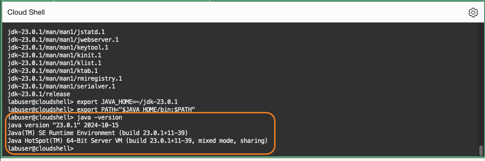
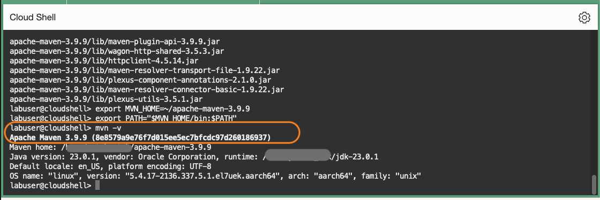
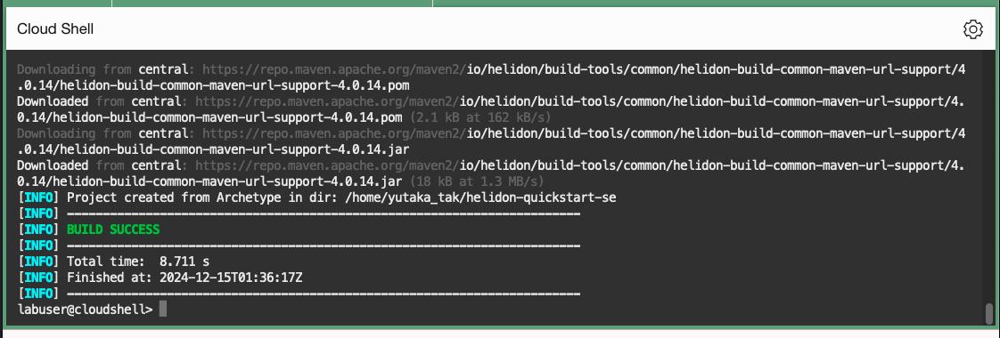
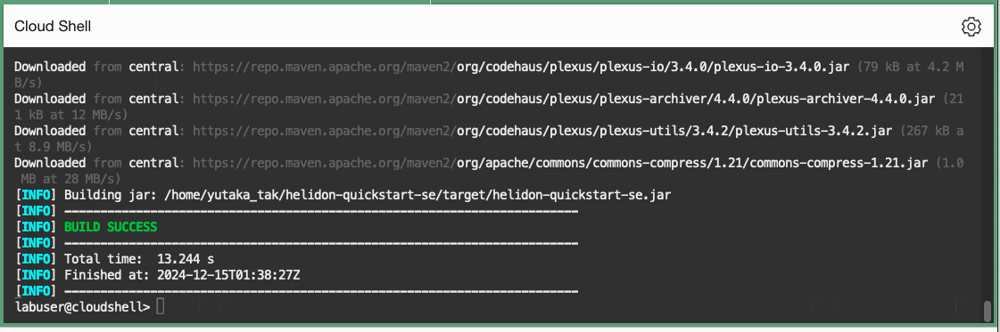
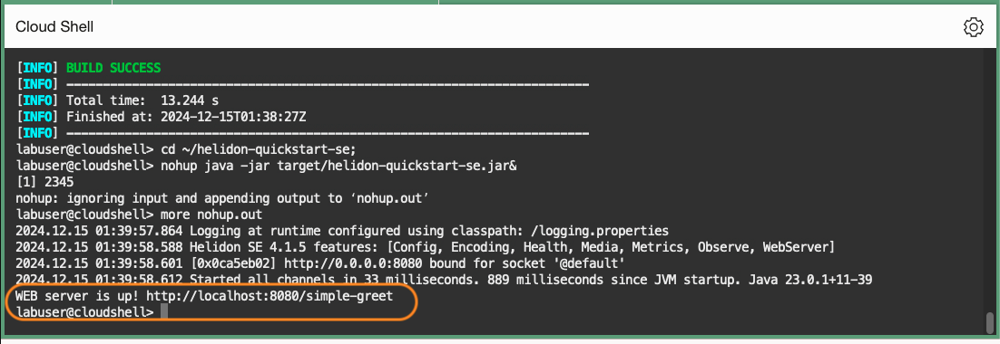
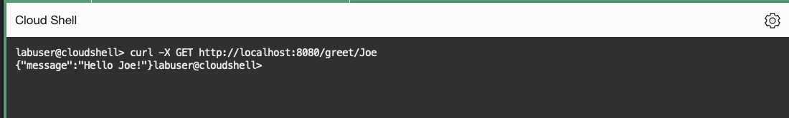

# Set up a Helidon SE application

## Introduction

In this lab, you will set up a simple Helidon SE application. You will use APM Trace Explorer to monitor the application later in this workshop.

Estimated time: 10 minutes

Watch the video below for a quick walk-through of the lab.
[Set up a Helidon SE application](videohub:1_y2og8t4n)

### Objectives

* Launch Cloud Shell
*	Verify Helidon prerequisites
*	Install Java and Maven
*	Build a simple Helidon SE application
*	Verify application


### Prerequisites

* An Oracle Free Tier, Always Free, or a Paid Cloud Account


## Task 1: Launch the Cloud Shell and install Helidon prerequisites

1. Launch the Oracle Cloud Shell from the Oracle Cloud Console by selecting the **Developer tools** icon, then select **Cloud Shell**.

  The Oracle Cloud Shell is a small virtual machine running a Bash shell that you access through the Oracle Cloud Console. It comes with a pre-authenticate Command Line Interface (CLI) pre-installed and configured so you can immediately start working in your tenancy without spending time on its installation and configuration.

 

2. Helidon 4.1.5 requires Java 21+ and Maven 3.8+. Verify the versions by running the following commands.

	``` bash
	<copy>
	java -version; mvn -v
	</copy>
	```

  	

	As of December 2024, ARM Cloud Shell has Maven 3.5.0, and Java 11. You can install required versions of Java and Maven manually to complete this workshop in the next task.

## Task 2: Install Java 23

1. Download Java 23 (JDK Development Kit 23.01 for ARM 64)
	``` bash
	<copy>
	curl -sLO https://download.oracle.com/java/23/latest/jdk-23_linux-aarch64_bin.tar.gz
	</copy>
	```
2. Unzip the file and install Java
	``` bash
	<copy>
	tar zxvf jdk-23_linux-aarch64_bin.tar.gz
	</copy>
	```
3. Add to the Path  
	``` bash
	<copy>
	export JAVA_HOME=~/jdk-23.0.1
	export PATH="$JAVA_HOME/bin:$PATH"
	</copy>
	```

4. Check the Java version to ensure it is 23.
	``` bash
	<copy>
	java -version
	</copy>
	```
	
## Task 3: Install Maven 3.9.9

1. Download Maven 3.9.9
	``` bash
	<copy>
	curl -sLO https://archive.apache.org/dist/maven/maven-3/3.9.9/binaries/apache-maven-3.9.9-bin.tar.gz
	</copy>
	```
2. Unzip the file and install Java
	``` bash
	<copy>
	tar zxvf apache-maven-3.9.9-bin.tar.gz
	</copy>
	```
3. Add to the Path  
	``` bash
	<copy>
	export MVN_HOME=~/apache-maven-3.9.9
    export PATH="$MVN_HOME/bin:$PATH"
	</copy>
	```

4. Check the maven version to ensure it is 3.9.9.
	``` bash
	<copy>
	mvn -v
	</copy>
	```

	

## Task 3:  Build a Helidon SE application

1.	From the home directory, run the Helidon Maven archetypes to generate the Maven project.
	``` bash
	<copy>
	cd ~
	mvn -U archetype:generate -DinteractiveMode=false \
    -DarchetypeGroupId=io.helidon.archetypes \
    -DarchetypeArtifactId=helidon-quickstart-se \
    -DarchetypeVersion=4.1.5 \
    -DgroupId=io.helidon.examples \
    -DartifactId=helidon-quickstart-se \
    -Dpackage=io.helidon.examples.quickstart.se
	</copy>
	```
	


2.	The archetype generates a Maven project (helidon-quickstart-se) in your current directory. Change to this directory.
	``` bash
	<copy>
	cd ~/helidon-quickstart-se
	</copy>
	```
3.	Build the application by running the command below:
	``` bash
	<copy>
	mvn clean package
	</copy>
	```
	The project builds an application jar for the example and saves all runtime dependencies in the target/libs directory.
	

4.	Start the application by running the application jar file.
	``` bash
	<copy>
  cd ~/helidon-quickstart-se;
	nohup java -jar target/helidon-quickstart-se.jar&
	</copy>
	```


5. View the output file. Ensure it shows the message: "WEB server is UP!"
	``` bash
	<copy>
	more nohup.out
	</copy>
	```
	


## Task 4: Verify the application

1.	Try the application with the curl command below.
	``` bash
	<copy>
	curl -X GET http://localhost:8080/greet/Joe
	</copy>
	```
	It should return a greeting message as in the below image.

		{"message":"Hello Joe!"}

	

>**Note:** For more information on Helidon prerequisites, application setup details, and test command examples, please see the Helidon Documentation, [Helidon QuickStart guide](https://helidon.io/docs/latest/#/se/guides/02_quickstart).


You may now **proceed to the next lab**.

## Acknowledgements

- **Author** - Yutaka Takatsu, Product Manager, Enterprise and Cloud Manageability
- **Contributors** - Steven Lemme, Senior Principal Product Manager,    
Anand Prabhu, Sr. Member of Technical Staff,  
Avi Huber, Vice President, Product Management
- **Last Updated By/Date** - Yutaka Takatsu, December 2024
