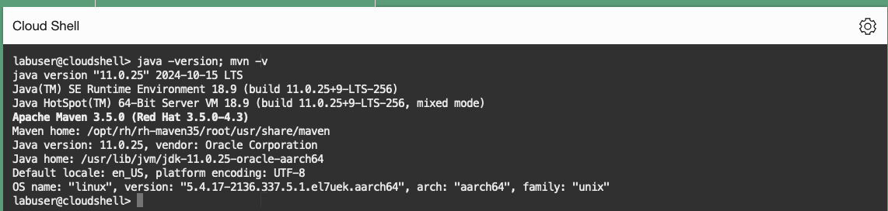
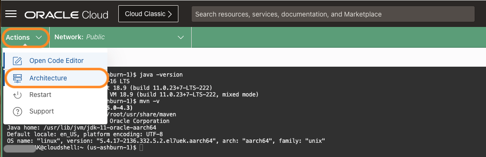
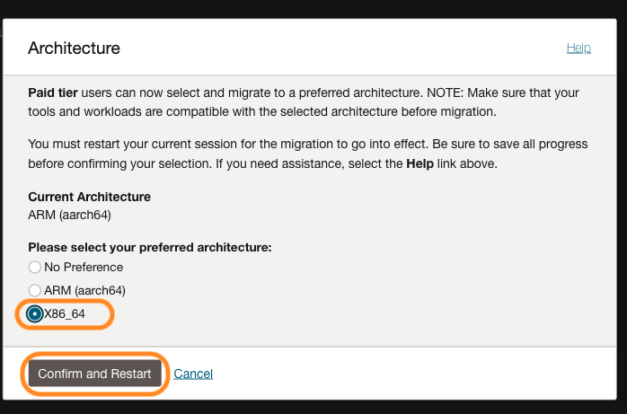
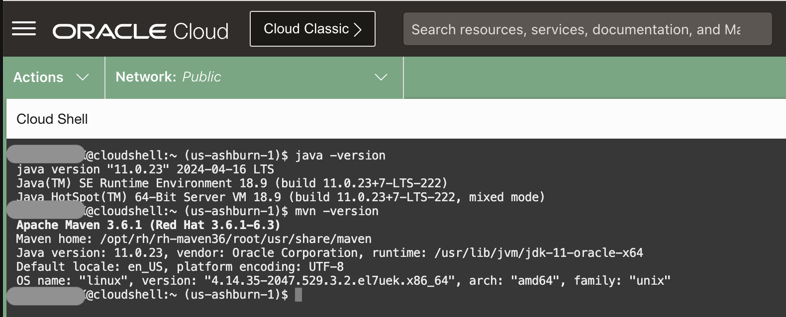
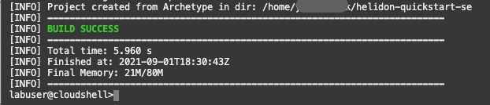
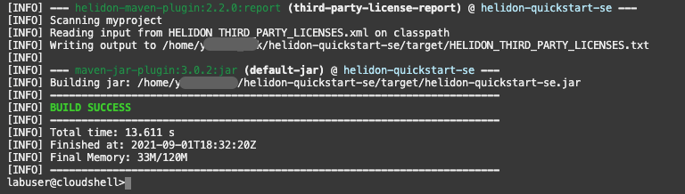
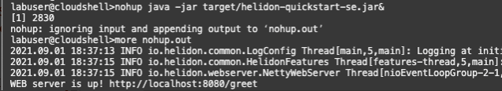
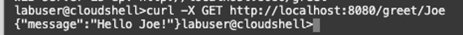

# Set up a Helidon SE application

## Introduction

In this lab, you will set up a simple Helidon SE application. You will use APM Trace Explorer to monitor the application later in this workshop.

Estimated time: 10 minutes

Watch the video below for a quick walk-through of the lab.
[Set up a Helidon SE application](videohub:1_y2og8t4n)

### Objectives

* Launch Cloud Shell
*	Verify Helidon prerequisites
*	Install Java and Maven
*	Build a simple Helidon SE application
*	Verify application


### Prerequisites

* An Oracle Free Tier, Always Free, or a Paid Cloud Account


## Task 1: Launch the Cloud Shell and verify Helidon prerequisites

1. Launch the Oracle Cloud Shell from the Oracle Cloud Console by selecting the **Developer tools** icon, then select **Cloud Shell**.

  The Oracle Cloud Shell is a small virtual machine running a Bash shell that you access through the Oracle Cloud Console. It comes with a pre-authenticate Command Line Interface (CLI) pre-installed and configured so you can immediately start working in your tenancy without spending time on its installation and configuration.

 

2. Helidon requires Java 11 (or newer) and Maven 3.6.1. Verify the versions by running the following commands.

	``` bash
	<copy>
	java -version
	</copy>
	```
	``` bash
	<copy>
	mvn -version
	</copy>
	```

  	

	If the Maven version is not 3.6.1, you can install it in the next task.

	>**Note:** Paid tier users can switch the Cloud shell architecture from the default ARM to **X64\_64**, with Maven 3.6.1 and Java 11 preinstalled. Select **Actions** from the menu, then select **Architecture**.

Select **x86_64** and click **Confirm and Restart**

Vefify the Java and Maven versions. 

You can skip the Task 2 and go to the Task 3.
	


## Task 2: Install Maven 3.6.1

As of June 2024, ARM Cloud Shell has Maven 3.5.0, and Java 11. Free tier users can install Maven 3.6.1 manually to complete this workshop.

1. Download Maven 3.6.1
	``` bash
	<copy>
	curl -sLO https://archive.apache.org/dist/maven/maven-3/3.6.1/binaries/apache-maven-3.6.1-bin.tar.gz
	</copy>
	```
2. Unzip the file
	``` bash
	<copy>
	gunzip apache-maven-3.6.1-bin.tar.gz
	</copy>
	```
3. Install Maven
	``` bash
	<copy>
	tar xvf apache-maven-3.6.1-bin.tar
	</copy>
	```
4. Add to the Path  
	``` bash
	<copy>
	export MVN_HOME=~/apache-maven-3.6.1 
    export PATH="$MVN_HOME/bin:$PATH"
	</copy>
	```
	e.g., export PATH="/home/labuser/apache-maven-3.6.1/bin:$PATH". 

5. Check the maven version to ensure it is 3.6.1.
	``` bash
	<copy>
	mvn -v
	</copy>
	```

## Task 3:  Build a Helidon SE application

1.	From the home directory, run the Helidon Maven archetypes to generate the Maven project.
	``` bash
	<copy>
	cd ~
	mvn -U archetype:generate -DinteractiveMode=false \
    -DarchetypeGroupId=io.helidon.archetypes \
    -DarchetypeArtifactId=helidon-quickstart-se \
    -DarchetypeVersion=2.3.2 \
    -DgroupId=io.helidon.examples \
    -DartifactId=helidon-quickstart-se \
    -Dpackage=io.helidon.examples.quickstart.se
	</copy>
	```
	


2.	The archetype generates a Maven project (helidon-quickstart-se) in your current directory. Change to this directory.
	``` bash
	<copy>
	cd ~/helidon-quickstart-se
	</copy>
	```
3.	Build the application by running the command below:
	``` bash
	<copy>
	mvn package
	</copy>
	```
	The project builds an application jar for the example and saves all runtime dependencies in the target/libs directory.
	

4.	Start the application by running the application jar file.
	``` bash
	<copy>
  cd ~/helidon-quickstart-se;
	nohup java -jar target/helidon-quickstart-se.jar&
	</copy>
	```


5. View the output file. Ensure it shows the message: "WEB server is UP!"
	``` bash
	<copy>
	more nohup.out
	</copy>
	```
	


## Task 4: Verify the application

1.	Try the application with the curl command below.
	``` bash
	<copy>
	curl -X GET http://localhost:8080/greet/Joe
	</copy>
	```
	It should return a greeting message as in the below image.

		{"message":"Hello Joe!"}

	

>**Note:** For more information on Helidon prerequisites, application setup details, and test command examples, please see the Helidon Documentation, [Helidon QuickStart guide](https://helidon.io/docs/latest/#/se/guides/02_quickstart).


You may now **proceed to the next lab**.

## Acknowledgements

- **Author** - Yutaka Takatsu, Product Manager, Enterprise and Cloud Manageability
- **Contributors** - Steven Lemme, Senior Principal Product Manager,    
Anand Prabhu, Sr. Member of Technical Staff,  
Avi Huber, Vice President, Product Management
- **Last Updated By/Date** - Yutaka Takatsu, July 2024
