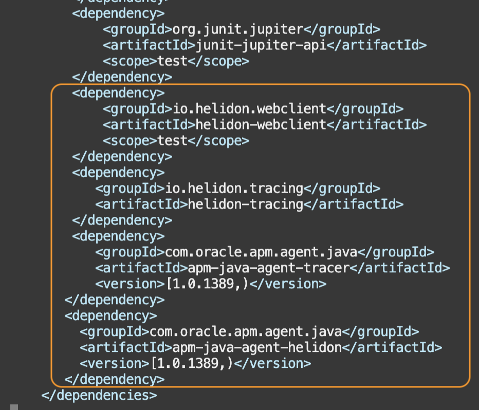
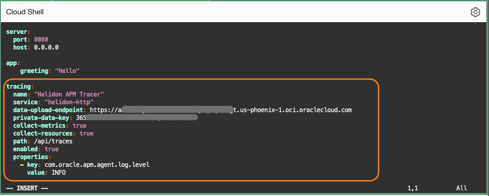
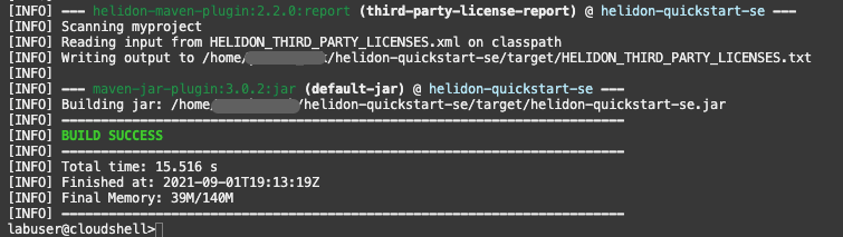
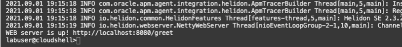
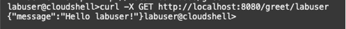
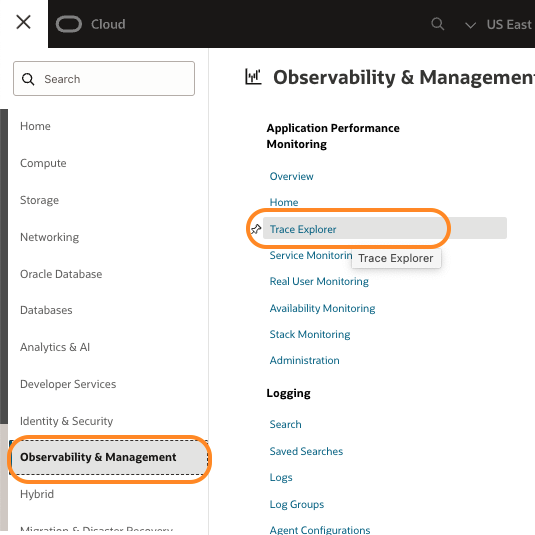
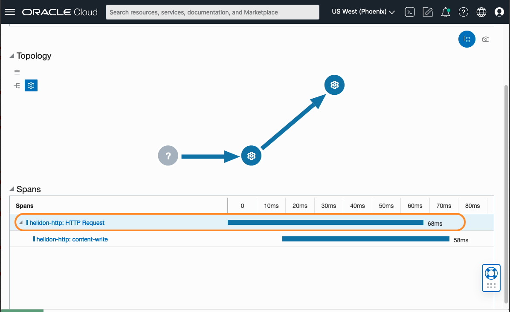
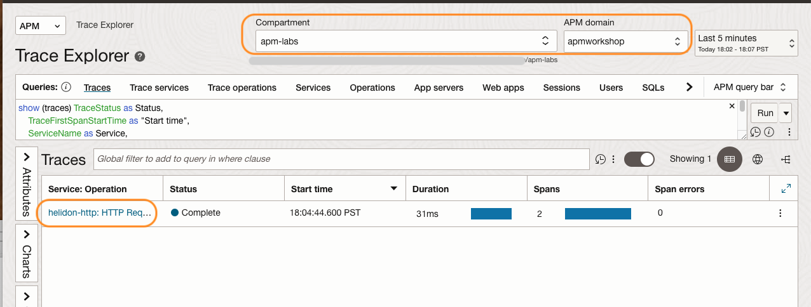

# Monitor traces and spans of the application with APM Trace Explorer

## Introduction

In this lab, you will configure APM Tracer to monitor the Helidon SE application, which you created in Lab2.

Estimated time: 15 minutes

### Objectives

* Modify the pom.xml file in the Helidon application
* Modify application.yaml file
*	Modify Main.java file
*	Rebuild application with APM Tracer configurations
*	View traces in the APM Trace Explorer


### Prerequisites

* This lab requires the completion of Lab 1 and Lab 2

## Task 1:Modify pom.xml file in the Helidon application

1. Launch OCI Cloud Shell if not opened already.

2. Ensure the Java version in the path is 11.0.7.
	``` bash
	<copy>
	java -version
	</copy>
	```

	if you completed Lab1 in this workshop, but the Java version returned from the command is not 11.0.7, you may need to reset the JAVA_HOME environment variable. Run the following commands.

	``` bash
	<copy>
	export JAVA_HOME=~/graalvm-ce-java11-20.1.0
	export PATH="$JAVA_HOME/bin:$PATH"
	</copy>
	```


3. Change to **helidon-quickstart-se** directory, and open the **pom.xml** file with an editor tool (e.g., vi editor)
	``` bash
	<copy>
	vi ~/helidon-quickstart-se/pom.xml
	</copy>
	```

	  >**Note:** If you are using the vi editor, type **i** to enter Insert mode, and make the text editable. Use allow keys to navigate the text and make changes to where you set the cursor. To save a file, press the Esc key, then type **:wq** to write and quit the file. If you do not wish a change, press Esc then type **:q!** to discard your changes. Please refer to the editor references for more usage or how to use other editors.


4.	At the end of the dependencies section, find a line **&lt;/dependencies&gt;** and add the following before that line:

			    <dependency>
			         <groupId>io.helidon.tracing</groupId>
			             <artifactId>helidon-tracing</artifactId>
			    </dependency>
			    <dependency>
			        <groupId>com.oracle.apm.agent.java</groupId>
			        <artifactId>apm-java-agent-tracer</artifactId>
			        <version>[1.5.2118,)</version>
			    </dependency>
			    <dependency>
			        <groupId>com.oracle.apm.agent.java</groupId>
			        <artifactId>apm-java-agent-helidon</artifactId>
			        <version>[1.0.1389,)</version>
			    </dependency>

	

## Task 2: Modify application.yaml file

1.	Change to **src/main/resources** directory, then open the **application.yaml** file with an editor tool.

	``` bash
	<copy>
	vi ~/helidon-quickstart-se/src/main/resources/application.yaml
	</copy>
	```
	Add the following properties to the file. Replace **&lt;data upload endpoint&gt;** and **&lt;private data key&gt;** with the values collected from the Oracle Cloud console in the earlier steps. For more details, see [Use APM Tracer for Helidon](https://docs.oracle.com/en-us/iaas/application-performance-monitoring/doc/use-apm-tracer-helidon.html).  


		tracing:
		  name: "Helidon APM Tracer"
		  service: "helidon-http"
		  data-upload-endpoint: <data upload endpoint of your OCI domain>
		  private-data-key: <private data key of your OCI domain>
		  collect-metrics: true
		  collect-resources: true
		  properties:
		    - key: com.oracle.apm.agent.log.level
		      value: INFO

	>Suggested Tips:
	- Use your mouse to select the text above, and manually copy and paste it into a text file.
	- Replace the endpoint and the private key, then copy the modified text and insert it into the yaml file.
	- Auto copy is not provided as it may break the indentation.
	- Make sure to keep the syntax of 2 space indentation.
	- Refer to the screenshot image below to see how it should look after the file is modified.
	


## Task 3: Modify Main.java file

1.	Open **Main.java** with any editor.
	``` bash
  <copy>
  vi ~/helidon-quickstart-se/src/main/java/io/helidon/examples/quickstart/se/Main.java
  </copy>
  ```

2. Add the following to configure the tracer with the Helidon application.

 a.	Add the import statement below:
    ``` bash
    <copy>
		import io.helidon.tracing.TracerBuilder;
		</copy>
		```
 b.	In the startServer method, find a line **.addMediaSupport(JsonpSupport.create())** (Line 47). Add the following above that line:
		 ``` bash
		 <copy>
		  .tracer(TracerBuilder.create(config.get("tracing")).build())
		 </copy>
		 ```
Refer to the sample image below:

	


## Task 4: Rebuild the application

1.	Close the previous session if running.  
	``` bash
	<copy>
	fuser -k 8080/tcp
	</copy>
	```

2.	Change to the **helidon-quickstart-se** directory where pom.xml is, then run the mvn package command. This will rebuild the package with the changes made in the configuration files.

	``` bash
	<copy>
	cd ~/helidon-quickstart-se/
	</copy>
	```
	``` bash
	<copy>
	mvn package
	</copy>
	```

	


	  >**Note:** If your build fails with an error, run the java -version and make sure it points to JDK 11. If the command does not return OpenJDK version"11.0.7", go back to task 1 in this Lab and re-run the export commands to set the environment variable. This can happen when a session is interrupted during the lab exercise. Confirm the java version returns 11.0.7 and re-execute the mvn package command.
		

3.	Start the application by running the application jar file.
	``` bash
	<copy>
	nohup java -jar target/helidon-quickstart-se.jar&
	</copy>
	```
4.	Review the status in the nohup.out file.
	``` bash
	<copy>
	more nohup.out
	</copy>
	```
	

5.	Type the following command to try the application.

	``` bash
	<copy>
	curl -X GET http://localhost:8080/greet/labuser
	</copy>
	```
	Ensure it returns the greeting response as shown in the image below.
	

## Task 5: Verify traces in APM Trace Explorer

1.	From the OCI menu, select **Observability & Management** then **Trace Explorer**
	

2.	In the **Trace Explorer** page >  **Compartment**, select **apmworkshop** from the **Compartment** and the **APM Domain** fields.
3.	Under **Traces**, find a trace from the Helidon application.
4.	Click the service name: **helidon-http: HTTP Request**.
	
5.	In the **Trace Details** page, review the trace in the **Topology** view, and each span duration in the **Spans** view.
6.	Click the span: **helidon-http: HTTP Request**.
	
7.	Examine the span parameters in the **Span Details** view.
	


You may now **proceed to the next lab**.

## Acknowledgements

- **Author** - Yutaka Takatsu, Product Manager, Enterprise and Cloud Manageability
- **Contributors** - Steven Lemme, Senior Principal Product Manager,	
Anand Prabhu, Sr. Member of Technical Staff,  
Avi Huber, Vice President, Product Management
- **Last Updated By/Date** - Yutaka Takatsu, August 2022
