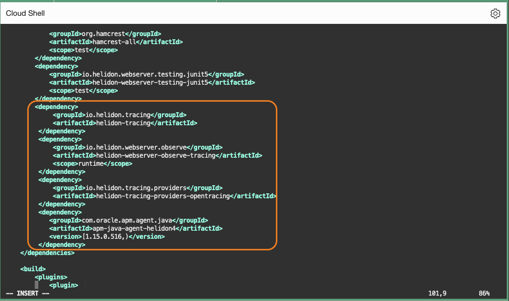
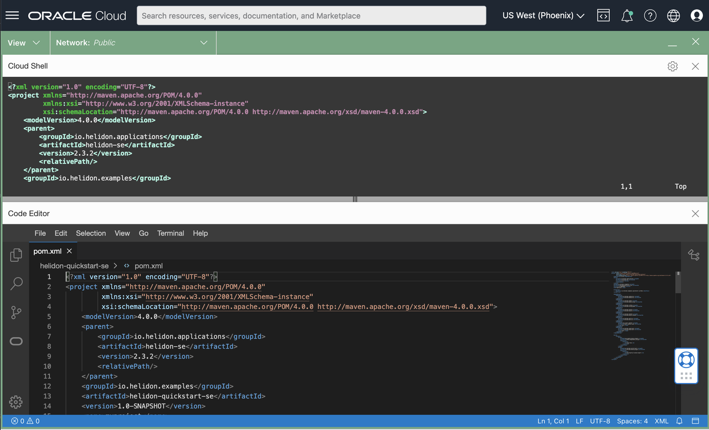
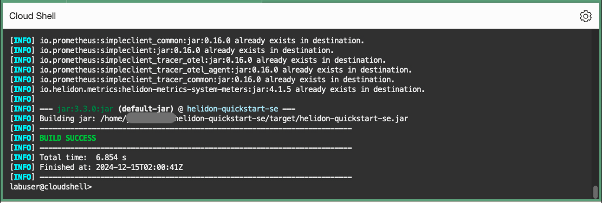
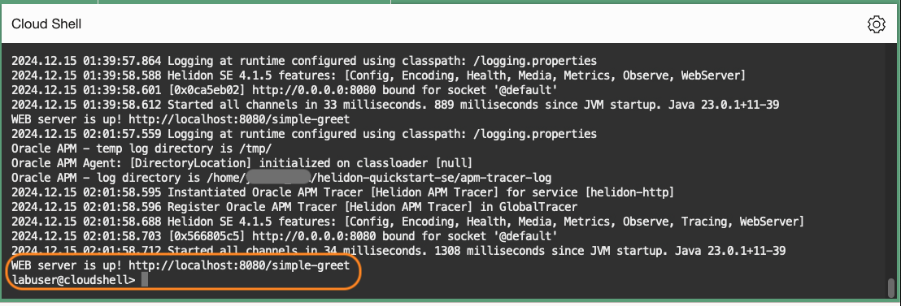
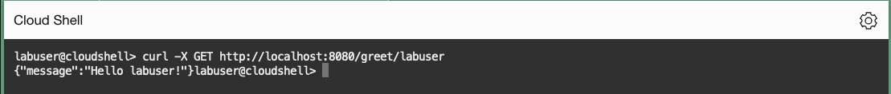
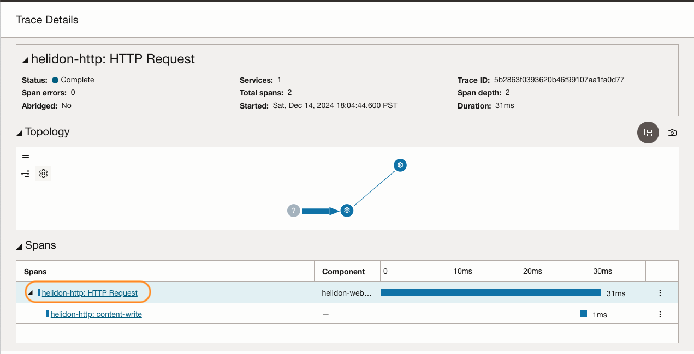
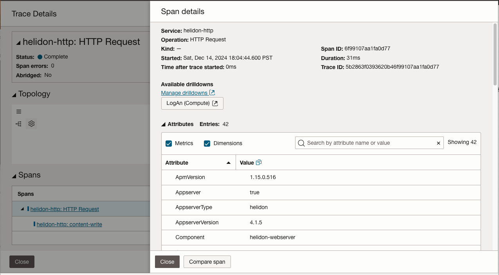

# Monitor traces and spans of the application with APM Trace Explorer

## Introduction

In this lab, you will configure APM Tracer to monitor the Helidon SE application, which you created in Lab2. 

By default, Helidon automatically activates tracing when detects the feature is enabled in the class-path. In this lab, you will edit application's configuration files and enable tracing using APM Java Tracer. You can see the traces in the APM Trace Explorer without modifying the java code, once you re-build and access the application.  

Estimated time: 10 minutes

Watch the video below for a quick walk-through of the lab.
[Monitor traces and spans of the application with APM Trace Explorer](videohub:1_5ffnikzh)

### Objectives

* Modify pom.xml file in the Helidon application
* Edit application.yaml file
* Rebuild the application with APM Tracer configurations
* View traces in the APM Trace Explorer


### Prerequisites

* This lab requires the completion of Lab 1 and Lab 2

## Task 1: Modify pom.xml

1. Launch OCI Cloud Shell if not opened already.

2. Ensure the Java version is 23 and Maven version in the path is 3.9.9. If not, run the export commands in the previous lab to add directories to the PATH variable. 
	``` bash
	<copy>
	java -version; mvn -v
	</copy>
	```

3. Change to **helidon-quickstart-se** directory, and open the **pom.xml** file with an editor tool (e.g., vi editor)
	``` bash
	<copy>
	vi ~/helidon-quickstart-se/pom.xml
	</copy>
	```

	  >**Note:** If you are using the vi editor, type **i** to enter Insert mode, and make the text editable. Use allow keys to navigate the text and make changes to where you set the cursor. To save a file, press the Esc key, then type **:wq** to write and quit the file. If you do not wish a change, press Esc then type **:q!** to discard your changes. Please refer to the editor references for more usage or how to use other editors.


4.	At the end of the dependencies section, find a line **&lt;/dependencies&gt;** and add the following before that line:

	``` bash
	<copy>           
			 <dependency>
                 <groupId>io.helidon.tracing</groupId>
                 <artifactId>helidon-tracing</artifactId>
             </dependency>
             <dependency>
                 <groupId>io.helidon.webserver.observe</groupId>
                 <artifactId>helidon-webserver-observe-tracing</artifactId>
                 <scope>runtime</scope>
             </dependency>
             <dependency>
                 <groupId>io.helidon.tracing.providers</groupId>
                 <artifactId>helidon-tracing-providers-opentracing</artifactId>
             </dependency>
             <dependency>
                <groupId>com.oracle.apm.agent.java</groupId>
                <artifactId>apm-java-agent-helidon4</artifactId>
                <version>[1.15.0.516,)</version>
             </dependency>
	</copy>
	```

	

	  >**Note:** Alternatively, you can use a built-in code editor to edit files. To use the code editor, select the **Developer tools** icon from the toolbar>  select **Code Editor**.
			

## Task 2: Edit application.yaml

1.	Change to **src/main/resources** directory, then open the **application.yaml** file with an editor tool.

	``` bash
	<copy>
	vi ~/helidon-quickstart-se/src/main/resources/application.yaml
	</copy>
	```
	Add the following properties to the file. Replace **&lt;data upload endpoint&gt;** and **&lt;private data key&gt;** with the values collected from the Oracle Cloud console in the earlier steps. For more details, see [Use APM Tracer for Helidon](https://docs.oracle.com/en-us/iaas/application-performance-monitoring/doc/use-apm-tracer-helidon.html).  


		tracing:
		  name: "Helidon APM Tracer"
		  service: "helidon-http"
		  data-upload-endpoint: <data upload endpoint of your OCI domain>
		  private-data-key: <private data key of your OCI domain>
		  collect-metrics: true
		  collect-resources: true
		  path: /api/traces
		  enabled: true
		  properties:
		    - key: com.oracle.apm.agent.log.level
		      value: INFO

	>Suggested Tips:
	- Use your mouse to select the text above, and manually copy and paste it into a text file.
	- Replace the endpoint and the private key, then copy the modified text and insert it into the yaml file.
	- Auto copy is not provided as it may break the indentation.
	- Make sure to keep the syntax of 2 space indentation.
	- Refer to the screenshot image below to see how it should look after the file is modified.
	


## Task 3: Rebuild the application

1.	Close the previous session if running.  
	``` bash
	<copy>
	fuser -k 8080/tcp
	</copy>
	```

2.	Change to the **helidon-quickstart-se** directory where pom.xml is, then run the mvn package command. This will rebuild the package with the changes made in the configuration files.

	``` bash
	<copy>
	cd ~/helidon-quickstart-se/
	</copy>
	```
	``` bash
	<copy>
	mvn package
	</copy>
	```

	


3.	Start the application by running the application jar file.
	``` bash
	<copy>
	nohup java -jar target/helidon-quickstart-se.jar&
	</copy>
	```
4.	Review the status in the nohup.out file.
	``` bash
	<copy>
	more nohup.out
	</copy>
	```
	

5.	Type the following command to try the application.

	``` bash
	<copy>
	curl -X GET http://localhost:8080/greet/labuser
	</copy>
	```
	Ensure it returns the greeting response as shown in the image below.
	

## Task 5: Verify traces in APM Trace Explorer

1.	From the OCI menu, select **Observability & Management** then **Trace Explorer**
	

2.	In the **Trace Explorer** page, select the **Compartment** and the **APM Domain** used in the lab.
3.	Under **Traces**, find a trace from the Helidon application.
4.	Click the service name: **helidon-http: HTTP Request**.
	
5.	In the **Trace Details** page, observe that there are two spans. Review the trace in the **Topology** view, and each span duration in the **Spans** view.
6.	In the **Spans** section, click the root span: **helidon-http: HTTP Request**.
	
7.	Examine the span parameters in the **Span Details** view.
	


You may now **proceed to the next lab**.

## Acknowledgements

- **Author** - Yutaka Takatsu, Product Manager, Enterprise and Cloud Manageability
- **Contributors** - Steven Lemme, Senior Principal Product Manager,
Anand Prabhu, Sr. Member of Technical Staff,  
Avi Huber, Vice President, Product Management
- **Last Updated By/Date** - Yutaka Takatsu, December 2024
