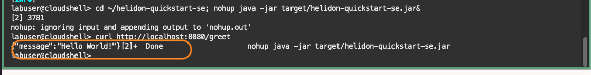

# Create a Custom Span

## Introduction

Helidon automataically enables tracing and adds a trace each time you access the application's service endpoints. You can also add a custom trace by manually editing the Java code. In this lab, you will use a Helidon tracing API to create an additional child span, and view it in the APM Trace Explorer.

Estimated time: 10 minutes


### Objectives

* Create additional child span to demonstrate tracking of the requests using APM Trace Explorer.

### Prerequisites

* This Lab requires the completion of Labs 1, 2 and 3

## Task 1: Verify the prerequisites

1. Launch OCI Cloud Shell, if not opened already.

2. Ensure the Java version is 23 and Maven version in the path is 3.9.9. If not, run the export commands in the previous lab to add directories to the PATH variable.
	``` bash
	<copy>
	java -version; mvn -v
	</copy>
	```


## Task 2: Add custom span to GreetService class

1.	Open **GreetService.java** file with an editor
	``` bash
	<copy>
	vi ~/helidon-quickstart-se/src/main/java/io/helidon/examples/quickstart/se/GreetService.java
	</copy>
	```

2.	Edit the file.

 a.	Add the import statement below:
	 ``` bash
	<copy>
	import io.helidon.tracing.SpanContext;
	import io.helidon.tracing.Tracer;
	import io.helidon.tracing.Scope;
	</copy>
	 ```

	
 b. Replace the **getDefaultMessageHandler** method (Line 68 before inserting import statements) with the following:

	``` bash
	<copy>
	private void getDefaultMessageHandler(ServerRequest request,
                                      ServerResponse response) {
    	var spanBuilder = Tracer.global().spanBuilder("secondchildSpan");
    	request.context().get(SpanContext.class).ifPresent(sc -> sc.asParent(spanBuilder));
    	var span = spanBuilder.start();

    	try (Scope scope = span.activate()) {
    	    sendResponse(response, "World");
    	    span.end();
    	} catch (Throwable t) {
    	    span.end(t);
    	}
	}
	</copy>
	```
	Before the change:
	
	After the change:
	
3.	Save and close the file.

## Task 3: Build and start the application

1.	Close the previous session if running.  
	``` bash
	<copy>
	fuser -k 8080/tcp
	</copy>
	```

2.	From the **helidon-quickstart-se-2** directory, run the MVN package, skipping unit tests.

	``` bash
	<copy>
	cd ~/helidon-quickstart-se; mvn package
	</copy>
	```

 	 

	>**Note:** If your build fails with an error, run the mvn -version and make sure it points to maven 3.9.9 If it does not, go back to Lab 2, Task 2 and re-run the commands to install the required Maven version. This can happen when a session is interrupted during the lab exercise.


3.	Start the application by running the application jar file

	``` bash
	<copy>
	cd ~/helidon-quickstart-se; nohup java -jar target/helidon-quickstart-se.jar&
	</copy>
	```

4.	Test the application by running the curl command and verify the response.
	``` bash
	<copy>
	curl http://localhost:8080/greet
	</copy>
	```

	


## Task 4: Verify the second child span in APM Trace Explorer

1.	From the OCI menu, select **Observability & Management**, then **Trace Explorer**. 

2. Under the Traces section, verify the **Spans** column indicates there are 3 spans included in the trace. Previously, there were 2 spans. Click the service name: **helidon-http: HTTP Request**.
	

3. In the **Toplogy View**, notice that there is an additional icon that is connected with an arrow. Also in the **Spans View**, now the trace has 3 spans shown in different rows.In the **Spans** section, click: **helidon-http: secondchildSpan**.
	
7.	Examine the span parameters in the **Span Details** view.
	


## Conclusions
This is the end of the workshop. You learned how to add the APM tracers to Helidon-based microservices by editing the configuring files such as pom.xml and application.yaml, and how to use APM Trace Explorer to trace the workflow within a service. For more information on APM, refer to the OCI documentation, **[Application Performance Monitoring](https://docs.oracle.com/en-us/iaas/application-performance-monitoring/index.html)**.

## Acknowledgements

* **Author** - Yutaka Takatsu, Product Manager, Enterprise and Cloud Manageability
- **Contributors** - Steven Lemme, Senior Principal Product Manager,
Anand Prabhu, Sr. Member of Technical Staff,  
Avi Huber, Vice President, Product Management
* **Last Updated By/Date** - Yutaka Takatsu, December 2024
