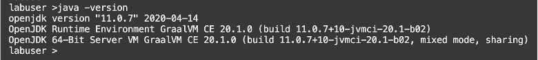
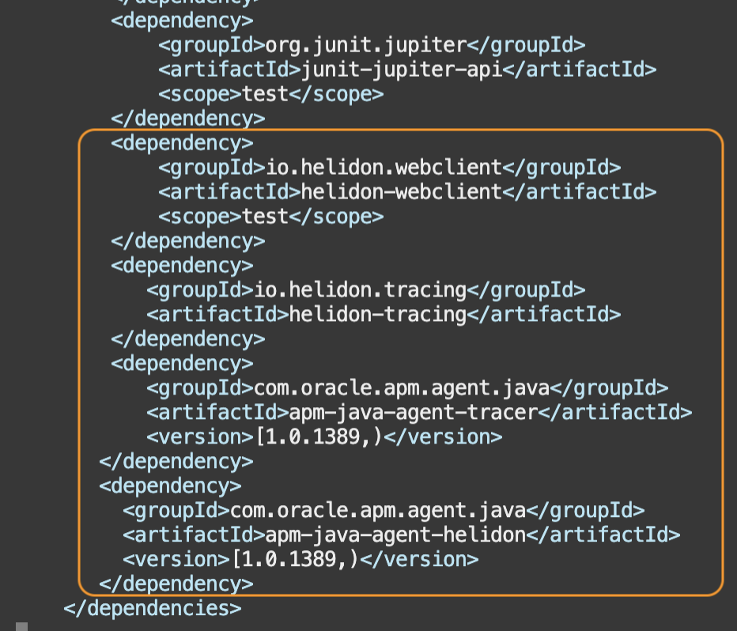
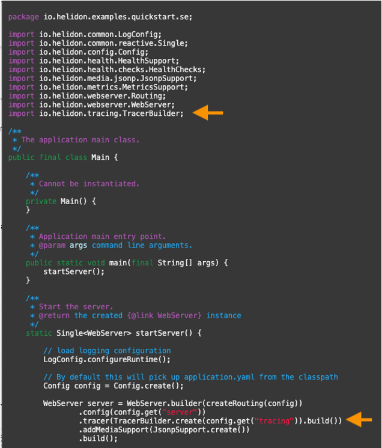
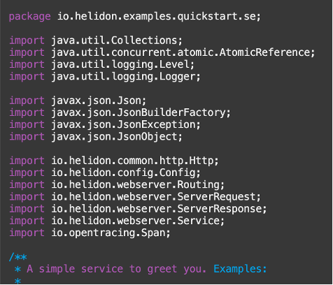
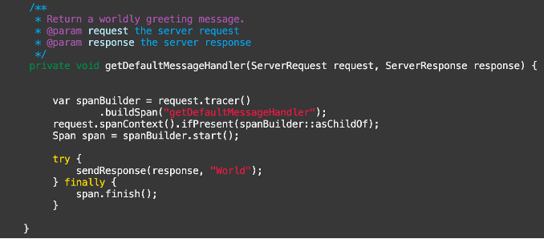
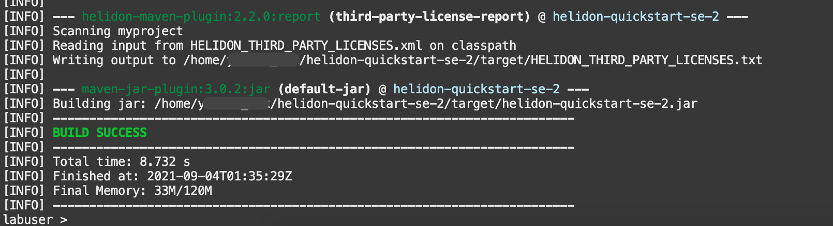
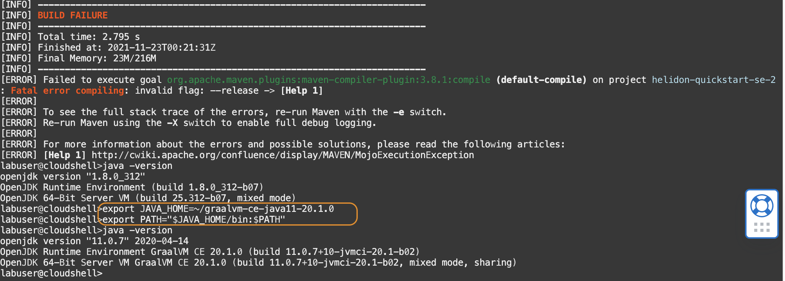
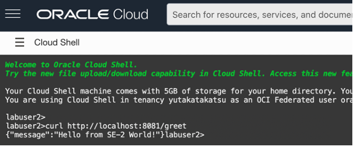
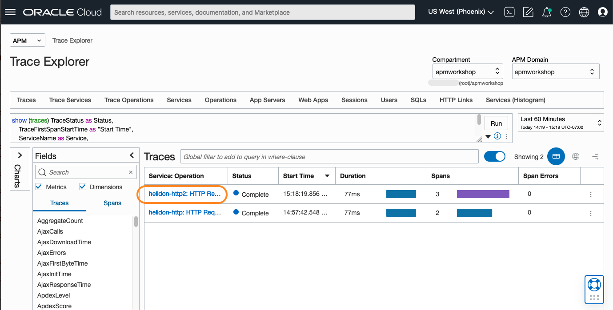

# Create a Second Service

## Introduction

In this lab, you will create a second Maven project, where the server listens on port 8081. You will configure APM tracer on this service, with similar steps to Lab 2 and 3.

Estimated time: 10 minutes

### Objectives

* Create another Maven project to demonstrate tracking of the requests that go from one service to another using APM Explorer.

### Prerequisites

* This Lab requires the completion of Labs 1, 2 and 3

## Task 1: Build another Maven project

1. Launch OCI Cloud Shell, if not opened already.

2. Ensure the Java version in the path is 11.0.7.
	``` bash
	<copy>
	java -version
	</copy>
	```
	

	If you completed Lab1 in a different Cloud Shell session, you will need to reset the JAVA_HOME environment variable, by running run the followings.

	``` bash
	<copy>
	export JAVA_HOME=~/graalvm-ce-java11-20.1.0
	export PATH="$JAVA_HOME/bin:$PATH"
	</copy>
	```

2.	From the home directory, run the Maven archetype:

	``` bash
	<copy>
  cd ~
	mvn -U archetype:generate -DinteractiveMode=false \
	    -DarchetypeGroupId=io.helidon.archetypes \
	    -DarchetypeArtifactId=helidon-quickstart-se \
	    -DarchetypeVersion=2.3.2 \
	    -DgroupId=io.helidon.examples \
	    -DartifactId=helidon-quickstart-se-2 \
	    -Dpackage=io.helidon.examples.quickstart.se
	</copy>
	```
  The project will be built and created in a directory; **helidon-quickstart-se-2**

## Task 2: Modify the pom.xml file in the Helidon application

1.	From the **helidon-quickstart-se-2** directory,	open **pom.xml** file with an editor tool (e.g., vi tool)
	``` bash
	<copy>
	vi ~/helidon-quickstart-se-2/pom.xml
	</copy>
	```
   	>**Note:** For how to use the vi editor, refer to the Lab3, Task1, step 3

3.	At the end of the dependencies section, find a line **&lt;/dependencies&gt;** (Line 56) and add the following before that line:

		        <dependency>
		            <groupId>io.helidon.tracing</groupId>
		            <artifactId>helidon-tracing</artifactId>
		        </dependency>
		        <dependency>
		            <groupId>com.oracle.apm.agent.java</groupId>
		            <artifactId>apm-java-agent-tracer</artifactId>
		            <version>[1.5.2118,)</version>
		        </dependency>
		        <dependency>
		            <groupId>com.oracle.apm.agent.java</groupId>
		            <artifactId>apm-java-agent-helidon</artifactId>
		            <version>[1.0.1389,)</version>
		        </dependency>
	
4.	Save and close the file.

## Task 3: Modify application.yaml file

1.	Open the application.yaml file with an editor.
	``` bash
	<copy>
	vi ~/helidon-quickstart-se-2/src/main/resources/application.yaml
	</copy>
	```
2.	Update the application.yaml file as in the below example. Note the port number is **8081**. Ensure to replace **&lt;data upload endpoint&gt;** and **&lt;private data key&gt;** with the values collected from the Oracle Cloud console in the earlier steps.

		app:
		  greeting: "Hello from SE-2"

		server:
		  port: 8081
		  host: 0.0.0.0

		tracing:
		  name: "Helidon APM Tracer"
		  service: "helidon-http2"
		  data-upload-endpoint: <data upload endpoint of your OCI domain>
		  private-data-key: <private data key of your OCI domain>
		  collect-metrics: true
		  collect-resources: true
		  properties:
		    - key: com.oracle.apm.agent.log.level
		      value: INFO

	

3.	Save and close the file.

## Task 4: Modify Main.java file

1.	Open **Main.java** file with an editor of your choice.
	``` bash
	<copy>
	vi ~/helidon-quickstart-se-2/src/main/java/io/helidon/examples/quickstart/se/Main.java
	</copy>
	```
2.	Edit the file to configure the tracer.

 a.	Add the import statement below:
		 ``` bash
		 <copy>
		 import io.helidon.tracing.TracerBuilder;
		 </copy>
		 ```

 b.	In the startServer method, find a line **.addMediaSupport(JsonpSupport.create())** (Line 47). Add the following above that line:
		 ``` bash
		 <copy>
		 .tracer(TracerBuilder.create(config.get("tracing")).build())
		 </copy>
		 ```
Refer to the sample image below:

	

3.	Save and close the file.

## Task 5: Add custom span to GreetService class

1.	Open **GreetService.java** file with an editor
	``` bash
	<copy>
	vi ~/helidon-quickstart-se-2/src/main/java/io/helidon/examples/quickstart/se/GreetService.java
	</copy>
	```

2.	Edit the file.

 a.	Add the import statement below:
		 ``` bash
		 <copy>
		 import io.opentracing.Span;
		 </copy>
		 ```

	
 b. Replace the **getDefaultMessageHandler** method (Line 68) with the following:
		 ``` bash
		 <copy>


		     private void getDefaultMessageHandler(ServerRequest request,
		                                        ServerResponse response) {
		         var spanBuilder = request.tracer()
		             .buildSpan("getDefaultMessageHandler");
		         request.spanContext().ifPresent(spanBuilder::asChildOf);
		         Span span = spanBuilder.start();
		         try {
		             sendResponse(response, "World");
		         } finally {
		             span.finish();
		         }
	       }

		</copy>
		```

	
3.	Save and close the file.

## Task 6: Build and start the application

1.	From the **helidon-quickstart-se-2** directory, run the MVN package, skipping unit tests.

	``` bash
	<copy>
	cd ~/helidon-quickstart-se-2/; mvn package -DskipTests=true
	</copy>
	```

 	 

	>**Note:** If your build fails with an error, run the java -version and make sure it points to JDK 11. If it does not return OpenJDK version"11.0.7", go back to task 1 in this Lab and re-run the export commands to set the environment variable. This can happen when a session is interrupted during the lab exercise. Confirm the java version returns 11.0.7 and re-execute the mvn package command.  
  

2.	Start the application by running the application jar file

	``` bash
	<copy>
	nohup java -jar target/helidon-quickstart-se-2.jar&
	</copy>
	```
3.	Open a command shell in a new browser window. Test the application by running the curl command and verify the response. Note that the port number is 8081, not 8080.
	``` bash
	<copy>
	curl http://localhost:8081/greet
	</copy>
	```

	


## Task 7: Verify the traces of the second service in APM Trace Explorer

1.	From the OCI menu, select **Observability & Management**, then **Trace Explorer**.  Verify that there is a trace with the service name **helidon-http2**.
	

 In the next Lab, you will modify the first service to call the second service.

You may now **proceed to the next lab**.

## Acknowledgements

* **Author** - Yutaka Takatsu, Product Manager, Enterprise and Cloud Manageability
- **Contributors** - Steven Lemme, Senior Principal Product Manager,	
Anand Prabhu, Sr. Member of Technical Staff,  
Avi Huber, Vice President, Product Management
* **Last Updated By/Date** - Yutaka Takatsu, August 2022
