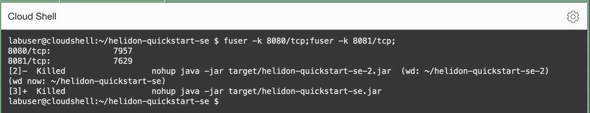

# Clean up the workshop environment

## Introduction

In this lab, you will stop the running application and remove the files that are used in the workshop.

Estimated time: 5 minutes


### Objectives

* Cleanup of the workshop environment


### Prerequisites

* This tutorial requires the completion of Labs 1,2,3 and 4.

## Task 1: Clean up the workshop environment

1. Close any running sessions.


	``` bash
	<copy>
	fuser -k 8080/tcp;fuser -k 8081/tcp;
	</copy>
	```

	

2. Remove the workshop files from the Cloud Shell.

	``` bash
	<copy>
	cd ~/; rm -rf helidon* apache-maven* jdk*
	</copy>
	```


## Acknowledgements

- **Author** - Yutaka Takatsu, Product Manager, Enterprise and Cloud Manageability
- **Contributors** - Steven Lemme, Senior Principal Product Manager,
Anand Prabhu, Sr. Member of Technical Staff,  
Avi Huber, Vice President, Product Management
- **Last Updated By/Date** - Yutaka Takatsu, December 2024
