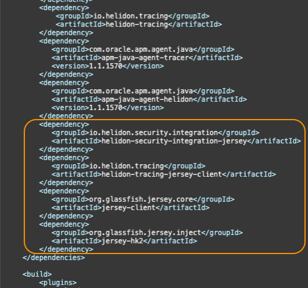
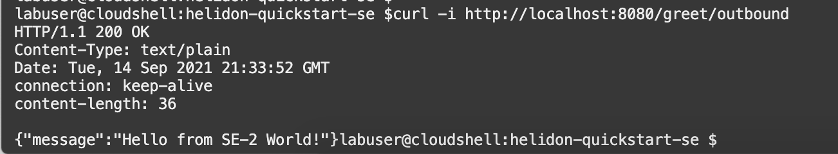
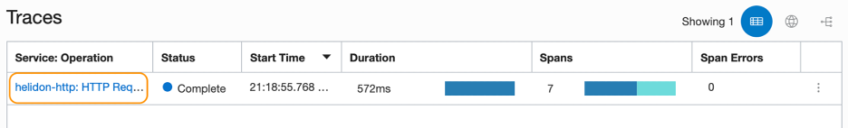
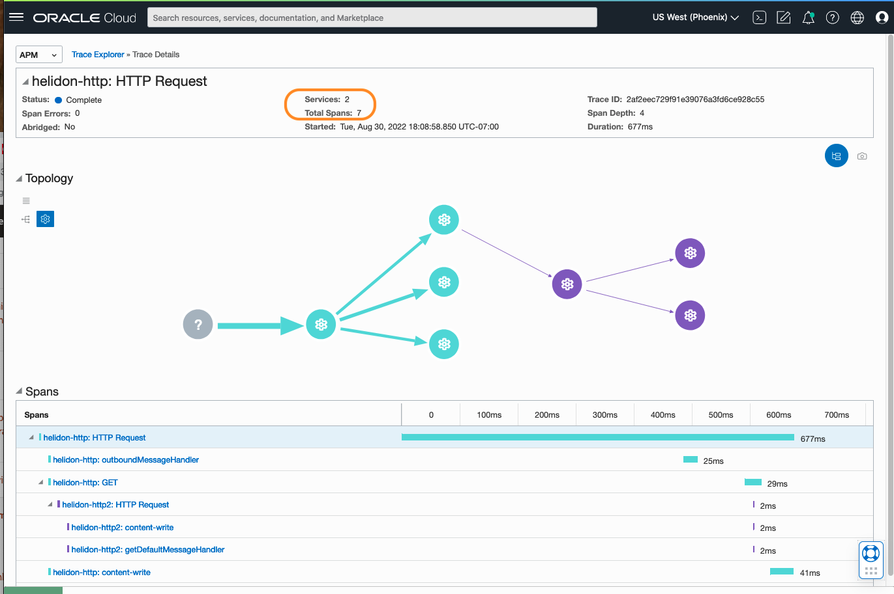
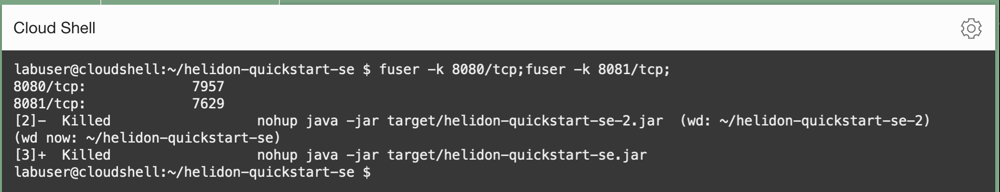
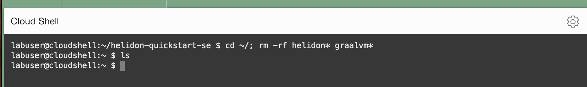

# View the trace having multiple services

## Introduction

In this lab, you will modify the original service to call the second service, which you created in Lab 4. Then verify the trace that is distributed among the services, in the APM Trace Explorer.

Estimated time: 15 minutes

### Objectives

* Implement Jersey client in the Maven project
*	Create and start a span that invokes the second service
*	Rebuild the application
*	Use APM Trace Explorer to verify the trace has multiple services


### Prerequisites

* This tutorial requires the completion of Labs 1,2,3 and 4.

## Task 1: Modify the pom.xml file in the Helidon application

1. Launch OCI Cloud Shell if not opened already.

2. Ensure the Java version in the path is 11.0.7.
	``` bash
	<copy>
	java -version
	</copy>
	```

	if you completed Lab1 in this workshop, but the Java version returned from the command is not 11.0.7, you may need to reset the JAVA_HOME environment variable. Run the following commands.

	``` bash
	<copy>
	export JAVA_HOME=~/graalvm-ce-java11-20.1.0
	export PATH="$JAVA_HOME/bin:$PATH"
	</copy>
	```

## Task 2:Modify pom.xml

1.	Change to **helidon-quickstart-se** directory, open **pom.xml** in an editor.

	``` bash
	<copy>
	vi ~/helidon-quickstart-se/pom.xml
	</copy>
	```
   	>**Note:** For how to use the vi editor, refer to the Lab3, Task1, step 3

2.	At the end of the dependencies section, find a line **&lt;/dependencies&gt;** (Line 70) and add the following before that line:

		        <dependency>
		            <groupId>io.helidon.security.integration</groupId>
		            <artifactId>helidon-security-integration-jersey</artifactId>
		        </dependency>
		        <dependency>
		            <groupId>io.helidon.tracing</groupId>
		            <artifactId>helidon-tracing-jersey-client</artifactId>
		        </dependency>
		        <dependency>
		            <groupId>org.glassfish.jersey.core</groupId>
		            <artifactId>jersey-client</artifactId>
		        </dependency>
	        	<dependency>
		            <groupId>org.glassfish.jersey.inject</groupId>
		            <artifactId>jersey-hk2</artifactId>
		        </dependency>
	

## Task 3: Replace GreetService Class

1.	Change to **quickstart/se** directory where the **GreetService.java** file resides.

	``` bash
	<copy>
	cd ~/helidon-quickstart-se/src/main/java/io/helidon/examples/quickstart/se
	</copy>
	```
2.	Rename the **GreetService.java** to **GreetService.javaorg**.

	``` bash
   <copy>
   mv GreetService.java GreetService.javaorg
   </copy>
   ```

3.  Create a new file and name it **GreetService.java**.
	``` bash
  <copy>
  touch GreetService.java
  </copy>
  ```
4. Open the **GreetService.java** file you just created.
	``` bash
  <copy>
  vi GreetService.java
  </copy>
  ```
5. Copy the code below and paste it into the file.
	``` bash
	<copy>

	package io.helidon.examples.quickstart.se;

	import io.helidon.common.http.Http;
	import io.helidon.config.Config;
	import io.helidon.tracing.jersey.client.ClientTracingFilter;
	import io.helidon.webserver.Routing;
	import io.helidon.webserver.ServerRequest;
	import io.helidon.webserver.ServerResponse;
	import io.helidon.webserver.Service;
	import io.opentracing.Span;
	import java.util.Collections;
	import java.util.concurrent.atomic.AtomicReference;
	import javax.json.Json;
	import javax.json.JsonBuilderFactory;
	import javax.json.JsonObject;
	import javax.ws.rs.client.Client;
	import javax.ws.rs.client.ClientBuilder;
	import javax.ws.rs.client.Invocation;
	import javax.ws.rs.client.WebTarget;

	public class GreetService implements Service {

		private final AtomicReference<String> greeting = new AtomicReference<>();
		private WebTarget webTarget;
		private static final JsonBuilderFactory JSON = Json.createBuilderFactory(Collections.emptyMap());

		GreetService(Config config) {
		  greeting.set(config.get("app.greeting").asString().orElse("Ciao"));
		  Client jaxRsClient = ClientBuilder.newBuilder().build();
		  webTarget = jaxRsClient.target("http://localhost:8081/greet");
		}

		@Override
		public void update(Routing.Rules rules) {
		  rules
		      .get("/", this::getDefaultMessageHandler)
		      .get("/outbound", this::outboundMessageHandler)
		      .put("/greeting", this::updateGreetingHandler);
		}

		private void getDefaultMessageHandler(ServerRequest request, ServerResponse response) {
		  var spanBuilder = request.tracer()
		              .buildSpan("getDefaultMessageHandler");
		  request.spanContext().ifPresent(spanBuilder::asChildOf);
		  Span span = spanBuilder.start();
		  try {
		    sendResponse(response, "World");
		  } finally {
		    span.finish();
		  }
		}

		private void sendResponse(ServerResponse response, String name) {
		  String msg = String.format("%s %s!", greeting.get(), name);

		  JsonObject returnObject = JSON.createObjectBuilder().add("message", msg).build();
		    response.send(returnObject);
		  }

		  private void updateGreetingFromJson(JsonObject jo, ServerResponse response) {

		   if (!jo.containsKey("greeting")) {
		      JsonObject jsonErrorObject =
		          JSON.createObjectBuilder().add("error", "No greeting provided").build();
		      response.status(Http.Status.BAD_REQUEST_400).send(jsonErrorObject);
		      return;
		    }
		    greeting.set(jo.getString("greeting"));
		    response.status(Http.Status.NO_CONTENT_204).send();
		  }

		  private void outboundMessageHandler(ServerRequest request, ServerResponse response) {
		    Invocation.Builder requestBuilder = webTarget.request();

		    var spanBuilder = request.tracer()
		                .buildSpan("outboundMessageHandler");
		    request.spanContext().ifPresent(spanBuilder::asChildOf);
		    Span span = spanBuilder.start();

		    try {
		      requestBuilder.property(
		          ClientTracingFilter.CURRENT_SPAN_CONTEXT_PROPERTY_NAME, request.spanContext());  
          requestBuilder   
		          .rx()
		          .get(String.class)
		          .thenAccept(response::send)
		          .exceptionally(
		              throwable -> {
		                response.status(Http.Status.INTERNAL_SERVER_ERROR_500);
		                response.send("Failed with: " + throwable);
		                return null;
		              });
		    } finally {
		      span.finish();   
		    }
		  }

		  private void updateGreetingHandler(ServerRequest request, ServerResponse response) {
		    request.content().as(JsonObject.class).thenAccept(jo -> updateGreetingFromJson(jo, response));
		  }
		}
		</copy>
		```


## Task 4: Build and start the application

1. Ensure the JAVA_HOME environment variable is set.

	``` bash
	<copy>
	export JAVA_HOME=~/graalvm-ce-java11-20.1.0
	export PATH="$JAVA_HOME/bin:$PATH"
	</copy>
	```
2.	Kill the existing session using port 8080.

	``` bash
	<copy>
	fuser -k 8080/tcp
	</copy>
	```

2.	From the **helidon-quickstart-se** directory, run the mvn package, skipping unit tests.

	``` bash
	<copy>
	cd ~/helidon-quickstart-se/; mvn package -DskipTests=true
	</copy>
	```
3.	Start the application by running the application jar file.

	``` bash
	<copy>
	nohup java -jar target/helidon-quickstart-se.jar&
	</copy>
```
4.	Test the application by running the following command

	``` bash
	<copy>
	curl -i http://localhost:8080/greet/outbound
	</copy>
	```
	

## Task 5: View the trace in the APM Trace Explorer

1.	From the OCI menu, select **Observability & Management**, then **Trace Explorer**.  Click a link to the trace that ran most recently. It should have 7 spans.


	

2. On the **Trace Details** page, verify that the trace includes 7 spans from two services. Examine the topology to understand how the two services are connected. Services are displayed in different colors. Review the flow in the **Spans** view and notice how the spans are distributed.

	


## Task 6: Clean up the workshop environment

1. Close any running sessions.


	``` bash
	<copy>
	fuser -k 8080/tcp;fuser -k 8081/tcp;
	</copy>
	```

	

2. Remove the workshop files from the Cloud Shell.

	``` bash
	<copy>
	cd ~/; rm -rf helidon* graalvm*
	</copy>
	```

	


## Conclusions
This is the end of the workshop. You have learned how to add the APM tracers to Helidon-based microservices by editing the configuring files such as pom.xml and application.yaml, and how to use APM Trace Explorer to trace the workflow within a service and across multiple services. For more information on APM, refer to the OCI documentation, **[Application Performance Monitoring](https://docs.oracle.com/en-us/iaas/application-performance-monitoring/index.html)**.


## Acknowledgements

- **Author** - Yutaka Takatsu, Product Manager, Enterprise and Cloud Manageability
- **Contributors** - Steven Lemme, Senior Principal Product Manager,
Anand Prabhu, Sr. Member of Technical Staff,  
Avi Huber, Vice President, Product Management
- **Last Updated By/Date** - Yutaka Takatsu, August 2022
