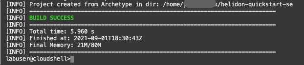

# Setup a Helidon SE Application

## Introduction

In this lab, you will setup a simple Helidon SE application. You will use APM Trace Explorer to monitor the application later in this workshop.

Estimated time: 10 minutes

### Objectives

* Launch Cloud Shell
*	Verify Helidon prerequisites
*	Install Java and Maven
*	Build a simple Helidon SE application
*	Verify application


### Prerequisites

* An Oracle Free Tier, Always Free, or a Paid Cloud Account


## Task 1: Launch the Cloud Shell and verify Helidon Prerequisites

1. Launch the Oracle Cloud Shell from the Oracle Cloud Console by selecting the **>..** icon.  <br/>

  The Oracle Cloud Shell is a small virtual machine running a Bash shell that you access through the Oracle Cloud Console. It comes with a pre-authenticate Command Line Interface (CLI) pre-installed and configured so you can immediately start working in your tenancy without spending time on its installation and configuration.

	
3. Helidon requires Java 11 (or newer) and Maven. Verify the versions by running the following commands.

	``` bash
	<copy>
	java -version
	</copy>
	```
	``` bash
	<copy>
	mvn -version
	</copy>
	```
	If you do not have required version of Java, you can install GraalVM in the Cloud Shell to run Java 11, in the next Task.

  >NOTE: By default, OCI Free comes with Maven 3.5.0, which can be used to complete this lab. If you wish to install a different version of Maven, you can download it from the following URL: [http://maven.apache.org/](http://maven.apache.org/)


## Task 2: Install Java

1.	Install GraalVM for building a Helidon image


	``` bash
	<copy>
	curl -sLO https://github.com/graalvm/graalvm-ce-builds/releases/download/vm-20.1.0/graalvm-ce-java11-linux-amd64-20.1.0.tar.gz
	</copy>
	```
	``` bash
	<copy>
	gunzip graalvm-ce-java11-linux-amd64-20.1.0.tar.gz
	</copy>
	```
	``` bash
	<copy>
	tar xvf graalvm-ce-java11-linux-amd64-20.1.0.tar
	</copy>
	```
	``` bash
	<copy>
	rm graalvm-ce-java11-linux-amd64-20.1.0.tar
	</copy>
	```
2. Move the directory under the home directory, if extracted at a different location.
	``` bash
	<copy>
	mv graalvm-ce-java11-20.1.0 ~/
	</copy>
	```
3. Set JAVA_HOME environment variable.
	``` bash
	<copy>
	export JAVA_HOME=~/graalvm-ce-java11-20.1.0
	export PATH="$JAVA_HOME/bin:$PATH"
	</copy>
	```

2. Verify the Java version, and ensure that it is updated to “11.0.7”

	``` bash
	<copy>
	java -version
	</copy>
	```
	


## Task 3:  Build a Helidon SE application

1.	From the home directory, run the Helidon Maven archetypes to generate the Maven project.
	``` bash
	<copy>
	cd ~
	mvn -U archetype:generate -DinteractiveMode=false \
    -DarchetypeGroupId=io.helidon.archetypes \
    -DarchetypeArtifactId=helidon-quickstart-se \
    -DarchetypeVersion=2.3.2 \
    -DgroupId=io.helidon.examples \
    -DartifactId=helidon-quickstart-se \
    -Dpackage=io.helidon.examples.quickstart.se
	</copy>
	```
	


2.	The archetype generates a Maven project (helidon-quickstart-se) in your current directory. Change to this directory.
	``` bash
	<copy>
	cd helidon-quickstart-se
	</copy>
	```
3.	Build the application by running the command below:
	``` bash
	<copy>
	mvn package
	</copy>
	```
	The project builds an application jar for the example and saves all runtime dependencies in the target/libs directory.
	

4.	Start the application by running the application jar file.
	``` bash
	<copy>
  cd ~/helidon-quickstart-se;
	nohup java -jar target/helidon-quickstart-se.jar&
	</copy>
	```


5. View the output file. Ensure it shows the message: "WEB server is UP!"
	``` bash
	<copy>
	more nohup.out
	</copy>
	```
	


## Task 4: Verify the application

1.	Try the application with the curl command below.
	``` bash
	<copy>
	curl -X GET http://localhost:8080/greet/Joe
	</copy>
	```
	It should return a greeting message as in the below image.

		{"message":"Hello Joe!"}

	

>NOTE: For more information on Helidon prerequisites, application setup details, and test command examples, please see the Helidon Documentation, [Helidon QuickStart guide](https://helidon.io/docs/latest/#/se/guides/02_quickstart).


You may now [proceed to the next lab](#next).

## Acknowledgements

- **Author** - Yutaka Takatsu, Product Manager, Enterprise and Cloud Manageability
- **Contributors** - Steven Lemme, Senior Principal Product Manager,<br>
David Le Roy, Director, Product Management,<br>
Avi Huber, Senior Director, Product Management
- **Last Updated By/Date** - Yutaka Takatsu, December 2021
