# Update API Gateway, configure APM Browser Agent, and update Object Storage

## Introduction

In this tutorial, first, you will add APM headers to the CORS policy in the API Gateway that you created in the Native Cloud App Workshop, second, enable the APM Browser Agent to capture the frontend traces, and finally upload the files built by the React JS, to the OCI Object Storage.

Estimated time: 15 minutes

### Objectives

*	Add APM headers to the CORS policy settings in the OCI API Gateway
* Insert JavaScript to a html file and enable the APM Browser Agent
* Rebuild the frontend application, then upload the revised files to the OCI Object Storage
*	Launch the application in a web browser, perform transactions to generate traffic

### Prerequisites

* This lab requires completion of lab 1, lab 2 and lab 3 of this workshop
* This Lab also assumes you have completed the tutorials 1, 2 and 3 in the [React+Java+ADB = Native Cloud App](https://apexapps.oracle.com/pls/apex/dbpm/r/livelabs/view-workshop?wid=814).

## Task 1: Add APM headers to the API Gateway

To run the application from the Gateway, you will need to add headers, which are required by APM, to the CORS policy in the API Gateway that you setup in the [React+Java+ADB = Native Cloud App](https://apexapps.oracle.com/pls/apex/dbpm/r/livelabs/view-workshop?wid=814) Workshop. APM Tracer uses several different headers. In this lab, to simplify the steps, we will add an asterisk to accept all headers in the CORS policy.

1. From the OCI menu, select **Developer Services** > **Gateways**.

	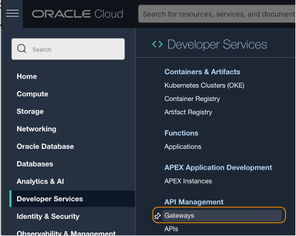

2. Select the gateway you created in the Native Cloud App Workshop.

	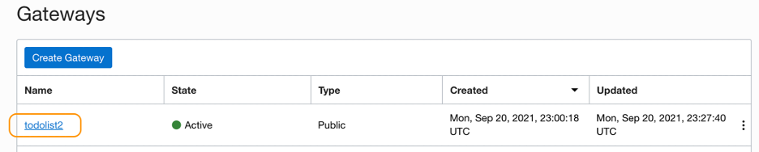

3. Click  **Deployments** under **Resources**, then click the name of the deployment you created in the Native Cloud App Workshop. In the example image, the deployment name is “todolist2”.

	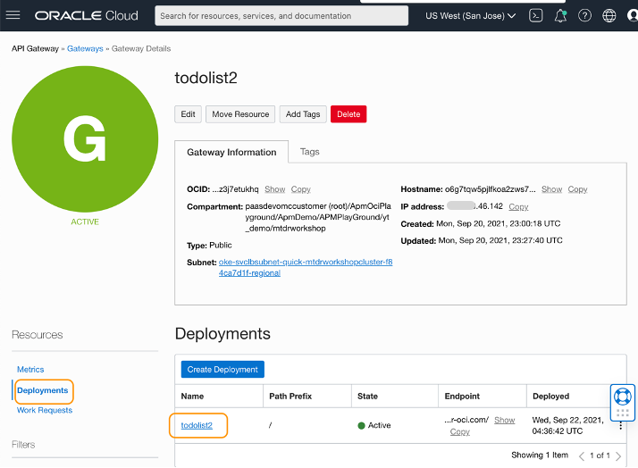

4. Click **Edit**.

	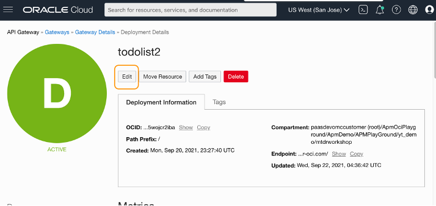

5. Under **API Request Policies**, scroll down to find **CORS** section, then click **Edit**.

	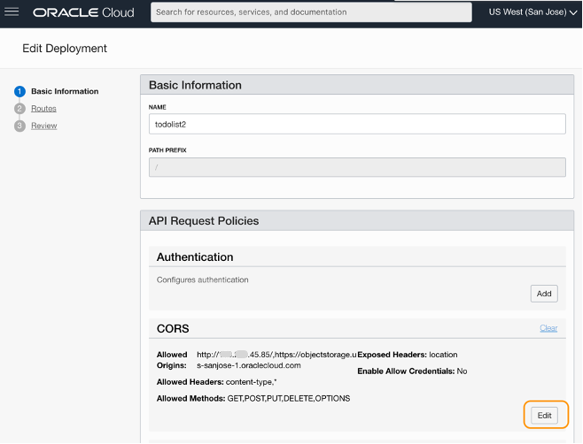

6. In the **Origins** section, replace the URL with the load balancer’s updated external IP, copied in the previous step.

	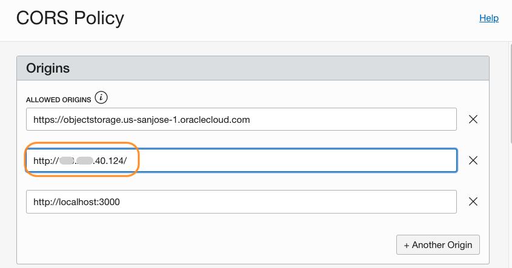

  External IP can be found by the **kubectl get services -n mtdrworkshop** command.

  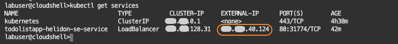

7. Under the **Headers**, click **+ Another Header** to create a new entry field. Enter an asterisk "*****" to the field, then click **Apply Changes**.

	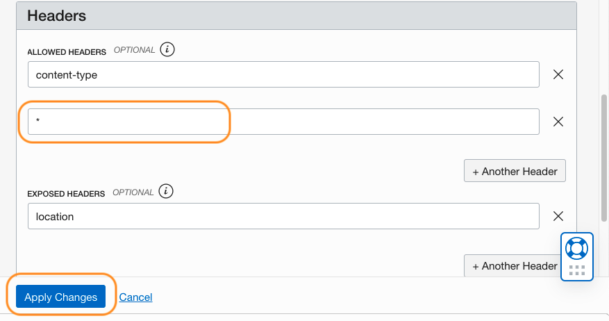

8. Click **Next**.

	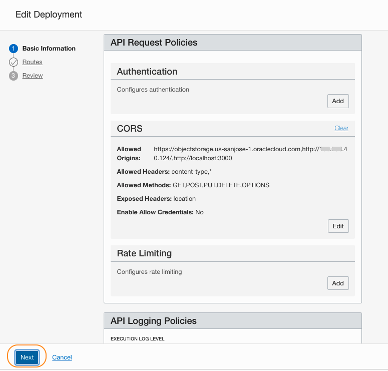

9. For both **Route 1** and **Route 2**, change the URL with the Load Balancer's updated external IP. Then, click **Next**.

	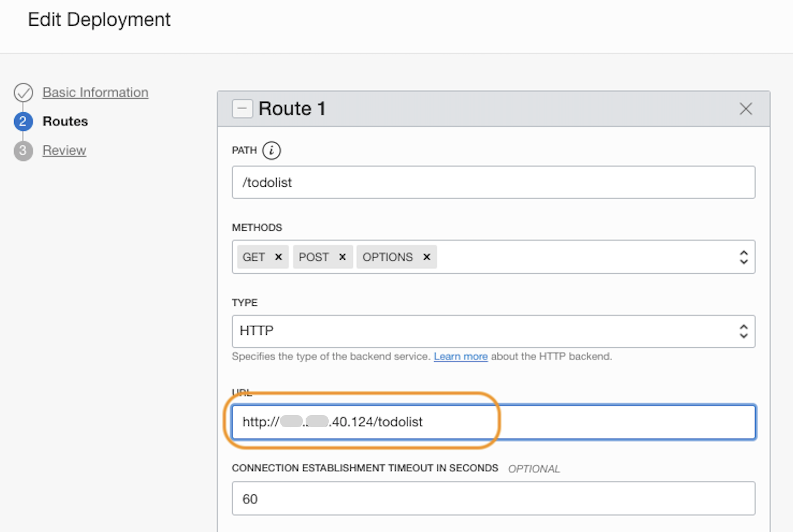
	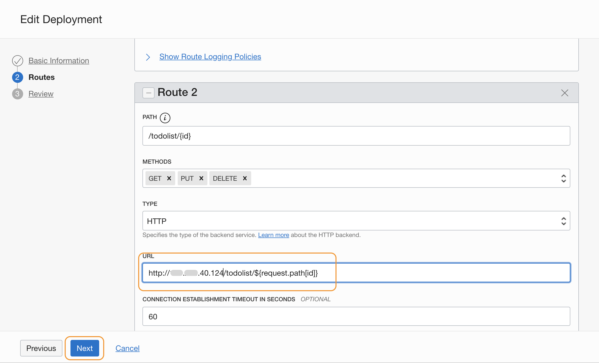

10. Click **Save Changes**.

	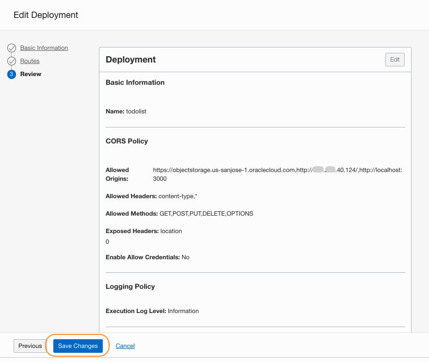

11. Click **Copy** next to the Endpoint. This will copy the endpoint URL to the clipboard.

	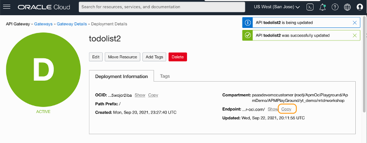

12. Open a text editor and paste the copied endpoint and append ***‘/todolist’*** to it. Re-copy the entire URL to your clipboard. Your URL should look like below.

		E.g.,
		https://abcdefg12345one.apigateway.us-sanjose-1.oci.customer-oci.com/todolist

13.	Open another browser tab and paste the URL to the browser’s address bar. Verify the response shows the data in a format similar to the below image.

	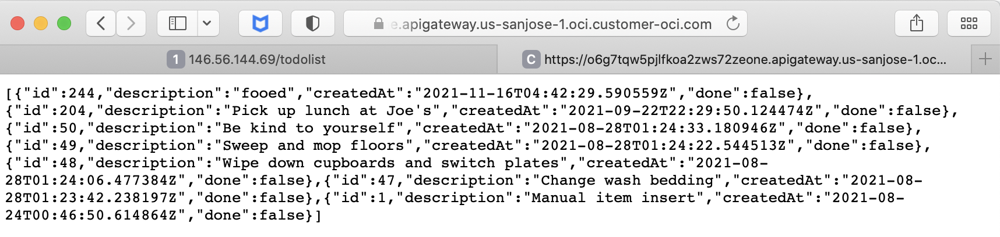

## Task 2: Insert a JavaScript to the index.html

To capture traces from the browser, the **APM Browser Agent** needs to be deployed to the application's frontend. In this lab, you will  insert a JavaScript that configures the APM agent to ***index.html*** file.

  > **NOTE:** This task assumes you completed the Tutorials of the [React+Java+ADB = Native Cloud App](https://apexapps.oracle.com/pls/apex/dbpm/r/livelabs/view-workshop?wid=814) Workshop, and cloned the workshop git repository on your laptop.

1.	On your laptop, open a terminal. Go to your React JS project directory, which you created in the Native Cloud App Workshop, and change to ***mtdrworkshop/frontend*** directory.

	``` bash
	<copy>
	cd <project directory on your laptop>/oci-react-samples/mtdrworkshop/frontend
	</copy>
	```

	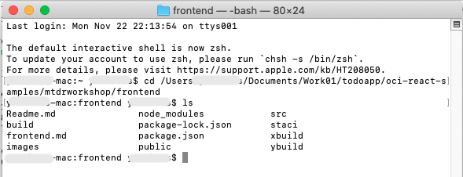

2.	from the ***frontend/public*** directory, open ***index.html*** with an editor.
	``` bash
	<copy>
	vi public/index.html
	</copy>
	```

3.	Insert the following JavaScript to the ***index.html*** file, just below the ***&lt;head&gt;*** section.

	```	bash
	<copy>
	<script>
	window.apmrum = (window.apmrum || {});
	window.apmrum.serviceName='todolist browser';
	window.apmrum.webApplication='My TodoList App';
	window.apmrum.ociDataUploadEndpoint='<ociDataUploadEndpoint>';
	window.apmrum.OracleAPMPublicDataKey='<APM_Public_Datakey>';
	</script>
	<script async crossorigin="anonymous" src="<ociDataUploadEndpoint>/static/jslib/apmrum.min.js"></script>
	</copy>
	```

	*	**todolist browser** is the service name for your APM Browser Agent. If you don't set a value, the default service name ‘APM Browser’ is assigned.
	*	**My TodoList App** is the web application name value.
	*	**ociDataUploadEndpoint** is the Data Upload Endpoint value, which can be obtained from the Administration menu in the APM Domain page.  Replace with the value collected in the Lab 2. Note that there are ***two places where Data Upload Endpoint must be specified***.
	*	**APM Public Datakey** is the APM Public Data key value. Replace with the value collected from the Oracle Cloud console in the Lab 2.

	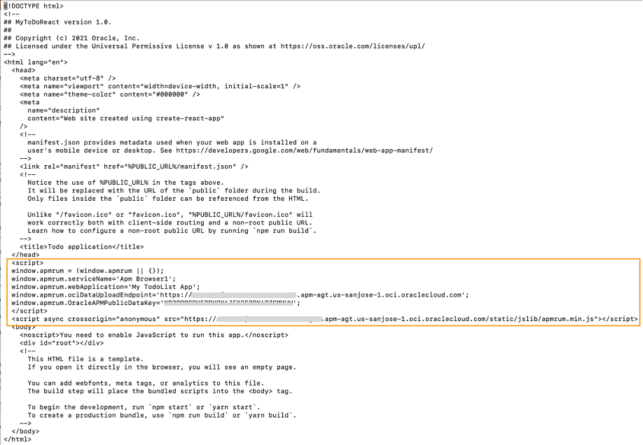

4.	Save and close the file.

## Task 3: Build the frontend and upload to the OCI Object Storage

1.	Make sure you are in the ***frontend*** directory, then run the **npm run build** command. It packages the build files into the ***‘build’*** folder for the deployment.

	``` bash
	<copy>
	npm run build
	</copy>
	```

	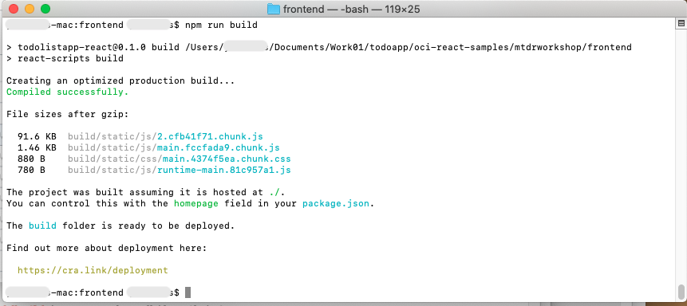

2.	Next you will upload the files to the ***Object Storage***. You can either use the staci tool as instructed in the Native Cloud App Workshop, or use the Oracle Cloud console. In this Lab, we will upload the built files using the Oracle Cloud console. From the OCI menu, select **Storage** then **Buckets**.

	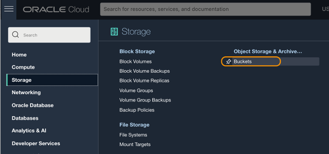

3.	Click the name of the bucket you created in the Native Cloud App Workshop.

	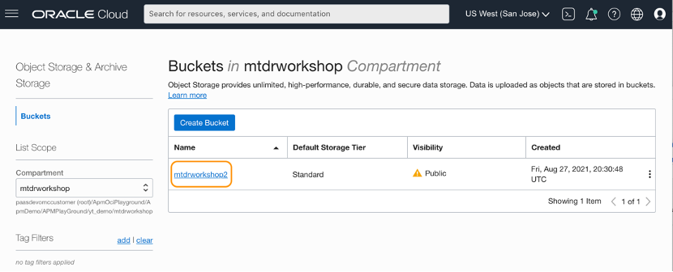

4.	Scroll down to the **Objects** section. You will see the files uploaded already from your Native Cloud App Workshop session. Replace them with the file you have just built in the previous steps. Click **Upload**.

	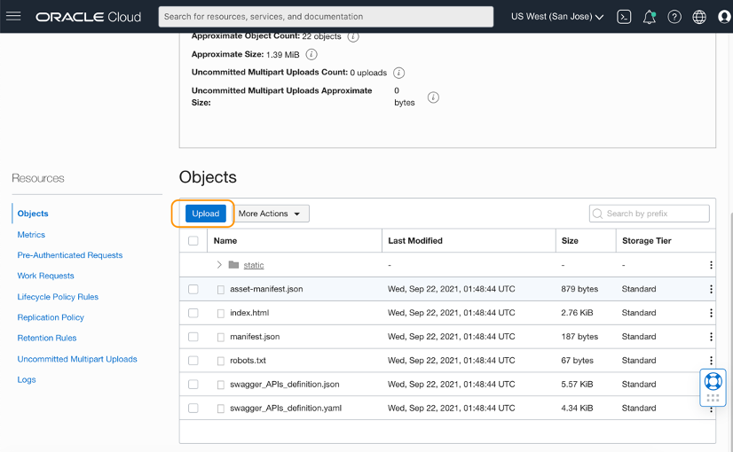

5. Click **select files** link to open a file browser dialog. Then, navigate to ***frontend/build*** directory, select all files. Click **Open**.

	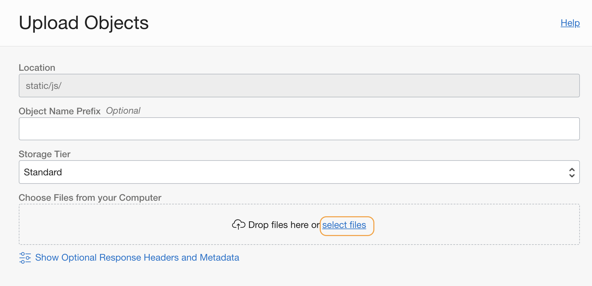
	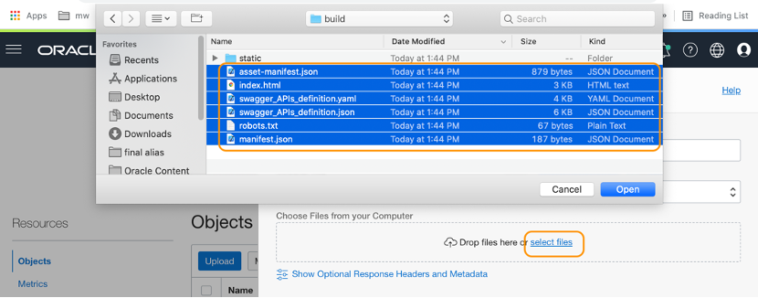

6. Review the list of files which will be replaced. Click **Upload**.

	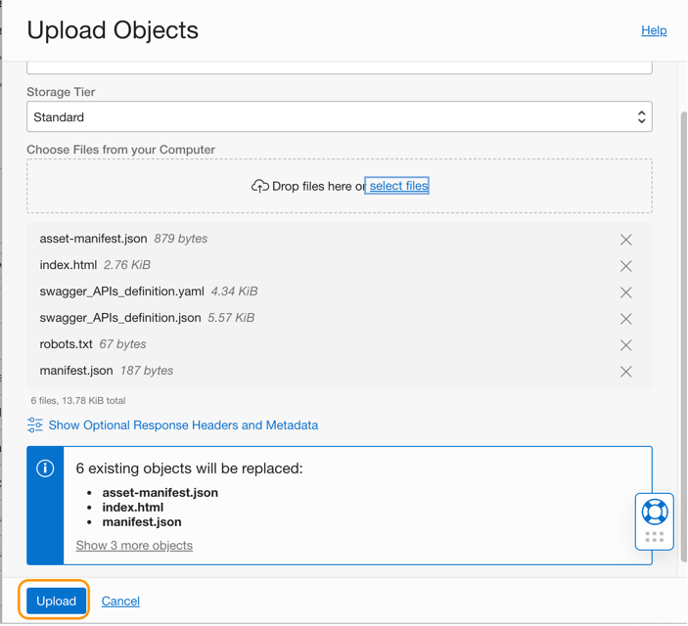

7. Click **Close**.

	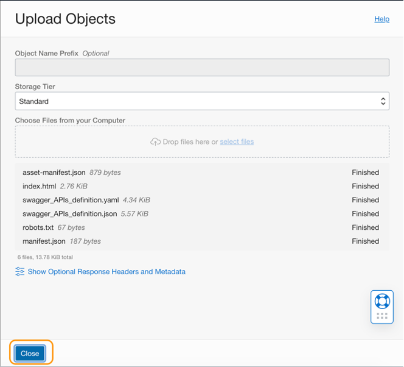

8. Next, upload the files in the subfolders. Expand the **static** folder link from the tree view.

	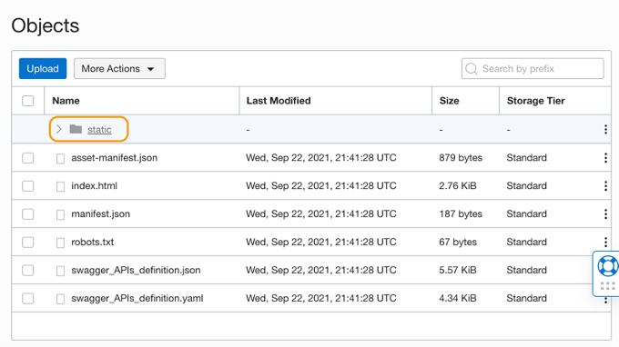

9.	Expand the **js** folder link

	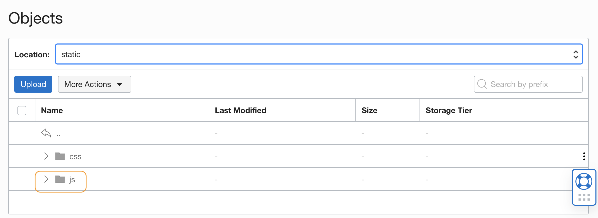

10.	Click **Upload**

  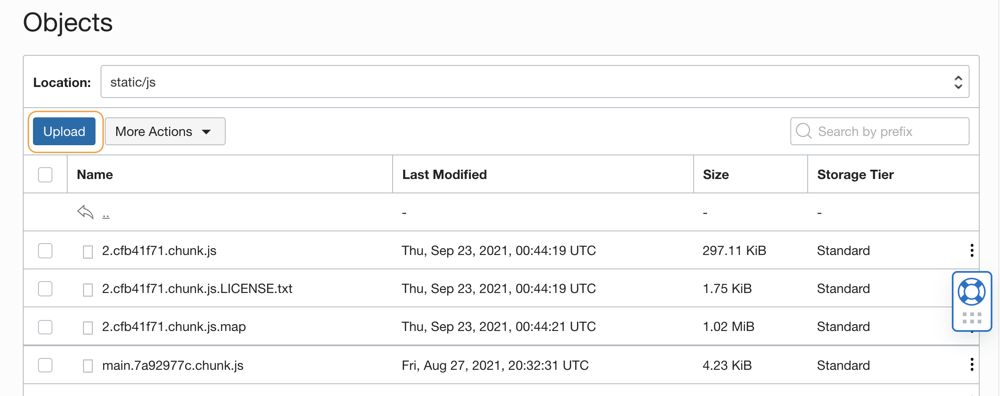

11. click **“select files”**

	

12. Select all files from the ***build/static/js*** folder. Then click **Open**.

  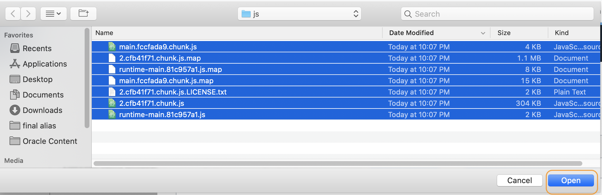

13. Review the files that will be replaced and click **Upload**. Click **Close** when the upload is completed.

	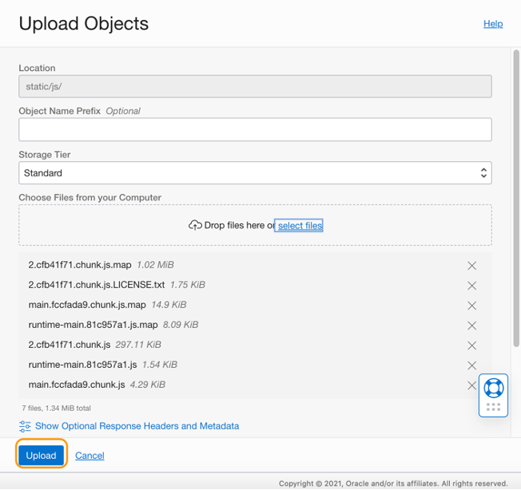

14.	Select **static** from the pulldown menu to go back to the static directory

	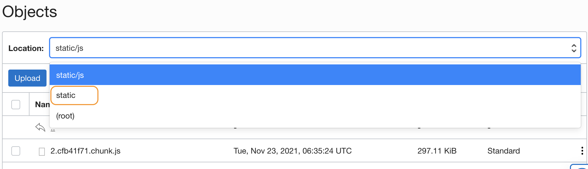

15. Expand the **css** folder link. Click Upload, Upload the files from your local css directory, by repeating the upload steps similar to the steps 9 to 14.

	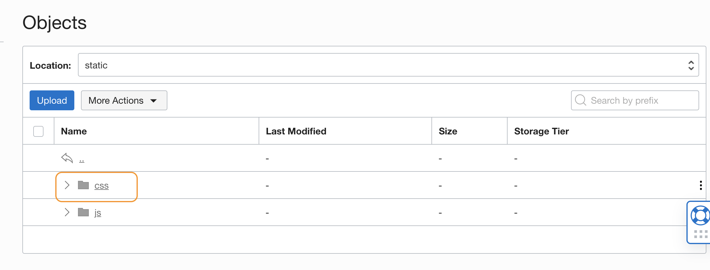

16. Click **Upload**

	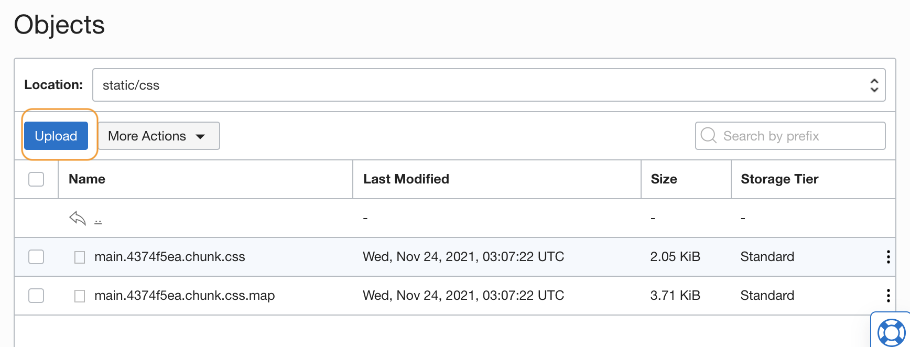

17. Click **select files**

	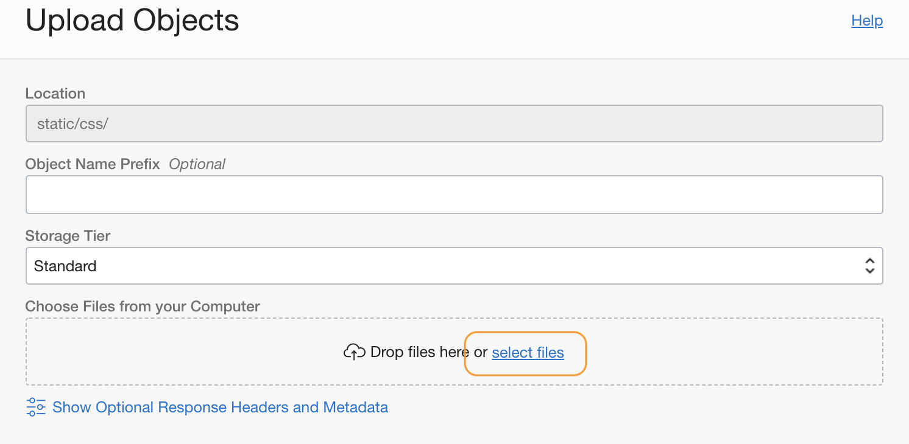

18. Select the files from your local ***build/static/css*** directory, then click **Open**

	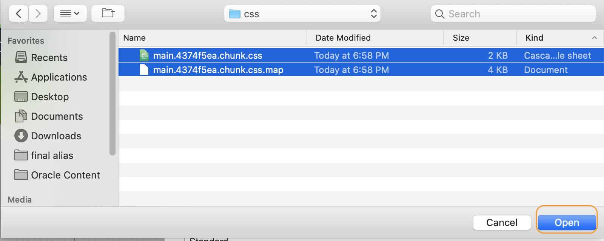

19. Verify the file names to upload, then click **Upload**. Then click **Close**

	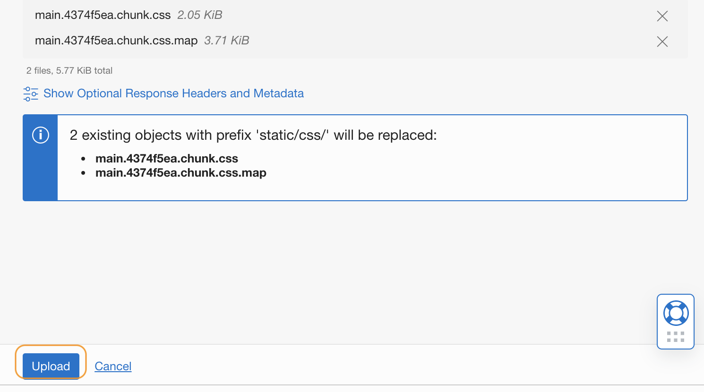

16.	After all the files are uploaded, go back to the root directory by selecting **(root)** from the pulldown menu.

	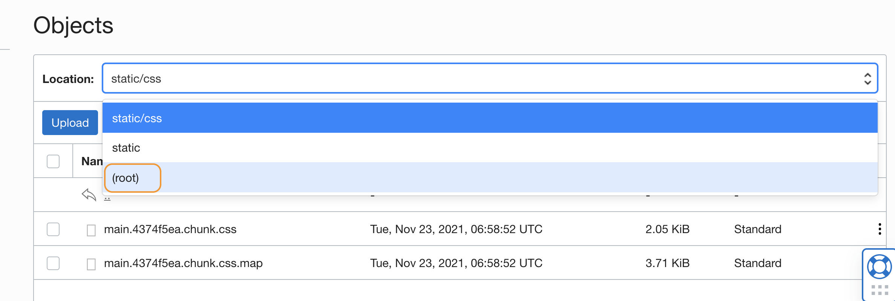

17. From the tree view and find ***index.html***. Click the three dots at the right side of the row, then select **View Object Details**.

	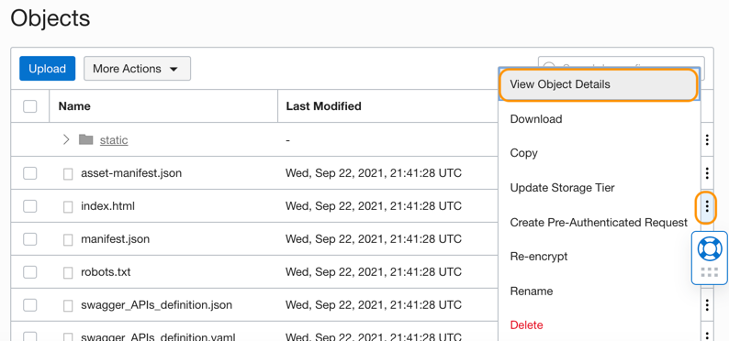

18.	Click the **URL Path** to open the application in a browser tab.

	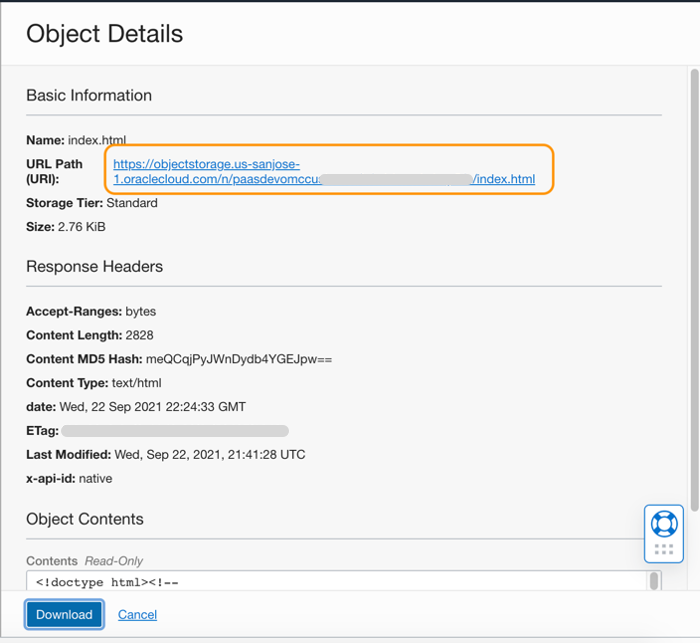

19.	Ensure that the application opens in a new browser tab without any error.

	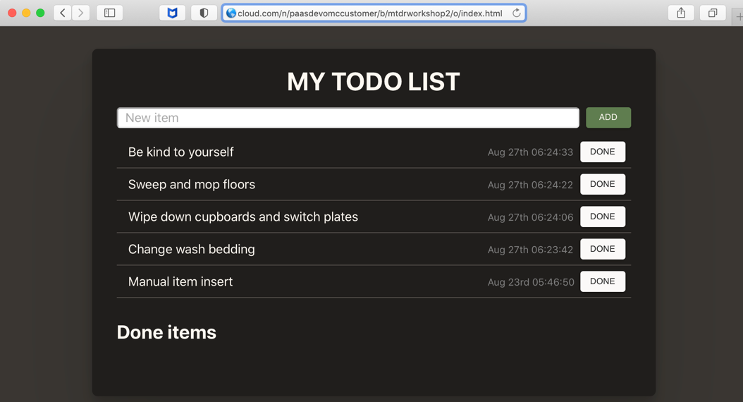

20.	Perform a few transactions to generate traffic. For example, add a new entery, press **Add**, verify that the new item was added to the list, then click **Done**.

	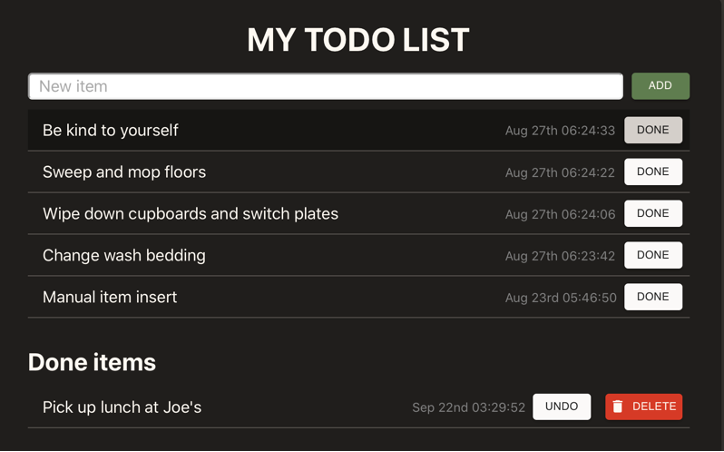

## Acknowledgements

- **Author** - Yutaka Takatsu, Product Manager, Enterprise and Cloud Manageability
- **Contributors** - Steven Lemme, Senior Principal Product Manager,<br>
David Le Roy, Director, Product Management,<br>
Avi Huber, Senior Director, Product Management
- **Last Updated By/Date** - Yutaka Takatsu, February 2022
