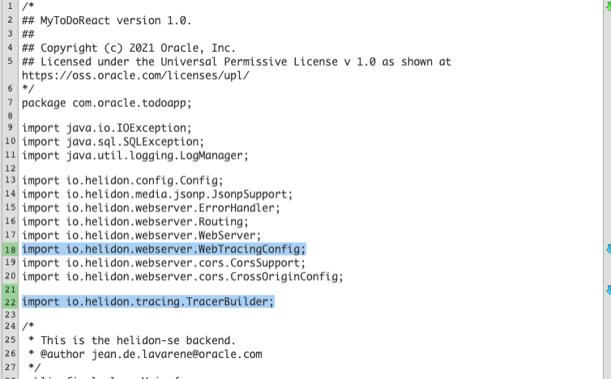
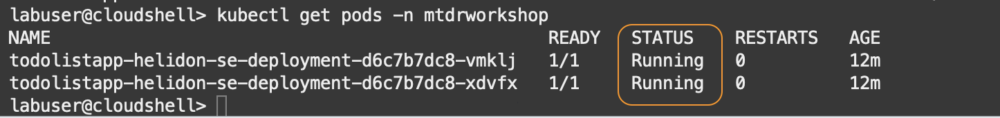

# Setup APM Tracer in Maven & Helidon, and build custom spans in Java

## Introduction

In this tutorial, you will configure APM data sources on the application to gather data and upload to APM for monitoring. You will enable the APM Tracer in Helidon and add custom spans to Java files, and finally rebuild the microservices project.

Estimated time: 20 minutes

### Objectives

* Modify configuration files to enable the APM Tracer
*	Add custom spans to Java files to capture SQL executions
*	Rebuild the application with APM Tracer configurations, and deploy it on Kubernetes

### Prerequisites

* This lab requires completion of lab 1 and lab 2 of this workshop
* This Lab also assumes you have completed the tutorials 1, 2 and 3 in the [React+Java+ADB = Native Cloud App](https://apexapps.oracle.com/pls/apex/dbpm/r/livelabs/view-workshop?wid=814).

## Task 1: Launch Cloud Shell
1. Launch the Oracle Cloud Shell from the Oracle Cloud Console by selecting the **>..** icon.  <br/><br/>

	

## Task 2: Modify pom.xml file in the application

1.	Change to ***mtdrworkshop/backend*** directory

	``` bash
	<copy>
	cd ~/reacttodo/oci-react-samples/mtdrworkshop/backend
	</copy>
	```
2.	Open the file with an editor tool (e.g., vi editor)
	``` bash
	<copy>
	vi pom.xml
	</copy>
	```

	  >NOTE: If you are using the vi editor, type ***i*** to enter Insert mode, and make the text editable. Use allow keys to navigate the text and make changes to where you set the cursor. To save a file, press Esc key, then type ***:wq*** to write and quit the file. If you do not wish a change, press Esc then type ***:q!*** to discard your changes. Please refer to the editor references for more usages or how to use other editors.

4. Add the following repositories blocks between the ***properties*** and ***build*** sections:

			<repositories>
				<repository>
				  <id>oci</id>
					<name>OCI Object Store</name>
					<url>https://objectstorage.us-ashburn-1.oraclecloud.com/n/idhph4hmky92/b/prod-agent-binaries/o</url>
					</repository>
			</repositories>

	

5.	At the end of the dependencies section, find a line ***&lt;/dependencies&gt;*** and add the followings before that line:

			<dependency>
			     <groupId>io.helidon.tracing</groupId>
			         <artifactId>helidon-tracing</artifactId>
			 </dependency>
			<dependency>
			    <groupId>com.oracle.apm.agent.java</groupId>
			    <artifactId>apm-java-agent-tracer</artifactId>
			    <version>[1.0.1389,)</version>
			</dependency>
			<dependency>
			    <groupId>com.oracle.apm.agent.java</groupId>
			    <artifactId>apm-java-agent-helidon</artifactId>
			    <version>[1.0.1389,)</version>
			</dependency>

	

## Task 3: Modify application.yaml file

1.	Change to ***backend/src/target/classes*** directory, then open the ***application.yaml*** file with an editor tool.

	``` bash
	<copy>
	vi ~/reacttodo/oci-react-samples/mtdrworkshop/backend/target/classes/application.yaml
	</copy>
	```
	Add the following properties to the file. Replace ***&lt;data upload endpoint&gt;*** and ***&lt;private data key&gt;*** with the values collected from the Oracle Cloud console in the earlier steps.


		tracing:
		  name: "Helidon APM Tracer"
		  service: "todolist-backend"
		  data-upload-endpoint: <data upload endpoint of your OCI domain>
		  private-data-key: <private data key of your OCI domain>
		  collect-metrics: true
		  collect-resources: true
		  properties:
		    - key: com.oracle.apm.agent.log.level
		      value: INFO
		  observation-log: "stdout"
		  paths:
		    - path: "/favicon.ico"
		      enabled: false
		  components:
		    web-server:
		      spans:
		        - name: "HTTP Request"
		          new-name: "%1$s %2$s"
		        - name: "content-write"
		          enabled: false
		        - name: "content-read"
		          enabled: false


	>Suggested Tips:
	* Copy the above text and paste it into a text file, replace the endpoint and the private key, then copy the modified text into the yaml file.
	* Make sure to keep the syntax of 2 space indentation. Deployment will fail with misconfigured indentation.
	* Refer to the screenshot image below to see how it should look like after the file is modified.

	


4.	Copy the edited yaml file to ***/backend/src/main/resources/*** directory.
	``` bash
	<copy>
	cp ~/reacttodo/oci-react-samples/mtdrworkshop/backend/target/classes/application.yaml ~/reacttodo/oci-react-samples/mtdrworkshop/backend/src/main/resources/application.yaml
	</copy>
	```

> NOTE: For more details, see [Use APM Tracer for Helidon](https://docs.oracle.com/en-us/iaas/application-performance-monitoring/doc/use-apm-tracer-helidon.html).  

## Task 4: Modify Main.java file

1.	Open ***Main.java*** with any editor.
	``` bash
  <copy>
  vi ~/reacttodo/oci-react-samples/mtdrworkshop/backend/src/main/java/com/oracle/todoapp/Main.java
  </copy>
  ```

2. Configure the tracer with the application. (Refer to the sample image in the next step)

 a.	Add the import statements below.

	``` bash
	<copy>
	import io.helidon.webserver.WebTracingConfig;		
	import io.helidon.tracing.TracerBuilder;
	</copy>
	```

 b.	 In the ***main*** method, find a line ***.addMediaSupport(JsonpSupport.create())***. Add the following above that line:
	``` bash
	<copy>
	.tracer(TracerBuilder.create(config.get("tracing")).build())
	</copy>
	```
 c.	In the ***createRouting*** method, find a line ***.register("/todolist", corsSupport, todoListAppService)***. Add the following above that line:
	``` bash
	<copy>
	.register(WebTracingConfig.create(config.get("tracing")))
	</copy>
	```
3.	Refer to the below screenshots of the ***Main.java*** where the changes are highlighted in blue.

	

	

## Task 5: Add custom spans to the Service implementation

Next, you will add custom spans to Java files to trace the workloads of the SQL executions in the application. The application has 4 methods that execute SQLs. They are:

*	List All (select),
*	Get by ID (select),
*	Update and
*	Delete.

In this lab, we are adding custom spans to the first two, ***List All*** and ***Get by ID***.

1. Open ***TodoListAppService.java*** with any editor.

	 ``` bash
	 <copy>
	 vi ~/reacttodo/oci-react-samples/mtdrworkshop/backend/src/main/java/com/oracle/todoapp/TodoListAppService.java
	 </copy>
	 ```
   	>NOTE: For how to use the vi editor, refer to the Task2, step 2 in this Lab.

	 a. Add the import statement below.

	 ``` bash
	 <copy>
	 import io.opentracing.Scope;
	 import io.opentracing.Span;
	 import io.opentracing.SpanContext;
	 import io.opentracing.util.GlobalTracer;
	 </copy>
	 ```

	b. Replace the ***getAllTodos*** method with the following:
	 ``` bash
	 <copy>
	 private void getAllTodos(ServerRequest serverRequest, ServerResponse serverResponse) {
	    LOGGER.fine("getAllTodos");
	  SpanContext parentContext = serverRequest.spanContext().get();
	  Span span = GlobalTracer.get().buildSpan("getAllTodos").asChildOf(parentContext).start();
	  Scope scope = GlobalTracer.get().activateSpan(span);
	    try {
	    serverResponse.send(TodoItem.toJsonArray(this.todoItems.all()));
	  }finally {
	    span.finish();
	    scope.close();
	  }
	}

	 </copy>
	 ```
	c. Replace the ***getTodoById*** method with the following:

	``` bash
	<copy>
	private void getTodoById(ServerRequest serverRequest, ServerResponse serverResponse) {
	    LOGGER.fine("getTodoById");
	  SpanContext parentContext = serverRequest.spanContext().get();
	  Span span = GlobalTracer.get().buildSpan("getTodoById").asChildOf(parentContext).start();
	  Scope scope = GlobalTracer.get().activateSpan(span);
	    String id = serverRequest.path().param("id");
	    try {
	      TodoItem todo = this.todoItems.getById(id);
	      if (todo == null) {
	        span.setTag("error", true);
	        span.log("todo  identified by " + id + " wasn't found");
	        serverRequest.next(new TodoItemNotFoundException(id));
	      } else {
	        serverResponse.status(200).send(TodoItem.toJsonObject(todo));
	      }
	    }finally {
	      span.finish();
	      scope.close();
	    }
	}
	</copy>
	```
    > **Tips replacing methods:** Comment the existing method, then paste the new code under the original method.

  
  


Refer to the screenshots of the ***TodoListAppService.java*** where the changes are highlighted in blue. Observe that custom spans are added to the methods.

  
  
	

2. Open ***TodoItemStorage.java*** with any editor.

	``` bash
	<copy>
	vi ~/reacttodo/oci-react-samples/mtdrworkshop/backend/src/main/java/com/oracle/todoapp/TodoItemStorage.java
	</copy>
	```

	a. Add the import statements below.

	``` bash
	<copy>
	import io.opentracing.Span;
	import io.opentracing.util.GlobalTracer;
	</copy>
	```

	b. Replace the ***List &lt;TodoItem&gt;all*** method with the following:
	``` bash
	<copy>
	List<TodoItem> all() {
	LOGGER.fine("all");
	ArrayList<TodoItem> list = new ArrayList<TodoItem>();
	Span span = GlobalTracer.get().buildSpan("all_sql").start();

	try (
		Connection conn = pool.getConnection();
		PreparedStatement pstmt = conn.prepareStatement("SELECT id, description, creation_ts, done FROM todoitem ORDER BY creation_ts DESC");
		ResultSet rs = pstmt.executeQuery();
	) {
		addConnectionInfo(span, "SELECT id, description, creation_ts, done FROM todoitem ORDER BY creation_ts DESC");
		while(rs.next()) {
			TodoItem item = TodoItem.of(
				rs.getInt("id"),
				rs.getString("description"),
				rs.getObject("creation_ts", OffsetDateTime.class),
				rs.getBoolean("done"));
			list.add(item);
		}
	  } catch (SQLException e) {
		  LOGGER.log(Level.SEVERE, e, ()->"in all()");
		  addErrorDetails(span, e);
	    } finally {
	    span.finish();
      }
	    LOGGER.fine("all() returns:");
	    LOGGER.fine(()->list.toString());
	   return list;
    }

	</copy>
	```

	c. Replace the ***TodoItem GetById (int id)*** method with the following:
	``` bash
	<copy>
	TodoItem getById(int id) {
	LOGGER.fine(()->"getById("+id+")");
	Span span = GlobalTracer.get().buildSpan("getById_sql").start();
	span.log("id="+id);
	TodoItem ret = null;
	try (
			Connection conn = pool.getConnection();
			PreparedStatement pstmt = conn.prepareStatement("SELECT id, description, creation_ts, done FROM todoitem WHERE id=?");
			){
		pstmt.setInt(1, id);
		addConnectionInfo(span, "SELECT id, description, creation_ts, done FROM todoitem WHERE id=?");
		try (ResultSet rs = pstmt.executeQuery();) {
			if(rs.next()) {
				ret = TodoItem.of(rs.getInt("id"), rs.getString("description"),
					rs.getObject("creation_ts", OffsetDateTime.class), rs.getBoolean("done"));
			 }
		 }
		} catch (SQLException e) {
			LOGGER.log(Level.SEVERE, e, ()->"in getById("+id+")");
			addErrorDetails(span, e);
		}
		if(ret != null){
			LOGGER.fine(()->"getById("+id+") returns:");
			LOGGER.fine(ret.toString());
		} else {
			LOGGER.fine(()->"getById("+id+") returns: null");
		}
		span.finish();
		return ret;
  }

	</copy>
	```

	d. At the end of the file, find a line with a curly-brace symbol **"}"**. Add the following methods just above that line:
	``` bash
	<copy>
	private void addConnectionInfo(Span span, String sql) {
  	span.setTag("DbStatement", sql);
		span.setTag("DbConnUrl", pool.getURL());
		span.setTag("DbType", "sql");
		span.setTag("DbUser", pool.getUser());
	}
	private void addErrorDetails(Span span, SQLException e) {
		span.setTag("error", true);
		span.setTag("ErrorMessage", e.getMessage());
		span.setTag("DbOracleErrorCode", e.getErrorCode());
	}
	</copy>
	```

  Review the screenshot below. There is a curly brace at the end of the file.

	

Refer to the below screenshots of the ***TodoItemStorage.java*** where the changes are highlighted in blue.

  
  
	
	

## Task 6: Rebuild application with the APM Tracer configuration

1. if you completed the [React+Java+ADB = Native Cloud App](https://apexapps.oracle.com/pls/apex/dbpm/r/livelabs/view-workshop?wid=814) Workshop in a different Cloud Shell session, you will need to do the followings :

  * Ensure the Java version in the path is 11.0.7.

	``` bash
	<copy>
	java -version
	</copy>
	```

  Reset the JAVA_HOME environment variable, by running run the followings.

	``` bash
	<copy>
	export JAVA_HOME=~/graalvm-ce-java11-20.1.0
	export PATH="$JAVA_HOME/bin:$PATH"
	</copy>
	```

* Go to the navigation menu (three bar icon) located at the top left corner in the Oracle Cloud console, select **Developer Services**, then **Kubernetes Clusters (OKE)**.

  

	 Select your compartment, then select the cluster.

  

   Click **Access Cluster**.

	

	Ensure **Cloud Shell Access** and **Launch Cloud Shell** are selected. Click **Copy** from the text box.

	

	Open Cloud Shell, paste the text copied from the cluster page.

	


2. From the backend directory, run ***undeploy.sh*** script to delete the service and the pods.

	``` bash
	<copy>
	cd ~/reacttodo/oci-react-samples/mtdrworkshop/backend; ./undeploy.sh
	</copy>
	```
3.	Run ***build.sh*** script to build and push the microservices images into the repository.
	``` bash
	<copy>
	cd  ~/reacttodo/oci-react-samples/mtdrworkshop/backend; ./build.sh
	</copy>
	```

	

## Task 7: Verify container registry from the root compartment

1.	In the Oracle Cloud console, click the menu from the top-left corner and open **Developer Services** > **Container Registry**.
2.	Ensure the correct **Compartment** is selected.
3.  From the tree view, select the repository you created in the Native Cloud App Workshop.
4.	Ensure the **Access** is Public.
	
5. If the access is Private, change it to “Public” by **Actions** > **Change** to Public


  

## Task 8: Deploy on Kubernetes and Check the status
1.	From the ***mtdrworkshop/backend*** directory, run the ***deploy.sh*** script.

	``` bash
	<copy>
	cd  ~/reacttodo/oci-react-samples/mtdrworkshop/backend; ./deploy.sh
	</copy>
	```
	

2.	Run kubectl command to check the status of the Kubernetes services. This command returns the service of the application with a load balancer exposed through an external API.
	``` bash
	<copy>
	kubectl get services -n mtdrworkshop
	</copy>
	```

	Copy the load balancer’s external IP from the output and save it to a text file. You will use this value later in the steps to start the application.

	


3.	Run the kubectl get pods command to verify the status of the pods.
	``` bash
	<copy>
	kubectl get pods -n mtdrworkshop
	</copy>
	```
	Make sure the pods are in the Running state.

	

       > Debugging Tips: If the pods are not running, check the logs with the following command:</br> $**kubectl logs ${POD_NAME}**</br>
         Pod names can be found by running the kubectl get pods command.
         In the image below, the log shows a syntax error in the yaml file, which was caused by the misconfigured indentation.


       

4. You can test the application with a browser on your laptop. Enter the URL: ***http://&lt;LB external-IP&gt;/todolist*** in the browwer, replacing the IP with the load balancer’s external IP copied in the previous step.

	


You may now [proceed to the next lab](#next).

## Acknowledgements

- **Author** - Yutaka Takatsu, Product Manager, Enterprise and Cloud Manageability
- **Contributors** - Steven Lemme, Senior Principal Product Manager,<br>
David Le Roy, Director, Product Management,<br>
Avi Huber, Senior Director, Product Management
- **Last Updated By/Date** - Yutaka Takatsu, February 2022
