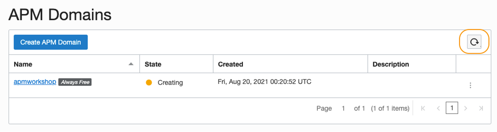

# Create APM Domain and obtain Data Upload Endpoint and Data Keys

## Introduction

In this lab, you will use the Oracle Cloud console to create an APM Domain. You will acquire Data Upload Endpoint and Data Keys, that you will use to configure APM tracer on the application.

Estimated time: 10 minutes

### Objectives

*	Create an APM Domain
*	Obtain a Data Upload Endpoint, a Private Data Key, and a Public Data Key

### Prerequisites

* This lab requires an [Oracle Cloud account](https://www.oracle.com/cloud/free/). You may use your own cloud account, or a Free Tier account, a cloud account that you obtained through a trial.
* To create APM domain, you will need an Oracle Cloud Account Administrator role or manage apm-domains permission in the target compartment. For more details, refer to the OCI Documentation, [Create an APM Domain](https://docs.oracle.com/en-us/iaas/application-performance-monitoring/doc/create-apm-domain.html).

## Task 1: Create an APM domain

1.	From the OCI menu, select **Observability & Management**, then **Administration**.
	

2.	Click **Create APM Domain**.
  

3. Name your APM domain and select the compartment you created during the Native Cloud App Workshop.

> **Note:** If you followed the instruction in the [Native Cloud App](https://apexapps.oracle.com/pls/apex/dbpm/r/livelabs/view-workshop?wid=814) Workshop , the name of the compartment is ***“mtdrworkshop”***.

4. Add a check to the **Create as Always Free Domain**, then click **Create**.
  

5.	This may take few minutes. Press the refresh button periodically to check the status.
  

6.	Once the job is completed, the status turns to Active with a green icon.
  

  For more details how to create an APM Domain, refer to the OCI documentation, [Create an APM Domain](https://docs.oracle.com/en-us/iaas/application-performance-monitoring/doc/create-apm-domain.html).

## Task 2: Obtain Data Upload Endpoint and Data Keys

To upload observations to an APM domain, Data Upload Endpoint and Data Keys must be configured in the application’s configuration files. Next you are going to obtain the values for them and then enter them into the Oracle Cloud console.

1.	Click the link to the APM domain just created.
  

2.	In the **APM Domain Information** tab, find **Data Upload Endpoint**, then click **Copy**. Paste the copied value to a text file and save. You will need this value in the later steps in the workshop.

3. Under **Data Keys**, find **auto\_generated\_private_data\_key**. Click **Copy** and save the value to the text file.

4. In the same section, find **auto\_generated\_public_data\_key**. Click **Copy** and save the value.
  

For more details on Data Upload Endpoint and Data keys, refer to the OCI documentation, [Obtaining Data Upload Endpoint and Data keys](https://docs.oracle.com/en-us/iaas/application-performance-monitoring/doc/obtain-data-upload-endpoint-and-data-keys.html).

## Acknowledgements

* **Author** - Yutaka Takatsu, Product Manager, Enterprise and Cloud Manageability
- **Contributors** - Steven Lemme, Senior Principal Product Manager, 
David Le Roy, Director, Product Management, 
Avi Huber, Senior Director, Product Management
* **Last Updated By/Date** - Yutaka Takatsu, December 2021
