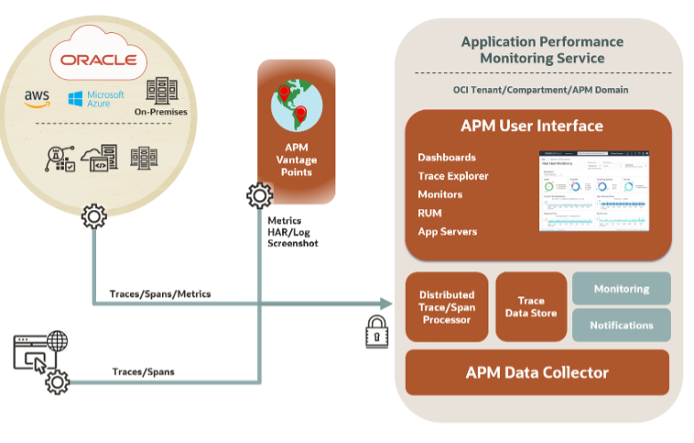
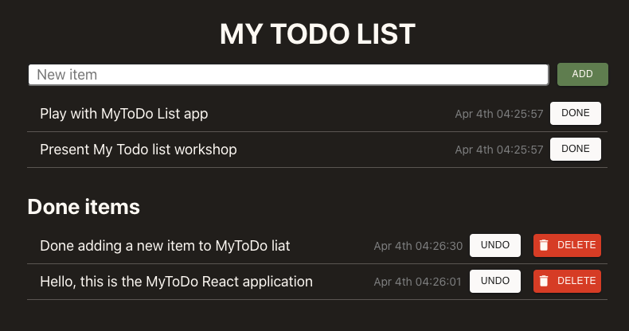

# Introduction

## About this Workshop

This workshop walks you through how to:

* Enable OpenTracing for a Java microservice based application deployed on Kubernetes cluster (OKE), using Oracle Application Performance Monitoring (APM)
* Configure APM Tracers on the frontend (ReactJS), and the backend server (Helidon) of the application
* Add custom spans to capture traces for SQL executions, made in the Autonomous Transaction Processing (ATP) Database
* Trace the workflow using Oracle Trace Explorer

Estimated Time: 65 minutes

### About Oracle Cloud Infrastructure Application Performance Management (OCI APM)

The diagram below provides an overview of the OCI APM Service, its features, components, and some of the other OCI services it integrates with.

  

Among other capabilities, OCI APM includes an implementation of a Distributed Tracing system. It collects and processes transaction trace data (spans) from the monitored application and make it available for viewing, dashboarding, exploration, alerts, etc. For more information on APM and Trace Explorer please refer to Application Performance Monitoring > **[Use Trace Explorer](https://docs.oracle.com/en-us/iaas/application-performance-monitoring/doc/use-trace-explorer.html)** section in the OCI Documentation.

In the workshop, you will learn how to add APM tracer to a Maven project, and the specific required configuration for Helidon. You will also learn how to create an APM domain and use Trace Explorer to search and view traces/spans in the APM User Interface.

### Objectives

In this workshop, you will:
* Create an APM domain, obtain Data Upload Endpoint and Data Keys
*	Enable the APM Java Tracer on a cloud native application
*	Add custom spans to trace SQL executions
*	Configure the APM Browser Agent
*	Enable APM Tracer configurations and rebuild the application
*	Use APM Trace Explorer to view traces, spans, and span dimensions

### Prerequisites

* An Oracle Cloud Account
*	Oracle Cloud Account Administrator role or manage apm-domains permission in the target compartment
*	This lab uses My ToDo List Application that you can build with the [React+Java+ADB = Native Cloud App](https://apexapps.oracle.com/pls/apex/dbpm/r/livelabs/view-workshop?wid=814) workshop. Complete the Tutorials 1 to 3 in the workshop and ensure the application runs on the OCI API Gateway. Note: Do not perform the Tutorial 4 as it is a cleanup lab that removes the application setup.

  

### Reference

*  Oracle LiveLabs **[React+Java+ADB = Native Cloud App](https://apexapps.oracle.com/pls/apex/dbpm/r/livelabs/view-workshop?wid=814)** Workshop

### More APM Workshops
-	**[Use OpenTracing for Microservices with Helidon Utilizing Oracle Application Performance Monitoring](https://apexapps.oracle.com/pls/apex/dbpm/r/livelabs/view-workshop?wid=917)**  Workshop
-	**[Monitor Traces for Oracle WebLogic Server on Kubernetes Using Oracle Application Performance Monitoring](https://apexapps.oracle.com/pls/apex/dbpm/r/livelabs/view-workshop?wid=932)** Workshop

### Learn More
-	**[Create an APM Domain](https://docs.oracle.com/en-us/iaas/application-performance-monitoring/doc/create-apm-domain.html)**
- **[Obtain Data Upload Endpoint and Data Keys](https://docs.oracle.com/en-us/iaas/application-performance-monitoring/doc/obtain-data-upload-endpoint-and-data-keys.html)**
- **[Configure Application Performance Monitoring Data Sources](https://docs.oracle.com/en-us/iaas/application-performance-monitoring/doc/configure-application-performance-monitoring-data-sources.html)**
- **[Use Trace Explorer](https://docs.oracle.com/en-us/iaas/application-performance-monitoring/doc/use-trace-explorer.html)**

## Acknowledgements

- **Author** - Yutaka Takatsu, Product Manager, Enterprise and Cloud Manageability
- **Contributors** - Steven Lemme, Senior Principal Product Manager, 
David Le Roy, Director, Product Management, 
Avi Huber, Senior Director, Product Management
- **Last Updated By/Date** - Yutaka Takatsu, February 2022
