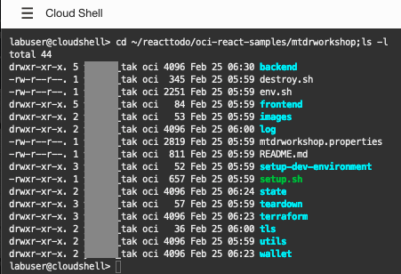
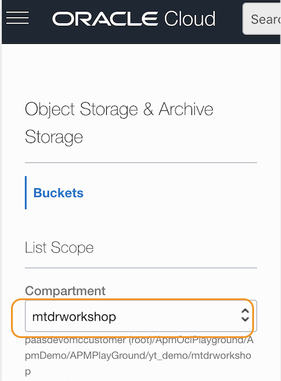
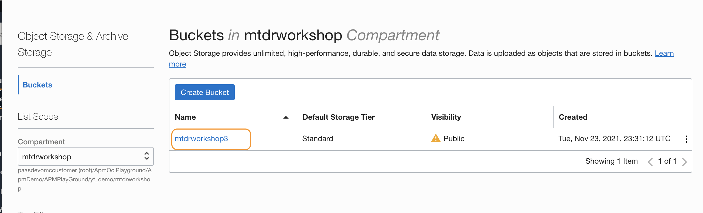
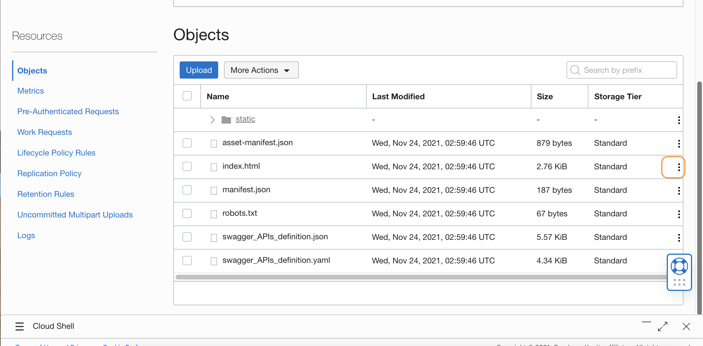
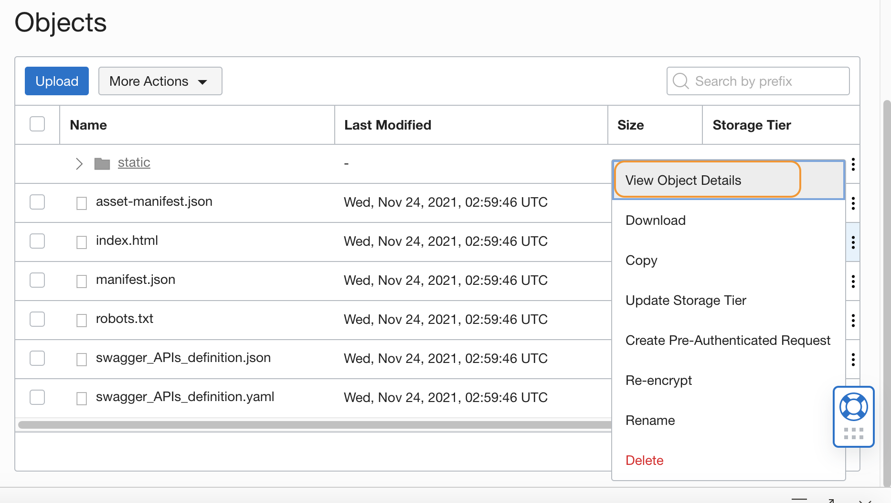
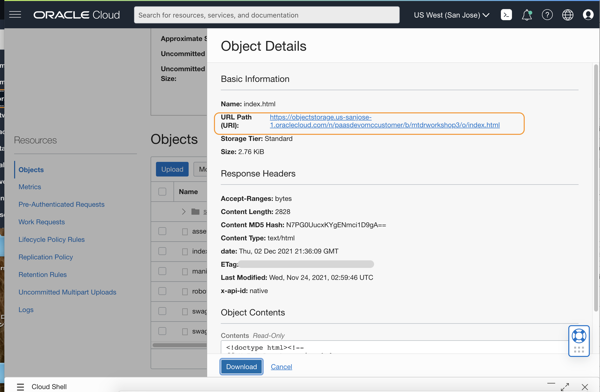
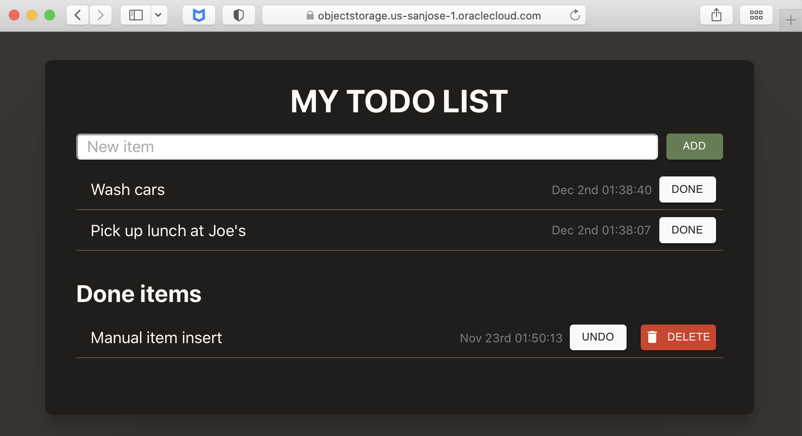

# Verify My Todo List web application

## Introduction

This workshop uses **My Todo List** Demo app, which is a Helidon application that runs in a Kubernetes cluster. It is a prerequisite to complete the  **[React+Java+ADB = Native Cloud App](https://apexapps.oracle.com/pls/apex/dbpm/r/livelabs/view-workshop?wid=814)** workshop, up to the Tutorial 3 to setup the app, before starting the labs in this workshop.

In this lab, you will launch the application and make sure it is ready to configure the APM Tracers.

Estimated time: 5 minutes

### Objectives
* Ensure the web application is running  

### Prerequisites

* Completion of the **[React+Java+ADB = Native Cloud App](https://apexapps.oracle.com/pls/apex/dbpm/r/livelabs/view-workshop?wid=814)** workshop, Tutorial 1, 2 and 3.

## Task 1: Verify the application setup directory

1. Launch the Oracle Cloud Shell from the Oracle Cloud Console by selecting the **>..** icon.
  

2. Change to ***mtdrworkshop*** directory by executing the following command.
	``` bash
	<copy>
	cd ~/reacttodo/oci-react-samples/mtdrworkshop;ls -l
	</copy>
	```
	If you have completed the Native Cloud App workshop, the output should be similar to the image below.

  

	> **NOTE:** If you cannot find the directory, you may have it with a different name, or have not gone through the workshop yet. Please visit **[React+Java+ADB = Native Cloud App](https://apexapps.oracle.com/pls/apex/dbpm/r/livelabs/view-workshop?wid=814)** workshop, and perform the Tutorials 1 to 3 to setup the demo application.

## Task 2: Verify the application in a browser

1. Click the three-bar icon at the top left corner in the Oracle Cloud console. From the menu, select **Storage** > **Buckets**.
  

2. Select the compartment where you created the Native App workshop objects.
  

3. By selecting a compartment, you should see the name of the bucket you created in the Native Cloud App workshop. Click the link to the Bucket.
  

4.	Scroll down the **Bucket Details** page and find **Objects** section.
  

5.	Click the three dots at the line of **index.html**.
  

6.	Click **View Object Details** from the menu.
  

7.	Click the URL link, next to **URL Path**.
  

8.	 Make sure **My ToDo List** demo app launches in a browser without any errors.
  

If the application is not running, or if you see errors, review the steps in the tutorials in the **[React+Java+ADB = Native Cloud App](https://apexapps.oracle.com/pls/apex/dbpm/r/livelabs/view-workshop?wid=814)** workshop to troubleshoot.

> **NOTE:** The Native Cloud App workshop (Tutorial 3, Task 3) instructs to use **staci** utility to upload the build objects to the Object Storage. In case you have a problem using the **staci** tool, you can manually upload the objects. Please refer to the Lab 4, Task 3: **Build the frontend and upload to the OCI Object Storage** in this workshop, for the steps to manually upload the files to the object storage in Oracle Cloud.

## Acknowledgements

* **Author** - Yutaka Takatsu, Product Manager, Enterprise and Cloud Manageability
- **Contributors** - Steven Lemme, Senior Principal Product Manager,<br>
David Le Roy, Director, Product Management,<br>
Avi Huber, Senior Director, Product Management
* **Last Updated By/Date** - Yutaka Takatsu, February 2022
