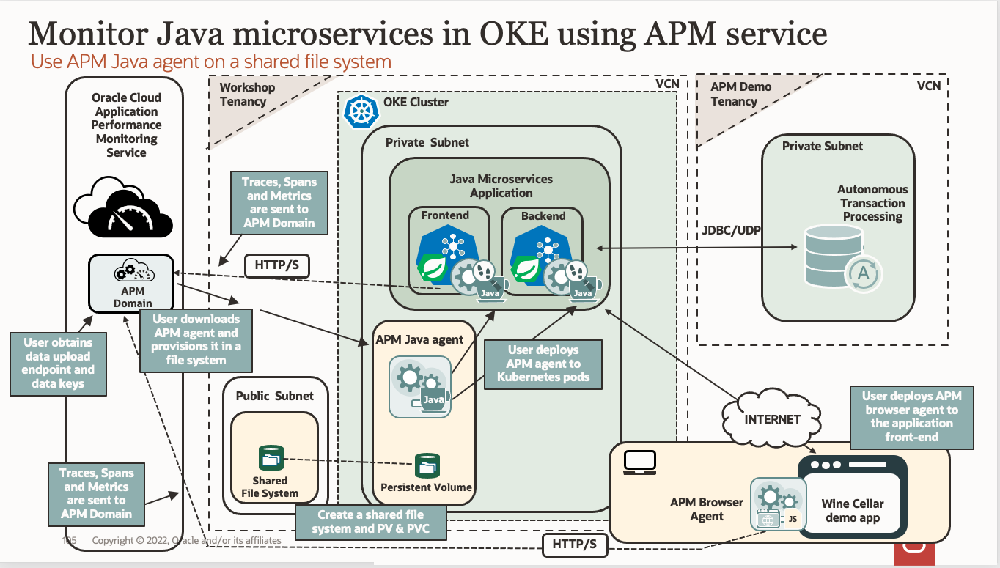

# Introduction

## About this Workshop

This workshop walks you through how to configure Spring Boot microservices deployed on Kubernetes for monitoring with the Oracle Application Performance Monitoring (APM) service. This enables automatic OpenTracing instrumentation and metrics collection that is used to provide full, end-to-end monitoring and diagnostics for the application.  

In this workshop, you will provision the APM Java agent in a file system mounted in the Oracle Cloud, deploy the agent to the Kubernetes cluster, instrument the APM Browser agent by inserting JavaScript code to a webpage and view traces and spans in APM Trace Explorer.

>**Note:** The same approach demonstrated for Spring Boot Java microservices on Kubernetes can be used to configure other types of java application servers, such as WebLogic, deployed on Kubernetes.

Estimated Time: 75 minutes

### About Oracle Cloud Infrastructure Application Performance Management (OCI APM)

The diagram below provides an overview of the OCI APM Service, its features, components, and some of the other OCI services it integrates with.

  

Among other capabilities, OCI APM includes an implementation of a Distributed Tracing system. It collects and processes transaction trace data (spans) from the monitored application and makes it available for viewing, dashboarding, exploration, alerts, etc. For more information on APM and Trace Explorer please refer to Application Performance Monitoring > **[Use Trace Explorer](https://docs.oracle.com/en-us/iaas/application-performance-monitoring/doc/use-trace-explorer.html)** section in the OCI Documentation.

In the workshop, you will learn how to instrument a Java microservices application deployed on a Kubernetes cluster with APM agents. You will also learn how to create an APM domain in the Oracle Cloud and use Trace Explorer to search and view traces/spans in the APM User Interface.

### Objectives

In this workshop, you will:
* Create an APM domain, obtain Data Upload Endpoint and Data Keys
*	Create a file system in the Oracle Cloud Infrastructure, and mount it in the Kubernetes pods
*	Download, provision and deploy the APM Java agent
* Apply custom storage configuration to the Kubernetes pods
*	Instrument APM Browser agent
*	Use APM Trace Explorer to view traces, spans, and span dimensions

### Prerequisites

* An Oracle Free Tier with a 30-day free trial or Paid Cloud Account - Please view this workshop's LiveLabs landing page to see which environments are supported.


>**Note:** If you have a **Free Trial** account when your Free Trial expires, your account will be converted to an **Always Free** account. You will not be able to conduct Free Tier workshops unless the Always Free environment is available.
**[Click here for the Free Tier FAQ page.](https://www.oracle.com/cloud/free/faq.html)**

If you are running the workshop in a Paid Cloud Account, ensure you have the permissions below:
* Oracle Cloud resources and permissions to create a file system. See **[Creating File Systems](https://docs.oracle.com/en-us/iaas/Content/File/Tasks/creatingfilesystems.htm)** and **[Service Limits](https://docs.oracle.com/en-us/iaas/Content/General/Concepts/servicelimits.htm#top)** in the Oracle Cloud documentation.
*	Oracle Cloud Account Administrator role or manage apm-domains permission in the target compartment. See **[Perform Oracle Cloud Infrastructure Prerequisites (APM)](https://docs.oracle.com/en-us/iaas/application-performance-monitoring/doc/perform-oracle-cloud-infrastructure-prerequisite-tasks.html)** in the Oracle Cloud documentation.

### More APM Workshops

-	**[Use OpenTracing for Microservices with Helidon Utilizing Oracle Application Performance Monitoring](https://apexapps.oracle.com/pls/apex/r/dbpm/livelabs/view-workshop?wid=917)**  Workshop
-	**[Trace a Native Cloud App Utilizing Oracle Application Performance Monitoring](https://apexapps.oracle.com/pls/apex/dbpm/r/livelabs/view-workshop?wid=916)** Workshop
-	**[Monitor Traces for WebLogic on Kubernetes utilizing Oracle Application Performance Monitoring](https://apexapps.oracle.com/pls/apex/dbpm/r/livelabs/view-workshop?wid=932)** Workshop

## Acknowledgements

- **Author** - Yutaka Takatsu, Product Manager, Enterprise and Cloud Manageability
- **Contributors** - Steven Lemme, Senior Principal Product Manager,  
Anand Prabhu, Sr. Member of Technical Staff,  
Avi Huber, Vice President, Product Management
- **Last Updated By/Date** - Yutaka Takatsu, August 2022
