# Create a Kubernetes cluster

## Introduction

This workshop uses Spring Boot-based Java microservices as a target application to trace against. In this lab, first, you will use the Oracle Cloud console to set up an OCI compartment, second, create an Oracle container engine for Kubernetes (OKE) cluster in your tenancy. In Lab 3, you will deploy the application to the OKE.

Estimated time: 5 minutes

### Objectives

* Create a compartment
* Create a Kubernetes cluster

### Prerequisites

* This lab requires an [Oracle Cloud account](https://www.oracle.com/cloud/free/). You may use your cloud account, or a Free tier account, a cloud account that you obtained through a trial.

## Task 1: Create an OCI compartment

1. Open the navigation menu from the top-left corner (aka. hamburger menu) of the Oracle Cloud console and select **Identity & Security** > **Compartments**.
	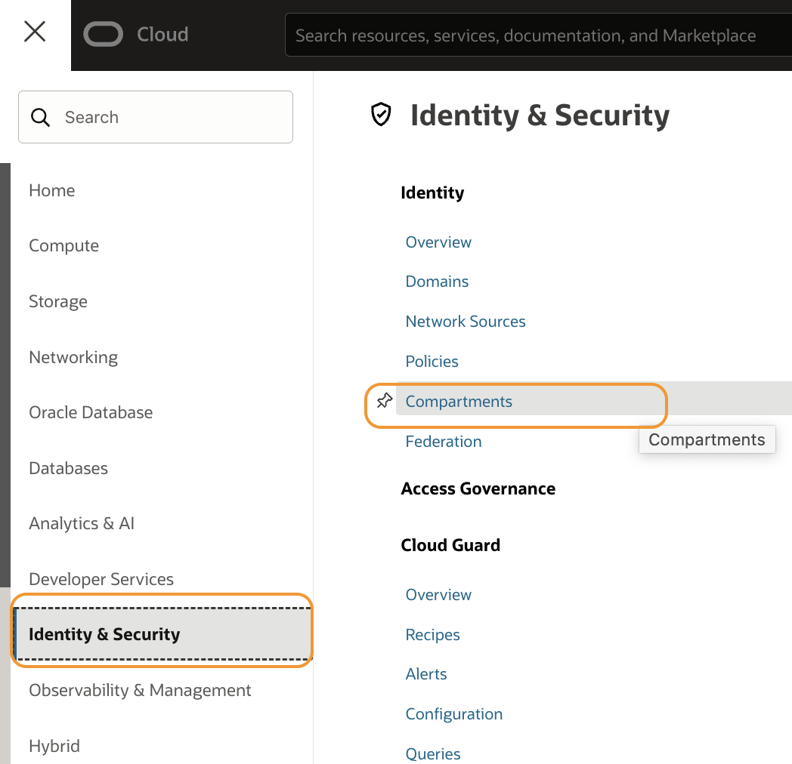
2. Click **Create Compartments**
	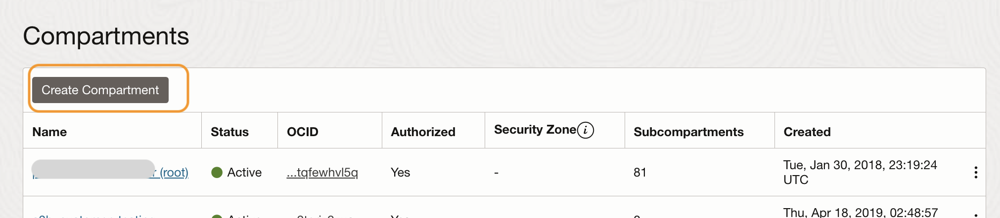
3. Enter the following parameters:
*	Compartment name: **apmworkshop**
*	Description: **APM workshop compartment**
*	Accept the default values for the other fields, and click, **Create Compartment**
	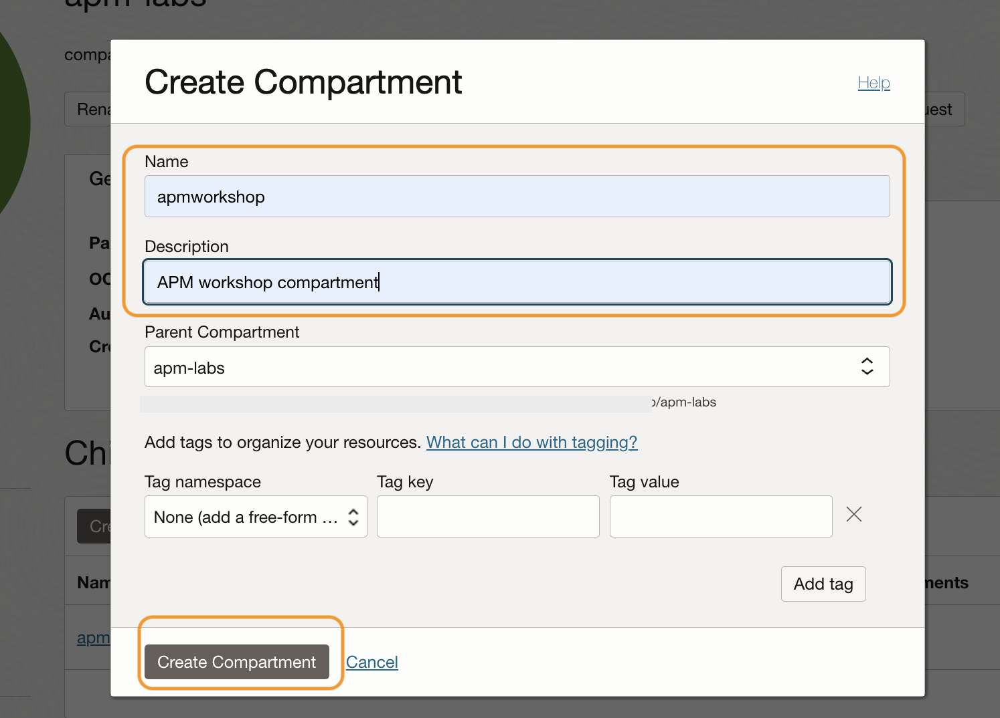
*	Verify that your apmworkshop compartment is created in the table
	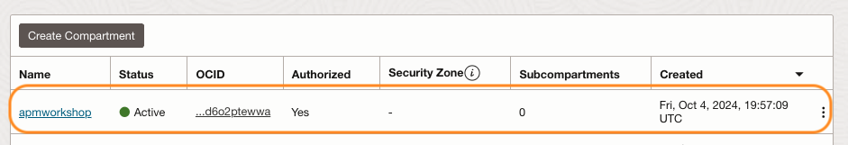

## Task 2: Create an OKE

1. Open the navigation menu from the top left corner (aka. hamburger menu) in the Oracle Cloud console, and select **Developer Services** > **Kubernetes Clusters (OKE)**.

   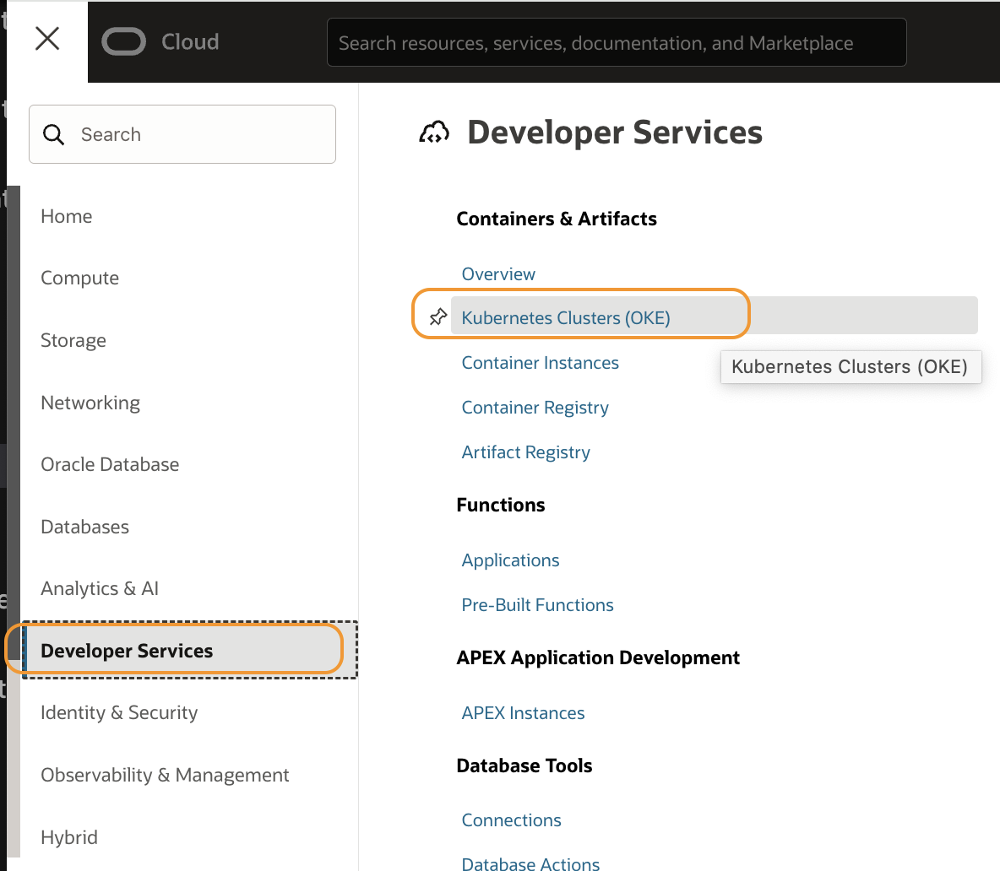

2. Make sure the **apmworkshop** is selected in the Compartment field, then click **Create cluster**

   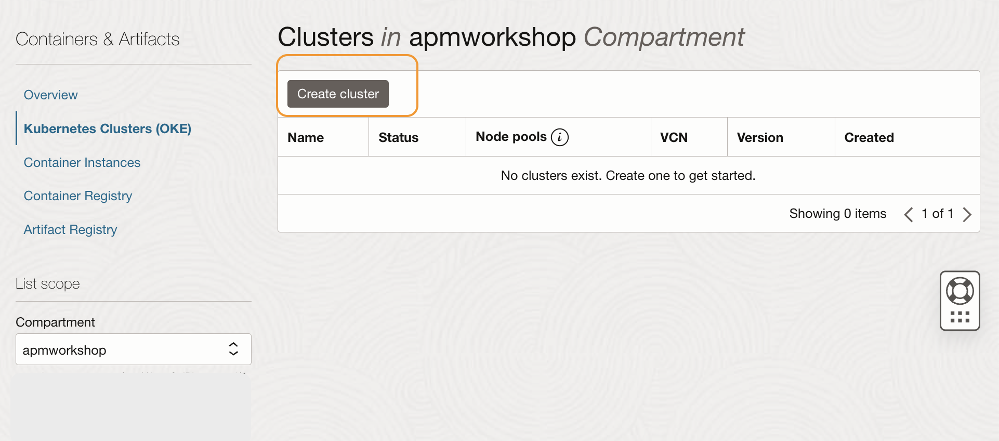

3. Quick Create pane is pre-selected. Keep the default selection and click **Submit**.

   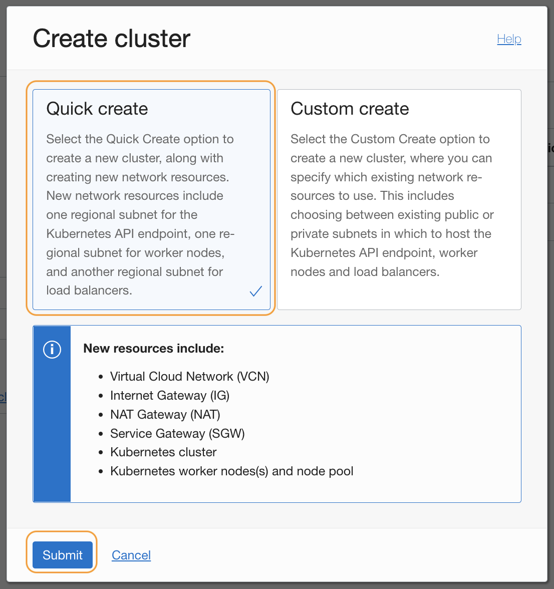

4. Name the cluster as **apmlab-cluser1**. Accept the default setting for other fields and click **Next**.

   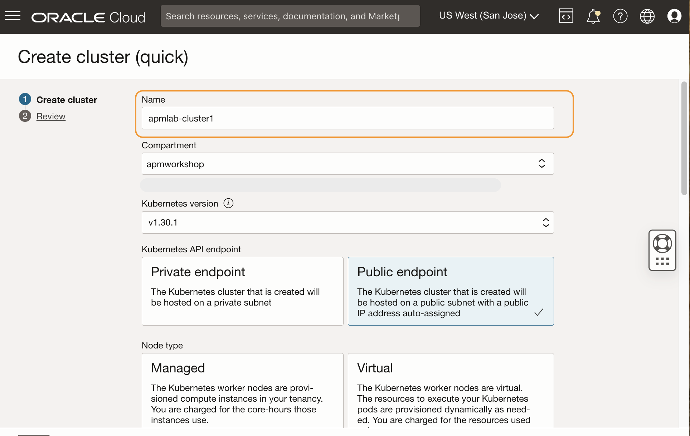
   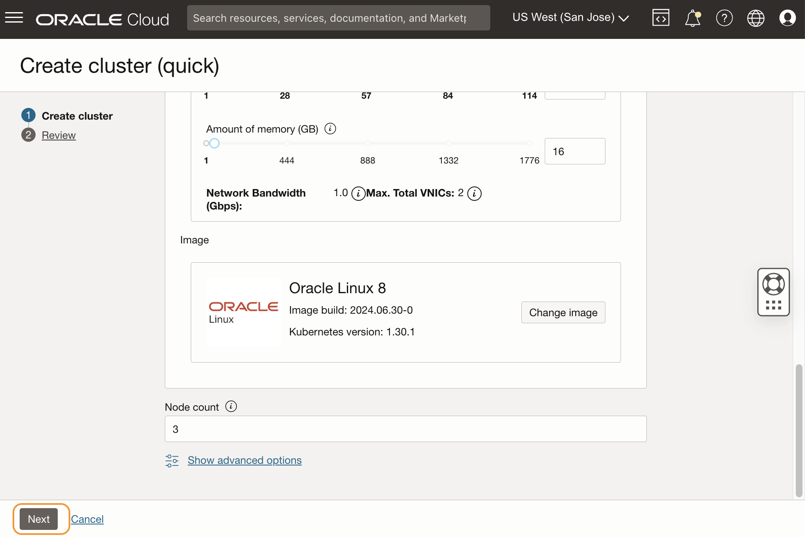

5. Review the configuration, and click **Create cluster**.

   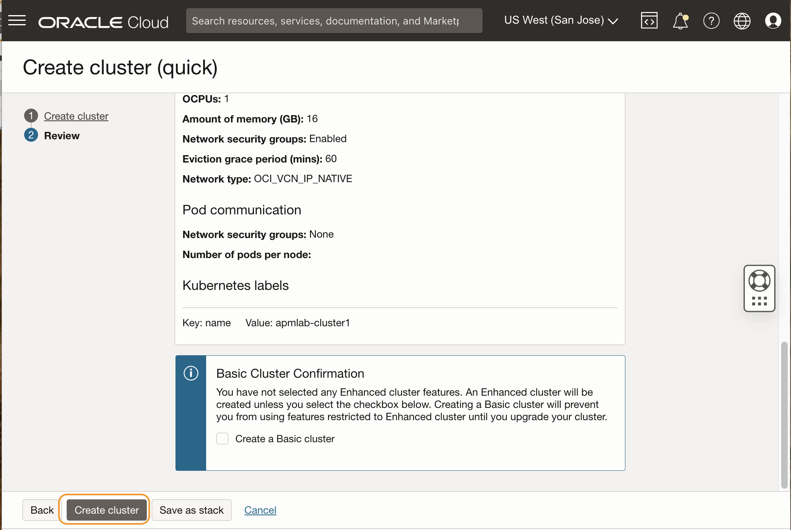

6. Make sure all verification steps are cleared. Click **Close**.

   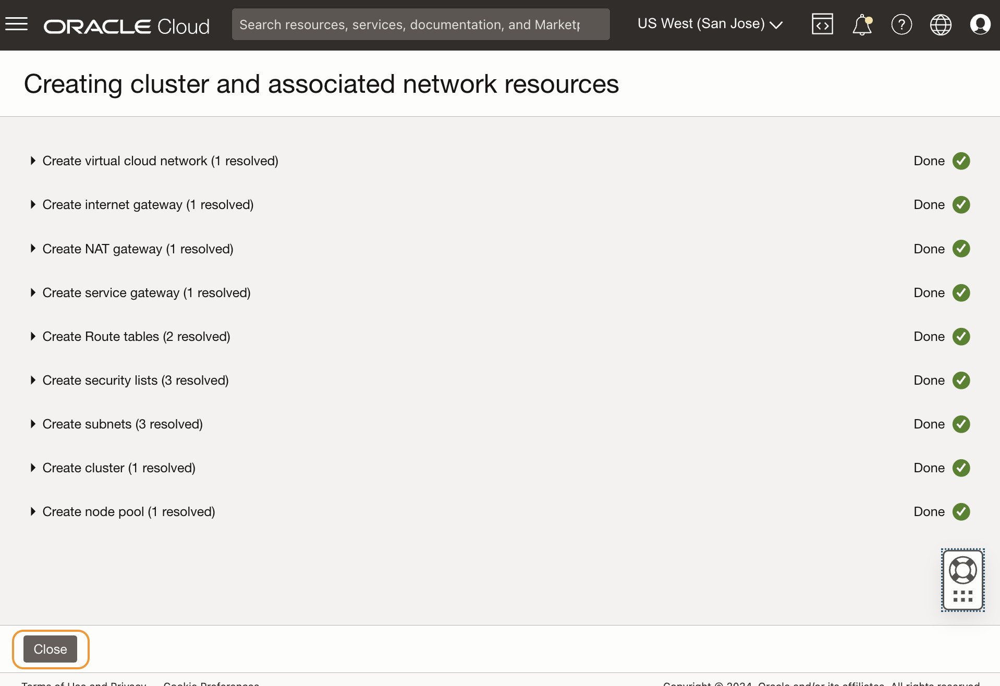

7.  This will start to create a cluster, and takes 7 to 10 minutes to complete. While waiting for the creation of the cluster, you can proceed to the next lab to create an APM domain. In Lab 3, we will resume the steps to build the application.

   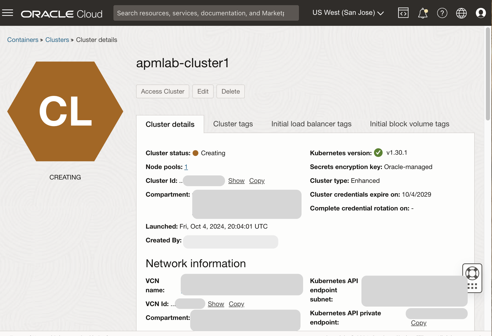

You may now **proceed to the next lab**.

## Acknowledgements

* **Author** - Yutaka Takatsu, Product Manager, Enterprise and Cloud Manageability
- **Contributors** - Steven Lemme, Senior Principal Product Manager,  
Anand Prabhu, Sr. Member of Technical Staff,  
Avi Huber, Vice President, Product Management
* **Last Updated By/Date** - Yutaka Takatsu, August 2022
