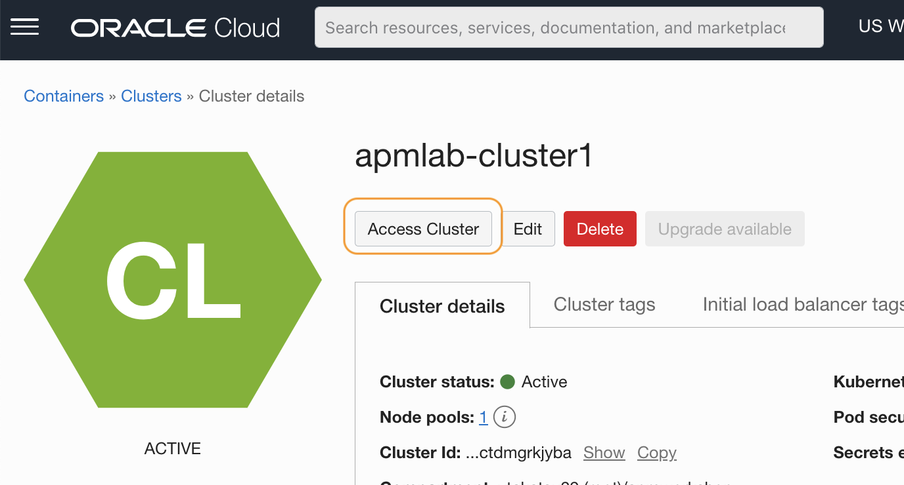
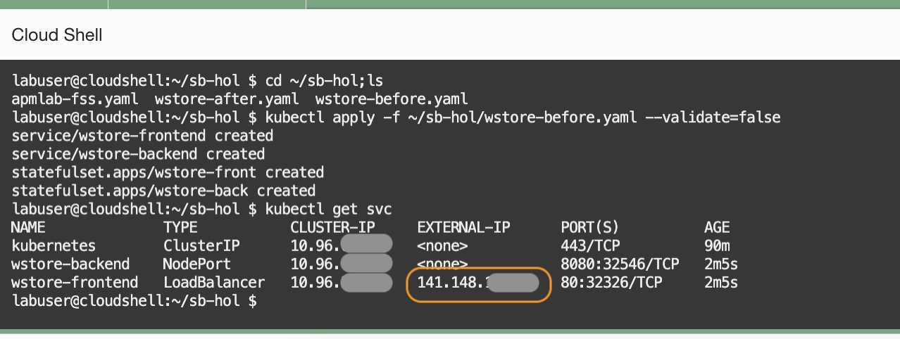

# Build a microservices application

## Introduction

This workshop uses a Spring Boot based Java microservices as a target application to trace against. In this lab, you will first build the application, create an Oracle container engine for Kubernetes (OKE) cluster in your tenancy, then deploy the application to the OKE.

Estimated time: 20 minutes

### Objectives

* Build a microservices application for monitoring

### Prerequisites

* Completion of the preceding labs in this workshop

## **Task 1**: Create an OKE

1. Open the navigation menu from the top left corner (aka. hamburger menu) in the Oracle Cloud console, select **Developer Services** > **Kubernetes Clusters (OKE)**.

   

2. Make sure the **apmworkshop** is selected in the Compartment field, then click **Create cluster**

   

3. Quick Create pane is pre-selected. Keep the default selection and click **Submit**.

   

4. Name the cluster as **apmlab-cluser1**. Accept the default setting for other fields and click **Next**.

   
   

5. Review the configuration, and click **Create cluster**.

   

6. Make sure all verification steps are cleared. Click **Close**.

   

7.  This will start to create a cluster. It may take 7 to 10 minutes to complete.

   

8. Once the creation is completed, the status becomes **Active**.

   

## **Task 2**: Access the OKE in the Oracle Cloud shell


1. Click **Access Cluster** in the cluster details page.

  

2. Make sure the **Cloud Shell Access** is selected. Click **Copy** link from the command to access kubeconfig for the cluster.

  

3. Then click **Launch Cloud Shell**.

  

4. Oracle Cloud Shell window opens at the lower side of the browser screen.

  

5. Paste the copied command to the command shell prompt. Then hit enter.   

  

  >***NOTE***: Save the command to a text file on your laptop, and execute it every time when you start a new Cloud Shell session, while working the labs in this workshop.

## **Task 3**: Download configuration files

1. Create a work folder in your Cloud Shell.

2. TBD: ***Download the zip file from Object library location to the sb-hol directory, and unzip.*** TBD


## **Task 4**: Deploy the application

1. Execute the following command from the Cloud Shell.

    ``` bash
    <copy>
    cd ~/sb-hol;ls
    </copy>
    ```
  

  >NOTE: Verify there are four  files in the folder.
  apmlab-fss.yaml, wstore-before.yaml, wstore-add-storage.yaml and wstore-deploy-agent.yaml

3. Execute the command below to deploy the application to the cluster.
    ``` bash
    <copy>
    kubectl apply -f ~/sb-hol/wstore-before.yaml --validate=false
    </copy>
    ```

4. Verify the 2 services and 2 stateful sets are created without an error.

  

5. Run the kubectl command below to display the deployed services. It may take a few minutes to show the IP.

    ``` bash
    <copy>
    kubectl get svc
    </copy>
    ```
5. Copy the External IP of the wstore-frontend service

  

6. Refer to the below example and construct a URL, and paste it into a browser's address bar. If you see the WineCellar content as in the below screenshot, the deployment was successful.

    ``` bash
    <copy>
    http://<IP of the wstore-frontend service>/winestore/
    </copy>
    ```
  


You may now **proceed to the next tutorial**.

## Acknowledgements

* **Author** - Yutaka Takatsu, Product Manager, Enterprise and Cloud Manageability
- **Contributors** - Steven Lemme, Senior Principal Product Manager,  
Avi Huber, Senior Director, Product Management
* **Last Updated By/Date** - Yutaka Takatsu, August 2022
