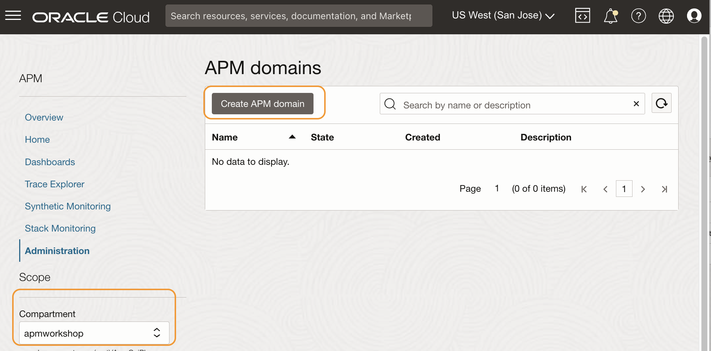
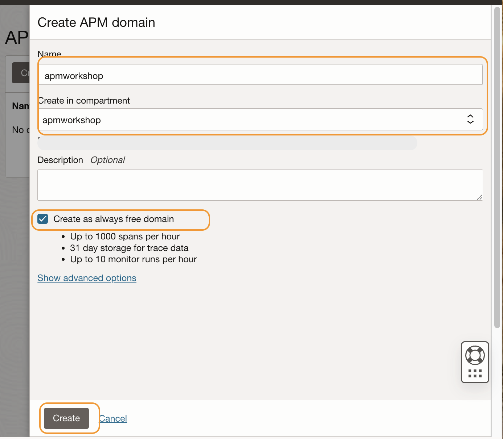
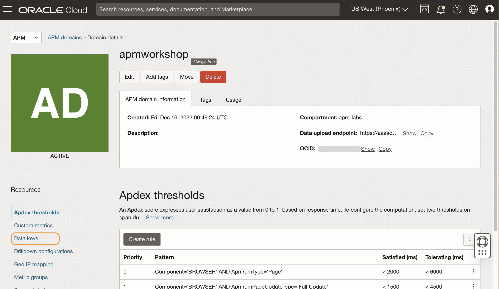
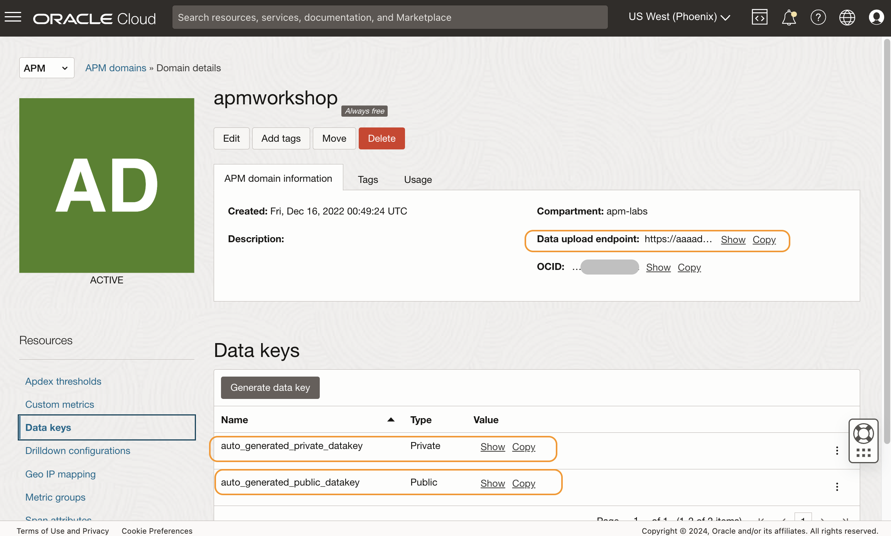

# Create an APM Domain and obtain Data Upload Endpoint and Private Data Key

## Introduction

In this lab, you will create an APM Domain. You will acquire a Data Upload Endpoint and a Private Data Key, which are needed to configure the APM Tracer on the application.

Estimated time: 10 minutes

### Objectives

*	Create an APM Domain
*	Obtain a Data Upload Endpoint and a Private Data Key

### Prerequisites

* This lab requires an [Oracle Cloud account](https://www.oracle.com/cloud/free/). You may use your cloud account, or a Free tier account, a cloud account that you obtained through a trial.
* To create an APM domain, you will need an Oracle Cloud Account Administrator role or manage apm-domains permission in the target compartment. For more details, refer to the OCI Documentation, [Create an APM Domain](https://docs.oracle.com/en-us/iaas/application-performance-monitoring/doc/create-apm-domain.html).

## Task 1: Create an APM domain

1.	From the OCI menu, select **Observability & Management**, then **Administration**.
	

2. Select the **apmworkshop** compartment from the pulldown menu.
	
3.	Click **Create APM Domain**.
  
4.	Name your APM domain as **apmworkshop** and select the compartment you created. Add a check to the **“Create as Always Free Domain”**, then click **Create**.
  

5. Press the refresh button periodically to check the status. This may take a few minutes.
  
6.	Once the job is completed, the status turns to Active with a green icon.
  
  For more details on how to create an APM Domain, refer to the OCI documentation, [Create an APM Domain](https://docs.oracle.com/en-us/iaas/application-performance-monitoring/doc/create-apm-domain.html).

## Task 2: Obtain Data Upload Endpoint and Private and Public Data Keys

To upload tracing data to an APM domain, Data Upload Endpoint and both Private and Public Data Keys must be configured in the application’s configuration files. Next, you are going to obtain the values for them and then enter them into the Oracle Cloud console.

1.	Click the link to the APM domain.
  

2. Under **Resources**, click **Data Keys**.

  

3.	In the **APM Domain Information** tab, find **Data Upload Endpoint**, then click **Copy**. Paste the copied value to a text file and save. You will need this value in the later steps in the workshop.

4.	Under **Data Keys**, find **auto\_generated\_private_data\_key**. Click **Copy** and save the value to the text file.

5.  In the same section, find **auto\_generated\_public_data\_key**. Click **Copy** and save the value to the text file.
  

For more details on Data Upload Endpoint and Data keys, refer to the OCI documentation, [Obtaining Data Upload Endpoint and Data keys](https://docs.oracle.com/en-us/iaas/application-performance-monitoring/doc/obtain-data-upload-endpoint-and-data-keys.html).

You may now **proceed to the next lab**.

## Acknowledgements

* **Author** - Yutaka Takatsu, Product Manager, Enterprise and Cloud Manageability
- **Contributors** -
Steven Lemme, Senior Principal Product Manager,  
Anand Prabhu, Sr. Member of Technical Staff,  
Avi Huber, Vice President, Product Management
* **Last Updated By/Date** - Yutaka Takatsu, December 2022
